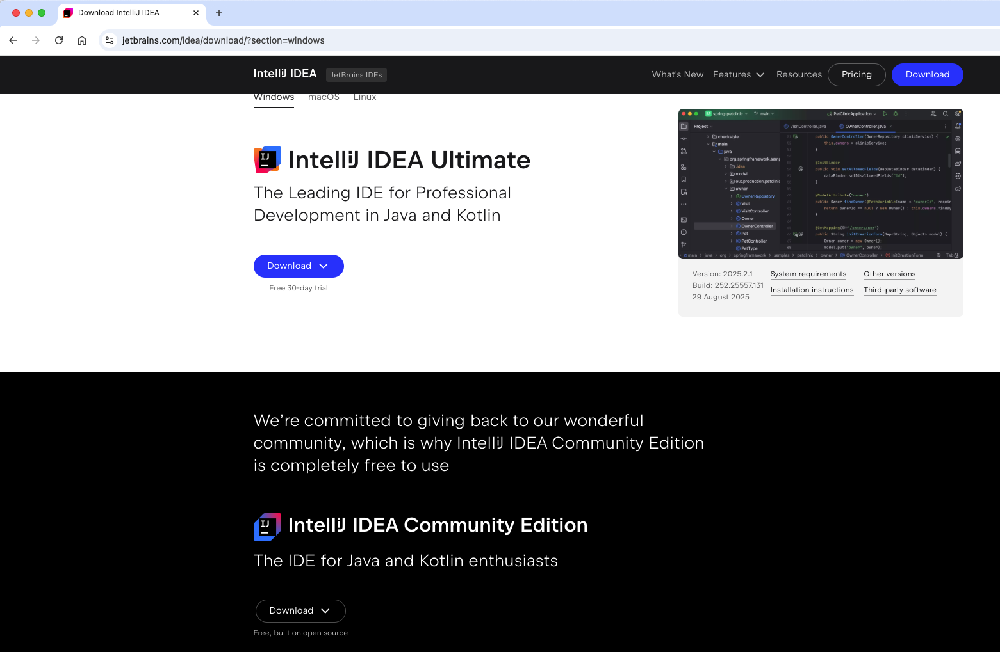
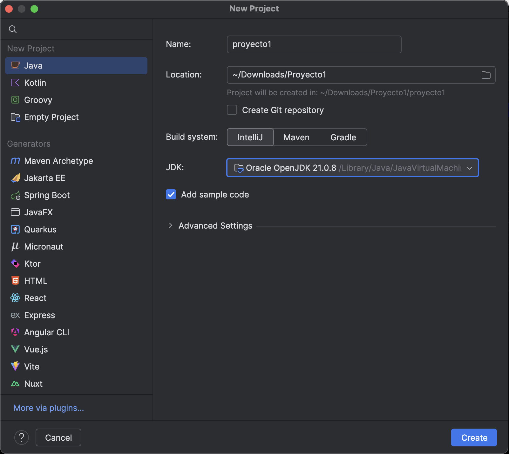
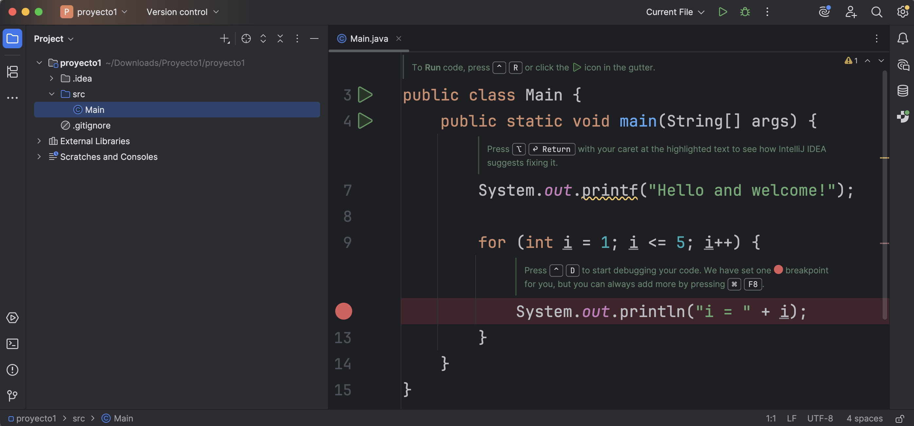

| Fecha      | Versión | Descripción         |
| ---------- | ------- | ------------------- |
| 10/09/2021 | 1.0.0   | Versión inicial     |
| 01/09/2025 | 1.0.1   | Versión actualizada |

# Unidad 1 - Configuración del equipo para programación

[TOC]

## 1. Instalación del JDK

Puede ser que el jdk de java ya lo tengamos instalado. Tanto si tienes windows como si tienes linux el comando para saber la versión o versiones que tenemos ya instaladas en el equipo es el siguiente:

**java --version**

Este nos devolverá la versión en el caso que lo tengamos instalado.

En este caso mostramos la versión actual que tengo instalada en el ordenador. Debemos descargarnos la última versión LTS desde la web de Oracle:

https://www.oracle.com/java/technologies/downloads/

**Para poder descargar el jdk deberéis registraros previamente.**

## 3. Configuración en el aula

En el aula vamos a realizar la configuración del entorno con Windows, de forma que no tendremos problemas con el sistema.

## 4. Programando online

En la actualidad la tecnología evoluciona a pasos agigantados. Hay una plataforma gratuita que nos ofrece infinidad de compiladores online y sin pagar ... wow !!!!!

Se trata de [Replit.com](https://replit.com/). En esta nos damos de alta, bien con un nuevo usuario y contraseña o utilizando nuestra cuenta de GitHub, gmail, etc. y podemos acceder a un compilador online.

Al ser una aplicación web, está corriendo el compilador en un servidor, por lo tanto podemos programar desde un dispositivo móvil como una tablet, por ejemplo.

## 5. Intellij IDEA Community Edition de JetBrains

Como IDE podemos hacer uso es la herramienta de **JetBrains** que se denomina **Intellij IDEA Community Edition** . Se trata de una versión **Comunity**, la cual nos va a permitiir desarrollar todos los contenidos del curso, eso si, se encuentra limitada, pero no nos importa para el uso que vamos a realizar.

https://www.jetbrains.com/idea/

Descargarla e instalarla. Al abrila tenemos lo siguiente:

Al crear el proyecto nos aparece de la siguiente forma:

Al ejecutar el proyecto nos sale lo siguiente en la consola:

