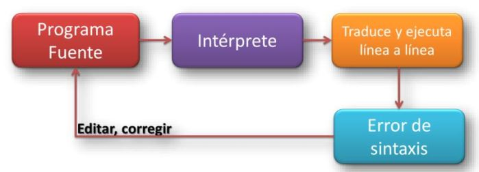
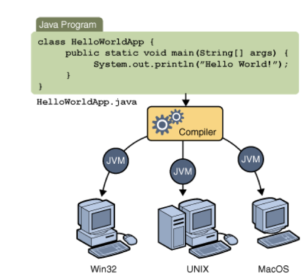
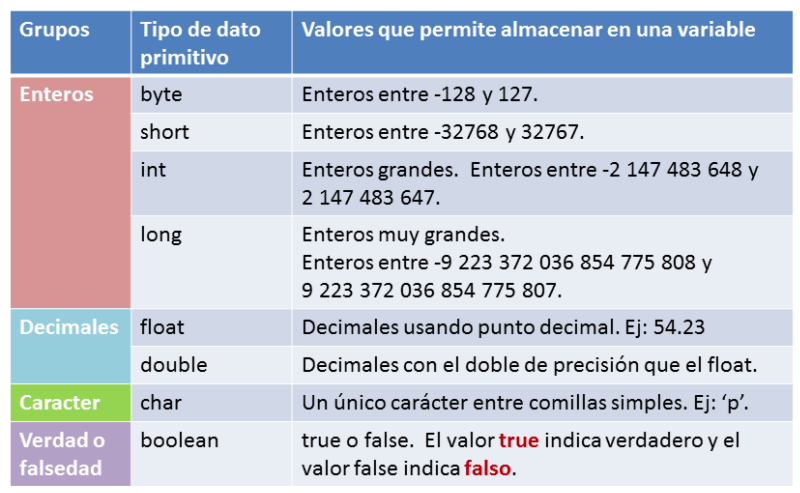
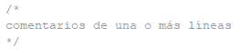
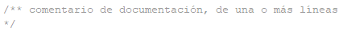
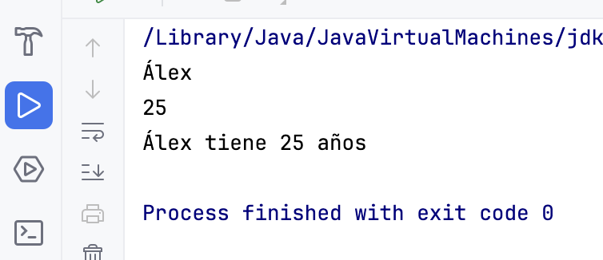
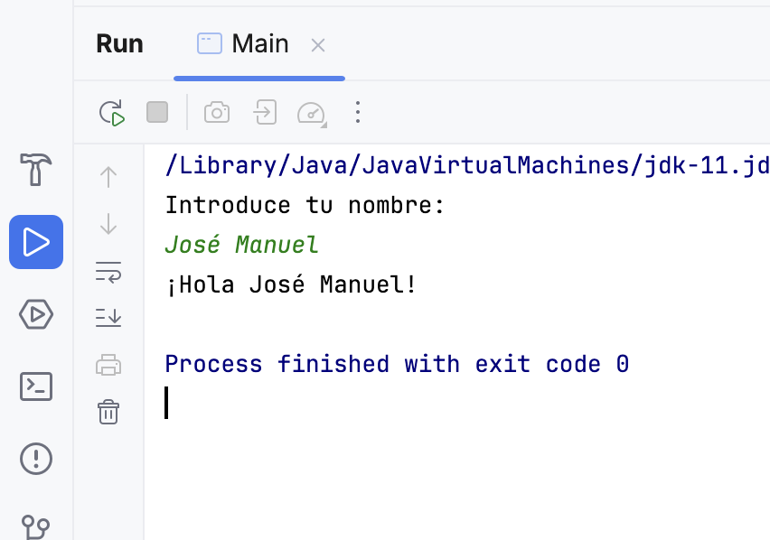

| Fecha      | Versión | Descripción                                |
| ---------- | ------- | ------------------------------------------ |
| 10/09/2021 | 1.0.0   | Versión inicial.                           |
| 17/09/2021 | 1.0.1   | Corrección en la declaración de variables. |
| 20/09/2021 | 1.0.2   | Corrección del índice.                     |
| 01/09/2025 | 1.0.3   | Revisión del tema.                         |


# Unidad 1 - Introducción a la programación

[TOC]

# 1 Programa

## 1.1 Programador y Usuario

- Un/a programador/a es aquella persona que se encarga de codificar programas
- Usuario/a es el término que se utiliza para referirse a la persona que utiliza una aplicación informática con la intención de conseguir un resultado final.
  
## 1.2 Algoritmo vs Programa vs Aplicación Informática

- Un algoritmo es un método de resolución de un problema en un número finito de pasos. Ejemplo: ¿cómo hacer una tortilla francesa?
- Un programa es la expresión de un algoritmo en un lenguaje comprensible para el ordenador. La programación es la secuencia de pasos que debe efectuar el / la programador / a para obtener un programa.
- Una aplicación informática es un conjunto de programas enlazados de manera conveniente.
  
## 1.3 Programa vs procesador

- Llamamos procesador toda entidad capaz de ejecutar un algoritmo. En última instancia será la CPU del ordenador, móvil o TV.
- Un programa constará de:
  - **Instrucciones:** una instrucción es una combinación de palabras, datos y símbolos que, obedeciendo la sintaxis propia del lenguaje, son utilizados por el ordenador para llevar a cabo una acción determinada.
  - **Datos:** llamamos dato toda información que utiliza el ordenador.


Las características deben cumplir:


  -  Las tecnologías de programación presente hoy en día son las siguientes:

     1. **Programación estructurada:** Usar únicamente secuencias, instrucciones condicionales e instrucciones repetitivas en la confección de sus programas.
     2. **Programación modular:** El programa se diseña por partes (módulos).
     3. **Programación orientada a objetos:** Paradigma de programación que usa "objetos" (estructuras con atributos y métodos) y sus interacciones para diseñar programas. Se verá en la tercera evaluación.
     4. Otros:

        - Programación concurrente: Útil cuando tenemos que realizar varias acciones a la vez. Se ve a segundo curso.
        - Otro programaciones: Programación funcional, Programación lógica

## 1.4 Ciclo de vida del software

El ciclo de vida del software (proceso de creación y explotación de un programa) es como se describe:


Este modelo admite la posibilidad de hacer iteraciones, es decir, durante las modificaciones que se hacen en el mantenimiento se pueden ver, por ejemplo, la necesidad de cambiar algo en el diseño, lo cual significa que se harán los cambios necesarios en la codificación y se tendrán que realizar de nuevo las pruebas, es decir, si se tiene que volver a una de las etapas anteriores al mantenimiento hay que recorrer de nuevo el resto de las etapas. 

Después de cada etapa se realiza una revisión para comprobar si se puede pasar a la siguiente. 

Trabaja en base a documentos, es decir, la entrada y la salida de cada fase es un tipo de documento específico. Idealmente, cada fase podría hacerla un equipo diferente gracias a la documentación generada entre las fases. Los documentos son: 

- **Análisis**: Toma como entrada una descripción en lenguaje natural de lo que quiere el cliente. Produce el S.R.D. (Software Requirements Document). 
- **Diseño**: Su entrada es el S.R.D. Produce el S.D.D. (Software Design Document). A partir del diseño se obtiene lo que denominamos **Algoritmo**, que básicamente es una secuencia de pasos que se han de realizar para resolver un determinado problema. 
- **Codificación**: A partir del S.D.D. produce módulos mediante la reescritura del algoritmo con un lenguaje especial, de forma que pueda entenderlo el ordenador. En esta fase se hacen también pruebas de unidad.
- **Pruebas**: A partir de los módulos probados se realiza la integración y pruebas de todo el sistema. El resultado de las pruebas es el producto final listo para entregar.


El programa fuente o código fuente es el resultado de la codificación de un algoritmo en un lenguaje de alto nivel. Esto se hace en texto plano, siguiendo la sintaxis del lenguaje elegido.

Un entorno de programación interpretado traduce el código fuente a código máquina y lo ejecuta, instrucción por instrucción.

## 1.5 Interprete vs Compilador

**Intérprete:**

- Analiza una línea y lo ejecuta
- No genera un programa
- Más lento, ya que verifica la línea una a una
- Necesita un elemento intermedio:
   - Intérprete: Python, PHP
   - Máquina virtual: Java

{width=400}

**Compilador:**

- Traducir todo el código fuente a código objeto
- Genera un programa ejecutable
- Más rápido
- Dificultad en la detección de errores
- Al corregir un error se debe recompilar

{width=300}


## 1.6 Java: 50% Compilado - 50% Interpretado

El lenguaje Java para poder ejecutarse se hace en dos fases:

- Una compilación del código fuente, donde el código generado no es código máquina, sino un lenguaje especial llamado **bytecodes**, que sólo puede interpretarse por una JVM (Máquina Virtual de Java)
- La JVM coge los **bytecodes** y los interpreta, ejecutando ya el programa sobre la máquina real
  


Esto permite la total portabilidad de los programas Java y su ejecución en cualesquiera plataforma.



## 1.7 Corrección de programas

Para corregir un programa se debe testear o probar. Un **juego de pruebas** es un conjunto de situaciones que permite probar el buen funcionamiento del programa. Este conjunto debe abarcar todas las posibilidades reales.

Un **depurador** (debugger) es un programa que permite:

- ejecutar un programa instrucción por instrucción y ver qué pasa después de la ejecución de cada una
- obtener el valor de los datos antes y después de ejecutar una instrucción
- modificar el valor de los datos durante la ejecución
- interrumpir o detener la ejecución del programa en cualquier punto

A la hora de programar tendremos que diferenciar entre errores:

- **Sintáctica:** errores que se producen durante la creación del programa, porque no cumplimos en las normas del lenguaje
- **De ejecución:** errores que no podemos detectar durante el desarrollo, y se producen sólo cuando se ejecuta.

## 1.8 ¿Qué lenguaje elegir?

Aquí puede encontrar un listado de los lenguajes más utilizados en el mundo [ranking de lenguajes de programación](http://www.tiobe.com/index.php/content/paperinfo/tpci/index.html).

Enguany estudiarem Java:
> **C**: Lenguaje de bajo y medio nivel. Nos permite acceder a la memoria e interactuar directamente con el sistema operativo de los equipos. Es el lenguaje escogido por todos los desarrolladores de sistemas operativos, desde un disco duro multimedia, un móvil, el ordenador de un coche, etc. Es uno de los lenguajes que genera el código más rápido (de ejecución)

> **Java:** Lenguaje de alto nivel. Es uno de los lenguajes más extendidos, debido a que es multiplataforma y permite ejecutar un mismo código en cualquier equipo, independientemente de la arquitectura del mismo (32 vs 64 bits, Win Lin, Mac) e incluso navegadores (Applets). Precursor de javascript y Node.js.

> **Python:** Lenguaje de alto nivel que permite crear desde aplicaciones de alto nivel, scripts de sistemas operativos. Predispone a la creación de un código legible, lo que lo hace muy útil para enseñar a programar.


# 2 La Información

## 2.1 ¿Qué es la información?
Un programa es una secuencia de instrucciones que manipulan unos datos para obtener unos resultados. Esas instrucciones son órdenes que le damos en el ordenador. Para ello hay que decirle esto en el lenguaje que entiende, que es el lenguaje máquina, compuesto por secuencias de 0s y 1s, al igual que toda la información que se guarda en un ordenador (números, texto, fotos, música, juegos , películas ...).

Pero como para nosotros (los humanos) nos resulta muy difícil, se lo diremos en otro lenguaje, más cercano al nuestro, que es un lenguaje de programación. A todo esto, hay que saber que los datos son información, y tal y como dice la wikipedia:

> "La información es un conjunto organizado de datos procesados, que constituyen un mensaje que cambia el estado de conocimiento del sujeto o sistema que recibe dicho mensaje."

A tener en cuenta:

1. Los datos deben estar organizados

2. El mensaje (los datos) deben cambiar el estado del conocimiento. Esto significa que deben aportar algo nuevo o relevante al programa o proceso. De manera inversa: "Si un dato no aporta conocimiento, es que no es necesario, es inútil"

   


## 2.2 Datos

Un dato es cualquier información con la que trabaja un algoritmo.

Cada dato es de un tipo determinado que, básicamente, será entero, real, carácter o lógico, pero que dependerá del lenguaje de programación en el que estamos trabajando.

Los datos aparecen en un programa en una de las siguientes formas:

- Variables
- Constantes (simbólicas y literales)

### 2.2.1 Variables

Una variable es un lugar donde podemos guardar un dato.


El dibujo anterior representa la variable edad que guarda el valor 17.

Cada variable se caracteriza por tener:

- Un *nombre* (edad) y un *tipo* (entero) que deben ser especificados cuando se define la variable en un programa, con una instrucción declarativa.
- Un *valor* (17) que se le asignará en alguna instrucción de asignación (o bien en la misma instrucción declarativa) y que podrá ser cambiado por otro valor las veces que haga falta.

Las variables se almacenan en la memoria RAM, de forma que:

- El **nombre** (edad) representa la dirección de la RAM donde está el valor
- El **tipo** (entero) especifica la cantidad de bytes necesarios para guardar un valor (4).
- El **valor** es el contenido (17).


Hay que tener en cuenta que las variables ocupan memoria, y que se puede saber en qué lugar está cada variable por su dirección de memoria.

```c
// instrucción declarativa

int edad;	// Definimos una variable, de nombre edad y de tipo entero

// instrucciones de asignación

edad = 17; // Damos valor 17 a la variable edad
lee (edad); // Asignamos por teclado un valor a edad. Por ej. 19
edad = edad + 3; // Volvemos a cambiar el valor. Ahora valdrá 22
edad = 23.5; // Error. ¿Por qué?

// utilización de la variable
escribe (edad);
```

### 2.2.2 Precisión de las variables

A la hora de declarar variables hay que tener en cuenta que datos se van a almacenar en ellas, sobre todo en datos numéricos. 

Por ejemplo en 1 byte pueden guardarse valores entero 0 y 255 ($ 2 ^ 8 = 256 $ valores posibles). Con 1 byte es más que suficiente para guardar un dato como por ejemplo la edad de una persona. Pero 1 byte no nos serviría para guardar el año de nacimiento, y para la fecha de nacimiento ya ni comentamos.

Otro problema es que con ese byte, ¿como representamos números negativos? La solución que tienen los lenguajes de programación, es de los 256, partir la mitad negativos y la mitad positivos, quedándose [-127..0..128]. A los números reales, también pasa lo mismo, ¿cuán grande es el número que vamos a representar?

La solución que dan los lenguajes de programación es permitir reservar varios tamaños a los números, ya veremos, desde 1 byte hasta 12. Esta flexibilidad tiene la desventaja de que muchas veces estaremos desperdiciando memoria innecesaria.


### 2.2.3 Constantes

Una constante es como una variable pero que el valor <u>no cambia durante la ejecución</u> del programa.

Las constantes pueden aparecer en forma de literales o bien con nombre (constantes simbólicas):


Es necesario resaltar que:

- Las constantes simbólicas, al igual que las variables, tienen un valor concreto que se le da al principio del programa pero, como ya hemos dicho, no pueden cambiar de valor.
- Las constantes de carácter (una letra) se expresan entre comillas simples.
- Las constantes literales alfanuméricos deben expresarse cerradas entre comillas dobles.

## 2.3 Nombres

Las variables y constantes, para referenciarlas con posterioridad, necesitan un nombre (`edad, x, altura, fecha_nacimim`, etc.). Dependiendo del lenguaje de programación que estamos, habrá unas normas generales para escoger los nombres, que se deben cumplir:

- Pueden contener letras, números y símbolos, a excepción de los símbolos que ya tienen un uso general, como son operadores, comas y puntos.
- Deben empezar por letra o el símbolo '_' (guión bajo).
- No pueden contener espacios en blanco.
- No pueden coincidir con palabras reservadas del lenguaje. El propio lenguaje de programación tiene palabras suyas (`while`,` class`, `int`, etc.).
- Las constantes con mayúsculas (convenio, es para que cualesquiera programador que lee el código, sepa que es una constante).

## 2.4 Tipos de datos

Como ya hemos comentado, una variable debe tener un tipo, y una primera clasificación sencilla de los tipos simples es la de la figura lateral.

Después, cuando estudiamos ya los lenguajes, veremos que para cada tipo podemos añadir modificadores para la precisión.




### 2.4.1 Datos simples y compuestos

Una clasificación muy interesante de los datos (sobre todo de las variables) es saber si estas son simples o compuestas. De todo ello se trabajará más adelante:

- **Simples**: Son aquellas que sólo guardan 1 información, es decir un número, un valor, un estado. Por ejemplo Edad, Piso, Puerta, Blog, Día

- **Compuestas**: Son aquellas que para guardar su valor, necesitan de varios datos simples. Los datos compuestas se forman a partir de datos simples, haciendo una composición. Por ejemplo: Fecha Nacimiento, Dirección,

Consideración: Los textos, dependiendo del lenguaje de programación pueden considerarse datos simples o compuestas (palabra como agrupación de letras)

Ejemplo de complejidad y de información compuesta:  captura con la herramienta imtool de MATLAB, donde podemos observar un plano de `nxm` píxeles o puntos de luz. Cada píxel está formado por una terna (tripleta), con unos valores RGB (colores primarios).


Fijar con el detalle bajo de todo Pixel info:

- El píxel de la celda `(772-202)` tiene los valores RGB `[77, 148, 210]`.
- Si hacemos un rápido recuento, una imagen de 600x400, en color real necesitará 600x400x3 = 720.000 bytes ~ 703 KB en memoria

### 2.4.2 Abstracción de datos

El proceso de abstraer datos, es muy simple: "quedarnos en lo que nos interesa".

Un "ente" tiene muchos datos que lo describen. Por ejemplo una persona tiene: nombre, apellido, edad, fecha nacimiento, color de ojos, grupo sanguíneo, deporte preferido, hobbies, actor preferido, etc.

Ahora cuando hacemos un programa, dependiendo para que sea, nos interesará una información u otra:

- Facebook: Nombre, Edad, aficiones, lugar de trabajo, etc.
- Hacienda: Nombre, DNI, dirección, nómina, propiedades, etc.

# 3 Instrucciones y Operadores

## 3.1 Expresiones

Las constantes y variables no aparecen aisladas, sino formando parte de expresiones. Una expresión es un cálculo necesario para obtener un resultado, y es una combinación de operandos unidos mediante operadores.

Los operandos pueden ser de diferentes tipos:

- Constantes: `PI`
- Variables: `edad`
- Funciones: `raíz (100)`, `longitud (nombre)`
- Literales: `100`,` "IES Camp de Morvedre" `

Ejemplos de expresiones:

|Tipos|Expresiones|
|--|--|
|Numéricas|`edad`|
| |`5`|
| |`2*PI*quadrado(radio)`|
| |`(-b+raiz(quadradp(b)-4*a*c)/(2*a)`|
|Alfanuméricas|`"Pedro"`|
| |`"Daenerys" + "De la tormenta"`|
| Lógicas |`True`|
| |`False`|
| |`a<b`|
| |`(v1<v2) && (v2<v3)`|


## 3.2 Operadores
Son los símbolos de las operaciones con los que se construyen las expresiones.

Dependiendo del tipo de datos de los operandos o del tipo del resultado, tenemos unos tipos de operadores: aritméticos, lógicos, relacionales y alfanuméricos


### 3.2.1 Operadores aritméticos

Son las operaciones matemáticos. Las variables o constantes que intervienen deben ser numéricas (enteros o reales) y el resultado también. Los más usuales son:

|Operador|Significado|
|-|-|
|`^` ó `**`|Potencia|
|`*` |Producto|
|`/`ó `//`| División |
|`%`| Residuo |
|`+`|Suma|
|`-`|Resta|

Las expresiones que tienen 2 o más operandos necesitan unas reglas que permiten determinar en qué orden se evalúan. Si escribimos `2 * 5-3`, ¿el resultado es` 7` o `4`?

Para ello están las reglas de prioridad, que son estas:

|Operador|Prioridad|
|-|-|
|`^`|mas alta|
|`*, /, %`||
|`+,-`|mas baja|


### 3.2.2 Operadores relacionales

Sirven para comparar 2 expresiones, retornan un valor lógico: verdadero o falso.

|Operador|Significado|
|-|-|
|`>`|mayor|
|`<`|menor|
|`==`|igual|
|`!=`|distinto|
|`>=`|mayor o igual|
|`<=`|menor o igual|

Por ejemplo, suponemos las siguientes variables: `x = 10, y = 20`:

|Expresión|Valor|
|-|-|
|`(x+y)<20`|`false`|
|`(y-x)<=x`|`true`|
|`(x+y)>=x`|`true`|
|`x==y`|`false`|
|`x!=y`|`true`|


### 3.2.3 Operadores lógicos

Los operadores lógicos son `NO`,` Y` y `O`. Pero para seguir la nomenclatura estándar de los algoritmos utilizaremos los nombres ingleses: `NOT`,` AND` y `OR`.

Actúan sobre operandos o expresiones lógicas y devuelven un valor lógico.

Los resultados de cada operador vienen dados por las correspondientes tablas de verdad:

|x|y| not x|x or y|x and y| x ox y|
|-|-|-|-|-|-|
|F|F|V|F|F|F|
|F|V|V|V|F|V|
|V|F|F|V|F|V|
|V|V|F|V|V|F|

**Leyes de De Morgan **

Son 3 leyes básicas que cumplen las expresiones relacionales y que nos pueden servir para expresar de diferentes formas lo que queremos:

```
1a) 	NOT (NOT A) 	 = 	A
2a) 	NOT (A AND B) 	 = 	(NOT A)   OR   (NOT B)
3a) 	NOT (A OR B) 	 = 	(NOT A)   AND  (NOT B)
```

**Negación de los operadores relacionales**

Los operadores relacionales pueden negarse también para obtener, a veces, expresiones más sencillas o de acuerdo a nuestras necesidades. La siguiente tabla muestra dichas negaciones:

| OPERADOR	| Negación |
|-|-|
|<|	>=|
|>|	<=|
|==|!=|
|!=|==|
|<=|>|
|>=|<|

**Cambios de prioridad**

Como los operadores lógicos y relacionales pueden formar expresiones junto con los aritméticos, también necesitamos unas reglas de prioridad para saber qué operadores evalúan primero.

|OPERADOR	| PRIORIDAD |
|-|-|
|NOT	    |Alta|
|^||
|*, /, % | |
|+, - | |
|<, >, <=, >= | |
|==, != | |
|AND | |
|OR | |
| = | Baja |


## 3.3 Funciones

Son bloques de código que podemos utilizar en nuestros programas. Hay 2 tipos.

### 3.3.1 Funciones predefinidas

Los lenguajes de programación tienen funciones predefinidas con las que podemos llevar a cabo las tareas más usuales. Las funciones (al igual que en las de las matemáticas) suelen recibir uno o más argumentos y devuelven un valor que llamamos resultado.

Por ejemplo, para mostrar cosas por pantalla tenemos:

- `printf("Hola");` 		// en lenguaje C
- `System.out.println("Hola");`	// en lenguaje  programación Java
- `print("Hola")`   // en Python
- `escribe("Hola")`			// los algoritmos

Pensamos en la dificultad que nos sería ahora que empezamos a programar el hecho de pintar algo en pantalla. Escribir `Hola`, a efectos prácticos es iluminar una serie de píxeles en pantalla, a unas determinadas coordenadas, en un determinado color, etc .. Gracias a cosas como` print` esto es mucho más fácil.

### 3.3.2 Funciones definidas por el usuario

Los lenguajes de programación también nos permiten definir nuestras funciones para poderlas utilizar en diferentes partes del programa:

En `Java`:

```java
float  area_triangulo(float base , float altura){
	float area;
	area = base * altura / 2
	return area;
}

{
	print("El área del triángulo de base 2 y altura 4 es:");
	area = area_triangulo(2,4);
	escribe( area );
	escribe("El área del triángulo de base 3 y altura 6 es:");
	area = area_triangulo(3,6);
	escribe( area );
}
```

En `Python`:

```python
def area(base, altura):
  area = base * altura / 2
  return area;

print("El area es: ",area(7.6,4,5))
```

# 4 El lenguaje Java

**Java** es un lenguaje de programación de propósito general, concurrente y orientado a objetos que
fue diseñado específicamente para tener tan pocas dependencias de implementación como fuera
posible. Su objetivo es permitir que los desarrolladores de aplicaciones escriban el programa una
vez y lo ejecuten en cualquier dispositivo (conocido en inglés como **WORA**, o "write once, run
anywhere"), lo que quiere decir que el código puede escribirse una sola vez y ser ejecutado en
cualquier tipo de dispositivos (PC, móvil, etc.).

Las características de Java son:

- **<u>Sencillo</u>**: Es un lenguaje sencillo de aprender.
- **<u>Orientado a Objetos</u>**: Posiblemente sea el lenguaje más orientado a objetos de todos los
  existentes; en Java, a excepción de los tipos fundamentales de variables (int, char, long…),
  todo es un objeto.
- **<u>Distribuido</u>**: Java está muy orientado al trabajo en red, soportando protocolos como TCP/IP,
  UDP, HTTP y FTP. Por otro lado el uso de estos protocolos es bastante sencillo comparándolo
  con otros lenguajes que los soportan.
- **<u>Robusto</u>**: El compilador Java detecta muchos errores que otros compiladores solo
  detectarían en tiempo de ejecución o incluso nunca.
- **<u>Seguro</u>**: Sobre todo un tipo de desarrollo: los Applet. Estos son programas diseñados para
  ser ejecutados en una página web.
- **<u>Portable</u>**: En Java no hay aspectos dependientes de la implementación, todas las
  implementaciones de Java siguen los mismos estándares en cuanto a tamaño y
  almacenamiento de los datos.
- **<u>Arquitectura Neutral</u>**: El código generado por el compilador Java es independiente de la
  arquitectura: podría ejecutarse en un entorno UNIX, Mac, Windows, Móvil, etc.
- **<u>Rendimiento medio</u>**: Actualmente la velocidad de procesado del código Java es semejante a
  las de otros lenguajes orientados a objetos.
- **<u>Multithread</u>**: Soporta de modo nativo los threads (hilos de ejecución), sin necesidad del uso
  de de librerías específicas.

## 4.1 Primer ejemplo

La aplicación más pequeña posible es la que simplemente imprime un mensaje en la pantalla.

Tradicionalmente, el mensaje suele ser "Hola Mundo!". Esto es justamente lo que hace el siguiente
fragmento de código:

> [!IMPORTANT]
>
> **Revisa el siguiente código de ejemplo**

```Java
public class Main {

	public static void main(String[] args) {		
		System.out.println("¡Hola Mundo!");
	}
}
```

Hay que ver en detalle la aplicación anterior, línea a línea. 

Esas líneas de código contienen los componentes mínimos para imprimir ***¡Hola Mundo!*** en la pantalla. Es un ejemplo muy simple, que no instancia objetos de ninguna otra clase; sin embargo, accede a otra clase incluida en el JDK.

`public class Main`

Esta línea declara la clase **Main**. El nombre de la clase especificado en el fichero fuente se
utiliza para crear un fichero *Nombre.class* en el directorio en el que se compila la aplicación.

En este caso, el compilador creará un fichero llamado **Main.class**.

`public static void main( String args[] )`

Esta línea **especifica un método** que el intérprete Java busca para ejecutar en primer lugar. 

Java utiliza una palabra clave **main** para especificar la ***primera función a ejecutar***. 

En este ejemplo tan simple no se pasan argumentos.

- **public** significa que el método *main* puede ser llamado por cualquiera, incluyendo el
  intérprete Java.
- **static** es una palabra clave que le dice al compilador que *main* se refiere a la propia clase
  *Main* y no a ninguna instancia de la clase. 
- **void** indica que main() no devuelve nada. Esto es importante ya que Java realiza una estricta
  comprobación de tipos, incluyendo los tipos que se ha declarado que devuelven los
  métodos.
- **args[]** es la declaración de un array de Strings. Estos son los argumentos escritos tras el
  nombre de la clase en la línea de comandos: java Main arg1 arg2 …

`System.out.println( "Hola Mundo!" );`

Esta es la funcionalidad de la aplicación. Esta línea muestra el uso de un nombre de clase y método. Se usa el **método println()** de la **clase out** que está en el **paquete System**.

El método **println()** toma una cadena como argumento y la escribe en el stream de salida estándar; en este caso, la ventana donde se lanza la aplicación. 

La clase **PrintStream** tiene un método instanciable llamado **println()**, que lo que hace es presentar en la salida estándar del Sistema el argumento que se le pase. 

En este caso, se utiliza la variable o instancia de out para acceder al método.

El resultado sería el siguiente:


> [!CAUTION]
>
> **Todas las instrucciones (creación de variables, llamadas a métodos, asignaciones) se deben finalizar con un punto y coma.**

En el caso que no tengamos el IDE todavía instalado, podemos hacer usar el siguiente compilador online: 

https://replit.com/


## 4.2 Elementos básicos

### 4.2.1 Comentarios

En Java hay tres tipos de comentarios:

|  |
| ------------------------------------------------------------ |

|  |
| ------------------------------------------------------------ |

|  |
| ------------------------------------------------------------ |

Los dos primeros tipos de comentarios son los que todo programador conoce y se utilizan del mismo modo.

Los **comentarios de documentación**, colocados inmediatamente antes de una declaración (de variable o función), **indican que ese comentario ha de ser colocado en la documentación que se** **genera automáticamente cuando se utiliza la  herramienta de Java** (***Javadoc*** ) no disponible en otros lenguajes de programación. Este tipo de comentario lo veremos más adelante.

### 4.2.2 Identificadores

Los **identificadores nombran variables, funciones, clases y objetos**; cualquier cosa que el programador necesite identificar o usar.

<u>Reglas para la creación de identificadores</u>:

- **Java** **hace distinción entre mayúsculas y minúsculas**, por lo tanto, nombres o identificadores como var1, Var1 y VAR1 son distintos.
- Pueden estar formados por cualquiera de los caracteres del código Unicode, por lo tanto, se pueden declarar variables con el nombre: añoDeCreación, raïm, etc., aunque eso sí, el **primer carácter no puede ser un dígito numérico y no pueden utilizarse espacios en blanco ni símbolos coincidentes con operadores**.
- La **longitud** máxima de los identificadores es prácticamente **ilimitada**.
- **No** puede ser una **palabra reservada del lenguaje** ni los valores lógicos true o false.
- **No** pueden ser **iguales a otro identificador** declarado en el mismo ámbito.
- IMPORTANTE: Por convenio:
  - Los **nombres** de las **variables** y los **métodos** deberían **empezar** por una **letra minúscula** y los de las clases por  mayúscula.
  
  - Si el identificador está formado por **varias palabras**, la **primera** se escribe en **minúsculas** (excepto para las clases) y el **resto** de palabras se hace **empezar por mayúscula** (por ejemplo: añoDeCreación).
  
  - Estas **reglas** no son obligatorias, pero son **convenientes** ya que ayudan al proceso de codificación de un programa, así como a su legibilidad. Es más sencillo distinguir entre clases y métodos o variables.
  
    

Serían identificadores válidos, por ejemplo:

- contador
- suma
- edad
- sueldoBruto
- sueldoNeto
- nombre_usuario
- nombre_Completo
- letraDni

y su uso sería, por ejemplo:

​	int contador;		 	// crea variable de tipo **int** llamada **contador**

​	float sueldoNeto;	 // crea variable de tipo **float** llamada **sueldoNeto**

​	char letraDni; 		// crea variable de tipo **char** llamada **letraDni**


## 4.3 Tipos de datos

En Java existen dos tipos principales de datos:

- **Tipos de datos simples**: Nos permiten crear variables que almacenan un solo valor. Por ejemplo para un contador, edad, precio, etc. Son los que más vamos a utilizar por ahora.

- **Tipos de datos compuestos**: Estructuras de datos más complejas que permiten almacenar muchos datos (vectores, objetos, etc.). Las veremos en futuras unidades.

Tipos de datos simples soportados por Java:

- Para números enteros: **byte, short, int, long**
- Para números reales: f**loat, double**
- Para números reales: **float, double**
- Para valores lógicos: **boolean**.

|    Tipo     | Descripción                                      | Memoria ocupada | Rango de valores permitidos               |
| :---------: | :----------------------------------------------- | :-------------- | :---------------------------------------- |
|  **byte**   | Número entero de 1 byte                          | 1 byte          | -128 … 127                                |
|  **short**  | Número entero corto                              | 2 bytes         | -32768 … 32767                            |
|   **int**   | Número entero                                    | 4 bytes         | -2147483648 … 2147483647                  |
|  **long**   | Número entero largo                              | 8 bytes         | -9223372036854775808 …9223372036854775807 |
|  **float**  | Número real en coma flotante de precisión simple | 32 bits         | ±3,4*10-38 … ±3,4*1038                    |
| **double**  | Número real en coma flotante de precisión doble  | 64 bits         | ±1,7*10-308 … ±1,7*10308                  |
|  **char**   | Un solo carácter                                 | 2 bytes         |                                           |
| **boolean** | Valor lógico                                     | 1 bit           | true o false                              |

> [!CAUTION]
>
> **Java no realiza una comprobación de los rangos.**


Por ejemplo, si a una variable de tipo short con el valor *32.767* se le suma *1*, sorprendentemente el resultado será *-32.768* (no produce un error de tipo desbordamiento como en otros lenguajes de programación, sino que se comporta de forma cíclica).

Existe un tipo de dato compuesto llamado **String** que conviene conocer ya que permite representar texto. Más adelante veremos cómo se utiliza.

## 4.4 Declaración de variables

La forma básica de declarar (crear) una variable es la siguiente:

​	**tipo identificador;**

Por ejemplo, creamos una variable de tipo int llamada edad:

​	**int edad;**

Las variables pueden ser inicializadas en el momento de su declaración, es decir, se les puede dar un valor inicial al crearlas. Por ejemplo, creamos una variable de tipo int llamada edad y le asignamos 25 como valor inicial:

​	**int edad = 25;**

Esto es equivalente a primero declararla y luego asignarle el valor:

​	**int edad;**
​	**edad = 25;**

También es posible declarar varias variables en una sola línea. Por ejemplo, creamos tres variables de tipo float llamadas precio1, precio2 y precio3:

**float precio1f, precio2f, precio3f;**

Esto es equivalente a:

​	**float precio1f;**

​	**float precio2f;**

​	**float precio3f;**

A su vez, también pueden inicializarse. Por ejemplo:

​	**float precio1 = 7.0f, precio2 = 7.25f, precio3 = 0.5f;**

Esto es equivalente a:

​	**float precio1 = 7.0f;**

​	**float precio2 = 7.25f;**

​	**float precio3 = 0.5f;**

Las constantes **reales** o en coma flotante se expresan con coma decimal y opcionalmente seguidos de un exponente. El valor puede finalizarse con una f o una F para indica el formato `float` (por defecto es `double`). Por ejemplo:

​	**float f1 = 13.5;**

Esto nos daría error puesto que la variable f1 es de tipo float mientras que 13.5 es double. Es necesario ponerle a 13.5 la f al final para indicar que es float.

Otros ejemplos a la hora de definir valores:

```java
double a = 15.2; // de tipo double
double b = 15.2D; // el mismo valor
double c = 1.52e1; // el mismo valor
double d = 0.152E2; // el mismo valor
double e = .8e10; // de tipo double
float f = 15.8f; // de tipo float
float g = 15.8F; // tambien de tipo float
```

Como se verá más adelante cada tipo de dato primitivo tiene una clase correspondiente (`Boolean, Character, Byte, Short, Integer, Long, Float y Double`), llamadas *wrappers*, que definen también constantes y métodos útiles.

> [!NOTE]
>
> En resumen la declaración de variables sigue el siguiente patrón:
>
> **`tipo identificador [ = valor][,identificador [= valor] ...];`**

Es decir, es **obligatorio indicar el tipo y el identificador** (además de terminar en punto y coma como todas las instrucciones). Opcionalmente (indicado entre corchetes) se puede inicializar y/o se pueden declarar más variables.

> [!CAUTION]
>
> **Si una variable no ha sido inicializada, Java le asigna un valor por defecto.**

Este valor es:

- Para las variables de tipo **numérico**, el valor por defecto es cero ( 0 ).
- Las variables de tipo **char**, el valor ''**\u0000**''.
- Las variables de tipo **boolean**, el valor **false**.
- Para las variables de tipo referencial (**objetos**), el valor **null**.

Es una buena práctica **inicializar siempre todas las variables**.


**Palabras clave**

Palabras que no podemos utilizar salvo en las instrucciones del lenguaje.

| abstract    | continue    | **for**        | **new**       | **switch**       |
| ----------- | ----------- | -------------- | ------------- | ---------------- |
| **boolean** | **default** | **goto**       | **null**      | **synchronized** |
| **break**   | **do**      | **if**         | **package**   | **this**         |
| **byte**    | **double**  | **implements** | **private**   | **threadsafe**   |
| **byvalue** | **else**    | **import**     | **protected** | **throw**        |
| **case**    | **extends** | **instanceof** | **public**    | **transient**    |
| **catch**   | **false**   | **int**        | **return**    | **true**         |
| **char**    | **final**   | **interface**  | **short**     | **try**          |
| **class**   | **finally** | **long**       | **static**    | **void**         |
| **const**   | **float**   | **native**     | **super**     | **while**        |

**Palabras reservadas**

Además, el lenguaje se reserva unas cuantas palabras más, pero que hasta ahora no tienen un cometido específico. 

| cast         | uture     | generic  | inner   |
| ------------ | --------- | -------- | ------- |
| **operator** | **outer** | **rest** | **var** |

### 4.4.1 Ámbito de una variable

> [!NOTE]
>
> El **ámbito** de una variable es la porción del programa donde dicha variable puede utilizarse.

El ámbito de una variable depende del lugar del programa donde es declarada, pudiendo pertenecer a cinco categorías distintas.

1. Variable global.
2. Variable local.
3. Atributo.
4. Parámetro de un método.
5. Parámetro de un tratador de excepciones.

**Por ahora utilizaremos solo variables locales** **<u>nunca variables globales</u>**. Las demás categorías las veremos en posteriores unidades.

### 4.4.2 Variables locales

> [!NOTE]
>
> Una **variable local** se declara dentro del cuerpo de un método de una clase y es visible únicamente dentro de dicho método.

Se puede declarar en cualquier lugar del cuerpo, incluso después de instrucciones ejecutables, aunque es una buena costumbre declararlas justo al principio.

También pueden declararse variables dentro de un bloque con llaves {...}. En ese caso, sólo serán “visibles” dentro de dicho bloque.

Por ejemplo (no es necesario entender lo que hace el programa) :

```Java
    public static void main(String[] args) {
        int i;
        for (i=0;i<10;i++)
            System.out.println("El valor de i es: "+i);
    }
}
```

En este ejemplo existe una variable local: **int i**; únicamente puede utilizarse dentro del bloque **main** donde fue creada.

### 4.4.3 Constantes (final)

Al declarar una variable puede utilizarse la palabra reservada final para indicar que el valor de la variable no podrá modificarse (es una constante).

Por ejemplo, creamos variable constante tipo int llamada x con valor 18:

​	**final int x = 18;**

Por ejemplo, creamos variable constante tipo float llamada pi con valor 3.14:

​	**final float pi = 3.14f;**

Si posteriormente intentamos modificar sus valores se producirá un error y Java nos avisará de que no es posible.

​	**x = 20; // no permitido, produce error**
​	**pi = 7; // no permitido, produce error**


> [!WARNING]
>
> Por lo tanto una variable precedida de la palabra **final** se convierte en una **constante**. O lo que es lo mismo, para definir una constante en Java deberemos preceder su declaración de la palabra reservada **final**.


## 4.5 Operadores

Los operadores son una parte indispensable de la programación ya que nos permiten realizar cálculos matemáticos y lógicos, entre otras cosas. Los operadores pueden ser:

**<u>Aritméticos</u>** : sumas, restas, etc.

**<u>Relacionales</u>** : menor, menor o igual, mayor, mayor o igual, etc.

**<u>Lógicos</u>** : and, or, not, etc.

**<u>Bits</u>** : prácticamente no los utilizaremos en este curso.

<u>**Asignación**</u> : =

### 4.5.1 Aritméticos

| Operador | Formato            | Descripción                                         |
| -------- | ------------------ | --------------------------------------------------- |
| **+**    | op1 + op2          | Suma aritmética de dos operandos.                   |
| **-**    | op1 - op2 <br>-op1 | Resta aritmética de dos operandos. Cambio de signo. |
| *****    | op1 * op2          | Multiplicación de dos operandos                     |
| **/**    | op1 / op2          | División entera de dos operandos                    |
| **%**    | op1 % op2          | Resto de la división entera ( o módulo)             |
| **++**   | ++op1<br/>op1++    | Incremento unitario                                 |
| **--**   | --op1<br/>op1--    | Decremento unitario                                 |

El operador - puede utilizarse en su versión unaria ( - op1 ) y la operación que realiza es la de invertir el signo del operando.

Los operadores ++ y -- realizan un incremento y un decremento unitario respectivamente. Es decir:

​	**x++** equivale a **x = x + 1**

​	**x--** equivale a **x = x - 1**

Los operadores **++** y **--** admiten notación postfija y prefija:

- **op1++**: Primero se ejecuta la instrucción en la cual está inmerso y después se incrementa op1.
- **op1--**: Primero se ejecuta la instrucción en la cual está inmerso y después se decrementa op1.
- **++op1**: Primero se incrementa op1 y después ejecuta la instrucción en la cual está inmerso.
- **--op1**: Primero se decrementa op1 y después ejecuta la instrucción en la cual está inmerso.

Los operadores incrementales suelen utilizarse a menudo en los bucles (estructuras repetitivas). Lo veremos más adelante.

### 4.5.2 Relacionales

| Operador | Formato    | Descripción                                            |
| -------- | ---------- | ------------------------------------------------------ |
| **>**    | op1 > op2  | Devuelve true (cierto) si op1 es mayor que op2         |
| **<**    | op1 < op2  | Devuelve true (cierto) si op1 es menor que op2         |
| **>=**   | op1 >= op2 | Devuelve true (cierto) si op1 es mayor o igual que op2 |
| **<=**   | op1<= op2  | Devuelve true (cierto) si op1 es menor o igual que op2 |
| **==**   | op1 == op2 | Devuelve true (cierto) si op1 es igual a op2           |
| **!=**   | op1 != op2 | Devuelve true (cierto) si op1 es distinto de op2       |

Los operadores relacionales actúan sobre valores enteros, reales y caracteres (char); y devuelven un valor del tipo boolean (true o false).

**Ejemplo**:

```Java
public static void main(String[] args) {
        double op1, op2;
        char op3, op4;
        op1=1.34;
        op2=1.35;
        op3='a';
        op4='b';
        
        System.out.println("op1="+ op1 +" ope2="+ op2);
        System.out.println("op1>op2=" + (op1 > op2));
        System.out.println("op1<op2=" + (op1 < op2));
        System.out.println("op1==op2=" + (op1 == op2));
        System.out.println("op1!=op2=" + (op1 != op2));
        System.out.println("'a'>'b'=" + (op3 > op4));    
    }
```

**Resultado de ejecución**:


### 4.5.3 Lógicos

| Operador | Formato      | Descripción                                               |
| -------- | ------------ | --------------------------------------------------------- |
| **&&**   | op1 && op2   | Y lógico. Devuelve true (cierto) si son ciertos op1 y op2 |
| **\|\|** | op1 \|\| op2 | O lógico. Devuelve true (cierto) si son ciertos op1 o op2 |
| **!**    | ! op1        | Negación lógica. Devuelve true (cierto) si es false op1.  |

Estos operadores actúan sobre operadores o expresiones lógicas, es decir, aquellos que se evalúan a cierto o falso (true / false).

```Java
    public static void main(String[] args) {
       boolean a, b, c, d;
  
       a=true;
       b=true;
       c=false;
       d=false;
       
       System.out.println("true Y true =" +  (a && b));
       System.out.println("true Y false =" +  (a && c));
       System.out.println("false Y false =" +  (c && d));
       System.out.println("true O true =" +  (a || b));
       System.out.println("true O false =" +  (a || c));
       System.out.println("false O false =" +  (c || d));
       System.out.println("No true =" +  !a);
       System.out.println("No false =" +  !c);
       System.out.println("(3 > 4) Y true = " + ((3>4) && a));
        
    }
```

**Resultado de ejecución**:


### 4.5.4 Asignación

El operador de asignación es el símbolo igual: **=**

------

**variable = expresión**

------

Es posible combinar el operador de asignación con otros operadores para, de forma abreviada, realizar un cálculo y asignarlo a una variable:

| Operador | Formato      | Descripción       |
| -------- | ------------ | ----------------- |
| **+=**   | op1 += op2   | op1 = op1 + op2   |
| -**=**   | op1 -= op2   | op1 = op1 - op2   |
| *=       | op1 *= op2   | op1 = op1 * op2   |
| **/=**   | op1 /= op2   | op1 = op1 / op2   |
| **%=**   | op1 %= op2   | op1 = op1 % op2   |
| **&=**   | op1 &= op2   | op1 = op1 & op2   |
| **\|=**  | op1 \|= ope2 | op1 = op1 \| ope2 |
| **^=**   | op1 ^= op2   | op1 = op1 ^ op2   |
| **>>=**  | op1 >>= op2  | op1 = op1 >> op2  |
| **<<=**  | op1 <<= op2  | op1 = op1 << op2  |
| **>>>=** | op1 >>>= op2 | op1 = op1 >>> op2 |

### 4.5.5 Expresiones

**Una expresión es la combinación de varios operadores y operandos**. Por ejemplo, tenemos las siguientes expresiones:

​	7 + 5 * 4 - 2
​	10 + (1 % 5)
​	(7 * x) <= N
​	etc.

El lenguaje **Java evalúa las expresiones aplicando los operadores uno a uno siguiendo un orden específico**. Este orden se detalla en el siguiente punto.

### 4.5.6 Precedencia de operadores

Indica el orden en el que se evalúan los operadores en una expresión. No es necesario saberse toda la lista de memoria, pero es importante conocer al menos los más utilizados: matemáticos, relacionales, lógicos y de asignación.

Algunos de estos operadores los veremos en unidades posteriores, ahora mismo no es necesario que sepas qué hacen.


1. Operadores postfijos: [ ] . (paréntesis)
2. Operadores unarios: ++expr, --expr, -expr, ~ !
3. Creación o conversión de tipo: new (tipo)expr
4. Multiplicación y división: *, /, %
5. Suma y resta: +, -
6. Desplazamiento de bits: <<, >>, >>>
7. Relacionales: <, >, <=, >=
8. Igualdad y desigualdad: ==, !=
9. AND a nivel de bits: &
10. AND lógico: &&
11. XOR a nivel de bits: ^
12. OR a nivel de bits: |
13. OR lógico: ||
14. Operador condicional: ? :
15. Asignación: =, +=, -=, *=, /=, %=, ^=, &=, |=, >>=, <<=


## 4.6 Conversión de tipos

### 4.6.1 Casting

La conversión entre tipos primitivos se realiza mediante el **casting**. 

Java proporciona dos tipos de casting: implícito y explícito. El implícito se realiza automáticamente, mientras que el explícito la tenemos que escribir nosotros.

#### Casting implícito

El compilador realiza automáticamente el casting implícito cuando el tipo al que se ha de convertir un dato es más amplio que el tipo original.

Es decir, Java hará el casting implícito automáticamente cuando convertimos:

- de *char* a *int* o de *char* a *float*

- de *int* a *float*


Por ejemplo:

```java
float foo = 'a';   // convertimos el char 'a' a float. El valor de foo sera 97.0f

int bar = 'a';     // convertimos el char 'a' a int. EL valor de bar sera 97

float baz = 97;    // convertimos el int 97 a float. El valor de baz sera 97.0f
```

Si tratamos de hacer un casting implícito al revés, el compilador nos dará un error:

```java
char bar = 65633;   // error, casting implícito de int a char no permitido

char baz = 97f;   // error, casting implícito de float a char no permitido

int qux = 97f;    // error, casting implícito de float a int no permitido
```


> [!WARNING]
>
> El casting con los tipos **boolean** y **String** no se puede realizar.


#### Casting explicito

Hemos visto que el casting implícito no se puede realizar cuando queremos convertir a un tipo más estrecho (por ejemplo, convertir de *float* a *int*, ya que se pierden los decimales). 

Pero a veces necesitamos hacerlo, sabiendo que vamos a perder precisión. En este caso tenemos que explicitar el casting.

Para realizar un casting explícito, se debe escribir **el tipo al que se quiere convertir** entre paréntesis, justo antes del **valor que se quiere convertir**.

**(tipo) valor**

Los siguientes ejemplos ilustran el uso del casting explícito:

```Java
// de int a char
char bar = (char) 65633;   // bar es 97 (el valor máximo de char es 65535)

// de float a char
char baz = (char) 97.53f;  // baz es 97, se pierden los decimales

// de float a int
int quux = (int) 14.67565f;  // quux es 14, se pierden los decimales
```

```java
// de int a char
int fooa = 65633;
char bar = (char) fooa;   // bar es 97, el valor máximo de char es 65535

// de float a char
float foob = 97.53f;
char baz = (char) foob;  // baz es 97, se pierden los decimales

// de float a int
float fooc = 14.67565f;
int quux = (int) fooc;  // quux es 14, se pierden los decimales
```

```java
float foo = 5 / 2;          // foo es 2.0f

float bar = (float) 5 / 2;  // bar es 2.5f
```


### 4.6.2 Conversión textual

Además de las conversiones con casting, Java incorpora una serie de métodos para hacer otras conversiones.

#### Concatenación

Se puede convertir cualquier valor en un *String* sólo concatenando con un *String* vacío "".

```Java
String foo = "" + 'a';    // foo es "a"
String bar = "" + 865;    // bar es "865"
String baz = "" + 23.78f; // baz es "23.78"
String quux = "" + true;  // quux es "true"
```


#### String.valueOf()

De forma equivalente a la concatenación, se puede utilizar el método **String.valueOf ()** para convertir a **String**.

```JAVA
String foo = String.valueOf('a');    // foo es "a"
String bar = String.valueOf(865);    // bar es "865"
String baz = String.valueOf(23.78f); // baz es "23.78"
String quux = String.valueOf(true);  // quux es "true"
```


#### charAt()

Lógicamente, no podemos convertir un String en un char, ya que el String puede tener varios caracteres. Pero podemos usar el método *charAt()* para obtener un caracter que esté en una determinada posición.

```jAVA
char foo = "java8".charAt(0);  // foo es 'j'
char baz = "java8".charAt(4);  // baz es '8'
```

Hay que tener en cuenta que las posiciones empiezan por **0**.


#### Character.getNumericValue()

En el punto anterior hemos visto que si hacemos el casting implícito para convertir un *char* en un *int*, obtenemos el valor Unicode del carácter.

Si queremos obtener el valor que representa el **caracter** se puede hacer con el método **Character.getNumericValue ()**.

```jAVA
char foo = '9';

int bar = foo; // bar es 57, con el casting obtenemos el valor unicode

int baz = Character.getNumericValue(foo); // baz se 9, obtenemos el valor representado por el caracter
```


#### parseInt() y parseFloat()

Para obtener el valor numérico representado por un **String** podemos utilizar **parseInt ()** o **parseFloat ()**.

```Java
String foo = "213";

int bar = Integer.parseInt(foo);  // bar es 213

```

```Java
String foo = "23.78";

float bar = Float.parseFloat(foo);  // bar es 23.78f
```


## 4.7 La clase Math

Se echan de menos operadores matemáticos más potentes en Java. Por ello se ha incluido una clase especial llamada **Math** dentro del paquete java.lang.

Esta clase posee muchos métodos muy interesantes para realizar cálculos matemáticos complejos como cálculo de potencias, raíces cuadradas, valores absolutos, seno, coseno, etc.

Por ejemplo:

```Java
double x = Math.pow(3,3);	 // Potencia 3 ^ 3

double y = Math.sqrt(9); 	// Raíz cuadrada de 9
```

También posee constantes como:

```java
double PI -> El número Π (3,14159265…)

double E -> El número e (2, 7182818245...)
```

Algunos ejemplos de otros métodos:


## 4. 8 Literales

A la hora de tratar con valores de los tipos de datos simples, y Strings, se utiliza lo que se denomina "literales". 

Los literales son elementos que sirven para representar un valor en el código fuente del programa.

En Java existen literales para los siguientes tipos de datos:

- Lógicos (boolean).
- Carácter (char).
- Enteros (byte, short, int y long).
- Reales (double y float).
- Cadenas de caracteres (String).


### 4.8.1 Literales lógicos

Son únicamente dos, las palabras reservadas true y false.

<u>Ejemplo</u>: boolean activado = false;


### 4.8.2 Literales enteros

Los literales de tipo **entero**: *byte, short, int y long* pueden expresarse en decimal (base 10), octal (base 8) o hexadecimal (base 16). 

Además, puede añadirse al final del mismo la letra **L** para indicar que el entero es considerado como **long** (64bits).

En Java, el compilador identifica un entero decimal (base 10) al encontrar un número cuyo primer dígito es cualquier símbolo decimal excepto el cero (del 1 al 9). A continuación pueden aparecer dígitos del 0 al 9.

La letra **L** al final de un literal de tipo **entero** puede aplicarse a cualquier sistema de numeración e indica que el número decimal sea tratado como un entero largo (de 64 bits). Esta letra **L** puede ser mayúscula o minúscula, aunque es aconsejable utilizar la mayúscula ya que de lo contrario puede confundirse con el dígito uno (1) en los listados.

Ejemplo:

`long max1 = 9223372036854775807L; 	//valor máximo para un entero largo`


### 4.8.3 Literales reales

Los literales de tipo real sirven para indicar valores **float** o **double**. A diferencia de los literales de tipo entero, **no pueden expresarse en octal o hexadecimal**.

Existen dos formatos de representación: mediante su parte entera, el punto decimal ( . ) y la parte fraccionaria; o mediante notación **exponencial** o **científica**:

Ejemplos equivalentes:

3.1415
0.31415e1
.31415e1
0.031415E+2
.031415e2
314.15e-2
31415E-4

Al igual que los literales que representan enteros, se puede poner una letra como sufijo. Esta letra puede ser una **F** o una **D** (mayúscula o minúscula indistintamente).

**F:** Trata el literal como de tipo float.

**D:** Trata el literal como de tipo double.

Ejemplo:

3.1415F

.031415d


### 4.8.4 Literales carácter

Los literales de tipo carácter se representan siempre entre comillas simples. Entre las comillas simples puede aparecer:

Un **símbolo** (letra) siempre que el carácter esté asociado a un código Unicode.
Ejemplos: 'a' , 'B' , '{' , 'ñ' , 'á' .

Las "**secuencias de escape**" son combinaciones del símbolo contrabarra **\** seguido de una letra. Sirven para representar caracteres que no tienen una equivalencia en forma de símbolo.

Las posibles secuencias de escape son:

​	 **\n**: Nueva Linea.

​	**\t** : Tabulador.

​	**\r**: Retroceso de Carro.

​	**\f**: Comienzo de Pagina.

​	**\b**: Borrado a la Izquierda.

​	\\\\: El carácter barra inversa ( \ ).

​	**\\'** : El carácter prima simple ( ' ).

​	**\\"** : El carácter prima doble o bi-prima ( " ).

Por ejemplo:

* Para imprimir una diagonal inversa se utiliza: \\\

* Para imprimir comillas dobles en un String se utiliza: \\"


### 4.8.5 Literales cadenas

Los **Strings** o **cadenas de caracteres** no forman parte de los tipos de datos elementales en Java. Son instanciados a partir de la clase ***java.lang.String*** pero aceptan su inicialización a partir de literales de este tipo, por lo que se tratan en este punto.


> [!WARNING]
>
> Un literal de tipo string va encerrado entre **comillas dobles ( " )** y debe estar incluido completamente en una sola línea del programa fuente (no puede dividirse en varias líneas).


Entre las comillas dobles puede incluirse cualquier carácter del código **Unicode** (o su código precedido del carácter \ )  además de las secuencias de escape vistas anteriormente en los literales
de tipo carácter.

Así, por ejemplo, para incluir un cambio de línea dentro de un literal de tipo **String** deberá hacerse mediante la secuencia de escape **\n** :

Ejemplo:

```java
System.out.println("Primera línea\nSegunda línea del string\n");
System.out.println("Hola");
```

La visualización del string anterior mediante **println()** produciría la siguiente salida por pantalla:

```java
Primera línea

Segunda línea del string

Hola

```

La forma de incluir los caracteres: comillas dobles ( " ) y contrabarra ( \ ) es mediante las secuencias de escape \\\" y \\\ respectivamente (o mediante su código Unicode precedido de \ ).

> [!TIP]
>
> Si el string es demasiado largo y debe dividirse en varias líneas en el fichero fuente, puede utilizarse el operador de concatenación de strings (+) de la siguiente forma:
>
> ```java
> "Este String es demasiado largo para estar en una línea del " 
> 
> + "fichero fuente y se ha dividido en dos."
> ```


## 4.9 Salida y Entrada Estándar

### 4.9.1 Salida estándar

Ya hemos visto el uso de System.out para mostrar información por pantalla:

- **print("...")** imprime texto por pantalla
- **println("...")** imprime texto por pantalla e introduce un salto de línea.

La utilización de System.err sería totalmente análoga para enviar los mensajes producidos por errores en la ejecución (es el canal que usa también el compilador para notificar los errores encontrados).

Por ejemplo, para presentar el mensaje de saludo habitual por pantalla, y después un mensaje de error, tendríamos la siguiente clase (aunque en realidad toda la información va a la consola de comandos donde estamos ejecutando el programa):

```Java
    public static void main(String[] args) {
        System.out.print("HOLA ");
        System.out.println("mundo");
        System.out.println("Mensaje de error");
    }
```

y la salida sería la siguiente:

```java
HOLA mundo
Mensaje de error
```

También pueden imprimirse variables de cualquier tipo, así como combinaciones de texto y variables concatenadas con el operador +

```Java
    public static void main(String[] args) {
        
       	String nombre = "Álex";
        int edad = 25;

        System.out.println(nombre);
        System.out.println(edad);
        System.out.println(nombre +" tiene "+edad+" años");
    }
```

Y la salida sería la siguiente:




### 4.9.2 Entrada estándar

La entrada estándar (leer información del teclado, escrita por el usuario) es un poco más compleja. Hay varias formas de hacerlo pero la más sencilla es utilizar la **clase Scanner**.

Siempre que queramos leer información del teclado primero tendremos que declarar un objeto **Scanner** que lea de la entrada estándar **System.in** así:

```java
Scanner sc= new Scanner(System.in);
```

> [!NOTE]
>
> En este ejemplo hemos creado un objeto **Scanner** llamado **sc** pero podríamos ponerle cualquier nombre.

Ahora podremos utilizar **sc** tantas veces como queramos para leer información del teclado.

Por ejemplo:

```java
String texto = sc.nextLine();
```

El método **sc.nextLine()** recogerá el texto que el usuario escriba por teclado (hasta presionar la tecla Intro) y lo guardará en **texto** (de tipo String).

Existen mucho otros métodos según el tipo de dato que se quiera leer:

- **nextByte()**: obtiene un número *entero* tipo *byte*.
- **nextShort()**: obtiene un número *entero* tipo *short*.
- **nextInt()**: obtiene un número *entero* tipo *int*.
- **nextLong()**: obtiene un número *entero* tipo *long*.
- **nextFloat():** obtiene un número real *float*.
- **nextDouble()**: obtiene un número real *double*.
- **next()**: obtiene el siguiente token (texto hasta un espacio).

> [!WARNING]
>
> No existen métodos de la clase Scanner para obtener directamente *booleanos* ni para obtener un solo *carácter*.

> [!CAUTION]
>
> Para poder utilizar la clase **Scanner** es necesario importarla desde el paquete **java.util** de Java. Es decir, arriba del todo (antes del public class… ) hay que escribir la siguiente sentencia:
>
> ```java
> import java.util.Scanner;
> ```

Ejemplo en el que leemos una cadena de texto y la mostramos por pantalla:

```Java
import java.util.Scanner;

public class Main {
    public static void main(String[] args) {
      
        String nombre;
        
        Scanner sc = new Scanner(System.in);
        
        System.out.println("Introduce tu nombre: ");
        
        nombre = sc.nextLine();
        
        System.out.println("¡Hola " + nombre + "!");
    }
    
}
```

Salida:




Ejemplo en el que leemos un valor tipo double. 

El programa pide al usuario que introduzca el radio de un círculo, luego calcula su área y circunferencia, por último lo muestra por pantalla.

```Java
import java.util.Scanner;

public class Main {

    public static void main(String[] args) {
        
        
        double radio, area, circunferencia;
        
        Scanner sc = new Scanner(System.in);
        
        System.out.println("Introduce el radio: ");
        
        radio = sc.nextDouble();
        
        // Se hace uso de la libreria Math para hacer uso de PI y la potencia (pow)
        
        area = Math.PI * Math.pow(radio, 2);
        
        circumferencia = 2 * Math.PI * radio;
              
        System.out.println("El area es " + area);
        
        System.out.println("La circumferencia es " + circunferencia);
    }
    
}
```

Salida:


