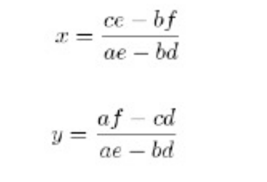
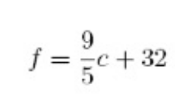
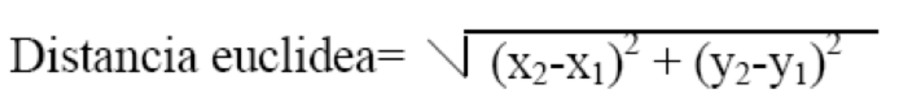
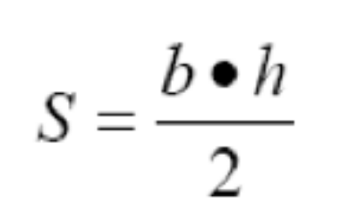
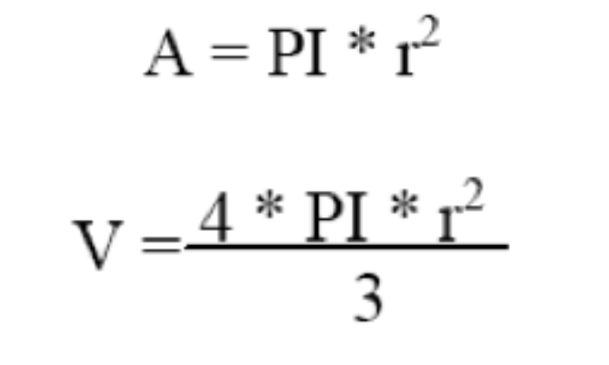
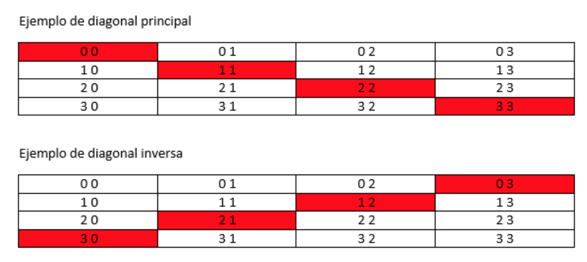

# Ejercicios Unidad 2 - Programación Estructurada

!!! info "Resultados de Aprendizaje"
    Estos ejercicios trabajan los siguientes RAs del módulo de **Programación**:

    - **RA2, RA3, RA5 y RA6** — Escribe y depura código utilizando las estructuras de control del lenguaje. Desarrolla programas aplicando la programación estructurada e introduciendo el tratamiento de datos.

!!! tip "Instrucciones Generales"
    - Resuelve cada ejercicio en los formatos indicados: `p` (pseudocódigo), `df` (diagrama de flujo) o `j` (Java).
    - Si un ejercicio no especifica de dónde obtener los datos, **siempre se deben solicitar por teclado** al usuario.

---

## Bloque 1: Repaso de Fundamentos

1. **(p, j) Conversor de Unidades:** Crea un programa que convierta una medida de pulgadas a centímetros. Solicita la cantidad de pulgadas y muestra el resultado.

    !!! tip "Pista"
        1 pulgada = 2.54 cm.

2. **(p, j) La Potencia Cúbica:** Escribe un programa que pida un número al usuario y calcule su cubo (el número multiplicado por sí mismo tres veces).

3. **(p, j) Geometría del Cilindro:** Programa para una fábrica de envases que calcule el área total y el volumen de un cilindro. Pide radio y altura.

    !!! tip "Pista"
        - Volumen: `V = PI * r² * h`
        - Área: `A = 2 * PI * r * h + 2 * PI * r²`

4. **(df, j) El Teorema de Pitágoras:** Diseña un programa que calcule la hipotenusa de un triángulo rectángulo a partir de los dos catetos.

    !!! tip "Pista"
        `hipotenusa² = cateto1² + cateto2²`

5. **(df, j) Conversor Imperial:** Desarrolla un programa que convierta una distancia en metros a pies y pulgadas.

    !!! tip "Pista"
        1 metro = 39.27 pulgadas; 1 pie = 12 pulgadas.

6. **(p, df, j) El Juego de los Vasos:** Tienes tres vasos (variables A, B, C). Intercambia sus contenidos: B toma el valor de A, A toma el valor de C, y C toma el valor de B. ¿Cómo lo harías sin perder el contenido original?

    !!! tip "Pista"
        Puede que necesites un vaso auxiliar temporal.

---

## Bloque 2: Estructuras Condicionales

7. **(df, j) ¿Par o Impar?:** Pide un número entero y determina si es par o impar, mostrando un mensaje claro al usuario.

8. **(p, j) Filtrando Pares:** Pide dos números enteros y muestra todos los números pares que se encuentren en ese rango.

    !!! warning "Nota"
        Este ejercicio requiere estructuras repetitivas.

9. **(p, j) Producto de Positivos:** Lee 5 números por teclado y calcula el producto de todos los que sean positivos. Los no positivos se ignoran.

10. **(p, j) División Segura:** Pide dos números al usuario. Realiza la división decimal del primero entre el segundo y muestra el resultado.

    !!! warning "Precaución"
        Asegúrate de que el divisor no sea cero antes de operar.

11. **(df, j) El Ordenador de Números:** Pide tres números enteros y muéstralos ordenados de menor a mayor.

12. **(df, j) Mini-Calculadora:** Pide dos números y muestra el resultado de su suma, producto y división.

    !!! warning "Precaución"
        Si el segundo número es cero, la división no es posible. Muestra un mensaje de error en lugar de intentar la operación.

13. **(p, j) Calculadora de Superficies:** Calcula el área de un rectángulo a partir de la base y la altura.

    !!! tip "Pista"
        `área = base * altura`

14. **(p, j) El Detector de Signo:** Pide un número y di al usuario si es "Positivo" o "Negativo". (Considera el cero como positivo).

15. **(p, j) Resolviendo Ecuaciones:** Un sistema de ecuaciones lineales (`ax + by = c`, `dx + ey = f`) se puede resolver con las fórmulas de Cramer. Pide los coeficientes y calcula `x` e `y`.

    

16. **(p, j) Conversor de Temperatura:** Convierte una temperatura de grados Celsius a Fahrenheit.

    

17. **(df, j) Detector de Años Bisiestos:** Pide un año y determina si es bisiesto.

    !!! tip "Reglas"
        Un año es bisiesto si es divisible por 4, **excepto** si es divisible por 100, **a menos que** también sea divisible por 400. (Ej: 2000 es bisiesto, 1900 no lo es).

18. **(df, j) Calendario Mensual:** Pide un número de mes (1-12) y, usando `switch`, muestra cuántos días tiene ese mes. (No te preocupes por años bisiestos).

19. **(df, j) Taquilla del Fútbol:** Programa el sistema de precios de un partido de fútbol sala:

    | Edad | Precio |
    |---|---|
    | Menores de 5 años | **Gratis** |
    | Entre 5 y 15 años | **2€** |
    | Mayores de 15 años | **3€** |

20. **(p, j) Calificador de Exámenes:** Pide la nota de un examen (0-10) y el sexo del alumno ('H' o 'M'). Muestra la calificación adaptada al género:

    | Nota | Masculino | Femenino |
    |---|---|---|
    | < 5 | SUSPENSO | SUSPENSA |
    | ≥ 5 y < 7 | APROBADO | APROBADA |
    | ≥ 7 y < 9 | NOTABLE | NOTABLE |
    | ≥ 9 | SOBRESALIENTE | SOBRESALIENTE |

21. **(p, j) Clasificador de Triángulos:** Pide las longitudes de los tres lados y determina si el triángulo es:

    - **Equilátero:** 3 lados iguales.
    - **Isósceles:** 2 lados iguales.
    - **Escaleno:** Ningún lado igual.

22. **(p, j) Gestor de Notas:** Pide las 4 notas de un alumno, calcula el promedio y muestra si ha "Aprobado" o "Suspendido". Se aprueba con un promedio ≥ 4.5.

23. **(df, j) Evaluación de Nivel:** Calcula el porcentaje de aciertos de un test (total de preguntas y respuestas correctas). Muestra el nivel:

    | Porcentaje | Nivel |
    |---|---|
    | ≥ 90% | Muy Bueno |
    | ≥ 70% y < 90% | Bueno |
    | ≥ 50% y < 70% | Regular |
    | < 50% | Malo |

24. **(p, j) Distancia Euclidiana:** Calcula la distancia entre dos puntos P1(x1, y1) y P2(x2, y2).

    

25. **(df, j) Asignador de Colores:** El usuario introduce un carácter y el programa muestra el color asignado (ignora mayúsculas/minúsculas):

    | Carácter | Color |
    |---|---|
    | `r` | ROJO |
    | `v` | VERDE |
    | `a` | AZUL |
    | `n` | NEGRO |

---

## Bloque 3: Estructuras Repetitivas y Vectores

26. **(df, j) La Tabla de Multiplicar:** Pide un número y muestra su tabla de multiplicar completa (del 0 al 10).

27. **(p, j) Suma hasta Negativo:** Lee números hasta que el usuario introduzca uno negativo. Muestra la suma de todos los positivos introducidos.

28. **(df, j) Calculadora de Factorial:** Pide un número entero y calcula su factorial (producto de todos los enteros positivos desde 1 hasta ese número).

29. **(p, j) Filtrando Positivos:** Pide una serie de números. El programa termina cuando se introduce un `0` y muestra solo los positivos leídos.

30. **(p, j) Filtro Numérico Avanzado:** Lee 10 números y muestra:
    - Los números positivos menores que 5.
    - Los números negativos mayores que -5.

31. **(df, j) Suma y Producto de Pares:** Calcula y muestra la suma y el producto de los 100 primeros números pares (2, 4, 6, ..., 200).

32. **(p, j) Super Tabla de Multiplicar:** Muestra las tablas de multiplicar del 1 al 10.

33. **(p, j) Suma Selectiva:** Pide números enteros positivos. El programa se detiene si se introduce un número ≤ 0. Muestra la suma total de los pares y la suma total de los impares.

34. **(p, j) Calculadora de Triángulos Interactiva:** Calcula la superficie de un triángulo.

    - **Validación:** Asegúrate de que la base y la altura sean positivas. Si no, vuelve a pedirlas.
    - **Repetición:** Después de mostrar el resultado, pregunta si se desea calcular otra superficie.

    

35. **(df, j) Menú Geométrico:** Crea un programa con menú para elegir entre:
    1. Calcular el área de una circunferencia.
    2. Calcular el volumen de una esfera.

    

36. **(p, df, j) El Cajero Automático:** Dado un importe en euros, calcula el desglose en el menor número de billetes posible (de 500€ a 5€).

37. **(p, j) Calculadora de Figuras Planas:** Diseña un programa con menú para calcular el área y el perímetro de: círculo, rectángulo, cuadrado, rombo y triángulo. El usuario debe poder realizar varios cálculos sin reiniciar.

38. **(p, j) Potencias en un Rango:** Pide dos números y muestra el cuadrado y el cubo de todos los enteros entre ellos.

39. **(p, df, j) Menú Anidado de Juegos:** Crea un programa con menú principal. Según la opción, muestra los juegos de esa categoría o un submenú:
    1. Juegos de salón: `cartas, ajedrez, damas, prendas`.
    2. Juegos al aire libre:
        - a) Individuales: `atletismo, senderismo, natación`
        - b) Colectivos: `gimnasia, rítmica, rugby, polo, fútbol`
    3. Salir.

40. **(p, j) La Serie Numérica:** Calcula la suma de la serie `2 + 5 + 8 + 11 + ...` para todos los valores menores que 100. Resuelve el problema usando **tres bucles diferentes**: `while`, `do-while` y `for`.

41. **(p, j) Simulador de la Primitiva:** 
    1. Pide al usuario 6 números (del 1 al 49) para su boleto.
    2. Genera 6 números aleatorios (del 1 al 49, sin repetir) para la combinación ganadora.
    3. Genera un reintegro aleatorio (del 0 al 9).
    4. Compara y muestra el número de aciertos.
    5. Pregunta si quiere volver a jugar.

42. **(df, j) Brain Training:** Simula un juego de cálculo mental.
    1. Realiza 20 operaciones aleatorias (+, -, *, /) con números del 1 al 10.
    2. Pide el resultado al usuario en cada operación.
    3. Si acierta, suma un punto.
    4. Al final, muestra el porcentaje de aciertos.

43. **(df, j) ¿Quién es el Director?:** Un juego de cine.
    1. Almacena en dos vectores paralelos 5 películas y sus directores.
    2. El programa elige una película al azar y se la muestra al usuario.
    3. El usuario debe escribir el nombre del director.
    4. El usuario empieza con 5 vidas. Si falla, pierde una.
    5. El juego termina si se queda sin vidas o decide no continuar.
    6. Al final, muestra el porcentaje de aciertos.

---

## Bloque 4: Retos Combinados

44. **(p, j) Máquina Expendedora:** Programa el software de una máquina que vende un producto a 2,10€.
    - Pide al usuario que introduzca dinero.
    - Si es insuficiente, muestra un mensaje de error.
    - Si es suficiente, calcula el cambio usando el menor número de monedas posible (50, 20, 10 y 5 céntimos).

45. **(df, j) Ordenador Universal:** Pide tres números. Pregunta si el usuario quiere ordenarlos de mayor a menor o de menor a mayor. Permite repetir la operación con nuevos números.

46. **(p, j) Calculadora de Salario Neto:** Calcula el salario neto semanal a partir de las horas trabajadas.

    | Concepto | Valor |
    |---|---|
    | Tarifa normal (primeras 35h) | 8€/hora |
    | Horas extra | +50% sobre tarifa normal |
    | Exención fiscal | Primeros 600€ |
    | Tramo 600€–1000€ | 25% |
    | Tramo > 1000€ | 45% |

    El programa debe mostrar: salario bruto, total de impuestos y salario neto.

47. **(df, j) Facturación de Hotel:** Calcula la factura según los días de estancia y la categoría de habitación.

    | Categoría | Precio/día |
    |---|---|
    | A | 200€ |
    | B | 180€ |
    | C | 120€ |
    | D | 80€ |

48. **(p, j) Simulador de Amortización de Préstamo:** Una persona pide un préstamo de P euros y lo devuelve en cuotas mensuales de A euros con un interés anual. Calcula y muestra para cada mes: el interés pagado, la reducción de deuda, el total de intereses acumulados, la deuda pendiente y el número total de pagos.

    !!! tip "Datos de prueba"
        Préstamo de 6000€, cuota de 135€, interés del 12% anual.

49. **(df, j) Facturación de Alquiler de Coches:** Calcula la factura según los kilómetros recorridos.

    | Kilómetros | Tarifa |
    |---|---|
    | 10–100 Km | 2€/Km |
    | 101–999 Km | 1,50€/Km |
    | ≥ 1000 Km | 1€/Km |

50. **(p, j) Sistema de Acceso Seguro:** Gestiona el acceso a un sistema mediante una contraseña de 4 dígitos. Menú:
    1. Introducir contraseña.
    2. Cambiar contraseña (requiere la contraseña antigua).
    3. Acceder al sistema (solo si la contraseña es correcta).
    4. Salir.

51. **(df, j) Gestor de Nóminas de Empresa:** Calcula la nómina de un empleado. Pide nombre, categoría, año de ingreso y horas trabajadas.

    | Categoría | Precio/hora |
    |---|---|
    | Administrativo | 5€ |
    | Técnico | 7€ |
    | Profesional | 12€ |
    | Operario | 3€ |

    - Horas extra: +50% sobre tarifa normal.
    - Antigüedad: 5% (1-3 años), 10% (4-6 años), etc.
    - Descuentos: 3% obra social, 10% jubilación sobre sueldo base.

52. **(p, j) Emulador de Calculadora Científica:** Crea una calculadora con menú para operaciones básicas (suma, resta, producto, división) y complejas (potencia, raíz cuadrada). El programa debe ser robusto y controlar posibles errores de entrada.

---

## Bloque 5: Matrices

53. **(j) Tablero Numérico:** Crea una matriz de 3×3 y rellénala con los números del 1 al 9. Muéstrala en formato de tabla.

54. **(j) Matriz Aleatoria:** Pide al usuario el número de columnas para una matriz de 5 filas. Rellénala con números aleatorios entre 0 y 10 y muéstrala.

55. **(j) Suma de Matrices:** Pide las dimensiones de dos matrices cuadradas (n×n). Solicita todos los valores para ambas. Calcula su suma en una tercera matriz y muestra las tres al final.

56. **(j) Analizador de Matrices:** Crea un programa con menú para analizar una matriz de 4×4:

    - **Rellenar Matriz:** Pide todos los valores (debe completarse primero).
    - **Suma de Fila:** Pide un número de fila y muestra la suma de sus elementos.
    - **Suma de Columna:** Pide un número de columna y muestra la suma de sus elementos.
    - **Suma Diagonal Principal:** Suma los elementos donde fila == columna.
    - **Suma Diagonal Inversa:** Suma los elementos de la diagonal secundaria.
    - **Media Total:** Calcula la media de todos los valores.

    

57. **(j) Matriz sin Repeticiones:** Genera una matriz de 3×3 con números aleatorios entre 1 y 9, asegurándote de que ningún número se repita.

58. **(j) Simulador de Máquina Expendedora v2.0:** Gestiona una máquina de golosinas usando matrices.

    Usa estas matrices de datos de ejemplo:

    ```java
    String[][] nombresGolosinas = {
        {"KitKat",      "Chicles de fresa",    "Lacasitos",    "Palotes"},
        {"Kinder Bueno","Bolsa variada Haribo", "Chetoos",      "Twix"},
        {"Kinder Bueno","M&M'S",               "Papa Delta",   "Chicles de menta"},
        {"Lacasitos",   "Crunch",               "Milkybar",     "KitKat"}
    };

    double[][] precios = {
        {1.1, 0.8, 1.5, 0.9},
        {1.8, 1.0, 1.2, 1.0},
        {1.8, 1.3, 1.2, 0.8},
        {1.5, 1.1, 1.1, 1.1}
    };

    // Inicializa la cantidad de cada golosina a 5
    int[][] cantidades = new int[4][4];
    ```

    **Menú de opciones:**

    1. **Pedir Golosina:** El usuario introduce un código de dos dígitos (fila y columna). Si hay stock y dinero suficiente, realiza la venta.
    2. **Mostrar Golosinas:** Muestra el código, nombre y precio de todos los productos.
    3. **Rellenar Golosinas (Técnico):** Pide contraseña. Si es correcta, permite aumentar el stock.
    4. **Apagar Máquina:** Muestra las ventas totales y termina el programa.
