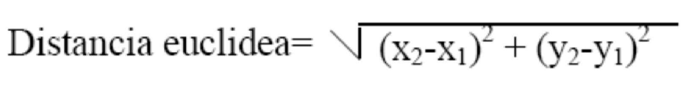
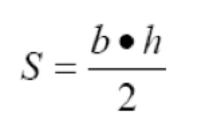

| Fecha      | Versión | Descripción                      |
| ---------- | ------- | -------------------------------- |
| 23/09/2021 | 1.0.0   | Versión inicial.                 |
| 27/09/2021 | 1.0.1   | Corrección de errores.           |
| 14/10/2021 | 1.0.2   | Se añaden ejercicios de matrices |
| 21/09/2025 | 2.0.0   | **Revisión.** Adaptación |

## Ejercicios Unidad 2 - Programación Estructurada

**Instrucciones Generales:**

* Resuelve cada ejercicio en los formatos indicados: `p` (pseudocódigo), `df` (diagrama de flujo) o `j` (Java).
* Si un ejercicio no especifica de dónde obtener los datos, siempre se deben solicitar por teclado al usuario.

---

### Bloque 1: Repaso de Fundamentos

1.  **(p, j) Conversor de Unidades:** Crea un programa que convierta una medida de pulgadas a centímetros. Debe solicitar al usuario la cantidad de pulgadas y mostrar el resultado.
    * **Pista:** 1 pulgada = 2.54 cm.

2.  **(p, j) La Potencia Cúbica:** Escribe un programa que pida un número al usuario y calcule su cubo (el número multiplicado por sí mismo tres veces).

3.  **(p, j) Geometría del Cilindro:** Necesitamos un programa para una fábrica de envases. Debe calcular el área total y el volumen de un cilindro. Pide al usuario el radio y la altura.
    * **Fórmula Volumen:** `V = PI * r² * h`
    * **Fórmula Área:** `A = 2 * PI * r * h + 2 * PI * r²`

4.  **(df, j) El Teorema de Pitágoras:** Diseña un programa que calcule la hipotenusa de un triángulo rectángulo. El usuario introducirá el valor de los dos catetos.
    * **Fórmula:** `hipotenusa² = cateto1² + cateto2²`

5.  **(df, j) Conversor Imperial:** Desarrolla un programa que convierta una distancia en metros a pies y pulgadas. El usuario debe introducir la cantidad de metros.
    * **Pista:** 1 metro = 39.27 pulgadas; 1 pie = 12 pulgadas.

6.  **(p, df, j) El Juego de los Vasos:** Imagina que tienes tres vasos (variables A, B, C). Debes intercambiar sus contenidos de la siguiente manera: B toma el valor de A, A toma el valor de C, y C toma el valor de B. ¿Cómo lo harías sin perder el contenido original?
    * **Pista:** Puede que necesites un vaso auxiliar.

---

### Bloque 2: Estructuras Condicionales

7.  **(df, j) ¿Par o Impar?:** Crea un programa que pida un número entero y determine si es par o impar, mostrando un mensaje claro al usuario.

8.  **(p, j) Filtrando Pares:** Escribe un programa que pida dos números enteros. Después, debe mostrar en pantalla todos los números pares que se encuentren en el rango entre esos dos números.

9.  **(p, j) Producto de Positivos:** Diseña un programa que lea 5 números por teclado y calcule el producto de todos aquellos que sean positivos. Si un número no es positivo, simplemente se ignora.

10. **(p, j) División Segura:** Pide dos números al usuario (asegúrate de que no sean cero). Realiza la división decimal del primero entre el segundo y muestra el resultado.

11. **(df, j) El Ordenador de Números:** Pide al usuario tres números enteros y muéstralos en pantalla ordenados de menor a mayor.

12. **(df, j) Mini-Calculadora:** Pide dos números y muestra el resultado de su suma, producto y división. ¡Cuidado! Si el segundo número es cero, la división no es posible. En ese caso, muestra un mensaje de error en lugar de intentar la operación.

13. **(p, j) Calculadora de Superficies:** Tu programa debe calcular el área de un rectángulo. Pide al usuario la base y la altura y muestra el resultado.
    * **Fórmula:** `área = base * altura`

14. **(p, j) El Detector de Signo:** Pide un número y dile al usuario si es "Positivo" o "Negativo". (Considera el cero como positivo).

15. **(p, j) Resolviendo Ecuaciones:** Un sistema de ecuaciones lineales (`ax + by = c`, `dx + ey = f`) se puede resolver con las fórmulas de Cramer. Tu programa debe pedir los coeficientes (a, b, c, d, e, f) y calcular los valores de `x` e `y`.

    

16. **(p, j) Conversor de Temperatura:** Crea un programa que convierta una temperatura de grados Celsius a Fahrenheit.

    

17. **(df, j) Detector de Años Bisiestos:** Escribe un programa que pida un año y determine si es bisiesto.
    * **Reglas:** Un año es bisiesto si es divisible por 4, excepto si es divisible por 100, a menos que también sea divisible por 400. (Ej: 2000 es bisiesto, 1900 no lo es).

18. **(df, j) Calendario Mensual:** Pide al usuario un número de mes (del 1 al 12) y, usando una estructura `switch`, muestra cuántos días tiene ese mes. (No te preocupes por los años bisiestos).

19. **(df, j) Taquilla del Fútbol:** Programa el sistema de precios de un partido de fútbol sala según la edad:
    * Menores de 5 años: **Gratis**
    * Entre 5 y 15 años: **2€**
    * Mayores de 15 años: **3€**

20. **(p, j) Calificador de Exámenes:** Pide la nota de un examen (0-10) y el sexo del alumno ('H' o 'M'). El programa debe mostrar la calificación adaptada al género:
    * **< 5:** SUSPENSO / SUSPENSA
    * **>= 5 y < 7:** APROBADO / APROBADA
    * **>= 7 y < 9:** NOTABLE
    * **>= 9:** SOBRESALIENTE

21. **(p, j) Clasificador de Triángulos:** Pide al usuario las longitudes de los tres lados de un triángulo y determina si es:
    * **Equilátero:** 3 lados iguales.
    * **Isósceles:** 2 lados iguales.
    * **Escaleno:** Ningún lado igual.

22. **(p, j) Gestor de Notas:** Pide las 4 notas de un alumno, calcula su promedio y muestra un mensaje indicando si ha "Aprobado" o "Suspendido". Se aprueba con un promedio de 4.5 o más.

23. **(df, j) Evaluación de Nivel:** Un programa para corregir tests debe calcular el porcentaje de aciertos. Pide el total de preguntas y el número de respuestas correctas. Luego, muestra el nivel:
    * **>= 90%:** Muy Bueno
    * **>= 70% y < 90%:** Bueno
    * **>= 50% y < 70%:** Regular
    * **< 50%:** Malo

24. **(p, j) Distancia Euclidiana:** Calcula la distancia entre dos puntos en un plano (P1 y P2). Pide al usuario las coordenadas (x1, y1) y (x2, y2).

    

25. **(df, j) Asignador de Colores:** Pide al usuario que introduzca un carácter y, según la letra, muestra el color asignado (ignora si es mayúscula o minúscula):
    * 'r': ROJO
    * 'v': VERDE
    * 'a': AZUL
    * 'n': NEGRO

---

### Bloque 3: Estructuras Repetitivas

26. **(df, j) La Tabla de Multiplicar:** Pide un número y muestra su tabla de multiplicar completa (del 0 al 10).

27. **(p, j) Suma hasta Negativo:** El programa debe leer números hasta que el usuario introduzca uno negativo. En ese momento, mostrará la suma de todos los números positivos introducidos.

28. **(df, j) Calculadora de Factorial:** Pide un número entero y calcula su factorial (el producto de todos los enteros positivos desde 1 hasta ese número).

29. **(p, j) Filtrando Positivos:** Pide al usuario una serie de números (positivos o negativos). El programa terminará cuando se introduzca un 0 y mostrará en pantalla solo los números positivos que se leyeron.

30. **(p, j) Filtro Numérico Avanzado:** Lee 30 números por teclado y al final, muestra una lista con:
    * Los números positivos menores que 5.
    * Los números negativos mayores que -5.

31. **(df, j) Suma y Producto de Pares:** Calcula y muestra la suma y el producto de los 100 primeros números pares (2, 4, 6, ..., 200).

32. **(p, j) Super Tabla de Multiplicar:** Muestra las tablas de multiplicar de los 10 primeros números (del 1 al 10).

33. **(p, j) Suma Selectiva:** Pide números enteros positivos. El programa se detiene si se introduce un número menor o igual a 0. Al final, muestra la suma total de los números pares y la suma total de los impares.

34. **(p, j) Calculadora de Triángulos Interactiva:** Calcula la superficie de un triángulo.
    * **Validación:** Asegúrate de que la base y la altura introducidas sean positivas. Si no, vuelve a pedirlas.
    * **Repetición:** Después de mostrar el resultado, pregunta al usuario si desea calcular otra superficie. El programa se repetirá hasta que responda que no.
    
    

35. **(df, j) Menú Geométrico:** Crea un programa con un menú que permita al usuario elegir entre:
    1.  Calcular el área de una circunferencia.
    2.  Calcular el volumen de una esfera.

    

36. **(p, df, j) El Cajero Automático:** Dado un importe en euros, calcula el desglose en el menor número de billetes posible (de 500€ a 5€).

37. **(p, j) Calculadora de Figuras Planas:** Diseña un programa con un menú para calcular el área y el perímetro de: círculo, rectángulo, cuadrado, rombo y triángulo. El usuario debe poder realizar varios cálculos sin reiniciar el programa.

38. **(p, j) Potencias en un Rango:** Pide dos números al usuario y muestra el cuadrado y el cubo de todos los números enteros que hay entre ellos.

39. **(p, df, j) Menú Anidado de Juegos:** Crea un programa que muestre un menú principal. Según la opción elegida, debe mostrar los juegos de esa categoría o un submenú si es necesario.
    1.  Juegos de salón: `cartas, ajedrez, damas, prendas`.
    2.  Juegos al aire libre:
        * a) Individuales: `atletismo, senderismo, natación`
        * b) Colectivos: `gimnasia, rítmica, rugby, polo, futbol`.
    3.  Salir

40. **(p, j) La Serie Numérica:** Calcula la suma de la serie `2 + 5 + 8 + 11 + ...` para todos los valores menores que 100. Resuelve el problema usando tres bucles diferentes: `while`, `do-while` y `for`.

41. **(p, j) Simulador de la Primitiva:** ¡Vamos a crear un juego!
    1.  Pide al usuario 6 números (del 1 al 49) para su boleto.
    2.  Genera 6 números aleatorios (del 1 al 49, sin que se repitan) para la combinación ganadora.
    3.  Genera un reintegro aleatorio (del 0 al 9).
    4.  Compara y muestra el número de aciertos.
    5.  Pregunta si quiere volver a jugar.

42. **(df, j) Brain Training:** Simula un juego de cálculo mental.
    1.  Realiza 20 operaciones aleatorias (+, -, *, /) con dos números aleatorios (del 1 al 10).
    2.  Pide el resultado al usuario en cada operación.
    3.  Si acierta, suma un punto.
    4.  Al final, muestra el porcentaje de aciertos.

43. **(df, j) ¿Quién es el Director?:** Un juego de cine.
    1.  Almacena en dos vectores paralelos 5 películas y sus directores.
    2.  El programa elige una película al azar y se la muestra al usuario.
    3.  El usuario debe escribir el nombre del director.
    4.  El usuario empieza con 5 vidas. Si falla, pierde una.
    5.  El juego termina si se queda sin vidas o si decide no continuar.
    6.  Al final, muestra el porcentaje de aciertos.

---

### Bloque 4: Retos Combinados

44. **(p, j) Máquina Expendedora:** Programa el software de una máquina que vende un producto a 2,10€.
    * Pide al usuario que introduzca dinero.
    * Si el dinero es insuficiente, muestra un mensaje de error.
    * Si es suficiente, calcula el cambio a devolver usando el menor número de monedas posible (dispones de monedas de 50, 20, 10 y 5 céntimos).

45. **(df, j) Ordenador Universal:** Pide tres números al usuario. Luego, pregúntale si quiere ordenarlos "de mayor a menor" o "de menor a mayor" y muestra el resultado. El programa debe permitir repetir la operación con nuevos números.

46. **(p, j) Calculadora de Salario Neto:** Calcula el salario neto semanal de un trabajador a partir de las horas trabajadas.
    * **Tarifa normal:** 8€/hora (para las primeras 35 horas).
    * **Horas extra:** Se pagan un 50% más que la tarifa normal.
    * **Impuestos:**
        * Los primeros 600€ del salario bruto están exentos.
        * Los siguientes 400€ tienen una tasa del 25%.
        * El resto tiene una tasa del 45%.
    * El programa debe mostrar: salario bruto, total de impuestos y salario neto.

47. **(df, j) Facturación de Hotel:** Calcula la factura de un cliente. Pide el número de días de estancia y la categoría de la habitación.
    * **Categoría A:** 200€/día
    * **Categoría B:** 180€/día
    * **Categoría C:** 120€/día
    * **Categoría D:** 80€/día

48. **(p, j) Simulador de Amortización de Préstamo:** Una persona pide un préstamo de P euros y lo devuelve en cuotas mensuales de A euros, con un interés anual. El programa debe calcular y mostrar para cada mes: el interés pagado, cuánto se reduce la deuda, el total de intereses pagados hasta la fecha, la deuda pendiente, y el número total de pagos necesarios (el último podría ser menor).
    * **Datos de prueba:** Préstamo de 6000€, cuota de 135€, interés del 12% anual.

49. **(df, j) Facturación de Alquiler de Coches:** Una empresa de alquiler de coches cobra según los kilómetros recorridos. Calcula la factura final.
    * **10-100 Km:** 2 €/Km.
    * **101-999 Km:** 1.50 €/Km.
    * **>= 1000 Km:** 1 €/Km.

50. **(p, j) Sistema de Acceso Seguro:** Crea un programa que gestione el acceso a un sistema mediante una contraseña de 4 dígitos. Debe presentar un menú:
    1.  Introducir contraseña.
    2.  Cambiar contraseña (requiere la contraseña antigua).
    3.  Acceder al sistema (solo si la contraseña es correcta).
    4.  Salir.

51. **(df, j) Gestor de Nóminas de Empresa:** Diseña un programa que calcule la nómina de un empleado. Pide su nombre, categoría, año de ingreso y horas trabajadas. Debe mostrar un desglose del sueldo.
    * **Categorías y precio/hora:** Administrativo (5€), Técnico (7€), Profesional (12€), Operario (3€).
    * **Horas extra:** Se pagan un 50% más.
    * **Antigüedad:** Un % extra sobre el sueldo base (5% para 1-3 años, 10% para 4-6, etc.).
    * **Descuentos:** 3% por obra social y 10% por jubilación sobre el sueldo base.

52. **(p, j) Emulador de Calculadora Científica:** Crea una calculadora con un menú para operaciones básicas (suma, resta, producto, división) y complejas (potencia, raíz cuadrada). El programa debe ser robusto y controlar posibles errores de entrada de datos.

---

### Bloque 5: Matrices

53. **(j) Tablero Numérico:** Crea una matriz de 3x3 y rellénala con los números del 1 al 9. Luego, muéstrala por pantalla en su formato de tabla.

54. **(j) Matriz Aleatoria:** Pide al usuario el número de columnas para una matriz de 5 filas. Rellénala con números aleatorios entre 0 y 10 y muéstrala.

55. **(j) Suma de Matrices:** Pide al usuario las dimensiones de dos matrices cuadradas (nxn). Luego, solicita todos los valores para ambas. Calcula la suma de las dos matrices y guarda el resultado en una tercera matriz. Muestra las tres matrices al final.

56. **(j) Analizador de Matrices:** Crea un programa con un menú para analizar una matriz de 4x4:
    * **Rellenar Matriz:** Pide al usuario todos los valores de la matriz. (Esta opción debe completarse primero).
    * **Suma de Fila:** Pide un número de fila y muestra la suma de sus elementos.
    * **Suma de Columna:** Pide un número de columna y muestra la suma de sus elementos.
    * **Suma Diagonal Principal:** Suma los elementos donde el índice de fila y columna son iguales.
    * **Suma Diagonal Inversa:** Suma los elementos de la diagonal secundaria.
    * **Media Total:** Calcula la media de todos los valores de la matriz.
    
    

57. **(j) Matriz sin Repeticiones:** Genera una matriz de 3x3 con números aleatorios entre 1 y 9, asegurándote de que ningún número se repita.

58. **(j) Simulador de Máquina Expendedora v2.0:** Gestiona una máquina de golosinas usando matrices.
    * Usa una matriz para los nombres, otra para los precios y otra para las cantidades. Puedes usar estos datos de ejemplo para empezar:
    ```java
    String[][] nombresGolosinas = {
        {"KitKat", "Chicles de fresa", "Lacasitos", "Palotes"},
        {"Kinder Bueno", "Bolsa variada Haribo", "Chetoos", "Twix"},
        {"Kinder Bueno", "M&M'S", "Papa Delta", "Chicles de menta"},
        {"Lacasitos", "Crunch", "Milkybar", "KitKat"}
    };

    double[][] precios = {
        {1.1, 0.8, 1.5, 0.9},
        {1.8, 1, 1.2, 1},
        {1.8, 1.3, 1.2, 0.8},
        {1.5, 1.1, 1.1, 1.1}
    };
    
    // Podrías inicializar la cantidad de cada golosina a 5, por ejemplo.
    int[][] cantidades = new int[4][4];
    ```
    * **Menú de opciones:**
        1.  **Pedir Golosina:** El usuario introduce un código de dos dígitos (fila y columna). Si hay stock y tiene dinero suficiente, se realiza la venta.
        2.  **Mostrar Golosinas:** Muestra el código, nombre y precio de todos los productos.
        3.  **Rellenar Golosinas (Técnico):** Pide una contraseña. Si es correcta, permite aumentar el stock de una golosina.
        4.  **Apagar Máquina:** Muestra las ventas totales y termina el programa.
