# Actividad Entregable UD4: La Logística de Santa Claus 🎅🎁

**Objetivo:** Diseñar y construir un programa complejo aplicando los principios de colecciones y estructuras de datos dinámicas. Haciendo un uso de `ArrayList`, `HashSet` y `HashMap`.

**Resultados de Aprendizaje (RAs) Trabajados: RA6.**

* Se han reconocido las librerías de clases relacionadas con tipos de datos avanzados.
* Se han utilizado listas para almacenar y procesar información.
* Se han utilizado iteradores para recorrer los elementos de las listas.
* Se han reconocido las características y ventajas de cada una de las colecciones de datos disponibles.

## Contexto

**Santa Claus** necesita un programa para optimizar el reparto de regalos de una zona e integrarlo en el GPS de su trineo. Y te ha encomendado la misión de hacerlo.

Como sabemos, los repartos se realizan a la velocidad de la luz, por lo que en cada *población* sólo necesita unos *milisegundos* para completar la tarea.

Sin embargo, **Santa Claus** quiere optimizar el reparto y **empezar primero por las poblaciones que necesiten menos tiempo**.

Cada población tiene unos milisegundos asignados. Por ejemplo:

* **Benifairó:** 500 ms
* **Gilet:** 1000 ms
* **Canet:** 1800 ms
* **Faura:** 950 ms
* **Sagunto:** 20000 ms

Si optimizamos los tiempos, la **ruta de reparto** quedaría así:

```mermaid
graph LR
    A[Benifairó] --> B[Faura]
    B --> C[Gilet]
    C --> D[Canet]
    D --> E[Sagunto]
```



## Enunciado

Desarrolla una aplicación modular de consola usando estructuras de datos dinámicas. Cumpliará los siguientes puntos:

1. **Menú de la aplicación:**

   * El menú de la aplicación es el siguiente:

    ```text
    --- SANTA MAPS ---

    A) Añadir población
    B) Visitar población
    C) Calcular ruta
    D) Resumen reparto
    E) Salir

    - Escoge una opción [A-E]: 
    ```

2. **Añadir población y sus *milisegundos* (`HashMap`):**
    * Solicitará el nombre de una población y el tiempo en *milisegundos*.
  
    ```text
    --- AÑADIR POBLACIÓN ---

    - Indica el nombre de la población: Benifairó
    - Indica el tiempo de reparto (ms): 500
    
    [MENSAJE] Población añadida con éxito
    ```

    * Una población no puede repetirse pero los tiempos sí.

    !!! tip "Registro datos"
        Usa un `HashMap<String, Integer>` para llevar el registro de las poblaciones y sus tiempos. **Clave:** Nombre población. **Valor:** Tiempo.

3. **Visitar población (`HashSet`):**
    * El programa solicitará el *nombre* de la población.
    * **Validación**: Debes comprobar si la población existe en tu registro (`HashMap`).
        * Si no existe: Muestra un error.
        * Si existe: Añádela al `HashSet` de visitadas.
  
        ```text
        --- VISITAR POBLACIÓN ---

        - Indica la población visitada: Benifairó

        [MENSAJE] Población visitada con éxito
        ```

    * Cuando **Santa** visita una población, ésta quedará registrada como *poblacion visitada*.

        ```mermaid
            graph LR
                subgraph "Poblaciones visitadas"
                direction TB
                E1((Benifairó))
                end
        ```

    * Las poblaciones visitadas se irán acumulando y **servirán para calcular de nuevo la ruta**. Si la población está *visitada* no se usará para **Calcular ruta**.

    !!! tip "Poblaciones visitadas"
        Usa un `HashSet` para almacenar las poblaciones visitadas. Ten en cuenta que **no queremos eliminar el registro de poblaciones y sus tiempos**.

4. **Calcular ruta (`ArrayList`):**

    * Esta es la parte central de la actividad. El programa debe generar una **lista con las poblaciones pendientes** (las que están en el registro pero **NO** están en visitadas).
    * Esta lista debe mostrarse **ordenada de menor a mayor tiempo** (primero las rápidas).
    * Mostrará la ruta optimizada y el tiempo estimado total (fíjate que no muestra la *visitada*).

    ```text
    --- RUTA DE SANTA ---

    [Faura]->[Gilet]->[Canet]->[Sagunto]
    - Tiempo estimado: 23.750 ms 
    ```

    !!! tip "Pista Técnica: 쮺칩mo ordeno la lista según el mapa?"
        Tienes los nombres en un `ArrayList` y los tiempos en un `HashMap`. Para ordenar la lista basándote en los tiempos, puedes usar `Collections.sort` con el siguiente código:

        ```java
        // Suponiendo que 'ruta' es tu ArrayList con los nombres de las ciudades
        // y 'mapaTiempos' es tu HashMap con los datos.

        Collections.sort(ruta, (ciudad1, ciudad2) -> {
            int tiempo1 = mapaTiempos.get(ciudad1);
            int tiempo2 = mapaTiempos.get(ciudad2);
            return tiempo1 - tiempo2; // Orden ascendente (menor a mayor)
        });
        ```
        > Esto le dice a Java: "Para saber qué ciudad va antes, busca sus tiempos en el mapa y comparalos (si el resultado es negativo en el return, significa que la primera es menor)".

    !!! danger "Cuidado con los cambios"
        En cualquier momento, se puede **añadir una población nueva con su tiempo** o **vistar una población**. Debes considerarlo cuando realices el **cálculo de la ruta**.

5. **Resumen reparto:**
    * Mostará las poblaciones donde se ha hecho el reparto y el **tiempo empleado**.
  
    ```text
    --- RESUMEN REPARTO ---

    - Poblaciones visitadas:

    (Benifairó)

    - Tiempo empleado: 500 ms
    ```
