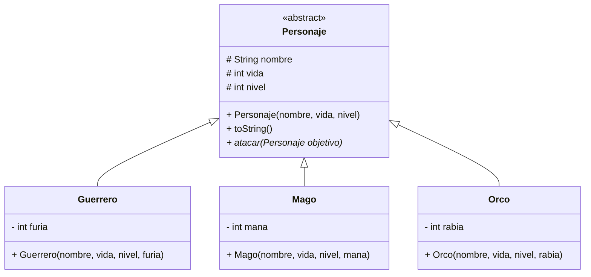
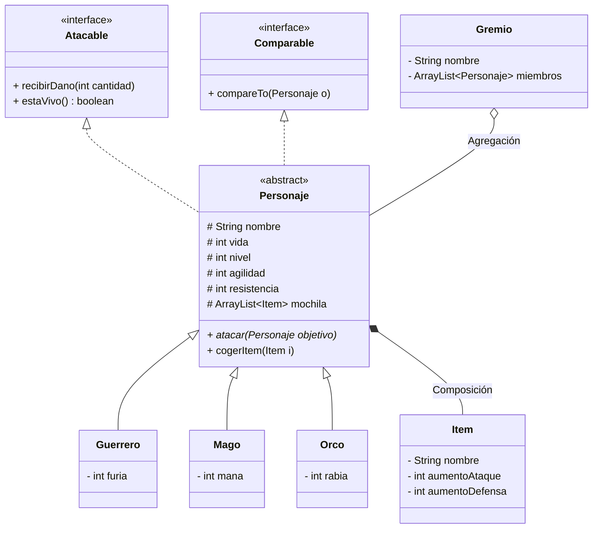

# Ejercicio Largo: La Batalla por el Trono de Código (Juego de Rol) ⚔️

Este ejercicio integral está diseñado para poner en práctica **todos** los conceptos avanzados de la Programación Orientada a Objetos vistos en la Unidad 6: **herencia, clases abstractas, interfaces, polimorfismo y colecciones**.

El ejercicio se divide en fases incrementales. Debes ir completando cada fase antes de pasar a la siguiente.

---

## Fase 1: La Jerarquía de Clases (Herencia y Abstractas)

En nuestro juego de rol, existen diferentes clases de personajes. Todos comparten características, pero cada uno es único.

### 1.1. Diagrama de Clases Inicial
Tendremos una clase base `Personaje` y tres especializaciones: `Guerrero`, `Mago` y `Orco`.



### 1.2. Tareas
1.  Crea un nuevo proyecto llamado `JuegoDeRol`.
2.  Crea un paquete `model` para las clases del dominio y un paquete `main` para el programa principal.
3.  Implementa la clase **Abstracta** `Personaje`.
    *   **¿Por qué abstracta?** Porque no queremos crear un "Personaje" genérico.
    *   Añade un constructor que reciba `nombre`, `vida` y `nivel`.
    *   Define el método abstracto `atacar(Personaje objetivo)`.
    *   Sobrescribe `toString()` para mostrar los datos básicos.
4.  Implementa las clases hijas `Guerrero`, `Mago` y `Orco`.
    *   **Guerrero**: Tiene atributo extra `furia`.
    *   **Mago**: Tiene atributo extra `mana`.
    *   **Orco**: Tiene atributo extra `rabia`.
    *   Deben tener un constructor que invoque al constructor del padre usando **`super(...)`**.
    *   Implementa el método `atacar()` de forma sencilla (por ahora solo un `System.out.println` indicando quién ataca a quién).

---

## Fase 2: Atributos y Estado (Encapsulamiento)

Vamos a dar vida a las estadísticas de los personajes.

### 2.1. Nuevos Atributos en `Personaje`
Además de lo básico, añade:

*   `agilidad` (int): Determinará quién ataca primero.
*   `resistencia` (int): Reducirá el daño recibido.

### 2.2. Tareas
1.  Actualiza el constructor de `Personaje` (y de los hijos) para incluir `agilidad` y `resistencia`.
2.  Actualiza el `toString()` para mostrar todas las estadísticas:
    `"Conan (Guerrero) | Nivel: 5 | Vida: 100 | Furia: 50 | Agilidad: 10 | Resistencia: 5"`

---

## Fase 3: El Contrato de Combate (Interfaces)

Queremos que nuestros personajes puedan recibir daño de forma estandarizada.

### 3.1. La Interfaz `Atacable`
Crea una interfaz en el paquete `model` llamada `Atacable`.

```java
public interface Atacable {
    void recibirDano(int cantidad);
    String getNombre();
    boolean estaVivo();
}
```

### 3.2. Implementación
1.  Haz que la clase abstracta `Personaje` implemente `Atacable`.
2.  Implementa los métodos en `Personaje`:
    *   **`recibirDano(int dano)`**:
        *   Calcula el daño real: `dano - resistencia`.
        *   Si el daño real es menor a 0, se queda en 0 (la armadura absorbió todo).
        *   Resta el daño real a la `vida`.
        *   Muestra por pantalla: *"Conan recibe X de daño. Vida restante: Y"*.
    *   **`estaVivo()`**: Devuelve `true` si la vida es mayor a 0.

---

## Fase 4: Comportamiento Especializado (Polimorfismo)

Ahora aprovecharemos el Polimorfismo para que cada clase ataque de forma única.

### 4.1. Reglas de Ataque
Modifica el método `atacar(Personaje objetivo)` en cada clase:

1.  **Guerrero**:
    *   Daño = `nivel * 2 + furia`.
    *   Si tiene menos de 10 de vida, su daño se duplica (¡Berserker!).
2.  **Mago**:
    *   Daño = `nivel * nivel + mana`.
    *   Si tiene menos de 10 de `mana`, no puede atacar (daño 0) y recupera 5 de maná.
3.  **Orco**:
    *   Daño = `nivel * 3 + rabia`.
    *   Siempre ignora la defensa del rival (llama a un método especial o truco, o simplifícalo haciendo que el daño sea directo).

### 4.2. Prueba Polimórfica
En el `main`, crea un método `void probarCombate()`:

1.  Crea un `ArrayList<Personaje>`.
2.  Añade un Guerrero, un Mago y un Orco.
3.  Recorre la lista y haz que **todos ataquen al primero de la lista**.
    *   Fíjate cómo Java decide qué método `atacar` ejecutar en tiempo de ejecución.

---

## Fase 5: Equipos y Ordenación (Colecciones y Comparadores)

### 5.1. Comparación Natural
Haz que `Personaje` implemente `Comparable<Personaje>`.

*   El orden natural será por **Agilidad** (de mayor a menor), para decidir quién ataca antes en un turno.

### 5.2. Métodos de Igualdad
Implementa `equals()` y `hashCode()` en `Personaje`.

*   Dos personajes son iguales si tienen el mismo `nombre`.

### 5.3. Clase `Gremio` (Agrupación)
Crea una clase `Gremio` que tenga:

*   `nombre` del gremio.
*   `ArrayList<Personaje>` miembros.
*   Métodos: `reclutar(Personaje p)`, `expulsar(Personaje p)`, `mostrarMiembros()`.
*   En `mostrarMiembros()`, usa `Collections.sort()` para mostrarlos ordenados por agilidad.

---

## Fase 6: Inventario (Composición)

Los personajes llevan una mochila con objetos.

### 6.1. Clase `Item`
*   Atributos: `nombre`, `aumentoAtaque` (int), `aumentoDefensa` (int).

### 6.2. Composición en `Personaje`
1.  Añade un atributo `Mochila` (o `ArrayList<Item>`) en `Personaje`.
2.  Añade métodos `cogerItem(Item i)` y `getInventario()`.
3.  **Importante**: Modifica el cálculo de daño (al atacar) y defensa (al recibir daño) para sumar los bonus de los objetos que lleven en la mochila.

---

## Fase 7: El Juego (Programa Principal)

Crea un menú interactivo en el `main`:

1.  **Alta de Personaje**: Pide datos y crea Guerrero/Mago/Orco.
2.  **Crear Gremio**: Crea un grupo vacío.
3.  **Gestión de Gremio**: Añadir/Echar personajes del gremio.
4.  **Entrenar (Combate)**:
    *   Elige dos personajes del gremio.
    *   Haz que luchen a muerte.
    *   Muestra un log paso a paso:
        *   "Turno 1: Conan ataca a Gandalf..."
        *   "Gandalf recibe 20 daño..."
5.  **Salir**.

---

## Fase 8: Diagrama de Clases Final

