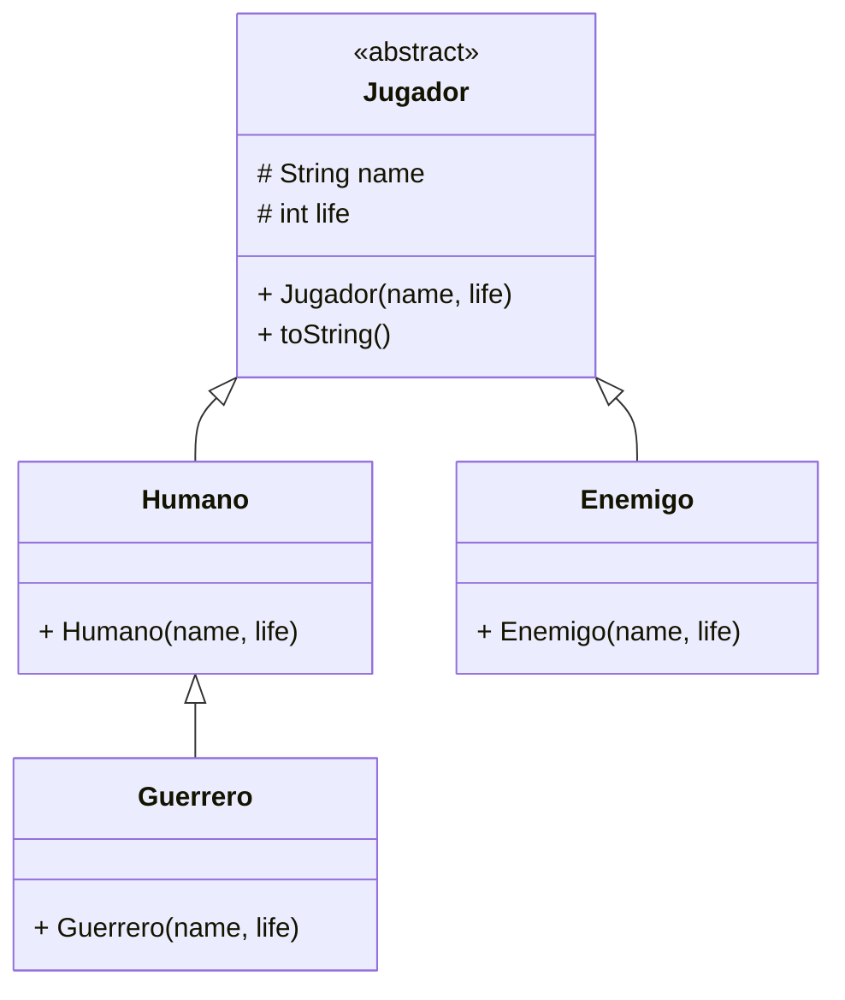
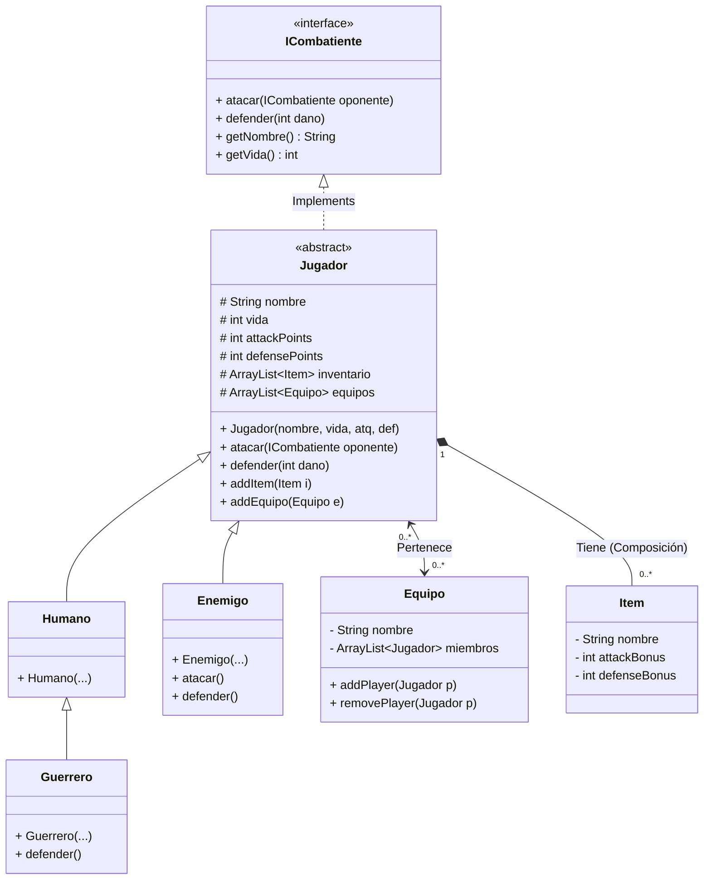

# Ejercicio Largo: La Batalla por el Trono de Hierro (Juego de Rol)

Este ejercicio integral está diseñado para poner en práctica **todos** los conceptos avanzados de la Programación Orientada a Objetos vistos en la Unidad 6: **Herencia, Clases Abstractas, Interfaces, Polimorfismo y Excepciones**.

El ejercicio se divide en fases incrementales. Debes ir completando cada fase antes de pasar a la siguiente.

---

## Fase 1: La Jerarquía de Clases (Herencia y Abstractas)

En nuestro juego de rol, existen diferentes razas de personajes. Todos comparten ciertas características, pero cada uno es único.
Vamos a definir la estructura base de nuestros actores.

### 1.1. Diagrama de Clases Inicial
Tendremos una clase base `Jugador` y tres especializaciones: `Humano`, `Enemigo` y `Guerrero`.



### 1.2. Tareas
1.  Crea un nuevo proyecto llamado `JuegoDeRol`.
2.  Crea un paquete `model` para las clases del dominio y un paquete `main` para el programa principal.
3.  Implementa la clase **Abstracta** `Jugador`.
    *   **¿Por qué abstracta?** Porque no queremos crear un "Jugador" genérico. Solo queremos crear Humanos, Enemigos o Guerreros.
    *   Añade un constructor que reciba el nombre y la vida por defecto.
    *   Sobrescribe el método `toString()` (explicado más adelante).
4.  Implementa las clases hijas `Humano` y `Enemigo` que heredan de `Jugador`.
5.  Implementa la clase `Guerrero` que hereda de **`Humano`**.
    *   Deben tener un constructor que reciba el nombre y la vida, e invoque al constructor del padre usando **`super(name, life)`**.
    *   En el constructor, añade un `System.out.println("He creado un " + this.getClass().getSimpleName());` para depurar.

---

## Fase 2: Atributos y Estado (Encapsulamiento)

Vamos a dar vida a nuestros personajes con estadísticas de combate.

### 2.1. Nuevos Atributos
Modifica la clase padre `Jugador` para incluir:

*   `attackPoints` (Puntos de Ataque - PA)
*   `defensePoints` (Puntos de Defensa - PD)

### 2.2. Tareas
1.  Actualiza el constructor de `Jugador` para recibir también los puntos de ataque y defensa.
2.  Actualiza los constructores de los hijos para pasar estos nuevos valores.
3.  Sobrescribe el método `toString()` en `Jugador` para que muestre los datos así:
    `"Nombre: Conan | PA: 15 | PD: 10 | Vida: 100"`

---

## Fase 3: El Contrato de Combate (Interfaces)

Aquí introducimos un concepto clave de la unidad: **Interfaces**.
Queremos que nuestros jugadores sean capaces de combatir, pero quizás en el futuro queramos que *Construcciones* o *Mobiliario* también puedan ser atacados. Para no limitar el combate solo a `Jugador`, crearemos una interfaz.

### 3.1. La Interfaz `ICombatiente`
Crea una interfaz en el paquete `model` llamada `ICombatiente`.

```java
public interface ICombatiente {
    public void atacar(ICombatiente oponente);
    public void defender(int danoRecibido);
    public String getNombre();
    public int getVida();
}
```

### 3.2. Implementación
1.  Haz que la clase abstracta `Jugador` implemente `ICombatiente` (`public abstract class Jugador implements ICombatiente`).
2.  Implementa los métodos en `Jugador`:
    *   **`defender(int dano)`**:
        *   Calcula el daño real: `dano - this.defensePoints`.
        *   Si el daño real es menor a 0, se queda en 0 (el escudo absorbió todo).
        *   Resta el daño real a la vida.
        *   Muestra por pantalla: *"Conan se defiende del golpe y recibe X de daño. Vida restante: Y"*.
    *   **`atacar(ICombatiente oponente)`**:
        *   Muestra: *"Conan ataca a Zombie Jefe con 15 puntos"*.
        *   Llama al método `oponente.defender(this.attackPoints)`.

---

## Fase 4: Comportamiento Especializado (Polimorfismo)

Ahora aprovecharemos el Polimorfismo para que cada raza se comporte de forma única al combatir.

### 4.1. Reglas de Raza
1.  **Humanos (`Humano`)**:
    *   No tienen bonificadores especiales. Combaten normal.
    *   **Restricción**: Su vida máxima no puede superar **100**. Asegúrate de esto en el constructor.
2.  **Enemigos (`Enemigo`)**:
    *   **Furia Berserker**: Si tienen **más de 20 de vida**, atacan con **+3** de daño extra, pero su defensa se reduce en **-3** (se vuelven imprudentes).
    *   Sobrescribe `atacar()` y `defender()` para aplicar esta lógica.
3.  **Guerreros (`Guerrero`)**:
    *   Al heredar de `Humano`, mantiene la restricción de vida máxima (100).
    *   **Piel Dura**: Si reciben menos de 5 puntos de daño real, ¡lo ignoran completamente! (El daño se convierte en 0).
    *   Sobrescribe `defender()` para esto.

### 4.2. Prueba Polimórfica
En el `main`, crea un método `void probarCombate()`:

1.  Crea un `ArrayList<ICombatiente>`.
2.  Añade un Humano, un Enemigo y un Guerrero.
3.  Recorre la lista y haz que **todos ataquen al siguiente de la lista** (el último al primero).
    *   Fíjate cómo Java decide qué método `atacar` ejecutar en tiempo de ejecución.

---

## Fase 5: Equipos (Relaciones y Colecciones)

El juego permite formar equipos (`Equipo`).

*   Un `Equipo` tiene muchos `Jugador`.
*   Un `Jugador` puede pertenecer a muchos `Equipo`.

### 5.1. Clase `Equipo`
*   Atributos: `nombre`, `ArrayList<Jugador>`.
*   Métodos: `addPlayer(Jugador p)`, `removePlayer(Jugador p)`, `getPlayers()`.
*   Implementa `equals()` (dos equipos son iguales si se llaman igual) y `toString()`.

### 5.2. Actualizar `Jugador`
*   Añade un `ArrayList<Team>` en `Jugador`.
*   **Importante**: Mantener la coherencia bidireccional. Si añado a "Conan" al "Equipo A", debo asegurarme de que "Equipo A" se añade a la lista de equipos de "Conan".

---

## Fase 6: Inventario (Composición)

Los jugadores pueden llevar objetos (`Item`) que modifican sus estadísticas.

### 6.1. Clase `Item`
*   Atributos: `nombre`, `attackBonus` (int), `defenseBonus` (int).
    *   *Nota*: Los bonus pueden ser negativos (ej: "Espada Maldita": +10 Ataque, -5 Defensa).

### 6.2. Inventario en `Jugador`
1.  Añade un `ArrayList<Item>` en `Jugador`.
2.  Modifica `getAttackPoints()` y `getDefensePoints()` en `Jugador` para que devuelvan:
    *   (Puntos base) + (Suma de bonus de todos los items).

---

## Fase 7: El Juego (Programa Principal)

Crea un menú interactivo en el `main` con las siguientes opciones estandar:

1.  **Configuración**:
    *   Crear Jugadores (pide nombre, tipo, vida...).
    *   Crear Equipos.
    *   Asignar Jugadores a Equipos.
    *   Crear Items y dárselos a jugadores.
2.  **Combate (La Arena)**:
    *   Elige dos jugadores del sistema.
    *   Haz que luchen hasta que uno muera (`vida <= 0`).
    *   Muestra el log de batalla paso a paso.
3.  **Salir**.

---

## Fase 8: Diagrama de Clases Final

A continuación se muestra el diseño completo del sistema, con todas las relaciones y la implementación de interfaces.

