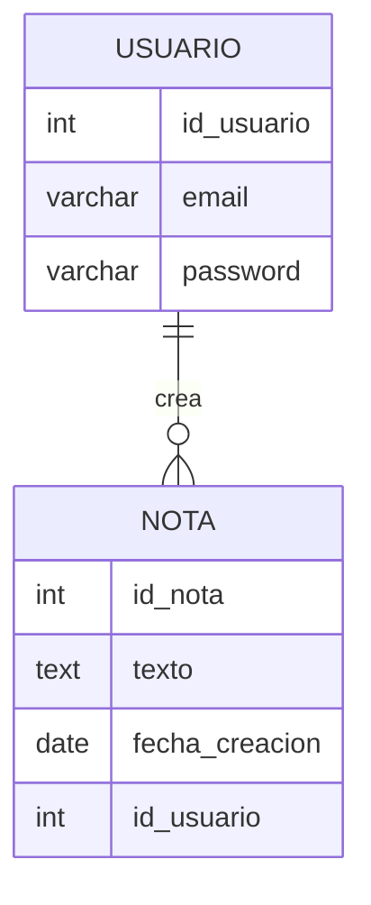

# Actividad Entregable UD8: Bloc de Notas con Base de Datos 📝

**Objetivo:**

* Implementar una aplicación Java que interactúe con una base de datos relacional para gestionar un bloc de notas multiusuario, aplicando conceptos de conexión JDBC, operaciones CRUD, sintaxis SQL y separación de responsabilidades (Patrón DAO).

**Resultados de Aprendizaje (RAs) Trabajados: RA9.**

* Gestiona información almacenada en bases de datos manteniendo la integridad y consistencia de los datos.

---

## Contexto

Se requiere desarrollar una aplicación backend en Java para gestionar un "Bloc de Notas" de usuarios. La aplicación debe permitir a distintos usuarios iniciar sesión en el sistema usando su correo electrónico y su contraseña. Una vez verificada su identidad ante la base de datos, el usuario podrá acceder a su tablón personal donde podrá leer sus notas anteriores, crear nuevas anotaciones (cada una con su texto y la fecha en la que fue creada) y eliminar las que ya no necesite.

---

## Diagrama E/R

El modelo relacional está compuesto por dos entidades principales: `usuario` y `nota`. Un usuario puede tener muchas notas, pero una nota siempre pertenece a un único usuario (relación 1:N).



---

## Requisitos Técnicos

### 1. Base de Datos

* Crea el esquema necesario en tu motor de base de datos (PostgreSQL, MariaDB o MySQL) prestando atención a las tablas `usuario` y `nota`.
* Es obligatorio establecer correctamente la clave foránea (FK) en la tabla `nota` apuntando a `usuario`, respetando la integridad referencial.
* Se recomienda insertar un par de usuarios iniciales directamente desde SQL (por consola o PGAdmin/DBeaver) para poder probar el login.

### 2. Clases Modelo (POJO)

Deberás crear dos clases Java para representar las tablas:

* **`Usuario`**: Con atributos `idUsuario`, `email` y `password`.
* **`Nota`**: Con atributos `idNota`, `texto`, `fechaCreacion` e `idUsuario`.

### 3. Clases DAO y Conectividad

Toda la lógica de acceso a datos debe estar extraída y separada del menú principal:

* **`ConexionBD`**: Encargada únicamente de proporcionar la conexión a la base de datos.
* **`UsuarioDAO`**: Debe contener el método para verificar las credenciales, por ejemplo, `public Usuario login(String email, String password)`. Éste hará un `SELECT` buscando a un usuario con esas credenciales exactas.
* **`NotaDAO`**: Contendrá los métodos CRUD para las notas:
  * `obtenerNotasPorUsuario(int idUsuario)`: Lista las notas correspondientes al usuario logueado.
  * `insertar(Nota nota)`: Guarda una nueva nota en la BD.
  * `eliminar(int idNota, int idUsuario)`: Borra una nota garantizando mediante la cláusula `WHERE` pertinente que pertenezca al usuario que la intenta borrar.

### 4. Menú y Flujo de la Aplicación

El programa principal gestionará dos fases claramente diferenciadas por consola:

#### Fase 1: Login

* El programa pedirá el **email** y la **contraseña**.
* Si no coincide en la BD, se mostrará "Credenciales incorrectas" y se volverá a pedir el login o dará la opción de salir.
* Si coincide, se saludará al usuario y se pasará a la Fase 2 guardando sus datos en memoria como "usuario activo".

!!! tip "¿Cómo mantener la sesión del usuario?"
    Al pasar a la Fase 2, ¿cómo sabrá tu aplicación de quién son las notas? Piensa en cómo guardar el objeto `Usuario` en una variable de tu clase principal para tener sus datos siempre "a mano" mientras no cierre la sesión.

#### Fase 2: Bloc de Notas (Usuario Logueado)

Mostrará un menú en bucle con estas opciones:

1. **Ver mis notas:** Mostrará la lista de notas del usuario activo con su ID, su fecha de creación y su contenido.
2. **Crear nueva nota:** Se pedirá al usuario el texto de la nota. El sistema asignará la fecha actual de forma automática y preparará la guardada en BD asociada al `id_usuario` activo.
3. **Eliminar nota:** Se pedirá el ID de la nota a borrar y se eliminará de la base de datos (asegurando siempre que el ID de la nota borrada le pertenece).
4. **Cerrar Sesión (Logout):** Eliminará al "usuario activo" de la memoria y volverá a la Fase 1 de Login.
5. **Salir:** Cerrará la aplicación.

---

## Tips y Ayuda: Trabajando con Fechas (Date) en JDBC

Pasar fechas de Java a la Base de Datos suele traer dudas debido a las diferencias entre `java.time` y las antiguas clases de `java.sql`. Para resolver este puente, te recomendamos lo siguiente:

### 1. En tu clase POJO (Modelo Java)

Aplica la moderna clase `LocalDate` (si solo guardas la fecha sin hora) del paquete `java.time` para tus atributos.

```java
import java.time.LocalDate;

public class Nota {
    // ...
    private LocalDate fechaCreacion;  // <-- Uso de API fecha moderna de Java 8+
    
    // ... Constructor, Getters y Setters ...
}
```

### 2. Interacciones DAO <-> Base de Datos

Aquí tienes las pistas clave para que logres insertar y recuperar la fecha por tu cuenta:

* **Al crear el objeto en memoria:** Puedes generar la fecha del momento actual simplemente invocando:

  ```java
  LocalDate momentoActual = LocalDate.now();
  ```

* **En el INSERT (de Java a BD):** En tu `PreparedStatement`, Java no te dejará usar `.setDate()` pasando un `LocalDate`. ¡Prueba a insertarlo usando el método más genérico `.setObject()`!

  ```java
  pstmt.setObject(posicion, tuLocalDate);
  // Alternativa clásica: pstmt.setDate(posicion, java.sql.Date.valueOf(tuLocalDate));
  ```

* **En el SELECT (de BD a Java):** Cuando leas la fila desde tu `ResultSet`, obtendrás una fecha en formato antiguo (`java.sql.Date`) que necesitarás transformar al formato moderno usando `.toLocalDate()`:

  ```java
  java.sql.Date fechaSql = rs.getDate("fecha_creacion");
  LocalDate fechaModerna = fechaSql.toLocalDate();
  ```

---

## Ampliación: Log de Accesos (Ficheros)

Para conectar los conocimientos de la UD7 (Ficheros) con la UD8 (Bases de Datos), se propone este reto final:

Cada vez que un usuario complete el login con éxito en la Fase 1, el programa deberá añadir una nueva línea en un archivo de texto plano llamado `accesos.log`. Esta línea dejará constancia de qué correo electrónico ha iniciado sesión y en qué momento exacto.

!!! warning "¡Ojo!"
    La clase `LocalDate` solo sirve para guardar fechas simples (Año-Mes-Día). Como se te pide registrar también las horas, minutos y segundos, tendrás que investigar y usar su clase hermana **`LocalDateTime`** (invocando a `LocalDateTime.now()`) para capturar el instante preciso del login tal y como se pide.

**Ejemplo de cómo debería verse el contenido de tu archivo `accesos.log`:**

```text
admin@empresa.com - 2024-05-10T08:30:15.123
pepe@gmail.com - 2024-05-10T09:15:42.859
admin@empresa.com - 2024-05-10T14:02:05.401
```
