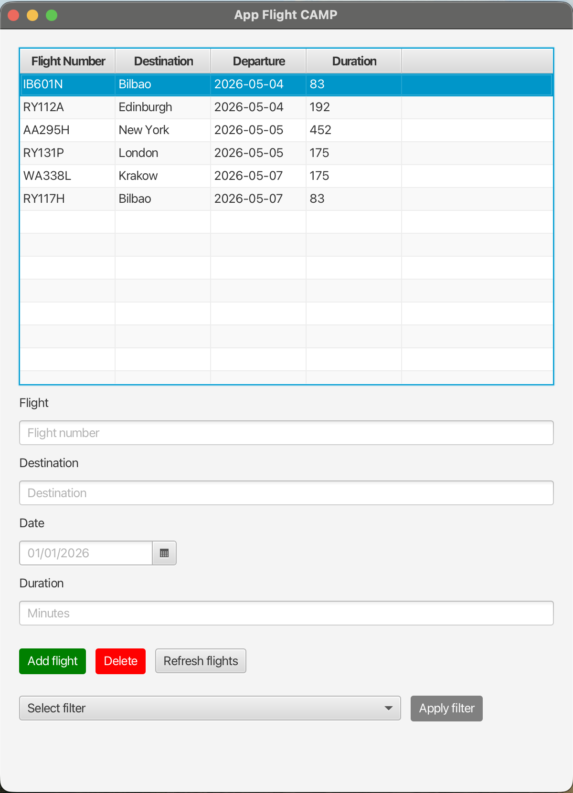

# Ejercicio Entregable UD09: Gestión de Vuelos

**Objetivo**

En este ejercicio final de la unidad, pondremos en práctica todos los conocimientos adquiridos sobre **JavaFX** (creación de interfaces, controladores y contenedores) e integraremos el acceso a datos mediante **JDBC** visto en la unidad anterior.

**Resultados de Aprendizaje (RAs) Trabajados: RA5 y RA9.**

* Gestiona información almacenada en bases de datos manteniendo la integridad y consistencia de los datos.
* Crea interfaces gráficas de usuario (GUI) sencillas para aplicaciones de escritorio.

## Descripción del Proyecto

El objetivo es desarrollar una aplicación de escritorio con una única pantalla para gestionar los vuelos de salida de un aeropuerto.

Cada **Vuelo** estará definido por las siguientes propiedades:

* **Número de vuelo**: Una cadena alfanumérica (ej: `IB3456`, `RYA992`). Actuará como identificador único.
* **Ciudad de destino**: El nombre de la ciudad a la que se dirige el vuelo (ej: `Madrid`, `Londres`).
* **Fecha de salida**: La fecha en la que sale el vuelo. Debe tener el formato `YYYY-MM-DD`.
* **Duración**: Expresada en minutos.

## Requisitos de la Aplicación

La aplicación debe cumplir con los siguientes requisitos:

### 1. Base de Datos (Integración UD08)

* Deberás crear una base de datos con una tabla `vuelo` que almacene la información descrita.
* Implementar el patrón **DAO** (por ejemplo, un `VueloDAO`) para aislar la lógica de acceso a la base de datos de la interfaz gráfica.
* El DAO debe contener métodos para, al menos: insertar un nuevo vuelo, eliminar un vuelo existente y obtener la lista de todos los vuelos.

### 2. Interfaz de Usuario (JavaFX)

* Toda la interacción se realizará en **una única pantalla** (un único archivo `.fxml`).
* La pantalla debe estar dividida en dos zonas principales:
  * **Formulario de Entrada**: Con los campos necesarios para introducir el número de vuelo, destino y duración, además de un botón "Añadir Vuelo".
  * **Visor de Datos**: Un `TableView` que muestre en tiempo real los vuelos registrados.

### 3. Funcionalidades Obligatorias

* **Listar Vuelos**: Al iniciar la aplicación, el `TableView` debe cargar automáticamente todos los vuelos existentes en la base de datos.
* **Añadir Vuelo**: Al rellenar el formulario y pulsar el botón, el vuelo debe guardarse en la base de datos mediante el DAO y, a continuación, el `TableView` debe actualizarse para mostrar el nuevo registro.
* **Eliminar Vuelo**: Se debe permitir seleccionar una fila en el `TableView` y pulsar un botón "Eliminar". Esto borrará el registro de la base de datos y refrescará la vista. (Recomendado: Añadir un diálogo de confirmación `Alert` antes de proceder al borrado definitivo).

### 4. Aplicar Filtros (Opcional)

Añadir opciones en la interfaz para aplicar los siguientes filtros:

* **Filtro 1**: Mostrará los vuelos de más de 3 horas (180 minutos).
* **Filtro 2**: Cogerá el campo Ciudad de destino y mostrará sólo los vuelos a esa ciudad.

*Nota: La lógica de ordenación o filtrado puedes realizarla mediante consultas SQL específicas en el DAO o manipulando la colección de datos en Java.*

#### Ejemplo de la interfaz

## Rúbrica y Consideraciones Adicionales

Se valorará de forma positiva:

* La correcta separación arquitectónica (Controlador JavaFX vs modelo y DAO de acceso a datos).
* El manejo adecuado de excepciones (por ejemplo, mostrar un `Alert` de error si se intenta añadir un vuelo con un número que ya existe en la BD o si hay un fallo de conexión).
* Que la interfaz (FXML) sea limpia y utilice correctamente los contenedores y elementos de JavaFX.
* La configuración adecuada de las columnas del `TableView` (uso de `PropertyValueFactory`).
