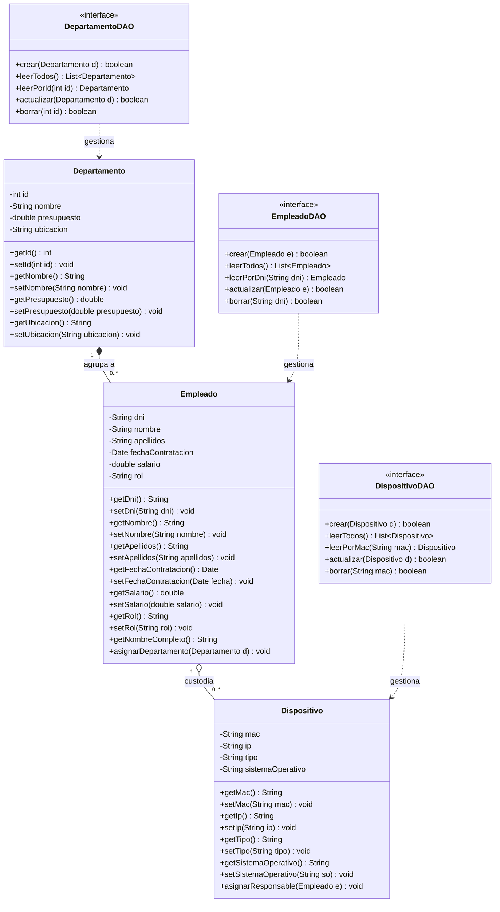

```mermaid
 classDiagram
    %% Definición de Entidades (POJOs)
    class Departamento {
        -int id
        -String nombre
        -double presupuesto
        -String ubicacion
        +getId() int
        +setId(int id) void
        +getNombre() String
        +setNombre(String nombre) void
        +getPresupuesto() double
        +setPresupuesto(double presupuesto) void
        +getUbicacion() String
        +setUbicacion(String ubicacion) void
    }

    class Empleado {
        -String dni
        -String nombre
        -String apellidos
        -Date fechaContratacion
        -double salario
        -String rol
        +getDni() String
        +setDni(String dni) void
        +getNombre() String
        +setNombre(String nombre) void
        +getApellidos() String
        +setApellidos(String apellidos) void
        +getFechaContratacion() Date
        +setFechaContratacion(Date fecha) void
        +getSalario() double
        +setSalario(double salario) void
        +getRol() String
        +setRol(String rol) void
        +getNombreCompleto() String
        +asignarDepartamento(Departamento d) void
    }

    class Dispositivo {
        -String mac
        -String ip
        -String tipo
        -String sistemaOperativo
        +getMac() String
        +setMac(String mac) void
        +getIp() String
        +setIp(String ip) void
        +getTipo() String
        +setTipo(String tipo) void
        +getSistemaOperativo() String
        +setSistemaOperativo(String so) void
        +asignarResponsable(Empleado e) void
    }

    %% Definición de la capa DAO (Acceso a Datos)
    class DepartamentoDAO {
        <<interface>>
        +crear(Departamento d) boolean
        +leerTodos() List~Departamento~
        +leerPorId(int id) Departamento
        +actualizar(Departamento d) boolean
        +borrar(int id) boolean
    }

    class EmpleadoDAO {
        <<interface>>
        +crear(Empleado e) boolean
        +leerTodos() List~Empleado~
        +leerPorDni(String dni) Empleado
        +actualizar(Empleado e) boolean
        +borrar(String dni) boolean
    }

    class DispositivoDAO {
        <<interface>>
        +crear(Dispositivo d) boolean
        +leerTodos() List~Dispositivo~
        +leerPorMac(String mac) Dispositivo
        +actualizar(Dispositivo d) boolean
        +borrar(String mac) boolean
    }

    %% Relaciones entre entidades
    Departamento "1" *-- "0..*" Empleado : agrupa a
    Empleado "1" o-- "0..*" Dispositivo : custodia
    
    %% Dependencias de uso (DAO -> POJO)
    DepartamentoDAO ..> Departamento : gestiona
    EmpleadoDAO ..> Empleado : gestiona
    DispositivoDAO ..> Dispositivo : gestiona
```