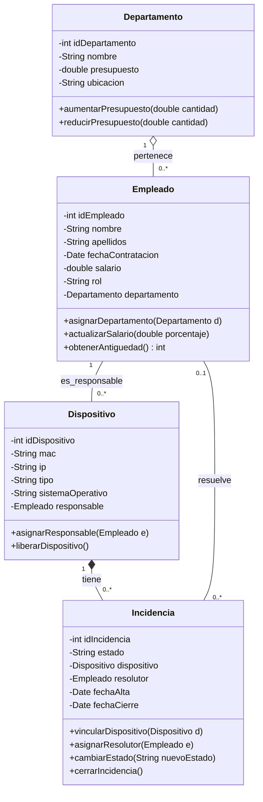

# Diagrama de Clases UML Proyecto Intermodular (posible solución)

A continuación se muestra una posible solución para el diagrama de las clases del proyecto, incluyendo sus atributos, métodos principales y las relaciones de cardinalidad entre ellas:

