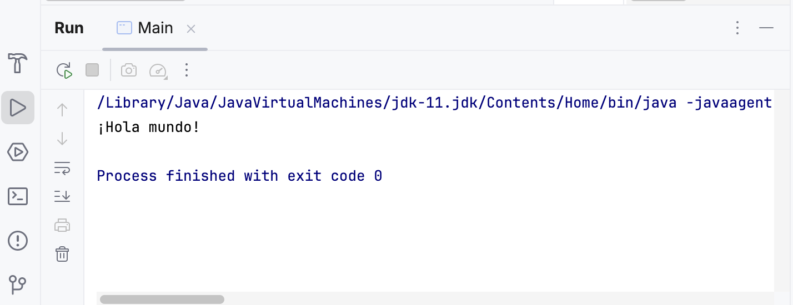
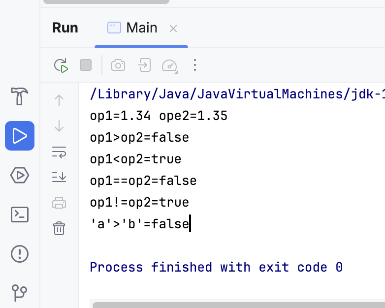
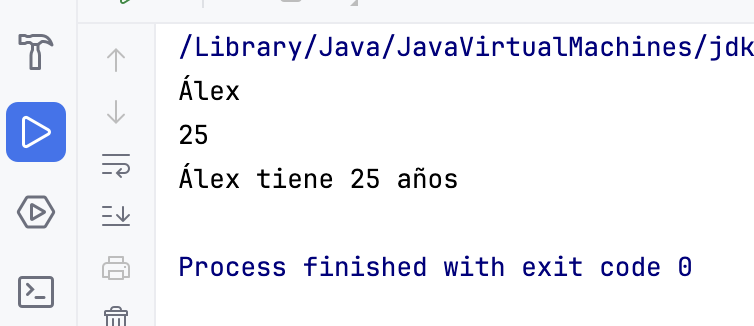
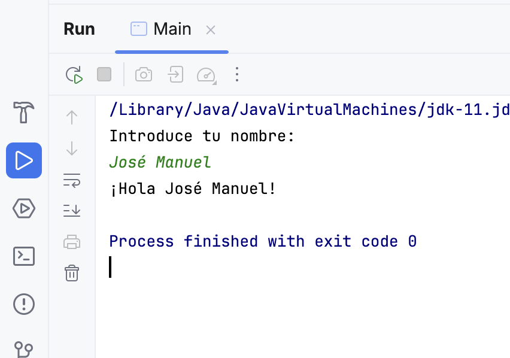

| Fecha      | Versión | Descripción                                |
| ---------- | ------- | ------------------------------------------ |
| 10/09/2021 | 1.0.0   | Versión inicial.                           |
| 17/09/2021 | 1.0.1   | Corrección en la declaración de variables. |
| 20/09/2021 | 1.0.2   | Corrección del índice.                     |
| 01/09/2025 | 1.0.3   | Revisión del tema.                         |
| 08/09/2025 | 1.0.4   | Adaptación del tema.                       |

## Unidad 1 - Introducción a la programación. Lenguaje Java.

## 1 Programa

### 1.1 Programador y Usuario

- Un/a **programador/a** es aquella persona que se encarga de codificar programas, es decir, de escribir las instrucciones que un ordenador debe seguir.
- **Usuario/a** es el término que se utiliza para referirse a la persona que utiliza una aplicación informática con la intención de conseguir un resultado final.
### 1.2 Algoritmo vs Programa vs Aplicación Informática

- Un **algoritmo** es un método de resolución de un problema en un número finito de pasos. Es como una receta de cocina: una secuencia clara y ordenada de acciones para llegar a un resultado. Ejemplo: ¿cómo hacer una tortilla francesa?
- Un **programa** es la expresión de un algoritmo en un lenguaje comprensible para el ordenador. Es la "traducción" de nuestra receta a un idioma que la máquina pueda ejecutar.
- Una **aplicación informática** es un conjunto de programas enlazados de manera conveniente para realizar una tarea más compleja.
#### 1.2.1 El paso intermedio: Pseudocódigo

Antes de saltar directamente a escribir en un lenguaje de programación como Java, los programadores usamos una herramienta intermedia fundamental: el **pseudocódigo**.

El pseudocódigo es una forma de describir un algoritmo utilizando una mezcla de lenguaje natural y algunas convenciones de los lenguajes de programación. Su gran ventaja es que nos permite centrarnos en la **lógica** del problema sin preocuparnos por la **sintaxis** estricta (puntos y comas, llaves, etc.).

**Ejemplo: Algoritmo para sumar dos números en pseudocódigo**

```
INICIO
  LEER numero1
  LEER numero2
  resultado = numero1 + numero2
  ESCRIBIR "El resultado es: ", resultado
FIN
```

Dominar el pseudocódigo es clave para aprender a "pensar como un programador".

### 1.3 Programa vs procesador

- Llamamos procesador toda entidad capaz de ejecutar un algoritmo. En última instancia será la CPU del ordenador, móvil o TV.
- Un programa constará de:
  - **Instrucciones:** una instrucción es una combinación de palabras, datos y símbolos que, obedeciendo la sintaxis propia del lenguaje, son utilizados por el ordenador para llevar a cabo una acción determinada.
  - **Datos:** llamamos dato toda información que utiliza el ordenador.
- Un programa recibe datos de entrada, los procesa siguiendo las instrucciones y produce unos datos de salida.


#### 1.3.1 ¿Cómo es un programa? Un primer vistazo

Aunque todavía no conozcamos los detalles, es bueno tener una primera imagen de cómo es un programa real. Este es el programa más famoso para empezar a programar, el "Hola Mundo", escrito en Java:

```java
public class HolaMundo {
  public static void main(String[] args) {		
    System.out.println("¡Hola Mundo!");
  }
}
```

Este pequeño bloque de código es un programa completo que le ordena al ordenador escribir el mensaje "¡Hola Mundo!" en la pantalla. ¡Así de simple y potente es la programación!

#### 1.3.2 Paradigmas de Programación

Los programas deben ser **fiables, legibles, eficientes y modulares**. Para conseguirlo, a lo largo de la historia han surgido diferentes formas o "estilos" de programar, conocidos como paradigmas:

1. **Programación estructurada:** Usar únicamente secuencias, instrucciones condicionales e instrucciones repetitivas. Es la base de todo.
2. **Programación modular:** El programa se diseña por partes (módulos o funciones), como si fueran piezas de un puzle.
3. **Programación orientada a objetos (POO):** El paradigma que usaremos en este módulo. Se basa en "objetos" que agrupan datos (atributos) y comportamientos (métodos). Lo veremos en profundidad.
4. **Otros:**
   - **Programación concurrente:** Útil cuando tenemos que realizar varias acciones a la vez. Se ve en segundo curso.
   - **Programación funcional, Programación lógica...**

### 1.4 Ciclo de vida del software

El ciclo de vida del software (el proceso de creación y explotación de un programa) se puede comparar con la **construcción de una casa**: no se empieza poniendo ladrillos al azar, sino que se sigue un proceso ordenado.


Este modelo, conocido como "modelo en cascada", describe las fases de forma secuencial:

- **Análisis**: Entender qué necesita el cliente (los "planos" iniciales de la casa).
- **Diseño**: Detallar cómo se va a construir el programa (diseño técnico, como la estructura y la fontanería). Aquí es donde creamos nuestro **algoritmo**.
- **Codificación**: Escribir el código en un lenguaje de programación (¡poner los ladrillos!).
- **Pruebas**: Comprobar que todo funciona como se esperaba (revisar que no haya grietas ni goteras).
- **Mantenimiento**: Corregir errores y añadir nuevas funcionalidades una vez el programa está en uso (reformas y reparaciones).

Es un modelo ideal. En la realidad, es común tener que volver a una fase anterior (iterar) si se descubre un problema.

### 1.5 Intérprete vs Compilador

- Para que el ordenador entienda nuestro código fuente (escrito en un lenguaje de alto nivel como Java), necesita ser traducido a código máquina (0s y 1s). Hay dos tipos de traductores:

   **Intérprete:**

   - Traduce y ejecuta el código línea a línea.
   - No genera un fichero ejecutable independiente.
   - Más lento, pero más fácil para depurar.
   - Ejemplos: Python, PHP.

   

   **Compilador:**

   - Traduce todo el código fuente de golpe a un fichero de código objeto o ejecutable.
   - El programa resultante es más rápido.
   - Si hay un error, hay que volver a compilar todo el programa.
   - Ejemplos: C, C++.


### 1.6 Java: 50% Compilado - 50% Interpretado

El lenguaje Java es especial, ya que combina ambos mundos:

1. **Fase de Compilación:** El compilador de Java (`javac`) traduce nuestro código fuente (`.java`) a un lenguaje intermedio llamado **bytecodes** (`.class`). Este código no es directamente ejecutable por el procesador.
2. **Fase de Interpretación:** La **Máquina Virtual de Java (JVM)**, que actúa como un intérprete, coge los bytecodes y los traduce a código máquina específico del sistema donde se está ejecutando.


Esta arquitectura es la que le da a Java su famosa característica **"Write Once, Run Anywhere" (Escribe una vez, ejecuta en cualquier parte)**, ya que el mismo fichero `.class` puede ser ejecutado en Windows, Linux, Mac, etc., siempre que tengan una JVM instalada.


### 1.7 Corrección de programas

Un programa sin errores es una utopía. Para encontrarlos y corregirlos, usamos dos técnicas:

- **Testing (Pruebas):** Se crea un **juego de pruebas**, un conjunto de casos de uso (con entradas y salidas esperadas) para verificar que el programa se comporta correctamente en todas las situaciones posibles.
- **Debugging (Depuración):** Se utiliza una herramienta llamada **depurador (debugger)** que permite ejecutar el programa paso a paso, inspeccionar el valor de los datos en cada momento y encontrar el punto exacto donde se produce un error.

Tipos de errores comunes:

- **Errores de sintaxis:** No seguir las reglas gramaticales del lenguaje. El compilador los detecta.
- **Errores de ejecución:** Ocurren cuando el programa está en marcha (ej: dividir por cero).
- **Errores lógicos:** El programa funciona pero hace algo incorrecto. Son los más difíciles de encontrar.

### 1.8 ¿Qué lenguaje elegir?

Existen cientos de lenguajes de programación. Puedes ver un ranking de popularidad [aquí](http://www.tiobe.com/index.php/content/paperinfo/tpci/index.html).

Este año estudiaremos Java, pero aquí tienes una comparativa con otros lenguajes populares:

> **C**: Lenguaje de bajo/medio nivel. Muy rápido y potente, permite un control directo del hardware. Es el lenguaje base de la mayoría de sistemas operativos.
>
> **Java:** Lenguaje de alto nivel, multiplataforma y orientado a objetos. Extremadamente popular para el desarrollo de aplicaciones empresariales (backend), aplicaciones Android y en el mundo del Big Data.
>
> **Python:** Lenguaje de alto nivel, muy fácil de aprender por su sintaxis clara y legible. Es el rey en ciencia de datos, inteligencia artificial y scripting.


## 2 La Información

### 2.1 ¿Qué es la información?
Un programa manipula datos. Los datos son la representación de la información. Para un ordenador, toda la información (números, texto, imágenes, etc.) se reduce a secuencias de 0s y 1s (bits).

Nosotros, como programadores, trabajamos con un nivel de abstracción mayor, utilizando lenguajes de programación para manejar estos datos de forma más sencilla.


### 2.2 Datos

Un dato es cualquier información con la que trabaja un algoritmo. Cada dato es de un **tipo** determinado (entero, real, carácter...). Los datos aparecen en un programa como **variables** o **constantes**.

#### 2.2.1 Variables

> **Analogía:** Piensa en una variable como una **caja etiquetada**. La etiqueta es el **nombre** de la variable, lo que hay dentro es su **valor**, y el tipo de caja (para zapatos, para joyas...) determina el **tipo** de dato que puedes guardar.

Una variable es un espacio en la memoria del ordenador (RAM) donde podemos guardar un dato que puede cambiar durante la ejecución del programa.

Cada variable se caracteriza por tener:

- Un **nombre** (ej: `edad`) y un **tipo** (ej: entero).
- Un **valor** (ej: `17`) que se le asigna y puede cambiar.


Las variables se almacenan en la memoria RAM, de forma que:

- El **nombre** (edad) representa la dirección de la RAM donde está el valor
- El **tipo** (entero) especifica la cantidad de bytes necesarios para guardar un valor (4).
- El **valor** es el contenido (17).


```c
// instrucción declarativa

int edad;	// Definimos una variable, de nombre edad y de tipo entero

// instrucciones de asignación

edad = 17; // Damos valor 17 a la variable edad
lee (edad); // Asignamos por teclado un valor a edad. Por ej. 19
edad = edad + 3; // Volvemos a cambiar el valor. Ahora valdrá 22
edad = 23.5; // Error. ¿Por qué?

// utilización de la variable
escribe (edad);
```

#### 2.2.2 Precisión de las variables

El tipo de dato determina cuánta memoria (cuántos bytes) ocupa una variable. Por ejemplo, con 1 byte podemos almacenar 28=256 valores diferentes.

- Si solo guardamos números positivos, el rango sería de 0 a 255.
- Si queremos guardar también negativos, se utiliza un sistema (complemento a dos) que divide el rango, quedando de **-128 a 127**.

Elegir el tipo de dato adecuado es importante para no desperdiciar memoria y para asegurarnos de que podemos almacenar los valores que necesitamos.


#### 2.2.3 Constantes

Una constante es como una variable, pero su valor **no puede cambiar** una vez que se ha establecido. Se usan para valores fijos y conocidos, como el número PI.


Es necesario resaltar que:

- Por convenio, los nombres de las constantes se escriben en mayúsculas (`PI`, `IVA_GENERAL`) y se escriben al principio del programa.
- Las constantes de carácter (una sola letra) van entre comillas simples (`'A'`).
- Las cadenas de texto van entre comillas dobles (`"Hola"`).

### 2.3 Nombres

Las variables y constantes necesitan un nombre (identificador) para poder usarlas. Las reglas generales son:

- Pueden contener letras, números y el símbolo `_`.
- Deben empezar por una letra o `_`.
- No pueden contener espacios en blanco.
- No pueden ser palabras reservadas del lenguaje (`while`, `class`, `int`...).
- Como decíamos, las constantes se escriben en mayúsculas (así cualquier programador las reconoce).

### 2.4 Tipos de datos

Los tipos de datos se pueden clasificar de muchas formas. Una primera clasificación básica es:


> **El caso especial del String:** En muchos lenguajes como Java, un texto (`String`) no es un tipo de dato simple (primitivo). Es un **objeto**, una estructura más compleja. Sin embargo, el lenguaje nos permite tratarlo de una forma muy similar a los tipos simples, lo que facilita mucho su uso.

#### 2.4.1 Datos simples y compuestos

Una clasificación de los datos (sobre todo de las variables) es saber si estas son simples o compuestas:

- **Simples**: Almacenan un único valor (un número, una letra, un estado booleano). Ej: `Edad`, `NotaMedia`.

- **Compuestos**: Se forman a partir de la agrupación de varios datos simples. Ej: `FechaNacimiento` (compuesta por día, mes y año), `Direccion`.


> El píxel de la celda `(772-202)` tiene los valores RGB `[77, 148, 210]`.
>
> Si hacemos un rápido recuento, una imagen de 600x400, en color real necesitará 600x400x3 = 720.000 bytes ~ 703 KB en memoria

#### 2.4.2 Abstracción de datos

La abstracción es uno de los conceptos más importantes en programación. Consiste en **"quedarnos solo con lo que nos interesa"**.

Un "ente" del mundo real tiene muchísimos datos (una persona tiene nombre, edad, altura, color de ojos, hobbies...). Cuando creamos un programa, solo modelamos los datos que son relevantes para el problema que queremos resolver.

- Para la DGT, de un coche interesa su matrícula, marca, modelo y dueño.
- Para un taller mecánico, interesa además el nivel de aceite, la presión de las ruedas, etc.

> **Para pensar...** Después de ver los tipos de datos, reflexiona:
>
> - ¿Qué tipo de variable usarías para almacenar el número de alumnos en una clase?
> - ¿Y para guardar la letra de tu DNI?
> - ¿Y para saber si un alumno es repetidor o no?

## 3 Instrucciones y Operadores

### 3.1 Expresiones

Las constantes y variables no aparecen aisladas, sino formando parte de expresiones. 

Una expresión es una combinación de operandos (variables, constantes, literales) y operadores que, al ser evaluada, produce un resultado.

Los operandos pueden ser de diferentes tipos:

- Constantes: `PI`
- Variables: `edad`
- Funciones: `raíz (100)`, `longitud (nombre)`
- Literales: `100`,` "IES Camp de Morvedre" `

Ejemplos de expresiones:

|Tipos|Expresiones|
|--|--|
|Numéricas|`edad`|
| |`5`|
| |`2*PI*quadrado(radio)`|
| |`(-b+raiz(quadradp(b)-4*a*c)/(2*a)`|
|Alfanuméricas|`"Pedro"`|
| |`"Daenerys" + "De la tormenta"`|
| Lógicas |`True`|
| |`False`|
| |`a<b`|
| |`(v1<v2) && (v2<v3)`|


### 3.2 Operadores
Son los símbolos que nos permiten realizar operaciones con los datos.

Dependiendo del tipo de datos de los operandos, o del tipo del resultado, tenemos unos tipos de operadores: _aritméticos, lógicos, relacionales y alfanuméricos_.


#### 3.2.1 Operadores aritméticos

Realizan operaciones matemáticas. 

Las variables o constantes que intervienen deben ser numéricas (enteros o reales) y el resultado también. 

Los más usuales son:

|Operador|Significado|
|-|-|
|`^` ó `**`|Potencia|
|`*` |Producto|
|`/`ó `//`| División |
|`%`| Residuo |
|`+`|Suma|
|`-`|Resta|

> **¡Cuidado con la división de enteros!** En la mayoría de lenguajes de programación, si divides dos números enteros, el resultado será también un entero (se trunca la parte decimal).
>
> Por ejemplo, `5 / 2` dará como resultado `2`, no `2.5`. Para obtener el resultado real, uno de los números debe ser de tipo real.

Las expresiones que tienen dos o más operandos necesitan unas reglas que permiten determinar en qué orden se evalúan. Si escribimos `2 * 5-3`, ¿el resultado es` 7` o `4`?

Para evaluar expresiones complejas, se siguen unas **reglas de prioridad** (similar a las matemáticas): primero potencias, luego multiplicaciones/divisiones, y por último sumas/restas. Se pueden usar paréntesis `()` para alterar este orden.

Para ello están las reglas de prioridad, que son estas:

|Operador|Prioridad|
|-|-|
|`^`|mas alta|
|`*, /, %`||
|`+,-`|mas baja|


#### 3.2.2 Operadores relacionales

Sirven para comparar dos expresiones. Su resultado es siempre un valor lógico: `verdadero` o `falso`.

|Operador|Significado|
|-|-|
|`>`|mayor|
|`<`|menor|
|`==`|igual|
|`!=`|distinto|
|`>=`|mayor o igual|
|`<=`|menor o igual|

Por ejemplo, suponemos las siguientes variables: `x = 10, y = 20`:

|Expresión|Valor|
|-|-|
|`(x+y)<20`|`false`|
|`(y-x)<=x`|`true`|
|`(x+y)>=x`|`true`|
|`x==y`|`false`|
|`x!=y`|`true`|


#### 3.2.3 Operadores lógicos

Actúan sobre operandos lógicos y devuelven un resultado lógico. Los básicos son `AND` (Y), `OR` (O) y `NOT` (NO).

Tablas de verdad:

| x     | y     | not x | x or y | x and y |
| ----- | ----- | ----- | ------ | ------- |
| Falso | Falso | V     | F      | F       |
| Falso | V     | V     | V      | F       |
| V     | Falso | F     | V      | F       |
| V     | V     | F     | V      | V       |

**Leyes de De Morgan**

Son tres leyes básicas que cumplen las expresiones relacionales y que nos pueden servir para expresar de diferentes formas lo que queremos:

```
1a)	NOT (NOT A)		=	A
2a)	NOT (A AND B)	=	(NOT A) OR (NOT B)
3a)	NOT (A OR B)	=	(NOT A) AND (NOT B)
```

**Negación de los operadores relacionales**

Los operadores relacionales pueden negarse también para obtener expresiones más sencillas o de acuerdo a nuestras necesidades. 

La siguiente tabla muestra dichas negaciones:

| OPERADOR	| Negación |
|-|-|
|<|	>=|
|>|	<=|
|==|!=|
|!=|==|
|<=|>|
|>=|<|

**Cambios de prioridad**

Como los operadores lógicos y relacionales pueden formar expresiones junto con los aritméticos necesitamos unas reglas de prioridad para saber qué operadores evalúan primero.

|OPERADOR	| PRIORIDAD |
|-|-|
|NOT	    |Alta|
|^||
|*, /, % | |
|+, - | |
|<, >, <=, >= | |
|==, != | |
|AND | |
|OR | |
| = | Baja |


### 3.3 Funciones

Son bloques de código reutilizables que realizan una tarea específica.

#### 3.3.1 Funciones predefinidas

Vienen incluidas en el lenguaje de programación para realizar tareas comunes (ej: `System.out.println()` para escribir en pantalla, `Math.sqrt()` para calcular una raíz cuadrada).

Las funciones (al igual que en las de las matemáticas) suelen recibir uno o más argumentos y devuelven un valor que llamamos resultado.


> Ejemplos de la función de impresión por pantalla en distintos lenguajes:
>
> - `printf("Hola");` 
> - `System.out.println("Hola");`
> - `print("Hola")`  
> - `escribe("Hola")`
>
> Pensemos en la dificultad que supone ahora que empezamos a programar el hecho de pintar algo en pantalla. 
>
> Escribir `Hola`, a efectos prácticos, es iluminar una serie de píxeles en pantalla en unas determinadas coordenadas en un determinado color, etc . 
>
> Gracias a funciones como` print` esto es mucho más fácil.

#### 3.3.2 Funciones definidas por el usuario

Los lenguajes de programación también nos permiten definir nuestras funciones para poderlas utilizar en diferentes partes del programa.

En `Java`:

```java
float  area_triangulo(float base , float altura){
  float area;
  area = base * altura / 2
  return area;
}

{
  print("El área del triángulo de base 2 y altura 4 es:");
  area = area_triangulo(2,4);
  escribe( area );
  escribe("El área del triángulo de base 3 y altura 6 es:");
  area = area_triangulo(3,6);
  escribe( area );
}
```

En `Python`:

```python
def area(base, altura):
  area = base * altura / 2
  return area;

print("El area es: ",area(7.6,4,5))
```

## 4 El lenguaje Java

**Java** es un lenguaje de programación de propósito general, concurrente y orientado a objetos. Su filosofía es **WORA (Write Once, Run Anywhere)**, lo que significa que el código puede escribirse una sola vez y ser ejecutado en cualquier tipo de dispositivo.

Características principales de Java:

- **<u>Sencillo</u>**: Su sintaxis es relativamente fácil de aprender, inspirada en C++.
- **<u>Orientado a Objetos</u>**: Posiblemente sea el lenguaje más puramente orientado a objetos. En Java, casi todo es un objeto.
- **<u>Distribuido</u>**: Excelente para trabajar en red, soportando múltiples protocolos.
- **<u>Robusto</u>**: El compilador detecta muchos errores que en otros lenguajes solo aparecerían en tiempo de ejecución.
- **<u>Seguro</u>**: Diseñado con la seguridad en mente, especialmente importante en aplicaciones de red.
- **<u>Portable y de Arquitectura Neutral</u>**: Gracias a la JVM, el mismo programa compilado (`.class`) funciona en cualquier sistema (Windows, Mac, Linux, etc.).
- **<u>Multithread (Multihilo)</u>**: Soporta de forma nativa la ejecución de varias tareas simultáneamente.
- **<u>Ecosistema enorme</u>**: Cuenta con una cantidad gigantesca de librerías y frameworks (como Spring) que lo hacen extremadamente potente para el desarrollo de grandes aplicaciones, especialmente en el **entorno empresarial (backend)**, aplicaciones **Android** y sistemas de **Big Data**.

### 4.1 Primer ejemplo

La aplicación más pequeña posible es la que simplemente imprime un mensaje en la pantalla. Tradicionalmente, cuando empezamos a programar, el mensaje suele ser _"¡Hola Mundo!"_.

> **Revisa y prueba** el siguiente código de ejemplo

```Java
public class Main {

  public static void main(String[] args) {		
    System.out.println("¡Hola Mundo!");
  }
}
```

Vamos a analizar con más detalle el programa _"¡Hola Mundo!"_:

- `public class Main`: Declara una clase llamada `Main`. En Java, todo el código debe estar dentro de una clase. El nombre del fichero fuente debe coincidir, `Main.java`.
- `public static void main(String[] args)`: Este es el **método principal**. Es la **puerta de entrada al programa**. La JVM siempre buscará este método para comenzar la ejecución.
  - `public`: Puede ser llamado desde cualquier sitio.
  - `static`: Pertenece a la clase, no a un objeto. No necesitamos crear nada para llamarlo.
  - `void`: No devuelve ningún valor.
  - `String[] args`: Es un array que podría recibir argumentos desde la línea de comandos.
- `System.out.println("¡Hola Mundo!");`: Esta es la instrucción que hace el trabajo. Llama al método `println` del objeto `out` que está en la clase `System` para imprimir el texto en pantalla.

El resultado sería el siguiente:



> **PRECAUCIÓN**: Todas las instrucciones (creación de variables, llamadas a métodos, asignaciones) se deben finalizar con un punto y coma **(;)**.


### 4.2 Elementos básicos

#### 4.2.1 Comentarios

Son notas que dejamos en el código para explicarlo. El compilador las ignora.

```java
// Comentario de una sola línea

/*
Comentario de
varias líneas.
*/

/**
 * Este es un comentario de documentación (Javadoc).
 * Sirve para generar documentación automática.
 */ 
```

#### 4.2.2 Identificadores

Los **identificadores** nombran **variables, funciones, clases y objetos**. Cualquier cosa que el programador necesite identificar o usar.

<u>Reglas y convenios</u>:

- **Distinguen mayúsculas de minúsculas** (`edad` y `Edad` son diferentes).
- Empiezan por letra o `_`.
- No pueden ser palabras reservadas (`public`, `class`, `int`...).
- **Convenio CamelCase:**
  - Nombres de **clases** empiezan con mayúscula: `CalculadoraFacturas`.
  - Nombres de **variables** y **métodos** empiezan con minúscula: `nombreUsuario`, `calcularTotal()`.
  - Nombres de **constantes** van en mayúsculas y con `_`: `IVA_GENERAL`.
    

Por ejemplo, serían identificadores válidos:

- contador
- suma
- edad
- sueldoBruto
- sueldoNeto
- nombre_usuario
- nombre_Completo
- letraDni

Y su uso sería:

```java
int contador; // crea variable de tipo int llamada contador

float sueldoNeto; // crea variable de tipo float llamada sueldoNeto

char letraDni; // crea variable de tipo char llamada letraDni
```


### 4.3 Tipos de datos

En Java existen dos tipos principales de datos:

- **Tipos de datos simples**: Nos permiten crear variables que almacenan un solo valor. 

- **Tipos de datos compuestos**: Estructuras de datos más complejas que permiten almacenar muchos datos (vectores, objetos, etc.).

Tipos de datos simples soportados por Java:

- **Números enteros:** _byte, short, int, long_
- **Números reales:** _float, double_
- **Carácteres:** _char_
- **Valores lógicos: **_boolean_

En Java existen 8 tipos de datos simples o primitivos:

| Tipo        | Descripción                     | Memoria           | Rango de valores permitidos    |
| ----------- | ------------------------------- | ----------------- | ------------------------------ |
| **byte**    | Número entero con signo         | 1 byte            | -128 a 127                     |
| **short**   | Número entero corto con signo   | 2 bytes           | -32.768 a 32.767               |
| **int**     | Número entero con signo         | 4 bytes           | -2.147.483.648 a 2.147.483.647 |
| **long**    | Número entero largo con signo   | 8 bytes           | Muy grande                     |
| **float**   | Número real de precisión simple | 4 bytes (32 bits) | ±3,4*10^-38 a ±3,4*10^38       |
| **double**  | Número real de precisión doble  | 8 bytes (64 bits) | ±1,7*10^-308 a ±1,7*10^308     |
| **char**    | Un solo carácter (Unicode)      | 2 bytes           | Representa un carácter         |
| **boolean** | Valor lógico                    | 1 bit             | `true` o `false`               |

> Java no comprueba los desbordamientos de rango. Si a una variable `byte` con valor 127 le sumas 1, pasará a valer -128 (comportamiento cíclico).

Existe un tipo de dato compuesto llamado **String** que conviene conocer ya que permite representar texto. Más adelante veremos cómo se utiliza.

### 4.4 Declaración de variables

La sintaxis para declarar una variable es:

**`tipo identificador [ = valor][,identificador [= valor] ...];`**

```java
// Declarar una variable
int edad;

// Declarar e inicializar en la misma línea
int edad = 25;

// Declarar varias variables del mismo tipo
float precio1, precio2, precio3;

// Declararlas e inicializarlas
float precio1 = 7.0f, precio2 = 7.25f, precio3 = 0.5f;
```

> Los literales numéricos con decimales en Java son de tipo `double` por defecto. Para asignar un valor a una variable `float`, debemos añadir una `f` al final del número (`7.0f`). Si no lo hacemos, el compilador dará un error de "posible pérdida de precisión".

Otros ejemplos a la hora de definir valores:

```java
double a = 15.2; // de tipo double
double b = 15.2D; // el mismo valor
double c = 1.52e1; // el mismo valor
double d = 0.152E2; // el mismo valor
double e = .8e10; // de tipo double
float f = 15.8f; // de tipo float
float g = 15.8F; // tambien de tipo float
```

Como se verá más adelante cada tipo de dato primitivo tiene una clase correspondiente (`Boolean, Character, Byte, Short, Integer, Long, Float y Double`), llamadas *wrappers*, que definen también constantes y métodos útiles.

Es **obligatorio indicar el tipo y el identificador**. 

> Si una variable no ha sido inicializada Java le asigna un valor por defecto.
>
> Este valor es:
>
> - Para las variables de tipo **numérico**, el valor por defecto es cero ( 0 ).
> - Las variables de tipo **char**, el valor ''**\u0000**''.
> - Las variables de tipo **boolean**, el valor **false**.
> - Para las variables de tipo referencial (**objetos**), el valor **null**.
>
> Es una buena práctica **inicializar siempre todas las variables**.


**Palabras clave**

Palabras que no podemos utilizar salvo en las instrucciones del lenguaje.

| abstract    | continue    | **for**        | **new**       | **switch**       |
| ----------- | ----------- | -------------- | ------------- | ---------------- |
| **boolean** | **default** | **goto**       | **null**      | **synchronized** |
| **break**   | **do**      | **if**         | **package**   | **this**         |
| **byte**    | **double**  | **implements** | **private**   | **threadsafe**   |
| **byvalue** | **else**    | **import**     | **protected** | **throw**        |
| **case**    | **extends** | **instanceof** | **public**    | **transient**    |
| **catch**   | **false**   | **int**        | **return**    | **true**         |
| **char**    | **final**   | **interface**  | **short**     | **try**          |
| **class**   | **finally** | **long**       | **static**    | **void**         |
| **const**   | **float**   | **native**     | **super**     | **while**        |

**Palabras reservadas**

Además, el lenguaje se reserva unas cuantas palabras más, pero que hasta ahora no tienen un cometido específico. 

| cast         | uture     | generic  | inner   |
| ------------ | --------- | -------- | ------- |
| **operator** | **outer** | **rest** | **var** |

#### 4.4.1 Ámbito de una variable

El **ámbito** de una variable es la parte del programa donde esa variable existe y puede ser utilizada.

En Java, a grandes rasgos, podemos distinguir:

- **Variables de instancia y de clase (`static`):** Pertenecen a un objeto o a una clase. Su ámbito es todo el objeto/clase. Las veremos en profundidad en Programación Orientada a Objetos.
- **Variables locales:** Se declaran dentro de un método o un bloque de código (`{...}`). Su ámbito se limita **exclusivamente** a ese método **o bloque**. Una vez que la ejecución sale de ahí, la variable "muere" y su memoria se libera.

> Por ahora, **nos centraremos exclusivamente en las variables locales**. Es una buena práctica declarar las variables en el ámbito más reducido posible.

#### 4.4.2 Variables locales

Una **variable local** se declara dentro del cuerpo de un método de una clase y es visible únicamente dentro de dicho método.

Es una buena costumbre declararlas justo al principio.

También pueden declararse variables dentro de un bloque con llaves _{ }_. En ese caso, sólo serán _visibles_ dentro de dicho bloque.

Un ejemplo (no es necesario entenderlo) :

```Java
    public static void main(String[] args) {
        int i;
        for (i=0;i<10;i++)
            System.out.println("El valor de i es: "+i);
    }
```

En este ejemplo existe una variable local: _**int i**;_ únicamente puede utilizarse dentro del bloque _**main**_ donde fue creada.

#### 4.4.3 Constantes (final)

Para declarar una constante, usamos la palabra reservada `final`. Su valor no podrá ser modificado.

```java
final int MAYORIA_EDAD = 18;
final float PI = 3.1416f;

// MAYORIA_EDAD = 21; // Esto daría un error de compilación.
```


### 4.5 Operadores

Los operadores son una parte indispensable de la programación ya que nos permiten realizar cálculos matemáticos y lógicos, entre otras cosas. 

Los operadores pueden ser:

- **Aritméticos**: sumas, restas, etc.

- **Relacionales**: menor, menor o igual, mayor, mayor o igual, etc.

- **Lógicos**: and, or, not, etc.

- **Bits**: prácticamente no los utilizaremos en este curso.

- **Asignación**: =

#### 4.5.1 Aritméticos

| Operador | Formato           | Descripción                            |
| -------- | ----------------- | -------------------------------------- |
| **+**    | `op1 + op2`       | Suma                                   |
| **-**    | `op1 - op2`       | Resta                                  |
| *****    | `op1 * op2`       | Multiplicación                         |
| **/**    | `op1 / op2`       | División (entera si ambos son enteros) |
| **%**    | `op1 % op2`       | Resto de la división (módulo)          |
| **++**   | `op1++` ó `++op1` | Incremento en 1 (`op1 = op1 + 1`)      |
| **--**   | `op1--` ó `--op1` | Decremento en 1 (`op1 = op1 - 1`)      |

**Pre-incremento vs. Post-incremento:**

- **Post-incremento (`op1++`):** Primero se usa el valor actual de `op1` en la expresión y *después* se incrementa.
- **Pre-incremento (`++op1`):** Primero se incrementa `op1` y *después* se usa el nuevo valor en la expresión.

> **Para pensar...** Si `int x = 5;`, ¿qué valor tendrá `y` en cada caso?
>
> 1. `int y = x++;`
> 2. `int y = ++x;`

#### 4.5.2 Relacionales

| Operador | Formato        | Descripción       |
| -------- | -------------- | ----------------- |
| **>**    | `op1` > op2    | Mayor que         |
| **<**    | `op1 < op2`    | Menor que         |
| **>=**   | `op1 >= op2`   | Mayor o igual que |
| **<=**   | `op1 <= op2`   | Menor o igual que |
| **==**   | `op1 == op2`   | Igual que         |
| **!=**   | `op1` !=` op2` | Distinto que      |

Los operadores relacionales actúan sobre valores enteros, reales y caracteres. Devuelven un valor del tipo boolean (_true, false_).

**Ejemplo**:

```Java
public static void main(String[] args) {
        double op1, op2;
        char op3, op4;
        op1=1.34;
        op2=1.35;
        op3='a';
        op4='b';
        
        System.out.println("op1="+ op1 +" ope2="+ op2);
        System.out.println("op1>op2=" + (op1 > op2));
        System.out.println("op1<op2=" + (op1 < op2));
        System.out.println("op1==op2=" + (op1 == op2));
        System.out.println("op1!=op2=" + (op1 != op2));
        System.out.println("'a'>'b'=" + (op3 > op4));    
    }
```

**Resultado de ejecución**:



#### 4.5.3 Lógicos

| Operador | Formato      | Descripción                                                  |
| -------- | ------------ | ------------------------------------------------------------ |
| **&&**   | `op1 && op2` | **Y (AND)** lógico. `true` si ambos son `true`.              |
| **\|\|** | `op1 || op2` | **O (OR)** lógico. `true` si alguno es `true`.               |
| **!**    | `! op1`      | **Negación lógica (NOT)**. Devuelve `true` si es `false` op1. |

Estos operadores actúan sobre operadores o expresiones lógicas, es decir, aquellos que se evalúan a cierto o falso (_true, false_).

```Java
    public static void main(String[] args) {
       boolean a, b, c, d;
  
       a=true;
       b=true;
       c=false;
       d=false;
       
       System.out.println("true Y true =" +  (a && b));
       System.out.println("true Y false =" +  (a && c));
       System.out.println("false Y false =" +  (c && d));
       System.out.println("true O true =" +  (a || b));
       System.out.println("true O false =" +  (a || c));
       System.out.println("false O false =" +  (c || d));
       System.out.println("No true =" +  !a);
       System.out.println("No false =" +  !c);
       System.out.println("(3 > 4) Y true = " + ((3>4) && a));
        
    }
```

**Resultado de ejecución**:


#### 4.5.4 Asignación

El operador básico es `=`, pero se puede combinar con los aritméticos para abreviar:

| Operador | Equivalencia |
| -------- | ------------ |
| `+=`     | `a` = a + b  |
| `-=`     | `a = a - b`  |
| `*=`     | `a = a * b`  |
| `/=`     | `a = a / b`  |

Es posible combinar el operador de asignación con otros operadores para, de forma abreviada, realizar un cálculo y asignarlo a una variable:

| Operador | Formato      | Descripción       |
| -------- | ------------ | ----------------- |
| **+=**   | op1 += op2   | op1 = op1 + op2   |
| -**=**   | op1 -= op2   | op1 = op1 - op2   |
| *=       | op1 *= op2   | op1 = op1 * op2   |
| **/=**   | op1 /= op2   | op1 = op1 / op2   |
| **%=**   | op1 %= op2   | op1 = op1 % op2   |
| **&=**   | op1 &= op2   | op1 = op1 & op2   |
| **\|=**  | op1 \|= ope2 | op1 = op1 \| ope2 |
| **^=**   | op1 ^= op2   | op1 = op1 ^ op2   |
| **>>=**  | op1 >>= op2  | op1 = op1 >> op2  |
| **<<=**  | op1 <<= op2  | op1 = op1 << op2  |
| **>>>=** | op1 >>>= op2 | op1 = op1 >>> op2 |

#### 4.5.5 Expresiones

Una **expresión** es la **combinación de varios operadores y operandos**. Por ejemplo, tenemos las siguientes expresiones:

```java
7 + 5 * 4 - 2
10 + (1 % 5)
(7 * x) <= n
```

El lenguaje **Java evalúa las expresiones aplicando los operadores uno a uno siguiendo un orden específico**.

#### 4.5.6 Precedencia de operadores

Indica el orden en que se evalúan. Aquí un resumen de los más comunes (de mayor a menor prioridad):

1. Operadores postfijos: [ ] . (paréntesis)
2. Operadores unarios: ++expr, --expr, -expr, ~ !
3. Creación o conversión de tipo: new (tipo)expr
4. Multiplicación y división: *, /, %
5. Suma y resta: +, -
6. Desplazamiento de bits: <<, >>, >>>
7. Relacionales: <, >, <=, >=
8. Igualdad y desigualdad: ==, !=
9. AND a nivel de bits: &
10. AND lógico: &&
11. XOR a nivel de bits: ^
12. OR a nivel de bits: |
13. OR lógico: ||
14. Operador condicional: ? :
15. Asignación: =, +=, -=, *=, /=, %=, ^=, &=, |=, >>=, <<=


### 4.6 Conversión de tipos

#### 4.6.1 Casting

La conversión entre tipos primitivos se realiza mediante el **casting**. 

Java proporciona dos tipos de casting: **implícito y explícito**. El implícito se realiza automáticamente mientras que el explícito la tenemos que escribir nosotros.

##### Casting implícito

El compilador realiza automáticamente el casting implícito cuando el tipo al que se ha de convertir un dato es más amplio que el tipo original.

Es decir, Java hará el casting implícito automáticamente cuando convertimos:

- de *char* a *int* o de *char* a *float*

- de *int* a *float*


Por ejemplo:

```java
float foo = 'a';   // convertimos el char 'a' a float. El valor de foo sera 97.0f

int bar = 'a';     // convertimos el char 'a' a int. EL valor de bar sera 97

float baz = 97;    // convertimos el int 97 a float. El valor de baz sera 97.0f
```

Si tratamos de hacer un casting implícito al revés, el compilador nos dará un error:

```java
char bar = 65633;   // error, casting implícito de int a char no permitido

char baz = 97f;   // error, casting implícito de float a char no permitido

int qux = 97f;    // error, casting implícito de float a int no permitido
```

> El casting con los tipos **boolean** y **String** no se puede realizar.
>

##### Casting explicito

Hemos visto que el casting implícito no se puede realizar cuando queremos convertir a un tipo más estrecho (por ejemplo, convertir de *float* a *int*, ya que se pierden los decimales). 

Pero a veces necesitamos hacerlo, sabiendo que vamos a perder precisión. En este caso tenemos que explicitar el casting.

Para realizar un casting explícito, se debe escribir **el tipo al que se quiere convertir** entre paréntesis, justo antes del **valor que se quiere convertir**.

**(tipo) valor**

Los siguientes ejemplos ilustran el uso del casting explícito:

```Java
// de int a char
char bar = (char) 65633;   // bar es 97 (el valor máximo de char es 65535)

// de float a char
char baz = (char) 97.53f;  // baz es 97, se pierden los decimales

// de float a int
int quux = (int) 14.67565f;  // quux es 14, se pierden los decimales
```

```java
// de int a char
int fooa = 65633;
char bar = (char) fooa;   // bar es 97, el valor máximo de char es 65535

// de float a char
float foob = 97.53f;
char baz = (char) foob;  // baz es 97, se pierden los decimales

// de float a int
float fooc = 14.67565f;
int quux = (int) fooc;  // quux es 14, se pierden los decimales
```

```java
float foo = 5 / 2;          // foo es 2.0f

float bar = (float) 5 / 2;  // bar es 2.5f
```


#### 4.6.2 Conversión textual

Además de las conversiones con casting, Java incorpora una serie de métodos para hacer otras conversiones.

##### Concatenación

Se puede convertir cualquier valor en un *String* sólo concatenando con un *String* vacío "".

```Java
String foo = "" + 'a';    // foo es "a"
String bar = "" + 865;    // bar es "865"
String baz = "" + 23.78f; // baz es "23.78"
String quux = "" + true;  // quux es "true"
```


##### String.valueOf()

De forma equivalente a la concatenación, se puede utilizar el método **String.valueOf ()** para convertir a **String**.

```JAVA
String foo = String.valueOf('a');    // foo es "a"
String bar = String.valueOf(865);    // bar es "865"
String baz = String.valueOf(23.78f); // baz es "23.78"
String quux = String.valueOf(true);  // quux es "true"
```


##### charAt()

Lógicamente, no podemos convertir un String en un char, ya que el String puede tener varios caracteres. Pero podemos usar el método *charAt()* para obtener un caracter que esté en una determinada posición.

```jAVA
char foo = "java8".charAt(0);  // foo es 'j'
char baz = "java8".charAt(4);  // baz es '8'
```

Hay que tener en cuenta que las posiciones empiezan por **0**.


##### Character.getNumericValue()

En el punto anterior hemos visto que si hacemos el casting implícito para convertir un *char* en un *int*, obtenemos el valor Unicode del carácter.

Si queremos obtener el valor que representa el **caracter** se puede hacer con el método **Character.getNumericValue ()**.

```jAVA
char foo = '9';

int bar = foo; // bar es 57, con el casting obtenemos el valor unicode

int baz = Character.getNumericValue(foo); // baz se 9, obtenemos el valor representado por el caracter
```


##### parseInt() y parseFloat()

Para obtener el valor numérico representado por un **String** podemos utilizar **parseInt ()** o **parseFloat ()**.

```Java
String foo = "213";

int bar = Integer.parseInt(foo);  // bar es 213

```

```Java
String foo = "23.78";

float bar = Float.parseFloat(foo);  // bar es 23.78f
```


### 4.7 La clase Math

Se echan de menos operadores matemáticos más potentes en Java. Por ello se ha incluido una clase especial llamada **Math** dentro del paquete java.lang.

Esta clase posee muchos métodos muy interesantes para realizar cálculos matemáticos complejos como cálculo de potencias, raíces cuadradas, valores absolutos, seno, coseno, etc.

Por ejemplo:

```Java
double x = Math.pow(3,3);	 // Potencia 3 ^ 3

double y = Math.sqrt(9); 	// Raíz cuadrada de 9
```

También posee constantes como:

```java
double PI; // El número Π (3,14159265…)

double E; // El número e (2, 7182818245...)
```

Algunos ejemplos de otros métodos:


### 4. 8 Literales

A la hora de tratar con valores de los tipos de datos simples se utiliza lo que se denomina _literales_. Son los valores fijos que escribimos directamente en el código.

- **Lógicos**: `true`, `false`.
- **Enteros**: `10` (decimal), `012` (octal, empieza por 0), `0xA` (hexadecimal, empieza por 0x). Para `long`, se añade una `L` al final: `1234567890L`.
- **Reales**: `12.34`. Por defecto son `double`. Para `float`, se añade `f`: `12.34f`.
- **Carácter**: Entre comillas simples: `'a'`. Usan secuencias de escape para caracteres especiales: `'\n'` (nueva línea), `'\t'` (tabulador).
- **Cadenas**: Entre comillas dobles: `"Hola mundo"`.

#### 4.8.1 Literales lógicos

Son únicamente dos, las palabras reservadas true y false.

#### 4.8.2 Literales enteros

Los literales de tipo **entero**: *byte, short, int y long* pueden expresarse en decimal (base 10), octal (base 8) o hexadecimal (base 16). 

Además, puede añadirse al final del mismo la letra **L** para indicar que el entero es considerado como **long** (64bits).

En Java, el compilador identifica un entero decimal (base 10) al encontrar un número cuyo primer dígito es cualquier símbolo decimal excepto el cero (del 1 al 9). A continuación pueden aparecer dígitos del 0 al 9.

La letra **L** al final de un literal de tipo **entero** puede aplicarse a cualquier sistema de numeración e indica que el número decimal sea tratado como un entero largo (de 64 bits). Esta letra **L** puede ser mayúscula o minúscula, aunque es aconsejable utilizar la mayúscula ya que de lo contrario puede confundirse con el dígito uno (1) en los listados.

Ejemplo:

`long max1 = 9223372036854775807L; 	//valor máximo para un entero largo`

#### 4.8.3 Literales reales

Los literales de tipo real sirven para indicar valores **float** o **double**. A diferencia de los literales de tipo entero, **no pueden expresarse en octal o hexadecimal**.

Existen dos formatos de representación: mediante su parte entera, el punto decimal ( . ) y la parte fraccionaria; o mediante notación **exponencial** o **científica**:

Ejemplos equivalentes:

3.1415
0.31415e1
.31415e1
0.031415E+2
.031415e2
314.15e-2
31415E-4

Al igual que los literales que representan enteros, se puede poner una letra como sufijo. Esta letra puede ser una **F** o una **D** (mayúscula o minúscula indistintamente).

**F:** Trata el literal como de tipo *float*.

**D:** Trata el literal como de tipo *double*.

Ejemplo:

3.1415F

.031415d

#### 4.8.4 Literales carácter

Los literales de tipo carácter se representan siempre entre comillas simples. Entre las comillas simples puede aparecer:

Un **símbolo** (letra) siempre que el carácter esté asociado a un código Unicode.
Ejemplos: 'a' , 'B' , '{' , 'ñ' , 'á' .

Las "**secuencias de escape**" son combinaciones del símbolo contrabarra **\** seguido de una letra. Sirven para representar caracteres que no tienen una equivalencia en forma de símbolo.

Las posibles secuencias de escape son:

​	 **\n**: Nueva Linea.

​	**\t** : Tabulador.

​	**\r**: Retroceso de Carro.

​	**\f**: Comienzo de Pagina.

​	**\b**: Borrado a la Izquierda.

​	\\\\: El carácter barra inversa ( \ ).

​	**\\'** : El carácter prima simple ( ' ).

​	**\\"** : El carácter prima doble o bi-prima ( " ).

Por ejemplo:

* Para imprimir una diagonal inversa se utiliza: \\\

* Para imprimir comillas dobles en un String se utiliza: \\"


#### 4.8.5 Literales cadenas

Los **Strings** o **cadenas de caracteres** no forman parte de los tipos de datos elementales en Java. Son instanciados a partir de la clase ***java.lang.String*** pero aceptan su inicialización a partir de literales de este tipo, por lo que se tratan en este punto.


> Un literal de tipo string va encerrado entre **comillas dobles ( " )** y debe estar incluido completamente en una sola línea del programa fuente (no puede dividirse en varias líneas).


Entre las comillas dobles puede incluirse cualquier carácter del código **Unicode** (o su código precedido del carácter \ )  además de las secuencias de escape vistas anteriormente en los literales
de tipo carácter.

Así, por ejemplo, para incluir un cambio de línea dentro de un literal de tipo **String** deberá hacerse mediante la secuencia de escape **\n** :

Ejemplo:

```java
System.out.println("Primera línea\nSegunda línea del string\n");
System.out.println("Hola");
```

La visualización del string anterior mediante **println()** produciría la siguiente salida por pantalla:

```java
Primera línea

Segunda línea del string

Hola

```

La forma de incluir los caracteres: comillas dobles ( " ) y contrabarra ( \ ) es mediante las secuencias de escape \\\" y \\\ respectivamente (o mediante su código Unicode precedido de \ ).

> Si el string es demasiado largo y debe dividirse en varias líneas en el fichero fuente, puede utilizarse el operador de concatenación de strings (+) de la siguiente forma:
>
> ```java
>"Este String es demasiado largo para estar en una línea del " 
> 
> + "fichero fuente y se ha dividido en dos."
> ```


### 4.9 Salida y Entrada Estándar

#### 4.9.1 Salida estándar

Usamos `System.out` para imprimir texto:

- `System.out.print("...")`: Imprime el texto sin salto de línea al final.
- `System.out.println("...")`: Imprime el texto y añade un salto de línea.

La utilización de ```System.err``` sería totalmente análoga para enviar los mensajes producidos por errores en la ejecución.

Por ejemplo, para presentar el mensaje de saludo habitual por pantalla:

```Java
    public static void main(String[] args) {
        System.out.print("HOLA ");
        System.out.println("mundo");
        System.out.println("Mensaje de error");
    }
```

La salida sería la siguiente:

```java
HOLA mundo
Mensaje de error
```

Podemos concatenar texto y variables con el operador `+`:

```Java
    public static void main(String[] args) {
        
        String nombre = "Álex";
        int edad = 25;

        System.out.println(nombre);
        System.out.println(edad);
        System.out.println(nombre +" tiene "+edad+" años");
    }
```

Y la salida sería la siguiente:




#### 4.9.2 Entrada estándar (lectura del teclado)

La entrada estándar (leer información del teclado, escrita por el usuario) es un poco más compleja. Hay varias formas de hacerlo pero la más sencilla es utilizar la **clase Scanner**.

Usaremos la clase `Scanner`, que simplifica mucho la lectura de datos.

1. **Importar la clase:** Al principio del fichero, hay que añadir `import java.util.Scanner;`.
2. **Crear un objeto Scanner:** Dentro del método `main`, creamos una única instancia que leerá del teclado (`System.in`). `Scanner sc = new Scanner(System.in);`
3. **Usar sus métodos para leer:**
   - `sc.nextLine()`: Lee una línea completa de texto (hasta el Enter). Devuelve un `String`.
   - `sc.nextInt()`: Lee un número entero. Devuelve un `int`.
   - `sc.nextDouble()`: Lee un número real. Devuelve un `double`.
   - Y muchos más: `nextByte()`, `nextFloat()`, etc.

```java
Scanner sc = new Scanner(System.in);
```

> En este ejemplo hemos creado un objeto **Scanner** llamado **sc** pero podríamos ponerle cualquier nombre.
>

Ahora podremos utilizar **sc** tantas veces como queramos para leer información del teclado.

Por ejemplo:

```java
String texto = sc.nextLine();
```

El método **sc.nextLine()** recogerá el texto que el usuario escriba por teclado (hasta presionar la tecla Intro) y lo guardará en **texto** (de tipo String).

Existen mucho otros métodos según el tipo de dato que se quiera leer:

- **nextByte()**: obtiene un número *entero* tipo *byte*.
- **nextShort()**: obtiene un número *entero* tipo *short*.
- **nextInt()**: obtiene un número *entero* tipo *int*.
- **nextLong()**: obtiene un número *entero* tipo *long*.
- **nextFloat():** obtiene un número real *float*.
- **nextDouble()**: obtiene un número real *double*.
- **nextBoolean()**: obtiene un valor *boolean*.
- **next()**: obtiene el siguiente token (texto hasta un espacio).

> **PRECAUCIÓN** Para poder utilizar la clase **Scanner** es necesario importarla desde el paquete **java.util** de Java. Es decir, arriba del todo (antes del _public class_ ) hay que escribir la siguiente sentencia:
>
> ```java
>import java.util.Scanner;
> ```

**Ejemplo completo:**

```Java
import java.util.Scanner;

public class Main {
    public static void main(String[] args) {
      
        String nombre;
        
        Scanner sc = new Scanner(System.in);
        
        System.out.println("Introduce tu nombre: ");
        
        nombre = sc.nextLine();
        
        System.out.println("¡Hola " + nombre + "!");
    }
    
}
```

Salida:




Ejemplo en el que leemos un valor tipo double. El programa pide al usuario que introduzca el radio de un círculo, luego calcula su área y circunferencia, por último lo muestra por pantalla.

```Java
import java.util.Scanner;

public class Main {

    public static void main(String[] args) {
        
        
        double radio, area, circunferencia;
        
        Scanner sc = new Scanner(System.in);
        
        System.out.println("Introduce el radio: ");
        
        radio = sc.nextDouble();
        
        // Se hace uso de la libreria Math para hacer uso de PI y la potencia (pow)
        
        area = Math.PI * Math.pow(radio, 2);
        
        circumferencia = 2 * Math.PI * radio;
              
        System.out.println("El area es " + area);
        
        System.out.println("La circumferencia es " + circunferencia);
    }
    
}
```

Y su salida:


> **¡El error más común de 1º de DAM!** El `Scanner` y el salto de línea fantasma.
>
> Cuando lees un número con `nextInt()`, `nextDouble()`, etc., el `Scanner` consume los dígitos del número, pero deja el "Enter" (el salto de línea `\n`) en el buffer de entrada.
>
> Si la siguiente instrucción es un `nextLine()`, este leerá ese "Enter" vacío y parecerá que se ha saltado la lectura.
>
> **Solución:** Después de leer un número y antes de leer una línea de texto, consume el salto de línea sobrante con un `sc.nextLine();` extra.
>
> ```
> System.out.print("Introduce tu edad: ");
> int edad = sc.nextInt(); // Lee sólo dígitos enteros
> sc.nextLine(); // Limpia el '\n' que quedó en el buffer
> ```