# UD1 — Introducción a la programación. Lenguaje Java

!!! abstract "¿Qué aprenderás en esta unidad?"
    - Entender qué es un programa, un algoritmo y cómo se relacionan
    - Conocer el ciclo de vida del software
    - Distinguir entre compiladores e intérpretes, y entender el modelo de Java
    - Manejar variables, constantes y tipos de datos
    - Escribir y evaluar expresiones con operadores aritméticos, relacionales y lógicos
    - Escribir tus primeros programas en Java: entrada, procesamiento y salida

---

## 1. Conceptos fundamentales

### 1.1 Programador y usuario

Antes de escribir una sola línea de código, conviene tener claros dos roles:

- Un **programador/a** escribe las instrucciones que un ordenador debe seguir.
- Un **usuario/a** utiliza la aplicación resultante para obtener un resultado.

Tú, en este módulo, eres el programador. Tus compañeros (o tú mismo fuera de clase) son los usuarios.

---

### 1.2 Algoritmo, programa y aplicación

| Concepto | Definición sencilla |
|---|---|
| **Algoritmo** | Secuencia finita de pasos para resolver un problema. Es la *receta*. |
| **Programa** | Algoritmo expresado en un lenguaje que entiende el ordenador. Es la *receta escrita en Java*. |
| **Aplicación** | Conjunto de programas que trabajan juntos para realizar una tarea compleja. |

!!! example "Analogía de la receta de cocina"
    Un algoritmo es como una receta de tortilla francesa: pasos ordenados, sin ambigüedad, que llevan a un resultado concreto. El programa es esa misma receta escrita en código Java para que el ordenador la «cocine».

#### Pseudocódigo: el paso intermedio

Antes de escribir código real, los programadores usamos el **pseudocódigo**: una mezcla de lenguaje natural y convenciones de programación. Nos permite centrarnos en la **lógica** sin preocuparnos por la sintaxis estricta.

```
INICIO
  LEER numero1
  LEER numero2
  resultado ← numero1 + numero2
  ESCRIBIR "El resultado es: ", resultado
FIN
```

!!! tip "¿Por qué pseudocódigo?"
    Imagina que tienes que construir un mueble: primero haces el boceto, luego mides, y finalmente carpinteas. El pseudocódigo es el boceto. Dominar este paso te ahorrará muchos errores al escribir código real.

---

### 1.3 Programa y procesador

Un programa consta de dos elementos básicos:

- **Instrucciones** — cada acción que el ordenador debe ejecutar.
- **Datos** — la información que recibe, procesa y produce.

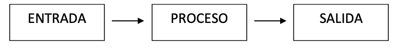

#### Un primer vistazo a Java

Aunque todavía no conozcas los detalles, tener una imagen mental del código es útil. Este es el programa más famoso del mundo para empezar:

```java
public class HolaMundo {
    public static void main(String[] args) {
        System.out.println("¡Hola Mundo!");
    }
}
```

Este pequeño bloque ordena al ordenador mostrar `¡Hola Mundo!` en pantalla. Sencillo, pero contiene todos los ingredientes de un programa real.

#### Paradigmas de programación

Los programas deben ser **fiables, legibles, eficientes y modulares**. Para lograrlo existen distintos estilos de programar:

1. **Programación estructurada** — secuencias, condicionales y bucles. La base de todo.
2. **Programación modular** — dividir el programa en funciones reutilizables.
3. **Programación orientada a objetos (POO)** — el paradigma principal de este módulo.
4. **Otros** — programación concurrente, funcional, lógica...

!!! info "¿Qué usaremos?"
    En este módulo trabajaremos principalmente con **programación estructurada** (UD1-UD4) y luego pasaremos a **POO** (UD5 en adelante).

---

### 1.4 Ciclo de vida del software

Crear un programa no es solo «ponerse a escribir código». Es un proceso ordenado:

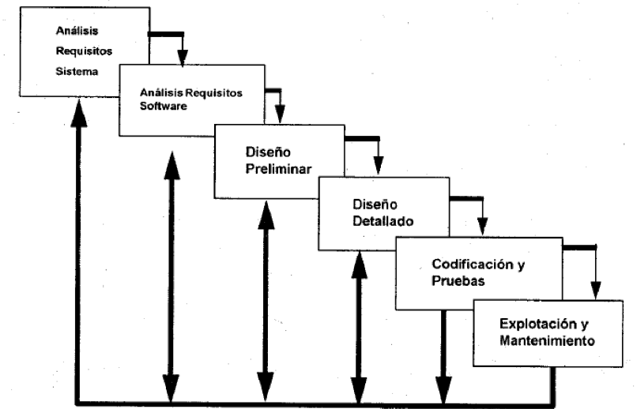

| Fase | ¿Qué se hace? | Analogía |
|---|---|---|
| **Análisis** | Entender qué necesita el cliente | Los planos de la casa |
| **Diseño** | Decidir cómo se construirá (algoritmo) | La estructura y fontanería |
| **Codificación** | Escribir el código | Poner los ladrillos |
| **Pruebas** | Verificar que todo funciona | Revisar que no haya goteras |
| **Mantenimiento** | Corregir y añadir funcionalidades | Reformas y reparaciones |

!!! warning "La realidad del desarrollo"
    El modelo en cascada es un ideal. En la práctica, es habitual volver a fases anteriores cuando se descubre un problema. No te frustres: **iterar es parte del proceso**.

---

### 1.5 Intérprete vs. Compilador

Para que el ordenador entienda nuestro código (escrito en un lenguaje de alto nivel), debe traducirse a código máquina. Hay dos formas de hacerlo:

=== "Intérprete"
    - Traduce y ejecuta el código **línea a línea**.
    - No genera un fichero ejecutable independiente.
    - Más lento, pero más fácil para depurar.
    - **Ejemplos:** Python, PHP.

    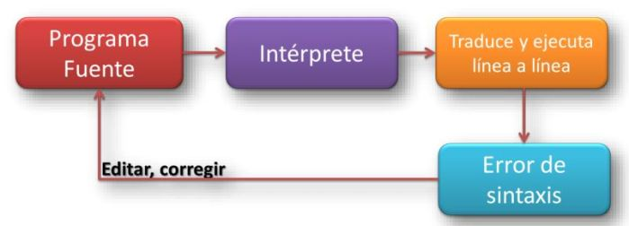

=== "Compilador"
    - Traduce **todo el código de golpe** a un fichero ejecutable.
    - El programa resultante es más rápido.
    - Si hay un error, hay que recompilar.
    - **Ejemplos:** C, C++.

    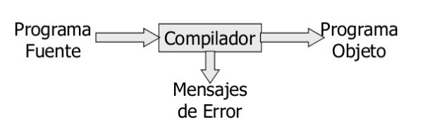

---

### 1.6 Java: 50% compilado, 50% interpretado

Java combina ambos mundos con una arquitectura en dos fases:

1. **Compilación** — `javac` traduce el código fuente (`.java`) a **bytecode** (`.class`). Este fichero no es ejecutable directamente.
2. **Interpretación** — La **Máquina Virtual Java (JVM)** interpreta el bytecode en cada sistema.

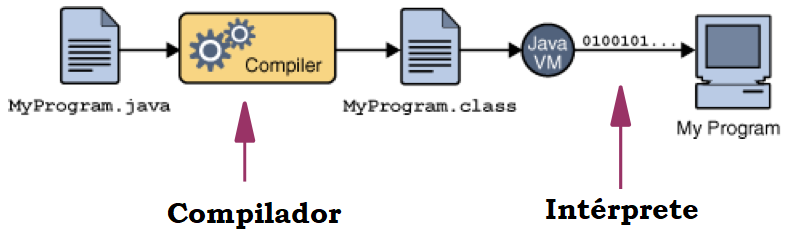

!!! success "Write Once, Run Anywhere"
    Gracias a la JVM, el mismo fichero `.class` funciona en Windows, Linux, macOS, Android… sin cambiar una sola línea. Esta es la ventaja más famosa de Java.

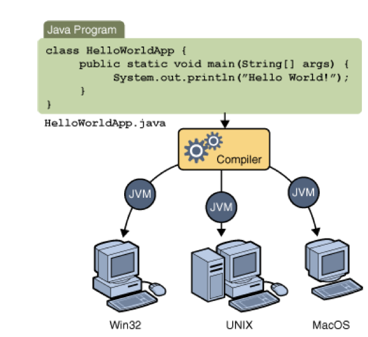

---

### 1.7 Corrección de programas

Un programa sin errores es una utopía. Las dos técnicas principales para encontrarlos son:

- **Testing** — crear un juego de pruebas con entradas y salidas esperadas para verificar el comportamiento del programa.
- **Debugging** — usar un depurador para ejecutar el programa paso a paso e inspeccionar el valor de las variables en cada momento.

Los tipos de error más comunes:

| Tipo | Cuándo aparece | Ejemplo |
|---|---|---|
| **Sintaxis** | Al compilar | Olvidar un `;` |
| **Ejecución** | Al ejecutar | Dividir por cero |
| **Lógico** | El programa funciona pero hace algo incorrecto | Sumar en lugar de restar |

!!! danger "Los errores lógicos son los más peligrosos"
    Un error de sintaxis el compilador te lo señala. Un error lógico puede pasar desapercibido durante años y causar resultados incorrectos sin ningún aviso.

---

### 1.8 ¿Qué lenguaje elegir?

Existen cientos de lenguajes. Aquí una comparativa de los más populares:

| Lenguaje | Nivel | Puntos fuertes |
|---|---|---|
| **C** | Bajo/medio | Velocidad, control del hardware, base de sistemas operativos |
| **Java** | Alto | Multiplataforma, empresarial, Android, Big Data |
| **Python** | Alto | Legibilidad, IA/ML, scripting, ciencia de datos |

Puedes consultar el ranking de popularidad en [TIOBE Index](https://www.tiobe.com/tiobe-index/).

---

## 2. La información

### 2.1 ¿Qué son los datos?

Un programa manipula datos. Para el ordenador, toda información se reduce a secuencias de 0s y 1s (bits). Como programadores, trabajamos con un nivel de abstracción mayor: usamos tipos de datos con nombres significativos.

Un dato puede aparecer en el programa como **variable** o como **constante**.

---

### 2.2 Variables

!!! note "Analogía de la caja etiquetada"
    Una variable es como una **caja etiquetada**. La etiqueta es el **nombre**, lo que hay dentro es el **valor**, y el tipo de caja determina qué tipo de dato puede contener.

Una variable es un espacio en la RAM del ordenador donde guardamos un dato que **puede cambiar** durante la ejecución.

Cada variable tiene:

- Un **nombre** (identificador)
- Un **tipo** (determina los valores que puede almacenar)
- Un **valor** (el dato almacenado en ese momento)

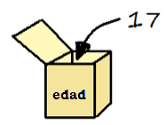

```c
int edad;        // Declaramos una variable de tipo entero llamada edad
edad = 17;       // Le asignamos el valor 17
edad = 19;       // Cambiamos el valor a 19 — por eso se llama VARIable
edad = edad + 3; // Ahora vale 22
edad = 23.5;     // ¡ERROR! No podemos guardar un decimal en un entero
```

#### Precisión

El tipo de dato determina cuántos bytes ocupa la variable y qué rango de valores puede almacenar. Con 1 byte (8 bits) tenemos 256 combinaciones posibles:

- Solo positivos → de 0 a 255
- Con negativos → de -128 a 127

---

### 2.3 Constantes

Una constante es igual que una variable, salvo que su valor **no puede cambiar** una vez asignado.

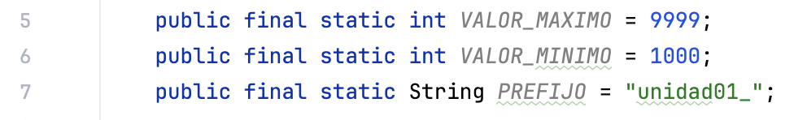

!!! tip "Convenio de nombrado"
    Por convenio, los nombres de constantes se escriben en **MAYÚSCULAS** con guiones bajos: `PI`, `IVA_GENERAL`, `MAYORIA_EDAD`. Así cualquier programador las reconoce de un vistazo.

---

### 2.4 Nombres e identificadores

Las reglas para nombrar variables y constantes son:

- Solo pueden contener letras, dígitos y `_`
- Deben **empezar** por una letra o `_`
- **No** pueden contener espacios
- **No** pueden ser palabras reservadas del lenguaje (`while`, `class`, `int`…)

---

### 2.5 Tipos de datos

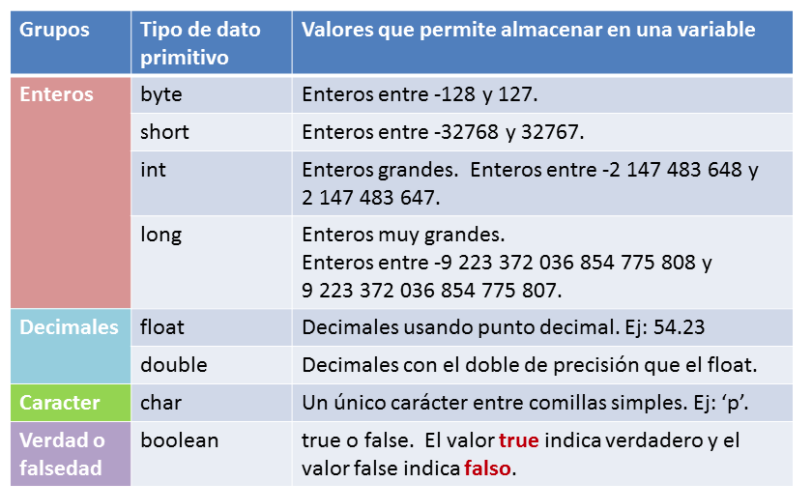

Los datos se clasifican en **simples** y **compuestos**:

- **Simples** — almacenan un único valor: `edad`, `precio`, `activo`.
- **Compuestos** — agrupan varios datos simples: `fechaNacimiento` (día + mes + año), `direccion`.

!!! example "El píxel como dato compuesto"
    Un píxel de color real está formado por tres valores simples: rojo, verde y azul (RGB). Una imagen de 600×400 píxeles necesita 600 × 400 × 3 = **720.000 bytes** (~703 KB) en memoria.

    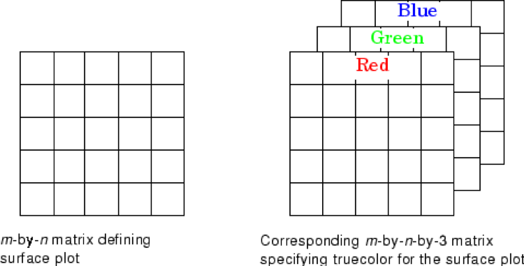

#### Abstracción de datos

Programar implica **seleccionar solo los datos relevantes** para el problema. Una persona tiene nombre, edad, altura, color de ojos, hobbies… pero:

- Para la DGT, de un coche interesa: matrícula, marca, modelo, dueño.
- Para un taller mecánico, además: nivel de aceite, presión de ruedas, kilómetros.

??? question "Para reflexionar"
    - ¿Qué tipo de variable usarías para almacenar el número de alumnos de una clase?
    - ¿Y para guardar la letra de tu DNI?
    - ¿Y para saber si un alumno está aprobado o no?

---

## 3. Instrucciones y Operadores

### 3.1 Expresiones

Una **expresión** es una combinación de operandos y operadores que produce un resultado al evaluarse.

Los operandos pueden ser: constantes (`PI`), variables (`edad`), funciones (`raiz(100)`), literales (`100`, `"Hola"`).

| Tipo | Ejemplos |
|---|---|
| Numéricas | `edad`, `5`, `2*PI*radio`, `(-b + raiz(b²-4ac)) / (2a)` |
| Alfanuméricas | `"Pedro"`, `"Hola" + " Mundo"` |
| Lógicas | `true`, `false`, `a < b`, `(v1 < v2) && (v2 < v3)` |

---

### 3.2 Operadores aritméticos

Realizan operaciones matemáticas. Operandos y resultado son numéricos.

| Operador | Significado | Ejemplo |
|---|---|---|
| `^` ó `**` | Potencia | `2^8` → 256 |
| `*` | Producto | `3 * 4` → 12 |
| `/` ó `//` | División | `10 / 4` → 2 (si son enteros) |
| `%` | Resto (módulo) | `10 % 3` → 1 |
| `+` | Suma | `5 + 3` → 8 |
| `-` | Resta | `9 - 4` → 5 |

!!! warning "División entera: ¡ojo!"
    En la mayoría de lenguajes, dividir dos enteros da un resultado entero (se trunca la parte decimal). `5 / 2` es **2**, no 2.5. Para obtener el decimal, uno de los operandos debe ser real.

**Prioridad** (de mayor a menor):

| Operador | Prioridad |
|---|---|
| `^` | Alta |
| `*, /, %` | Media |
| `+, -` | Baja |

Usa paréntesis `()` para alterar el orden cuando sea necesario.

---

### 3.3 Operadores relacionales

Comparan dos expresiones y devuelven **verdadero o falso**.

| Operador | Significado |
|---|---|
| `>` | Mayor que |
| `<` | Menor que |
| `==` | Igual |
| `!=` | Distinto |
| `>=` | Mayor o igual |
| `<=` | Menor o igual |

Con `x = 10, y = 20`:

| Expresión | Resultado |
|---|---|
| `(x + y) < 20` | `false` |
| `(y - x) <= x` | `true` |
| `x == y` | `false` |
| `x != y` | `true` |

---

### 3.4 Operadores lógicos

Operan sobre valores lógicos (verdadero/falso) y devuelven un resultado lógico.

| Operador | Descripción |
|---|---|
| `AND` | Verdadero solo si **ambos** son verdaderos |
| `OR` | Verdadero si **alguno** es verdadero |
| `NOT` | Invierte el valor lógico |

**Tabla de verdad:**

| x | y | NOT x | x OR y | x AND y |
|---|---|---|---|---|
| F | F | V | F | F |
| F | V | V | V | F |
| V | F | F | V | F |
| V | V | F | V | V |

**Leyes de De Morgan** (muy útiles para simplificar condiciones):

```
NOT (NOT A)      =  A
NOT (A AND B)    =  (NOT A) OR (NOT B)
NOT (A OR B)     =  (NOT A) AND (NOT B)
```

**Prioridad completa** (de mayor a menor):

| Operador | Prioridad |
|---|---|
| `NOT` | Alta |
| `^` | |
| `*, /, %` | |
| `+, -` | |
| `<, >, <=, >=` | |
| `==, !=` | |
| `AND` | |
| `OR` | Baja |

---

### 3.5 Funciones

Son bloques de código reutilizables que realizan una tarea específica y, generalmente, devuelven un resultado.

!!! example "La misma función en distintos lenguajes"
    Imprimir «Hola» en pantalla en varios lenguajes:

    === "Java"
        ```java
        System.out.println("Hola");
        ```
    === "Python"
        ```python
        print("Hola")
        ```
    === "C"
        ```c
        printf("Hola");
        ```
    === "Pseudocódigo"
        ```
        ESCRIBIR("Hola")
        ```

También podemos definir nuestras propias funciones. En Java:

```java
float areaTriangulo(float base, float altura) {
    return base * altura / 2;
}
```

---

## 4. El lenguaje Java

**Java** es un lenguaje de propósito general, orientado a objetos y con filosofía **WORA** (*Write Once, Run Anywhere*).

Sus características principales:

- **Sencillo** — sintaxis inspirada en C++, fácil de aprender.
- **Orientado a objetos** — casi todo en Java es un objeto.
- **Robusto** — el compilador detecta muchos errores antes de ejecutar.
- **Seguro** — diseñado pensando en aplicaciones de red.
- **Portable** — el mismo `.class` funciona en cualquier sistema con JVM.
- **Multihilo** — soporta varias tareas simultáneas de forma nativa.
- **Ecosistema enorme** — frameworks como Spring, uso masivo en backend empresarial y Big Data.

---

### 4.1 Primer ejemplo: ¡Hola Mundo!

> **Escribe y ejecuta** este programa en IntelliJ antes de continuar.

```java
public class Main {

    public static void main(String[] args) {
        System.out.println("¡Hola Mundo!");
    }
}
```

Analizando cada parte:

| Parte | Significado |
|---|---|
| `public class Main` | Declara una clase llamada `Main`. El fichero debe llamarse `Main.java`. |
| `public static void main(...)` | Método principal: la **puerta de entrada** al programa. La JVM lo busca para empezar. |
| `System.out.println(...)` | Imprime el texto en consola y añade un salto de línea. |

!!! warning "Punto y coma obligatorio"
    Todas las instrucciones en Java terminan con `;`. Olvidarlo es el error de sintaxis más frecuente de los primeros días.

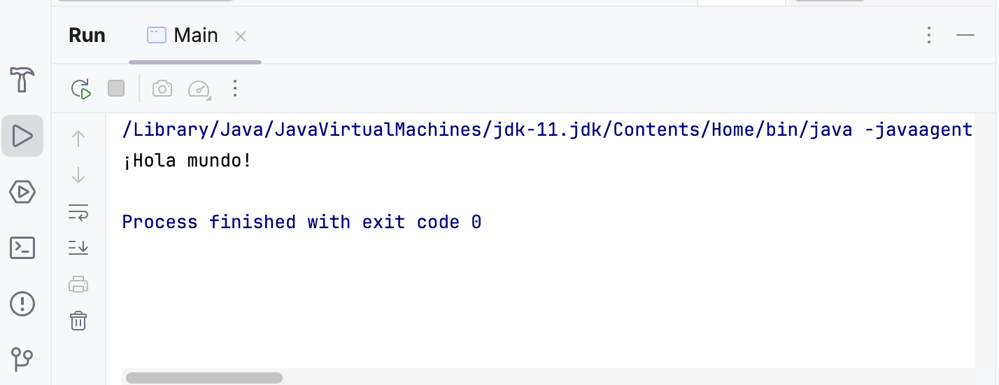

---

### 4.2 Elementos básicos del lenguaje

#### Comentarios

El compilador los ignora. Son notas para los programadores.

```java
// Comentario de una sola línea

/*
   Comentario de
   varias líneas.
*/

/**
 * Comentario Javadoc — genera documentación automática.
 * @param args argumentos de línea de comandos
 */
```

#### Identificadores

Nombran variables, métodos, clases y constantes. Reglas:

- Distinguen mayúsculas de minúsculas (`edad` ≠ `Edad`)
- Empiezan por letra o `_`
- No pueden ser palabras reservadas

**Convenio CamelCase en Java:**

| Elemento | Convenio | Ejemplo |
|---|---|---|
| Clases | Primera letra mayúscula | `CalculadoraFacturas` |
| Variables y métodos | Primera letra minúscula | `nombreUsuario`, `calcularTotal()` |
| Constantes | MAYÚSCULAS con `_` | `IVA_GENERAL`, `PI` |

---

### 4.3 Tipos de datos en Java

Java tiene **8 tipos primitivos**:

| Tipo | Descripción | Memoria | Rango |
|---|---|---|---|
| `byte` | Entero con signo | 1 byte | -128 a 127 |
| `short` | Entero corto | 2 bytes | -32.768 a 32.767 |
| `int` | Entero (el más usado) | 4 bytes | ±2.147 millones |
| `long` | Entero largo | 8 bytes | Muy grande |
| `float` | Real precisión simple | 4 bytes | ±3,4×10³⁸ |
| `double` | Real precisión doble | 8 bytes | ±1,7×10³⁰⁸ |
| `char` | Un carácter Unicode | 2 bytes | Cualquier carácter |
| `boolean` | Valor lógico | 1 bit | `true` / `false` |

!!! info "El tipo String"
    `String` **no es un tipo primitivo** — es un objeto. Sin embargo, Java nos permite usarlo de forma muy similar a los tipos simples, lo que facilita enormemente trabajar con texto.

!!! warning "Desbordamiento de rango"
    Java no avisa si superas el rango de un tipo. Si una variable `byte` vale 127 y le sumas 1, pasará a valer **-128** (comportamiento cíclico). Elige siempre el tipo adecuado para tus datos.

---

### 4.4 Declaración de variables y constantes

```java
// Declarar una variable
int edad;

// Declarar e inicializar
int edad = 25;

// Declarar varias del mismo tipo
float precio1, precio2, precio3;

// Declarar e inicializar varias
float precio1 = 7.0f, precio2 = 7.25f, precio3 = 0.5f;
```

!!! tip "La `f` en los `float`"
    Los literales decimales en Java son `double` por defecto. Para asignar a un `float` hay que añadir `f` al final: `7.0f`. Sin esa `f`, el compilador reportará «posible pérdida de precisión».

**Constantes** — se declaran con `final`:

```java
final int MAYORIA_EDAD = 18;
final float PI = 3.1416f;

// MAYORIA_EDAD = 21; // ¡Error de compilación! No se puede cambiar.
```

**Ámbito de las variables:**

- **Variables locales** — declaradas dentro de un método. Solo existen dentro de ese método.
- **Variables de instancia/clase** — las veremos en POO (UD5 en adelante).

!!! info "Valores por defecto"
    Si no inicializas una variable, Java le asigna un valor por defecto: `0` (numéricos), `false` (boolean), `null` (objetos). Aún así, es **buena práctica inicializar siempre**.

**Palabras reservadas** (no puedes usarlas como identificadores):

```
abstract  boolean  break     byte      case      catch     char
class     const    continue  default   do        double    else
extends   false    final     finally   float     for       goto
if        implements import   instanceof int      interface long
native    new       null      package   private   protected public
return    short     static    super     switch    synchronized this
throw     throws    transient true      try       void      volatile while
```

---

### 4.5 Operadores en Java

#### Aritméticos

| Operador | Descripción | Ejemplo |
|---|---|---|
| `+` | Suma | `5 + 3` → 8 |
| `-` | Resta | `9 - 4` → 5 |
| `*` | Multiplicación | `3 * 4` → 12 |
| `/` | División (entera si ambos son `int`) | `10 / 3` → 3 |
| `%` | Módulo (resto) | `10 % 3` → 1 |
| `++` | Incremento en 1 | `x++` ó `++x` |
| `--` | Decremento en 1 | `x--` ó `--x` |

!!! warning "Pre vs. post incremento"
    - `x++` — usa el valor **actual** de `x` y luego lo incrementa.
    - `++x` — incrementa `x` **primero** y luego usa el nuevo valor.

    ??? question "¿Sabes la diferencia?"
        Si `int x = 5;`, ¿cuánto valdrá `y` en cada caso?

        1. `int y = x++;` → `y` vale **5**, `x` pasa a valer 6.
        2. `int y = ++x;` → `x` pasa a valer 6, `y` vale **6**.

#### Relacionales

| Operador | Descripción |
|---|---|
| `>`, `<` | Mayor que, menor que |
| `>=`, `<=` | Mayor o igual, menor o igual |
| `==` | Igual (¡doble `=`!) |
| `!=` | Distinto |

```java
double op1 = 1.34, op2 = 1.35;
System.out.println(op1 > op2);   // false
System.out.println(op1 < op2);   // true
System.out.println(op1 == op2);  // false
System.out.println(op1 != op2);  // true
```

#### Lógicos

| Operador | Descripción |
|---|---|
| `&&` | AND — verdadero si **ambos** son verdaderos |
| `\|\|` | OR — verdadero si **alguno** es verdadero |
| `!` | NOT — invierte el valor |

```java
boolean a = true, b = false;
System.out.println(a && b);   // false
System.out.println(a || b);   // true
System.out.println(!a);       // false
System.out.println(3 > 4 && a); // false (3>4 ya es false)
```

#### Asignación compuesta

Combinan asignación con una operación aritmética:

| Operador | Equivalencia |
|---|---|
| `+=` | `a = a + b` |
| `-=` | `a = a - b` |
| `*=` | `a = a * b` |
| `/=` | `a = a / b` |
| `%=` | `a = a % b` |

#### Precedencia de operadores (de mayor a menor)

1. `[]`, `.`, `()`
2. `++`, `--`, `-` (unario), `!`
3. `*`, `/`, `%`
4. `+`, `-`
5. `<`, `>`, `<=`, `>=`
6. `==`, `!=`
7. `&&`
8. `||`
9. `=`, `+=`, `-=`, `*=`, `/=`…

---

### 4.6 Conversión de tipos (Casting)

#### Casting implícito

Java lo realiza automáticamente cuando convierte a un tipo **más amplio** (sin pérdida de información):

```
char → int → float → double
```

```java
float foo = 'a';  // 97.0f — 'a' tiene código Unicode 97
int  bar = 'a';   // 97
float baz = 97;   // 97.0f
```

#### Casting explícito

Necesario cuando convertimos a un tipo **más estrecho** (puede haber pérdida de información):

```java
// Sintaxis: (tipo) valor
char  bar  = (char) 65633;     // 97 — se trunca al máximo de char
char  baz  = (char) 97.53f;   // 97 — se pierden los decimales
int   quux = (int) 14.67565f; // 14 — se pierden los decimales

// Caso habitual: división real de enteros
float resultado = (float) 5 / 2;  // 2.5f ✓
float otro      = 5 / 2;          // 2.0f ✗ — se divide antes del casting
```

!!! warning "boolean y String no se pueden castear"
    No existe conversión directa entre `boolean` y tipos numéricos, ni entre `String` y primitivos mediante casting. Para eso existen métodos específicos.

#### Conversión con String

```java
// Cualquier valor → String
String s1 = "" + 42;          // "42"
String s2 = String.valueOf(3.14f); // "3.14"

// String → número
int    n = Integer.parseInt("213");    // 213
float  f = Float.parseFloat("23.78"); // 23.78f

// String → char (por posición)
char c = "java".charAt(0);  // 'j'  (índices empiezan en 0)
```

---

### 4.7 La clase Math

Proporciona funciones matemáticas avanzadas sin necesidad de importar nada (viene en `java.lang`).

```java
double potencia    = Math.pow(3, 3);    // 27.0
double raiz        = Math.sqrt(9);      // 3.0
double absoluto    = Math.abs(-5.7);    // 5.7
double redondeado  = Math.round(3.6);   // 4
double aleatorio   = Math.random();     // número entre 0.0 y 1.0

// Constantes
double pi = Math.PI;   // 3.14159265...
double e  = Math.E;    // 2.71828182...
```

---

### 4.8 Literales

Los literales son valores escritos directamente en el código:

| Tipo | Literales | Ejemplos |
|---|---|---|
| Lógicos | `true`, `false` | `boolean activo = true;` |
| Enteros | Decimal, octal (`0`), hex (`0x`) | `42`, `052`, `0x2A` |
| Entero largo | Añadir `L` | `1234567890L` |
| Reales (double) | Con punto decimal | `3.14`, `1.52e1` |
| Reales (float) | Añadir `f` | `3.14f`, `1.52e1f` |
| Carácter | Entre comillas simples | `'a'`, `'\n'`, `'\t'` |
| Cadena | Entre comillas dobles | `"Hola mundo"` |

**Secuencias de escape habituales:**

| Secuencia | Significado |
|---|---|
| `\n` | Nueva línea |
| `\t` | Tabulador |
| `\\` | Barra inversa `\` |
| `\"` | Comillas dobles `"` |
| `\'` | Comilla simple `'` |

---

### 4.9 Entrada y salida estándar

#### Salida: `System.out`

```java
System.out.print("Sin salto de línea");
System.out.println("Con salto de línea");

String nombre = "Álex";
int edad = 25;
System.out.println(nombre + " tiene " + edad + " años");
// → Álex tiene 25 años
```

#### Entrada: `Scanner`

La clase `Scanner` simplifica la lectura de datos del teclado.

```java
import java.util.Scanner;  // 1. Importar al principio del fichero

public class Main {
    public static void main(String[] args) {

        Scanner sc = new Scanner(System.in);  // 2. Crear el scanner

        System.out.print("Introduce tu nombre: ");
        String nombre = sc.nextLine();        // 3. Leer una línea de texto

        System.out.print("Introduce tu edad: ");
        int edad = sc.nextInt();              // 4. Leer un entero

        System.out.println("¡Hola " + nombre + ", tienes " + edad + " años!");
    }
}
```

**Métodos de lectura disponibles:**

| Método | Tipo devuelto |
|---|---|
| `nextLine()` | `String` — lee hasta el Enter |
| `next()` | `String` — lee hasta el primer espacio |
| `nextInt()` | `int` |
| `nextDouble()` | `double` |
| `nextFloat()` | `float` |
| `nextLong()` | `long` |
| `nextBoolean()` | `boolean` |

!!! danger "El error más común de 1.º DAM: el 'Enter fantasma'"
    Cuando lees un número con `nextInt()` o `nextDouble()`, el `Scanner` consume los dígitos pero **deja el `\n` (Enter) en el buffer**. Si la siguiente lectura es un `nextLine()`, leerá ese Enter vacío y parecerá que se saltó la pregunta.

    **Solución:** añadir `sc.nextLine();` extra después de leer un número:

    ```java
    int edad = sc.nextInt();
    sc.nextLine();          // ← limpia el '\n' sobrante
    String nombre = sc.nextLine();  // ahora lee correctamente
    ```

---

## 📝 Resumen de la unidad

| Concepto | Clave |
|---|---|
| Algoritmo | Secuencia finita de pasos para resolver un problema |
| Programa | Algoritmo escrito en un lenguaje de programación |
| JVM | Permite que Java sea multiplataforma |
| Variable | Espacio en RAM con nombre, tipo y valor (cambiable) |
| Constante | Como variable pero su valor no cambia (`final`) |
| Tipos primitivos | `int`, `double`, `boolean`, `char`… (8 en total) |
| Operadores | Aritméticos, relacionales, lógicos, asignación |
| Casting | Conversión entre tipos de datos |
| Scanner | Clase para leer datos del teclado |

!!! success "¡Ya tienes la base!"
    Con los conceptos de esta unidad puedes escribir programas que lean datos del usuario, realicen cálculos y muestren resultados. En las siguientes unidades aprenderás a controlar el flujo (condicionales y bucles) para resolver problemas más complejos.
