# Unidad 2 - Programación Estructurada: Estructuras de Control y Repetición

!!! abstract "Objetivos de la Unidad"
    Al finalizar esta unidad serás capaz de:

    - Comprender los fundamentos de la **programación modular y estructurada**.
    - Diseñar algoritmos usando **diagramas de flujo** y **pseudocódigo**.
    - Implementar en Java las tres estructuras de control: **secuencial, condicional y repetitiva**.
    - Usar **arrays unidimensionales (vectores) y bidimensionales (matrices)** para almacenar colecciones de datos.
    - Manipular cadenas de texto con los métodos de la clase **`String`**.

---

## 1 Introducción: Construyendo programas sólidos

En esta unidad vamos a sentar las bases para crear programas que no solo funcionen, sino que sean **claros, sencillos de mantener y fáciles de ampliar**. Para ello, nos apoyaremos en dos pilares fundamentales: la **Programación Modular** y la **Programación Estructurada**.

## 2 Programación Modular: Construyendo con piezas de LEGO

Imagina que quieres construir un castillo de LEGO. No empiezas uniendo piezas al azar, ¿verdad? Lo más probable es que construyas primero las torres, luego las murallas, el puente... y finalmente lo unes todo.

La **programación modular** aplica exactamente esa idea: consiste en dividir un programa grande y complejo en partes más pequeñas e independientes, llamadas **módulos**.

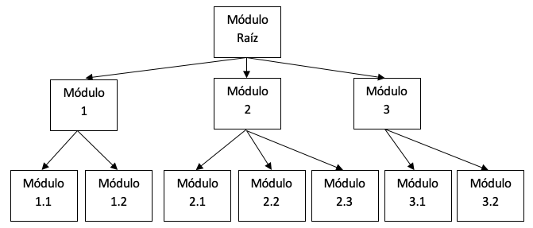

Un **módulo** es un fragmento de código que resuelve una parte muy concreta del problema. Cada módulo se puede programar y probar por separado, como si fuera una pieza de LEGO.

Esta técnica, también conocida como diseño **Top-Down** (de lo general a lo particular), nos aporta enormes ventajas:

!!! success "Ventajas de la Programación Modular"
    - **Claridad:** Es más fácil entender un programa dividido en partes lógicas.
    - **Reutilización:** Un mismo módulo puede usarse en diferentes programas.
    - **Facilidad de depuración:** Si algo falla, solo revisas ese módulo, no el programa entero.
    - **Trabajo en equipo:** Diferentes programadores pueden trabajar en distintos módulos a la vez.

## 3 Programación Estructurada: Las reglas de tráfico del código

Si la programación modular nos dice "divide y vencerás", la programación estructurada nos dice **cómo construir cada una de esas divisiones**.

Se basa en el famoso **Teorema de la Estructura**, que demuestra algo asombroso: cualquier programa, por complejo que sea, puede construirse usando únicamente **tres tipos de estructuras de control**:

| Estructura | Analogía | Descripción |
|---|---|---|
| **Secuencial** | Calle de sentido único | Las instrucciones se ejecutan una tras otra, en orden |
| **Condicional** | Bifurcación en la carretera | El programa decide qué camino tomar según una condición (`if-else`) |
| **Repetitiva** | Rotonda | El programa repite un bloque hasta que se cumple la condición de salida (`while`, `for`) |

!!! info "Teorema de la Estructura"
    Formulado por _Böhm y Jacopini_: "_Todo programa propio — con un solo punto de entrada y un solo punto de salida — puede escribirse usando únicamente **estructura secuencial, condicional y repetitiva**_."

## 4 El Algoritmo: El plano de nuestra construcción

Un algoritmo es el **plano detallado** para resolver un problema: una serie de pasos claros y finitos. Para representarlos, usaremos dos herramientas:

- **Diagrama de flujo:** Representación gráfica con símbolos y flechas. Muy visual.
- **Pseudocódigo:** Lenguaje intermedio entre el lenguaje humano y el código, que permite centrarse en la lógica sin preocuparse por la sintaxis estricta.

!!! tip "Características de un buen algoritmo"
    Un algoritmo de calidad debe ser **sencillo** y **eficiente** (usar el mínimo tiempo y memoria posibles).

Los **elementos** de un algoritmo son:

- Instrucciones: de entrada, de salida, de asignación
- Estructuras de control: bifurcaciones y repeticiones

## 5 Elementos de un algoritmo

### 5.1 Inicio y Fin

Todo algoritmo tiene un punto de partida y un final claros:

- **NOMBRE DEL ALGORITMO** — el nombre que identifica su propósito.
- **INICIO** — punto de entrada.
- **FIN** — finalización.

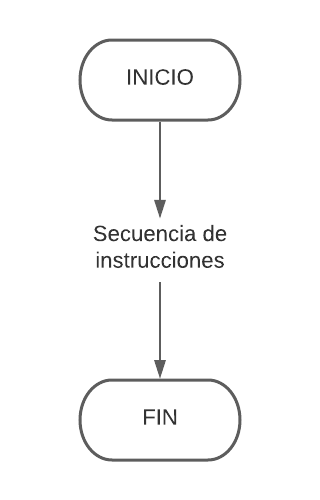

=== "Pseudocódigo"
    ```
    ALGORITMO NombreDelAlgoritmo
    INICIO
        // ... instrucciones
    FIN
    ```

=== "Java"
    ```java
    public class HolaMundo {          // INICIO de la clase
        public static void main(String[] args) { // INICIO del método
            System.out.println("Hola Mundo");
        }                             // FIN del método
    }                                 // FIN de la clase
    ```

### 5.2 Instrucciones de asignación

Una asignación consiste en guardar un valor en una variable. Se representa con un **rectángulo** en el diagrama de flujo.

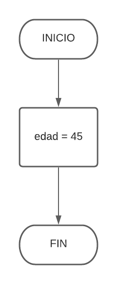

En pseudocódigo, las variables y constantes se declaran antes del `INICIO`:

- **CONSTANTES:** Su valor no cambia. Por convenio, en mayúsculas.
- **VARIABLES:** Su valor puede cambiar durante la ejecución.

=== "Pseudocódigo"
    ```
    ALGORITMO EjemploTipos
    CONST
        REAL PI = 3.1416
    VAR
        ENTERO edad = 0
        CADENA nombre = " "
        BOOLEANO esAlumno = VERDADERO
    INICIO
        // ... cuerpo del algoritmo
    FIN
    ```

=== "Java"
    ```java
    final double PI = 3.1416;
    int edad = 0;
    String nombre = "";
    boolean esAlumno = true;
    ```

### 5.3 Instrucciones de Entrada y Salida

Son la forma en que nuestro programa se comunica con el exterior (normalmente, el usuario). Se representan con figuras **romboides o trapecios**.

- **Entrada:** Leer datos del teclado.
- **Salida:** Mostrar información en pantalla.

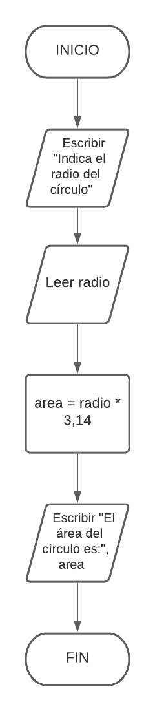

=== "Pseudocódigo"
    ```
    ALGORITMO CalculoAreaCirculo
    VAR
        REAL radio = 0.0
        REAL area = 0.0
    INICIO
        ESCRIBIR("Indica el radio del círculo:")
        LEER(radio)
        area = PI * radio * radio
        ESCRIBIR("El área del círculo es: ", area)
    FIN
    ```

=== "Java"
    ```java
    import java.util.Scanner;

    public class CalculoAreaCirculo {
        public static void main(String[] args) {
            Scanner teclado = new Scanner(System.in);

            System.out.print("Indica el radio del círculo: ");
            double radio = teclado.nextDouble();

            double area = Math.PI * Math.pow(radio, 2);

            System.out.println("El área del círculo es: " + area);
        }
    }
    ```

### 5.4 Estructuras Alternativas (Condicionales)

Son las **bifurcaciones** del código. Permiten ejecutar un bloque u otro según si una condición es verdadera o falsa.

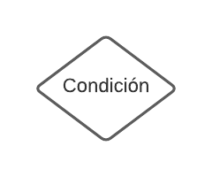

#### 5.4.1 Condicional `if` (Simple)

Ejecuta un bloque de código **solo si** la condición es verdadera.

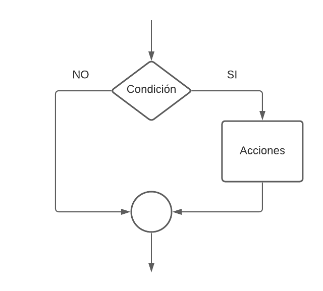

**Ejemplo:** solicitar una edad y mostrar "Mayor de edad" si es ≥ 18.

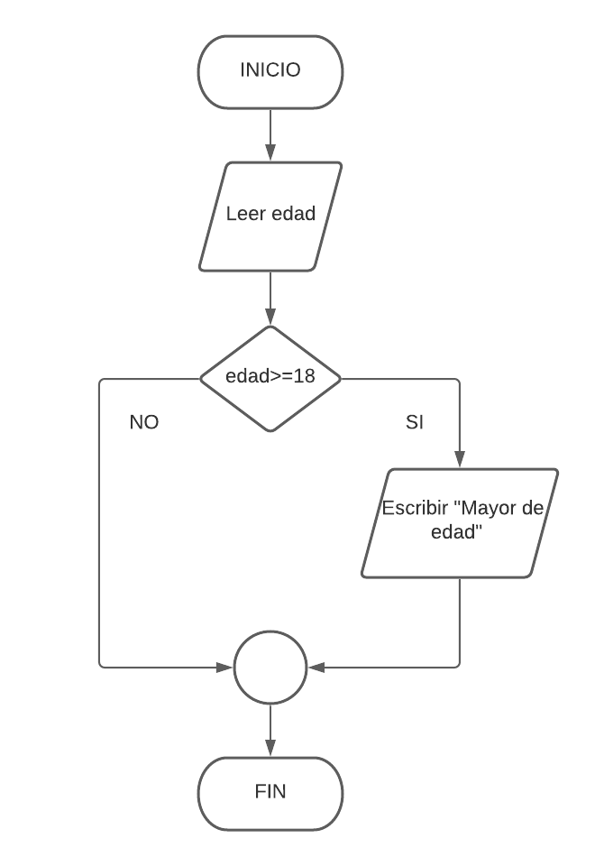

=== "Pseudocódigo"
    ```
    ALGORITMO MayoriaEdad
    VAR
        ENTERO edad
    INICIO
        ESCRIBIR("Introduce tu edad:")
        LEER(edad)
        SI (edad >= 18) ENTONCES
            ESCRIBIR("Mayor de edad.")
        FIN SI
    FIN
    ```

=== "Java"
    ```java
    import java.util.Scanner;

    public class MayoriaEdad {
        public static void main(String[] args) {
            int edad = 0;
            Scanner entrada = new Scanner(System.in);

            System.out.println("Introduce tu edad: ");
            edad = entrada.nextInt();

            if (edad >= 18) {
                System.out.println("Mayor de edad.");
            }
        }
    }
    ```

#### 5.4.2 Condicional `if-else` (Doble)

Proporciona un camino alternativo cuando la condición es falsa.

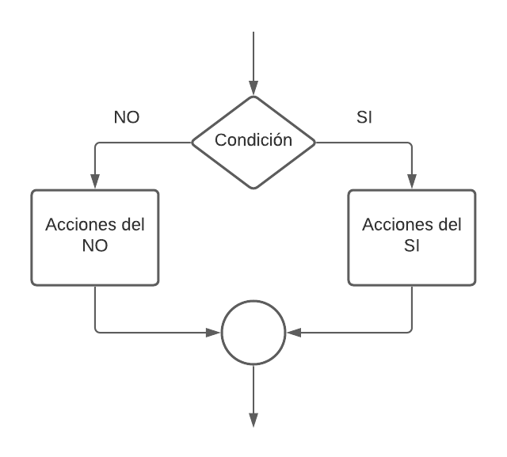

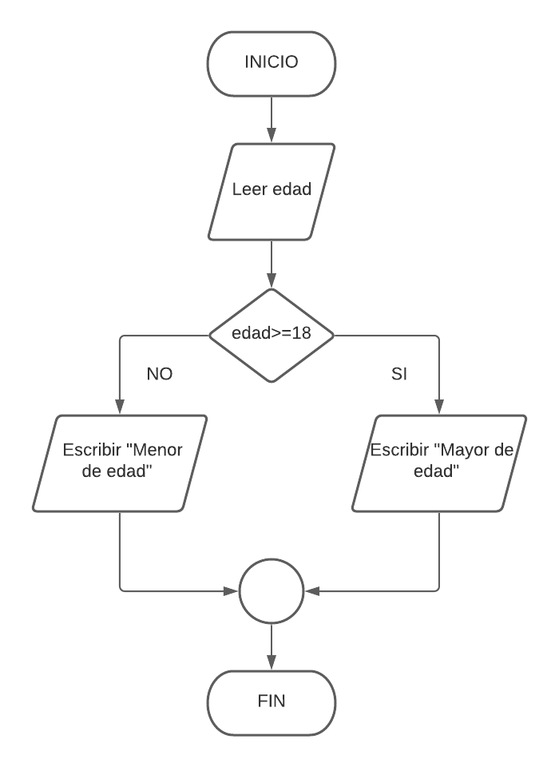

=== "Pseudocódigo"
    ```
    ALGORITMO MayoriaEdadDoble
    VAR
        ENTERO edad
    INICIO
        ESCRIBIR("Introduce tu edad:")
        LEER(edad)
        SI (edad >= 18) ENTONCES
            ESCRIBIR("Eres mayor de edad.")
        SINO
            ESCRIBIR("Eres menor de edad.")
        FIN SI
    FIN
    ```

=== "Java"
    ```java
    edad = teclado.nextInt();
    if (edad >= 18) {
        System.out.println("Eres mayor de edad.");
    } else {
        System.out.println("Eres menor de edad.");
    }
    ```

#### 5.4.3 Condicional `if else-if else` (Anidada)

Permite encadenar varias condiciones. El programa evalúa cada una en orden y ejecuta el primer bloque cuyo resultado sea verdadero.

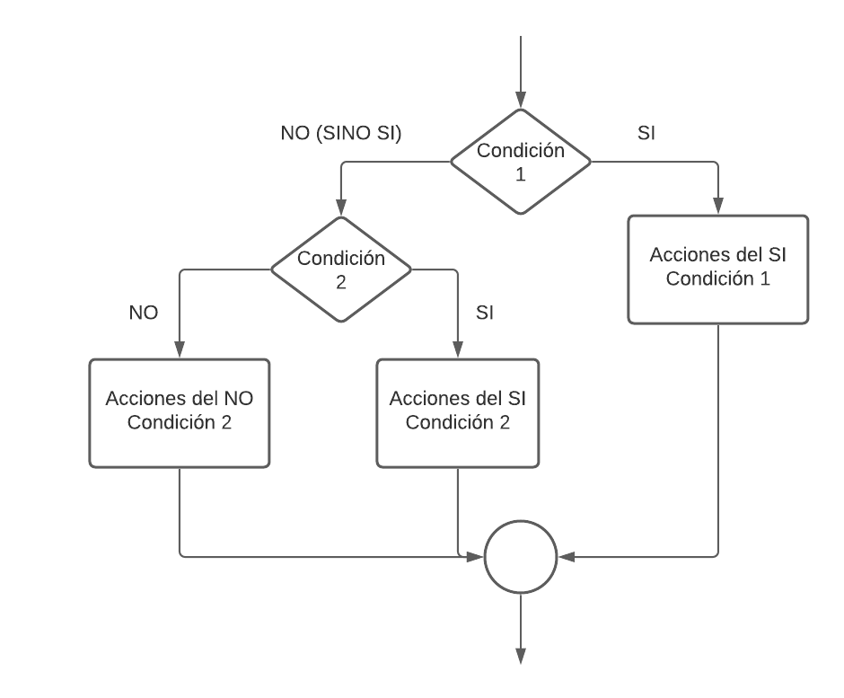

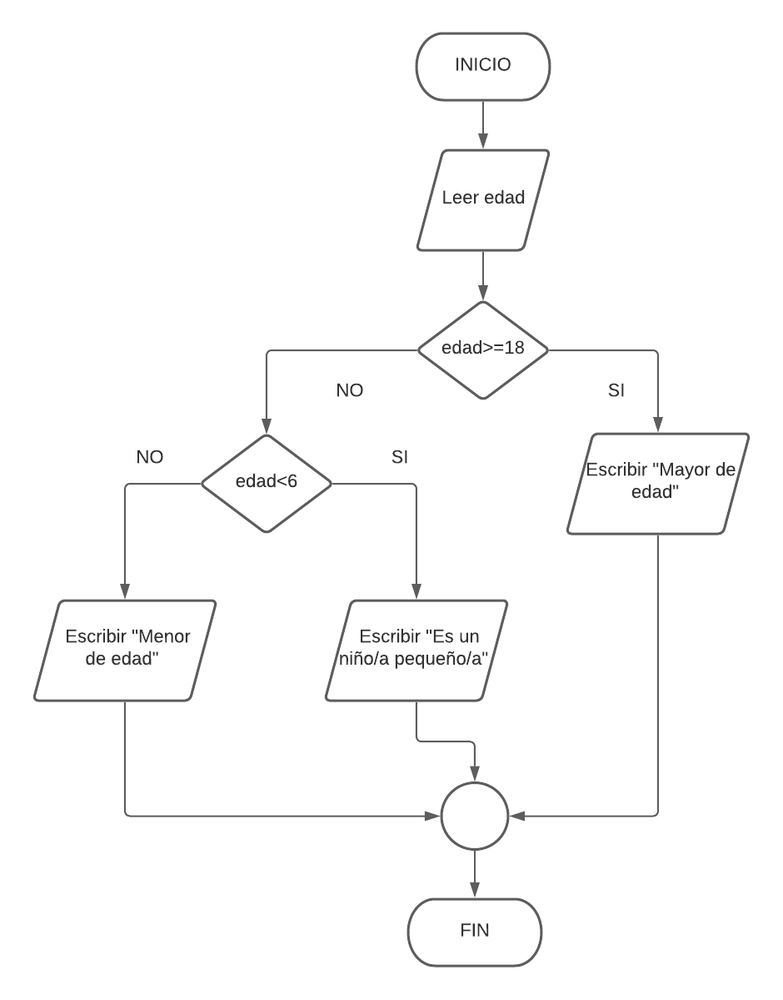

=== "Pseudocódigo"
    ```
    ALGORITMO ClasificarEdad
    VAR
        ENTERO edad
    INICIO
        ESCRIBIR("Introduce tu edad:")
        LEER(edad)
        SI (edad >= 18) ENTONCES
            ESCRIBIR("Eres mayor de edad.")
        SINO SI (edad < 6) ENTONCES
            ESCRIBIR("Eres un/a niño/a pequeño/a.")
        SINO
            ESCRIBIR("Eres menor de edad.")
        FIN SI
    FIN
    ```

=== "Java"
    ```java
    edad = teclado.nextInt();
    if (edad >= 18) {
        System.out.println("Eres mayor de edad.");
    } else if (edad < 6) {
        System.out.println("Eres un/a niño/a pequeño/a.");
    } else {
        System.out.println("Eres menor de edad.");
    }
    ```

??? example "Ejemplo avanzado: condiciones de distinto tipo"
    Un `if` anidado no tiene por qué evaluar el mismo tipo de dato. Podemos combinar comprobaciones numéricas y booleanas para crear lógicas más complejas.

    **Caso:** Control de acceso a un evento. Un menor solo puede entrar si va acompañado.

    === "Pseudocódigo"
        ```
        ALGORITMO PermisoEntrada
        VAR
            ENTERO edad
            BOOLEANO vieneAcompanado
        INICIO
            ESCRIBIR("Introduce tu edad:")
            LEER(edad)
            SI (edad >= 18) ENTONCES
                ESCRIBIR("Puedes pasar.")
            SINO
                ESCRIBIR("¿Vienes acompañado por un adulto? (VERDADERO/FALSO)")
                LEER(vieneAcompanado)
                SI (vieneAcompanado == VERDADERO) ENTONCES
                    ESCRIBIR("Puedes pasar con tu acompañante.")
                SINO
                    ESCRIBIR("Lo sentimos, no puedes pasar.")
                FIN SI
            FIN SI
        FIN
        ```

    === "Java"
        ```java
        System.out.print("Introduce tu edad: ");
        int edad = teclado.nextInt();

        if (edad >= 18) {
            System.out.println("Puedes pasar.");
        } else {
            System.out.print("¿Vienes acompañado? (true/false): ");
            boolean vieneAcompanado = teclado.nextBoolean();
            if (vieneAcompanado) {
                System.out.println("Puedes pasar con tu acompañante.");
            } else {
                System.out.println("Lo sentimos, no puedes pasar.");
            }
        }
        ```

#### 5.4.4 Condicional `switch` (Múltiple)

Es una alternativa más limpia al `if-else if` cuando se compara **una sola variable** contra una lista de valores concretos.

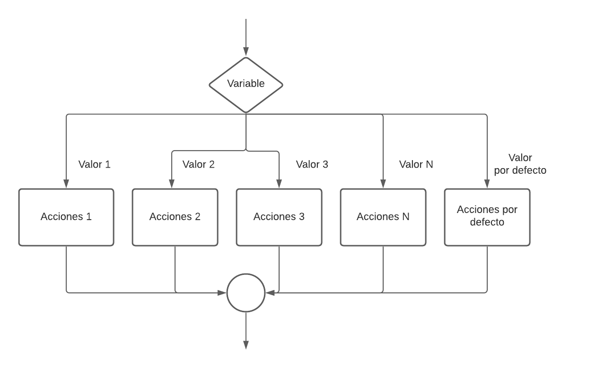

!!! tip "¿Cuándo usar `switch` en lugar de `if-else`?"
    Usa `switch` cuando compruebes el valor exacto de una variable (un menú, una letra, un código). Usa `if-else` cuando las condiciones impliquen rangos o comparaciones complejas.

**Ejemplo:** identificar una vocal mayúscula.

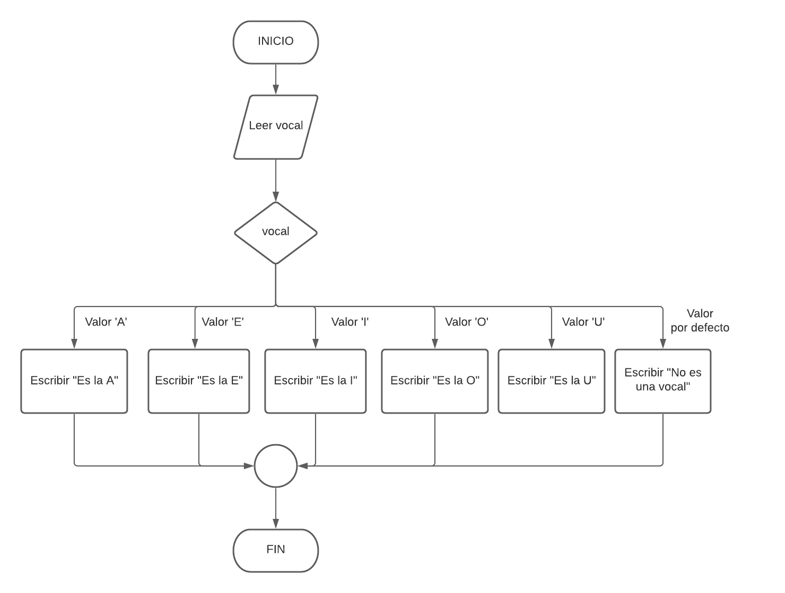

=== "Pseudocódigo"
    ```
    ALGORITMO VOCAL
    VAR
        CARACTER vocal
    INICIO
        ESCRIBIR("Dame una vocal: ")
        LEER(vocal)
        SEGÚN VALOR(vocal):
            VALOR 'A': ESCRIBIR("Es la A")
            VALOR 'E': ESCRIBIR("Es la E")
            VALOR 'I': ESCRIBIR("Es la I")
            VALOR 'O': ESCRIBIR("Es la O")
            VALOR 'U': ESCRIBIR("Es la U")
            DEFAULT:   ESCRIBIR("No es una vocal")
        FIN SEGÚN
    FIN
    ```

=== "Java"
    ```java
    import java.util.Scanner;

    public class Vocal {
        public static void main(String[] args) {
            Scanner entrada = new Scanner(System.in);
            System.out.println("Dame una vocal: ");
            char vocal = entrada.next().charAt(0);

            switch (vocal) {
                case 'A': System.out.println("Es la 'A'"); break;
                case 'E': System.out.println("Es la 'E'"); break;
                case 'I': System.out.println("Es la 'I'"); break;
                case 'O': System.out.println("Es la 'O'"); break;
                case 'U': System.out.println("Es la 'U'"); break;
                default:  System.out.println("No es una vocal"); break;
            }
        }
    }
    ```

!!! warning "¡No olvides el `break`!"
    Sin `break`, Java continuará ejecutando los `case` siguientes aunque no coincidan. Este comportamiento se llama *fall-through* y es una fuente frecuente de errores.

Un uso muy típico del `switch` es construir **menús de opciones**:

=== "Pseudocódigo"
    ```
    ALGORITMO MenuOpciones
    VAR
        ENTERO opcion
    INICIO
        ESCRIBIR("Elige una opción (1-3):")
        LEER(opcion)
        SEGUN (opcion) HACER
            CASO 1: ESCRIBIR("Has elegido 'Ver perfil'")
            CASO 2: ESCRIBIR("Has elegido 'Editar cuenta'")
            CASO 3: ESCRIBIR("Has elegido 'Cerrar sesión'")
            DE OTRO MODO: ESCRIBIR("Opción no válida.")
        FIN SEGUN
    FIN
    ```

=== "Java"
    ```java
    int opcion = teclado.nextInt();
    switch (opcion) {
        case 1: System.out.println("Has elegido 'Ver perfil'");    break;
        case 2: System.out.println("Has elegido 'Editar cuenta'"); break;
        case 3: System.out.println("Has elegido 'Cerrar sesión'"); break;
        default: System.out.println("Opción no válida.");           break;
    }
    ```

### 5.5 Estructuras Repetitivas (Bucles)

Son las **rotondas** del código. Permiten repetir un bloque de instrucciones múltiples veces.

!!! info "Comparativa de los tres bucles"
    | Bucle | ¿Cuándo se comprueba la condición? | Ejecuciones mínimas | Mejor para... |
    |---|---|---|---|
    | `while` | Antes de cada iteración | 0 | Número desconocido de repeticiones |
    | `do-while` | Después de cada iteración | **1** (siempre ejecuta al menos una vez) | Menús y validaciones de entrada |
    | `for` | Antes de cada iteración | 0 | Número conocido de repeticiones |

#### 5.5.1 Bucle `while` (Mientras)

Repite un bloque de código **mientras** una condición sea verdadera. La condición se comprueba **antes** de cada vuelta.

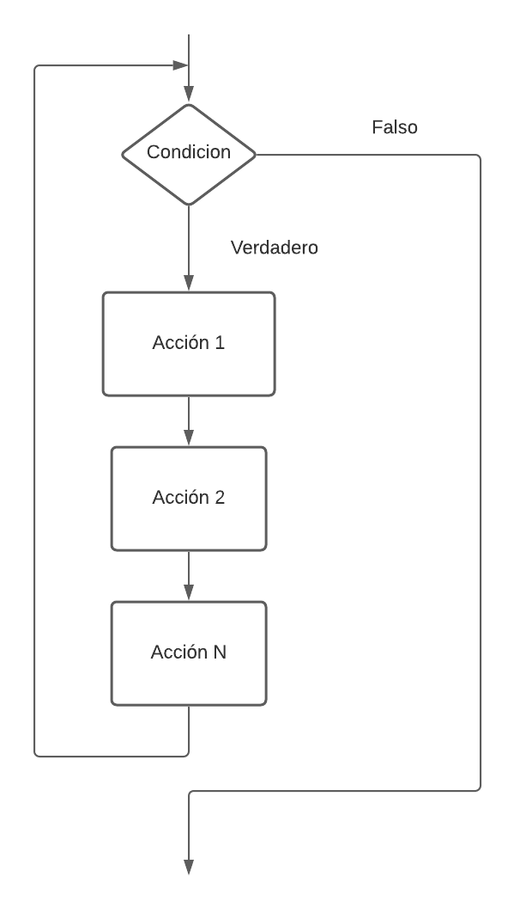

**Ejemplo:** tabla de multiplicar con `while`.

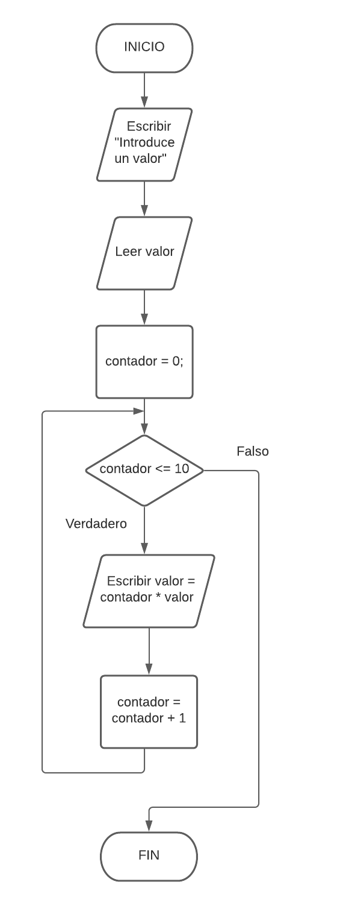

=== "Pseudocódigo"
    ```
    ALGORITMO TablaMultiplicarWhile
    VAR
        ENTERO numero, i = 0
    INICIO
        ESCRIBIR("Introduce un número:")
        LEER(numero)
        MIENTRAS (i <= 10) HACER
            ESCRIBIR(numero, " x ", i, " = ", (numero * i))
            i = i + 1
        FIN MIENTRAS
    FIN
    ```

=== "Java"
    ```java
    int numero = teclado.nextInt();
    int i = 0;
    while (i <= 10) {
        System.out.println(numero + " x " + i + " = " + (numero * i));
        i++; // Abreviatura de i = i + 1
    }
    ```

!!! warning "Cuidado con los bucles infinitos"
    Si la condición del `while` nunca se hace falsa, el programa se ejecutará para siempre. Asegúrate de que la variable de control **cambia** dentro del bucle.

#### 5.5.2 Bucle `do-while` (Hacer-Mientras)

Similar al `while`, pero la condición se comprueba **después** de cada vuelta. El bloque se ejecuta **al menos una vez**.

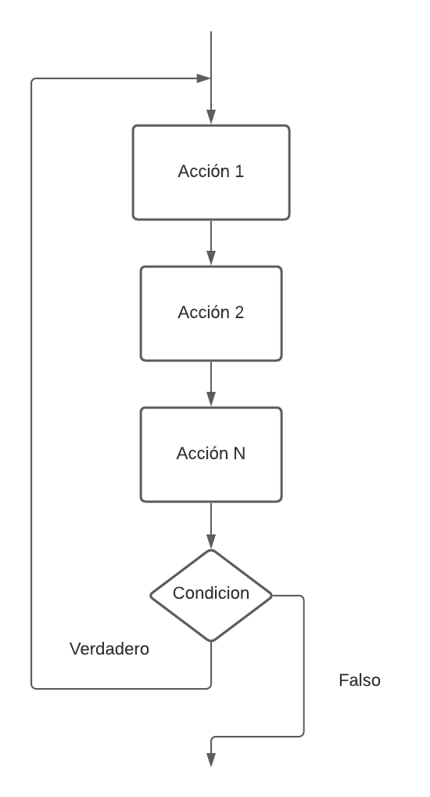

**Ejemplo:** pedir un número positivo (si el usuario introduce uno negativo, se vuelve a pedir).

=== "Pseudocódigo"
    ```
    ALGORITMO PedirNumeroPositivo
    VAR
        ENTERO numero
    INICIO
        HACER
            ESCRIBIR("Introduce un número positivo:")
            LEER(numero)
        MIENTRAS (numero <= 0)
    FIN
    ```

=== "Java"
    ```java
    int numero;
    do {
        System.out.print("Introduce un número positivo: ");
        numero = teclado.nextInt();
    } while (numero <= 0);
    System.out.println("Número correcto: " + numero);
    ```

!!! tip "Uso ideal del `do-while`"
    Es perfecto para **menús de opciones**: siempre quieres mostrar el menú al menos una vez antes de preguntar si el usuario desea continuar.

#### 5.5.3 Bucle `for` (Para)

El bucle ideal cuando **sabemos de antemano el número exacto de repeticiones**. Compacta en una sola línea la inicialización, la condición y el incremento.

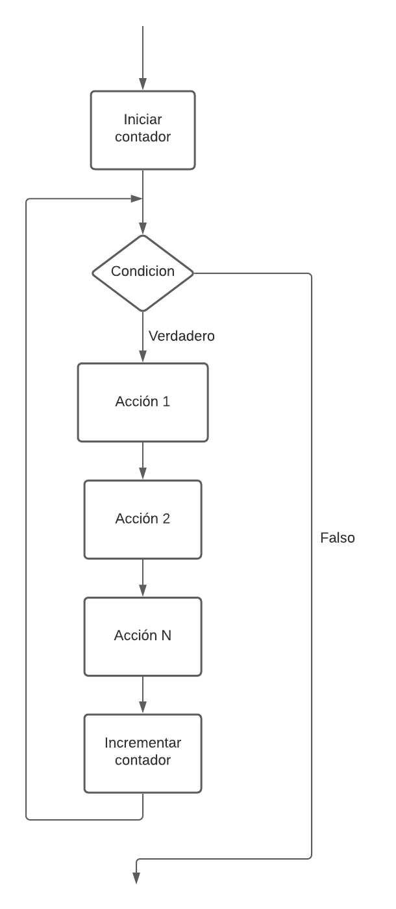

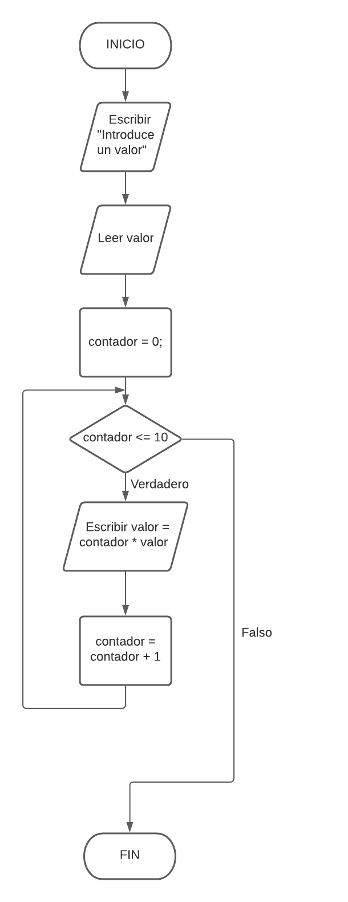

**Ejemplo:** tabla de multiplicar con `for`.

=== "Pseudocódigo"
    ```
    ALGORITMO TablaMultiplicarFor
    VAR
        ENTERO numero, i
    INICIO
        ESCRIBIR("Introduce un número:")
        LEER(numero)
        PARA i DESDE 0 HASTA 10 CON PASO 1 HACER
            ESCRIBIR(numero, " x ", i, " = ", (numero * i))
        FIN PARA
    FIN
    ```

=== "Java"
    ```java
    int numero = teclado.nextInt();
    // for (inicialización; condición; incremento)
    for (int i = 0; i <= 10; i++) {
        System.out.println(numero + " x " + i + " = " + (numero * i));
    }
    ```

## 6 Elementos Auxiliares: Herramientas dentro de los bucles

Dentro de los bucles, es habitual usar variables con roles muy específicos:

!!! info "Variables auxiliares más comunes"
    | Tipo | Descripción | Nombres típicos | Analogía |
    |---|---|---|---|
    | **Contador** | Cuenta sucesos (+1 en cada iteración) | `i`, `j`, `contador` | El portero que pulsa un contador por cada persona que entra |
    | **Acumulador** | Suma cantidades variables para obtener un total | `suma`, `total`, `acumulado` | El carrito de la compra donde vas añadiendo productos |
    | **Bandera (Flag)** | `boolean` que recuerda si un evento ha ocurrido | `encontrado`, `fin`, `salir` | Una bandera que se levanta al encontrar lo que se buscaba |

## 7 Vectores y Matrices: Almacenando Datos en Colección

Hasta ahora, cada variable guardaba un solo dato. Pero, ¿y si necesitamos guardar las notas de 30 alumnos? Para eso usamos los **arrays**.

### 7.1 Vectores (Arrays Unidimensionales)

Un vector es una estructura que almacena un conjunto de datos **del mismo tipo** en posiciones contiguas de memoria.

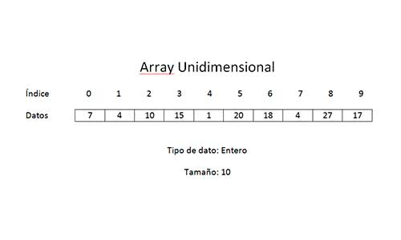

!!! info "Analogía: el tren"
    Piensa en un **tren**. El tren entero es el vector, cada **vagón** es un elemento, y el número del vagón es su **índice**. ¡El primer vagón siempre es el número **0**!

**Declaración y acceso en Java:**

```java
int[] notas = new int[30];         // Vector de 30 enteros
String[] nombres = new String[30]; // Vector de 30 cadenas

notas[0] = 7;                      // Asigna 7 al primer elemento (índice 0)
System.out.println(nombres[2]);    // Muestra el tercer elemento (índice 2)
```

Los bucles `for` son el compañero perfecto para recorrer vectores:

```java
for (int i = 0; i < notas.length; i++) {
    System.out.print("Introduce la nota del alumno " + (i + 1) + ": ");
    notas[i] = teclado.nextInt();
}
```

!!! tip "Inicialización directa"
    Si ya conocemos los valores, podemos declarar e inicializar el vector en un solo paso:
    ```java
    String[] dias = {"Lunes", "Martes", "Miércoles", "Jueves", "Viernes", "Sábado", "Domingo"};
    ```

??? example "Caso de Uso 1: Acumulador — Cesta de la compra"
    Usamos un vector para guardar los precios de varios productos y un acumulador para el total.

    === "Pseudocódigo"
        ```
        ALGORITMO CestaCompra
        VAR
            REAL precios[5]
            REAL total = 0.0
            ENTERO i
        INICIO
            PARA i DESDE 0 HASTA 4 HACER
                ESCRIBIR("Precio del producto ", i+1, ":") → LEER(precios[i])
            FIN PARA
            PARA i DESDE 0 HASTA 4 HACER
                total = total + precios[i]
            FIN PARA
            ESCRIBIR("Total: ", total)
        FIN
        ```

    === "Java"
        ```java
        double[] precios = new double[5];
        double total = 0.0;
        Scanner teclado = new Scanner(System.in);

        for (int i = 0; i < precios.length; i++) {
            System.out.print("Precio del producto " + (i + 1) + ": ");
            precios[i] = teclado.nextDouble();
        }
        for (int i = 0; i < precios.length; i++) {
            total += precios[i];
        }
        System.out.println("Total: " + total);
        ```

??? example "Caso de Uso 2: Vectores Paralelos — Nombres y Edades"
    Dos vectores donde el índice `i` de uno está relacionado con el índice `i` del otro.

    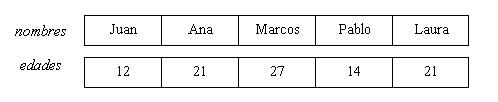

    === "Pseudocódigo"
        ```
        ALGORITMO MayoresDeEdad
        VAR
            CADENA nombres[5]
            ENTERO edades[5], i
        INICIO
            PARA i DESDE 0 HASTA 4 HACER
                ESCRIBIR("Nombre:") → LEER(nombres[i])
                ESCRIBIR("Edad:")   → LEER(edades[i])
            FIN PARA
            ESCRIBIR("--- Mayores de edad ---")
            PARA i DESDE 0 HASTA 4 HACER
                SI (edades[i] >= 18) ENTONCES
                    ESCRIBIR(nombres[i])
                FIN SI
            FIN PARA
        FIN
        ```

    === "Java"
        ```java
        String[] nombres = new String[5];
        int[] edades = new int[5];
        Scanner teclado = new Scanner(System.in);

        for (int i = 0; i < nombres.length; i++) {
            System.out.print("Nombre: ");
            nombres[i] = teclado.nextLine();
            System.out.print("Edad: ");
            edades[i] = teclado.nextInt();
            teclado.nextLine(); // Consume el salto de línea
        }

        System.out.println("--- Mayores de edad ---");
        for (int i = 0; i < nombres.length; i++) {
            if (edades[i] >= 18) System.out.println(nombres[i]);
        }
        ```

    !!! warning "`nextLine()` después de `nextInt()`"
        Tras leer un entero con `nextInt()`, el carácter `\n` queda en el buffer. Si no lo consumes con `teclado.nextLine()`, el siguiente `nextLine()` leerá una cadena vacía.

### 7.2 Matrices (Arrays Bidimensionales)

Una matriz es un vector de vectores: organiza la información en una tabla con **filas y columnas**.

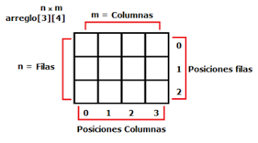

!!! info "Analogía: el tablero de ajedrez"
    Para localizar una casilla necesitas dos coordenadas: **fila** y **columna**. Una matriz funciona exactamente igual.

**Declaración y acceso en Java:**

```java
int[][] tablero = new int[8][8]; // Matriz 8x8
tablero[0][0] = 1;               // Fila 0, columna 0
```

Para recorrer una matriz se usan **dos bucles `for` anidados**: el exterior para las filas, el interior para las columnas:

```java
for (int fila = 0; fila < tablero.length; fila++) {
    for (int col = 0; col < tablero[fila].length; col++) {
        System.out.print(tablero[fila][col] + " ");
    }
    System.out.println(); // Salto de línea al terminar cada fila
}
```

!!! tip "Inicialización directa de una matriz"
    ```java
    int[][] matriz = {
        {1, 4, 7},
        {2, 5, 8},
        {3, 6, 9}
    };
    ```

### 7.3 Lectura y Escritura de Matrices

??? example "Ejemplo completo: Gestión de una matriz dinámica"
    === "Pseudocódigo"
        ```
        ALGORITMO GestionMatriz
        VAR
            ENTERO filas, columnas, i, j
        INICIO
            LEER(filas), LEER(columnas)
            ENTERO matriz[filas][columnas]
            PARA i DESDE 0 HASTA filas-1 HACER
                PARA j DESDE 0 HASTA columnas-1 HACER
                    ESCRIBIR("Valor [",i,"][",j,"]:") → LEER(matriz[i][j])
                FIN PARA
            FIN PARA
            PARA i DESDE 0 HASTA filas-1 HACER
                PARA j DESDE 0 HASTA columnas-1 HACER
                    ESCRIBIR(matriz[i][j], "\t")
                FIN PARA
                ESCRIBIR_NUEVA_LINEA()
            FIN PARA
        FIN
        ```

    === "Java"
        ```java
        import java.util.Scanner;

        public class GestionMatriz {
            public static void main(String[] args) {
                Scanner teclado = new Scanner(System.in);

                System.out.print("¿Cuántas filas? ");
                int filas = teclado.nextInt();
                System.out.print("¿Cuántas columnas? ");
                int columnas = teclado.nextInt();

                int[][] matriz = new int[filas][columnas];

                System.out.println("--- Introduce los valores ---");
                for (int i = 0; i < filas; i++)
                    for (int j = 0; j < columnas; j++) {
                        System.out.print("Valor [" + i + "][" + j + "]: ");
                        matriz[i][j] = teclado.nextInt();
                    }

                System.out.println("\n--- Matriz resultante ---");
                for (int i = 0; i < filas; i++) {
                    for (int j = 0; j < columnas; j++)
                        System.out.print(matriz[i][j] + "\t");
                    System.out.println();
                }
            }
        }
        ```

??? example "Caso de Uso: Tablero de Tres en Raya"
    Una matriz `char[3][3]` es perfecta para representar un tablero de juego.

    === "Pseudocódigo"
        ```
        ALGORITMO TresEnRaya
        VAR
            CARACTER tablero[3][3]
        INICIO
            // Inicializar con '-'
            PARA fila DESDE 0 HASTA 2 HACER
                PARA col DESDE 0 HASTA 2 HACER
                    tablero[fila][col] = '-'
                FIN PARA
            FIN PARA
            tablero[0][1] = 'X' | tablero[1][1] = 'O' | tablero[2][0] = 'X'
            // Mostrar tablero
            PARA fila DESDE 0 HASTA 2 HACER
                PARA col DESDE 0 HASTA 2 HACER
                    ESCRIBIR(tablero[fila][col], " ")
                FIN PARA
                ESCRIBIR_NUEVA_LINEA()
            FIN PARA
        FIN
        ```

    === "Java"
        ```java
        public class TresEnRaya {
            public static void main(String[] args) {
                char[][] tablero = new char[3][3];

                for (int fila = 0; fila < 3; fila++)
                    for (int col = 0; col < 3; col++)
                        tablero[fila][col] = '-';

                tablero[0][1] = 'X';
                tablero[1][1] = 'O';
                tablero[2][0] = 'X';

                System.out.println("--- TABLERO ---");
                for (int fila = 0; fila < 3; fila++) {
                    for (int col = 0; col < 3; col++)
                        System.out.print(tablero[fila][col] + " | ");
                    System.out.println();
                }
            }
        }
        ```

    ```
    --- TABLERO ---
    - | X | - | 
    - | O | - | 
    X | - | - | 
    ```

## 8 Strings: La navaja suiza para manejar texto

Un `String` en Java es un objeto que ofrece métodos muy útiles para manipular cadenas de texto.

!!! danger "La regla de oro: usa `equals()`, nunca `==`"
    - `variable1 == variable2` compara si dos variables apuntan al **mismo objeto en memoria**.
    - `variable1.equals(variable2)` compara si los **contenidos** (el texto) son iguales.

    Usar `==` para comparar el contenido de dos `String` es uno de los errores más comunes y difíciles de detectar.

**Métodos más útiles de la clase `String`:**

| Método | Descripción |
|---|---|
| `length()` | Devuelve el número de caracteres |
| `charAt(indice)` | Devuelve el carácter en una posición |
| `toUpperCase()` / `toLowerCase()` | Convierte a mayúsculas o minúsculas |
| `substring(inicio, fin)` | Extrae un fragmento de la cadena |
| `indexOf(texto)` | Posición de la primera aparición (-1 si no existe) |
| `contains(texto)` | `true` si la cadena contiene el texto |
| `replace(viejo, nuevo)` | Reemplaza todas las apariciones |
| `trim()` | Elimina espacios al inicio y al final |
| `split(delimitador)` | Divide la cadena en un array de `String` |

**Ejemplo:** validar y descomponer un email.

```java
public class StringEjemplo {
    public static void main(String[] args) {
        String email = "   ejemplo@DOMINIO.com   ";

        // 1. Limpiamos y normalizamos
        String emailLimpio = email.trim().toLowerCase();
        System.out.println("Email limpio: " + emailLimpio);

        // 2. Validamos formato básico
        if (emailLimpio.contains("@") && emailLimpio.contains(".com")) {
            System.out.println("Formato correcto.");

            // 3. Extraemos usuario y dominio
            int posArroba = emailLimpio.indexOf("@");
            String usuario = emailLimpio.substring(0, posArroba);
            String dominio = emailLimpio.substring(posArroba + 1);

            System.out.println("Usuario: " + usuario);
            System.out.println("Dominio: " + dominio);
        } else {
            System.out.println("Formato de email incorrecto.");
        }
    }
}
```
