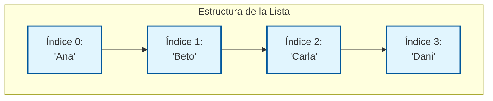
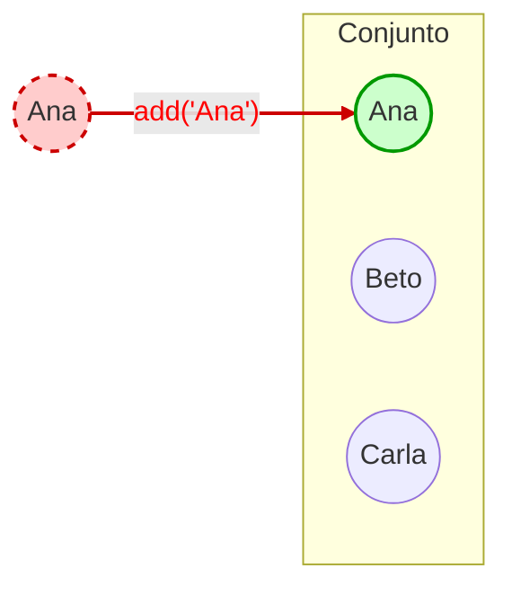
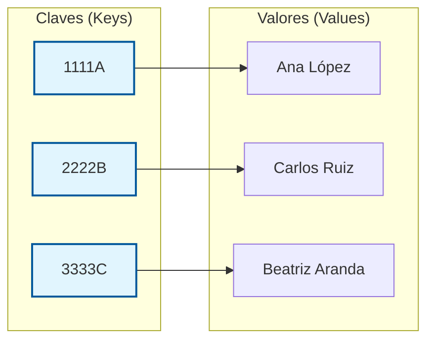

# Unidad 4. Estructuras de datos dinámicas

| Fecha      | Versión | Descripción                                                  |
| ---------- | ------- | ------------------------------------------------------------ |
| 15/10/2021 | 1.0.0   | Versión inicial                                              |
| 23/11/2025 | 2.0.0   | **Versión revisada:** Ejemplos funcionales completos y profundización en Mapas. |

## 1. Introducción: Limitaciones del Almacenamiento Estático

### 1.1. Estructuras Estáticas (Arrays)

En el desarrollo de software profesional, la gestión de datos rara vez es predecible. Hasta ahora, hemos utilizado **Arrays**, que son estructuras de almacenamiento **estático**. Esto implica que su tamaño se define en tiempo de compilación o inicialización y no puede modificarse durante la ejecución.

* **Ventajas:**

    * **Rendimiento extremo:** Acceso directo a memoria y muy ligeros.
    * **Simplicidad:** Ideales cuando sabemos *exactamente* cuántos datos vamos a manejar (ej: días de la semana, meses del año).

* **El problema del Array:**
  
    * **Rigidez:** Si declaramos `int[] datos = new int[10];`, estamos limitados a 10 elementos. No se pueden redimensionar. Si te quedas corto, el programa falla (`ArrayIndexOutOfBoundsException`).
    * **Ineficiencia:** Si solo usamos 2 posiciones, desperdiciamos memoria reservada para las otras 8.
    * **Complejidad de gestión:** Insertar un elemento en medio requiere mover manualmente todos los elementos posteriores.

En programación, la forma en que almacenamos y organizamos los datos determina la eficiencia y la flexibilidad de nuestras aplicaciones.

### 1.2. Estructuras Dinámicas (Colecciones)

Para resolver estos problemas, Java proporciona el **Java Collection Framework (JCF)**. Este conjunto de clases e interfaces permite gestionar grupos de objetos de forma **dinámica**, adaptando el uso de memoria a las necesidades del programa en tiempo de ejecución.

* **Ventajas:**
    * **Flexibilidad total:** Crecen y decrecen según la necesidad.
    * **Potencia:** Incluyen algoritmos ya programados para buscar, ordenar, barajar, invertir, etc.
    * **Abstracción:** Nos olvidamos de la gestión de memoria de bajo nivel.
  
* **Desventajas:**
    * **Mayor consumo de memoria:** Tienen una pequeña sobrecarga (overhead) por ser objetos complejos.
    * **Tipado:** Solo trabajan con Objetos (requieren Wrappers para tipos primitivos), lo que añade un pequeñísimo coste de procesamiento.

---

## 2. Java Collection Framework (JCF)

Java no nos deja solos con la tarea de programar estructuras dinámicas. Nos ofrece el **Java Collection Framework (JCF)**, una arquitectura unificada para representar y manipular colecciones.

El JCF no es solo "una lista de clases". Es un diseño de ingeniería de software basado en tres pilares:

1. **Interfaces:** Definen **QUÉ** se puede hacer (el contrato). Ej: `List`, `Set`, `Map`. Nos permiten programar contra abstracciones (ej: "necesito una Lista", sin importar si es `ArrayList` o `LinkedList`).
2. **Implementaciones:** Son las clases concretas que definen **CÓMO** se hace. Ej: `ArrayList`, `HashSet`. Cada una tiene características de rendimiento diferentes.
3. **Algoritmos:** Métodos polimórficos reutilizables (ordenar, buscar, copiar) que funcionan sobre las interfaces.

### 2.1 La Jerarquía Principal

La interfaz raíz es **`Collection`**, de la que descienden las principales familias (aunque `Map` no hereda de ella):

* **`List`** (Listas): Define una colección ordenada que permite elementos duplicados.
* **`Set`** (Conjuntos): Colección no ordenada (generalmente), **NO permiten duplicados**.
* **`HashSet`** (Mapas): Almacenan elementos individuales que asocia una *clave* con un *valor*. Las claves no pueden estar duplicadas.
* **`Queue`** (Colas): Estructuras FIFO (First In, First Out).
* **`Stack`** (Pilas): Estructuras LIFO (Last In, First Out).
* **`SortedSet`**: Conjuntos ordenados.

### 2.2. Métodos de la Interfaz Collection

El JCF está diseñado en base a **Interfaces**, que definen el comportamiento, y **Clases**, que implementan ese comportamiento.

La interfaz raíz es **`Collection`**, que define las operaciones básicas comunes a casi todas las estructuras de datos dinámicas (excepto los Mapas, que tienen su propia jerarquía).

Cualquier clase que implemente `Collection` (como `ArrayList` o `HashSet`) garantiza la disponibilidad de estos métodos:

| Método | Descripción Técnica |
| :--- | :--- |
| `int size()` | Retorna el número de elementos almacenados. |
| `boolean isEmpty()` | Retorna `true` si la colección no contiene elementos. |
| `boolean add(E e)` | Asegura que la colección contiene el elemento especificado. Retorna `true` si la colección cambió. |
| `boolean remove(Object o)` | Elimina una instancia del elemento especificado si está presente. |
| `boolean contains(Object o)`| Retorna `true` si la colección contiene el elemento especificado. |
| `void clear()` | Elimina todos los elementos de la colección. |

### 2.3. Algoritmos de la clase Collections (¡No confundir con `Collection`!)

Java proporciona una clase de utilidad llamada **`Collections`** (plural, con "s" al final) que contiene métodos estáticos muy potentes para operar sobre las colecciones. Son como la "navaja suiza" del framework.

Estos son los tres más utilizados:

* **`Collections.sort(List lista)`**: Ordena una lista en orden ascendente (natural). Si es de números, de menor a mayor; si es de Strings, alfabéticamente.
* **`Collections.max(Collection col)`**: Busca y devuelve el elemento máximo de la colección.
* **`Collections.min(Collection col)`**: Busca y devuelve el elemento mínimo.

---

## 3. Fundamentos: Clases Wrapper y Tipos Genéricos

Antes de abordar las colecciones, debemos comprender una restricción fundamental de la arquitectura de Java:

!!! danger "Cuidado"
    Las Colecciones en Java solo pueden almacenar referencias a **OBJETOS, no tipos primitivos.**

Esto significa que no podemos crear un `ArrayList` directamente de tipos `int`, `double` o `boolean`. Para solucionar esto, Java utiliza las **Clases Wrapper** (Envoltorios).

### 3.1. Clases Wrapper (Envoltorios)

Cada tipo primitivo tiene una clase correspondiente que "envuelve" su valor en un objeto. Esto permite que los valores primitivos sean tratados como objetos y almacenados en colecciones.

| Tipo Primitivo | Clase Wrapper (Objeto) |
| :------------- | :--------------------- |
| `int`          | `Integer`              |
| `double`       | `Double`               |
| `char`         | `Character`            |
| `boolean`      | `Boolean`              |

### 3.2. Autoboxing y Unboxing

Java facilita la conversión entre primitivos y Wrappers mediante dos mecanismos automáticos del compilador:

* **Autoboxing:** Conversión automática de un tipo primitivo a su objeto Wrapper correspondiente.
* **Unboxing:** Conversión automática de un objeto Wrapper a su tipo primitivo.

```java
import java.util.ArrayList;

public class EjemploWrapper {
    public static void main(String[] args) {
        // Declaración correcta usando el Wrapper Integer
        ArrayList<Integer> numeros = new ArrayList<>();

        // AUTOBOXING: El compilador convierte el primitivo 10 a new Integer(10)
        numeros.add(10); 

        // UNBOXING: El compilador extrae el int del objeto Integer automáticamente
        int valor = numeros.get(0); 
        
        System.out.println("Valor recuperado: " + valor);
    }
}
```

---

## 4. Listas: Secuencias Ordenadas

La interfaz **`List`** es, con diferencia, la estructura más utilizada en el día a día del desarrollo. Si vienes del mundo de los arrays, la Lista es su evolución natural y supervitaminada.

### 4.1. ¿Qué es una Lista?

Una Lista es una **colección ordenada** (una secuencia). Imagínala como una "Lista de la Compra" o una "Lista de Reproducción" de Spotify:

1. **El Orden Importa:** Si añades "Pan", luego "Leche" y luego "Huevos", se guardan en ese orden exacto. El "Pan" es el primero (índice 0), la "Leche" el segundo (índice 1), etc.
2. **Admite Duplicados:** Puedes tener "Leche" dos veces en tu lista si necesitas comprar dos cartones. A la lista no le importa que el contenido sea igual, son dos elementos distintos en posiciones distintas.
3. **Acceso por Posición:** Puedes decir "dame el tercer elemento" (`get(2)`) o "borra el primer elemento" (`remove(0)`).

### 4.2. ¿Para qué la usamos?

Usamos listas siempre que necesitemos agrupar elementos y nos importe el orden en que están, o necesitemos acceder a ellos por su posición numérica.

* Una lista de alumnos en una clase.
* El historial de páginas visitadas en un navegador.
* Los mensajes de un chat (ordenados cronológicamente).

### 4.3. Implementaciones: ArrayList vs LinkedList

Aunque hay varias, en el 99% de los casos usarás una de estas dos:

* **`ArrayList`:** Internamente usa un **array**. Es rapidísima para leer (`get`), pero si insertas algo en medio, tiene que mover todos los elementos siguientes un paso a la derecha. **Es la opción por defecto.**
* **`LinkedList`:** Internamente es una cadena de **nodos enlazados**. Es rápida insertando en medio, pero lenta para leer porque tiene que recorrer la cadena nodo a nodo.

### 4.4. Métodos Principales de `List`

A continuación, tienes las herramientas que usarás constantemente. Supongamos una lista llamada `lista`.

| Método | Descripción | Ejemplo de Código |
| :--- | :--- | :--- |
| **`add(E elemento)`** | Añade el elemento al **final** de la lista. | `lista.add("Java");` |
| **`add(int index, E e)`** | Inserta el elemento en la **posición indicada**, desplazando al resto. | `lista.add(0, "Python");` |
| **`get(int index)`** | Devuelve el elemento que está en esa posición. | `String s = lista.get(1);` |
| **`set(int index, E e)`** | **Sustituye** el elemento de esa posición por uno nuevo. | `lista.set(1, "C++");` |
| **`remove(int index)`** | Elimina el elemento de esa posición y "cierra el hueco". | `lista.remove(0);` |
| **`remove(Object o)`** | Busca el primer elemento igual a ese y lo borra. | `lista.remove("Java");` |
| **`size()`** | Devuelve el número de elementos actuales. | `int n = lista.size();` |
| **`contains(Object o)`** | Devuelve `true` si la lista contiene ese elemento. | `boolean b = lista.contains("C++");` |
| **`indexOf(Object o)`** | Devuelve el índice de la primera aparición (o -1 si no está). | `int pos = lista.indexOf("C++");` |
| **`clear()`** | Vacía la lista por completo. | `lista.clear();` |

### 4.5. Visualizando una Lista

Este diagrama muestra cómo una lista (`ArrayList`) gestiona sus elementos y sus índices. Observa que los índices siempre son consecutivos (0, 1, 2...).



### 4.6. Manejo básico de una lista

* **Instanciación de una Lista**: Para comenzar a trabajar con listas, lo primero que tenemos que saber es cómo instanciarlas (declararlas).
* **Añadir elementos a una lista**: Para añadir elementos al final de una lista usaremos el método `add`. Ten en cuenta que el **wrapper** tiene que ser el mismo que usamos en la instanciación.

```java
import java.util.ArrayList;

public class EjemploLista {
    public static void main(String[] args) {
        
        // Instanciación de un ArrayList de Strings
        ArrayList<String> miLista = new ArrayList<>();

        // Añadimos elementos a la lisda de manera ordenada
        miLista.add("Ana");
        miLista.add("Beto");
        miLista.add("Carla");
        miLista.add("Dani");
    }
}
```

* **Iteración de una lista** (recorrer elementos): Usaremos un bucle `for` pero de una manera ligeramente distinta a la que hemos visto hasta ahora. `for( [tipo_dato] nombre_elemento : nombre_lista ) {}`.

```java
import java.util.ArrayList;

public class EjemploLista {
    public static void main(String[] args) {
        
        // Instanciación de un ArrayList de Strings
        ArrayList<String> miLista = new ArrayList<>();

        // Añadimos elementos a la lisda de manera ordenada
        miLista.add("Ana");
        miLista.add("Beto");
        miLista.add("Carla");
        miLista.add("Dani");

        // Iteración de una lista
        System.out.println("\n--- RECORRER ELEMENTOS DE UNA LISTA ---");
        for (String elemento : miLista) {
            System.out.println("- " + elemento);
        }
    }
}
```

Si lanzamos la ejecución del programa, la **salida estándar por pantalla** es la siguiente:

```bash
--- RECORRER ELEMENTOS DE UNA LISTA ---
- Ana
- Beto
- Carla
- Dani
```

### 4.7. Ejemplo Funcional: Gestión de Inventario con ArrayList

A continuación, vamos a ver un ejemplo funcional con la mayoría de métodos de uso de una lista. Queremos un *Gestor de inventario* que realice las principales operaciones *CRUD (Create, Read, Update, Delete)*:

* **Crear**: Añadir un elemento a la lista.
* **Leer**: Accedemos a un elemento de una lista (según posición).
* **Actualizar**: Modificamos el valor de un elemento en una posición.
* **Eliminar**: Borramos un elemento. Podemos hacerlo por su *valor* o por su *posición*.

También haremos uso de operaciones de utilidad:

* `isEmpty()`: Indica si la lista está vacía o no.
* `size()`: Devuelve el tamaño de la lista
* `contains([elemento])`: Indica si un elemento está o no en la lista.

!!! note "🔎 Comprobación"
    Comprueba el funcionamiento del programa. **Copia el código y ejecútalo** en tu entorno para comprender cómo funciona.

```java
import java.util.ArrayList;
import java.util.Collections; // Utilidad para ordenar

public class GestorInventario {
    public static void main(String[] args) {
        // Instanciación de un ArrayList de Strings
        ArrayList<String> inventario = new ArrayList<>();

        // 1. Operaciones CRUD (Create, Read, Update, Delete)
        
        // CREATE: Añadir elementos
        inventario.add("Martillo");
        inventario.add("Destornillador");
        inventario.add("Taladro");
        inventario.add(0, "Sierra"); // Insertar al inicio (desplaza el resto)

        // READ: Acceso posicional
        System.out.println("Elemento en índice 2: " + inventario.get(2));

        // UPDATE: Modificar elementos
        inventario.set(1, "Martillo Neumático"); // Reemplaza "Martillo"

        // DELETE: Eliminar elementos
        inventario.remove("Taladro"); // Por objeto
        inventario.remove(0);         // Por índice ("Sierra")

        // 2. Operaciones de Utilidad
        System.out.println("¿Está vacío? " + inventario.isEmpty());
        System.out.println("Total de artículos: " + inventario.size());
        
        if (inventario.contains("Destornillador")) {
            System.out.println("El inventario contiene Destornillador.");
        }

        // Ordenación (usando la clase de utilidad Collections)
        Collections.sort(inventario);

        // 3. Iteración
        System.out.println("\n--- Inventario Actualizado ---");
        for (String articulo : inventario) {
            System.out.println("- " + articulo);
        }
    }
}
```

!!! example "Vamos a pornerlo en práctica"
    Vamos a comenzar a crear un ejemplo. Crea un **programa** con una lista de *Videojuegos* que implemente y pruebe las operaciones **CRUD** que hemos visto.

### 4.8. Operaciones Especiales: Inserción y Borrado Condicional

Antes de ver el ejemplo completo, es importante entender dos operaciones que distinguen a las listas de los arrays:

**A. Inserción en medio de la lista**
A diferencia de los arrays, donde insertar un dato en medio requiere mover manualmente todos los elementos siguientes, las listas tienen un método mágico: `add(int index, E element)`.

* **¿Qué hace?** Hace un hueco en la posición `index`, inserta el nuevo dato y desplaza automáticamente todos los elementos posteriores una posición a la derecha.
* **Ejemplo:** Si tienes `[A, C]` y haces `lista.add(1, "B")`, la lista pasa a ser `[A, B, C]`.

**B. Borrado Condicional (El peligro del bucle `for`)**
Borrar elementos de una lista mientras la recorres es una de las fuentes de errores más comunes en Java.

* **El Problema:** Si usas un bucle `for` o `for-each` y borras un elemento (`lista.remove(i)`), el tamaño de la lista cambia instantáneamente y los índices se mueven. Esto suele provocar que te saltes elementos o que el programa falle con una `ConcurrentModificationException`.
* **La Solución:** Para borrar de forma segura mientras recorres, debes usar un **Iterador** (`Iterator`). El iterador es un objeto que sabe "caminar" sobre la lista y tiene un método `remove()` seguro que mantiene la integridad de la estructura.

#### Ejemplo Funcional: Gestor de Notas

Vamos a ver un programa completo que gestiona las notas de una clase aplicando estos conceptos. Fíjate en cómo insertamos una nota olvidada en medio de la lista y cómo borramos los suspensos de forma segura.

```java
import java.util.ArrayList;
import java.util.Collections; // Utilidad para ordenar, máximo, mínimo...
import java.util.Iterator;    // Importante para el borrado seguro

public class GestionNotas {

    public static void main(String[] args) {
        // 1. Creación de la lista (vacía al principio)
        ArrayList<Double> notas = new ArrayList<>();
        double max = 0, min = 0;
        
        Double nota;

        // 2. Añadir datos al final (add)
        System.out.println("--- Añadiendo notas ---");
        notas.add(6.5);
        notas.add(4.2);
        notas.add(8.9);
        notas.add(5.0);
        notas.add(9.7);
        System.out.println("Notas iniciales: " + notas);

        // 3. INSERCIÓN EN MEDIO (add con índice)
        // Imaginemos que se nos olvidó una nota y debe ir en la segunda posición (índice 1)
        System.out.println("\n--- Insertando nota olvidada ---");
        notas.add(1, 7.5); 
        // Ahora el 4.2 (que estaba en índice 1) se ha movido al 2
        System.out.println("Notas tras inserción: " + notas);

        // 4. Operaciones de lectura y cálculo
        System.out.println("\n--- Estadísticas ---");
        System.out.println("Total de exámenes: " + notas.size());
        
        max = Collections.max(notas);
        min = Collections.min(notas);
        
        System.out.println("Nota más alta: " + max);
        System.out.println("Nota más baja: " + min);

        // 5. BORRADO CONDICIONAL (Uso de Iterator)
        // Queremos borrar TODAS las notas suspensas (menores que 5)
        System.out.println("\n--- Eliminando suspensos ---");
        
        // Creamos el iterador
        Iterator<Double> it = notas.iterator();
        
        while(it.hasNext()) {         // Mientras queden elementos por visitar...
            nota = it.next();  // ...dame el siguiente
            
            if (nota < 5.0) {
                it.remove();          // ¡BORRADO SEGURO! El iterador gestiona el hueco
                System.out.println("Eliminada nota: " + nota);
            }
        }
        
        // 6. Resultado final
        System.out.println("\n--- Lista de Aprobados ---");
        System.out.println(notas);
    }
}
```

**Salida esperada del programa:**

```text
--- Añadiendo notas ---
Notas iniciales: [6.5, 4.2, 8.9, 5.0, 9.7]

--- Insertando nota olvidada ---
Notas tras inserción: [6.5, 7.5, 4.2, 8.9, 5.0, 9.7]

--- Estadísticas ---
Total de exámenes: 6
Nota más alta: 9.7
Nota más baja: 4.2

--- Eliminando suspensos ---
Eliminada nota: 4.2

--- Lista de Aprobados ---
[6.5, 7.5, 8.9, 5.0, 9.7]
```

---

## 5. Conjuntos (Set): Unicidad Garantizada

La interfaz **`Set`** modela la abstracción matemática de un conjunto. Su característica definitoria es que **NO permite elementos duplicados**.

* **Sin orden (generalmente):** No garantiza que los elementos se guarden en el orden en que se insertaron.
* **Sin acceso posicional:** No existe el método `get(i)`. No puedes pedir "el tercer elemento", porque no hay un orden secuencial fijo.

**¿Cuándo usar un Set?**

Úsalo cuando necesites garantizar unicidad: lista de correos para no enviar spam duplicado, DNI de usuarios, matrículas de coches en un parking, etc.

### 5.1. Implementaciones Principales

1. **`HashSet`**: Es la más rápida y utilizada. No garantiza ningún orden. Usa una tabla hash interna.
2. **`TreeSet`**: Ordena los elementos automáticamente (por orden natural o comparador). Es más lento al insertar porque tiene que ordenar.
3. **`LinkedHashSet`**: Mantiene el orden de inserción, pero es un poco más lento que `HashSet`.

### 5.2. Visualizando un Conjunto (Diagrama)

En este diagrama vemos cómo funciona un **Conjunto (`HashSet`)**:

1. Los elementos no tienen una posición fija (índice).
2. Si intentamos añadir un duplicado (ej: 'Ana'), el conjunto lo rechaza y se mantiene igual.



> *Nota: La línea discontinua roja indica que la inserción del duplicado es rechazada.*

### 5.3. Métodos Principales de `Set`

Supongamos un conjunto llamado `conjunto`.

| Método | Descripción | Ejemplo de Código |
| :--- | :--- | :--- |
| **`add(E elemento)`** | Añade el elemento si no existe. Devuelve `true` si lo añadió, `false` si ya estaba. | `boolean exito = conjunto.add("Ana");` |
| **`remove(Object o)`** | Elimina el elemento si existe. Devuelve `true` si lo eliminó. | `conjunto.remove("Beto");` |
| **`size()`** | Devuelve el número de elementos únicos. | `int n = conjunto.size();` |
| **`contains(Object o)`** | Devuelve `true` si el conjunto contiene ese elemento. | `boolean b = conjunto.contains("Carla");` |
| **`isEmpty()`** | Devuelve `true` si el conjunto está vacío. | `boolean b = conjunto.isEmpty();` |
| **`clear()`** | Elimina todos los elementos. | `conjunto.clear();` |

### 5.4. Ejemplo Funcional: Invitados a una Fiesta

!!! note "🔎 Comprobación"
    Comprueba el funcionamiento del programa. **Copia el código y ejecútalo** en tu entorno para comprender cómo funciona.

```java
import java.util.HashSet;
import java.util.Set;

public class FiestaPrivada {
    public static void main(String[] args) {
        // Usamos la interfaz Set para la referencia (Buenas prácticas)
        Set<String> invitados = new HashSet<>();
        boolean agregado;

        // 1. Añadir invitados
        invitados.add("Ana");
        invitados.add("Borja");
        invitados.add("Clara");

        // INTENTO DE DUPLICADO:
        // El método add devuelve 'false' si el elemento ya existía.
        agregado = invitados.add("Ana");

        System.out.println("¿Se ha añadido a Ana otra vez? ");
        if(!agregado) { // false
            System.out.println("No se ha podido agregar porque ya estaba");
        } else {
            System.out.println("Se ha podido agregar");
        }

        // 2. Comprobar existencia
        if (invitados.contains("Borja")) {
            System.out.println("Borja está en la lista.");
        }

        // 3. Eliminar
        invitados.remove("Clara");

        // 4. Recorrer (Solo con for-each o iterador, no hay índice)
        System.out.println("\n--- Lista Final (" + invitados.size() + ") ---");
        for (String nombre : invitados) {
            System.out.println("- " + nombre);
        }
    }
}
```

!!! example "Vamos a pornerlo en práctica"
    Vamos a crear un programa que use conjuntos. El **programa** definirá un conjunto de *Frutas* que implemente y pruebe las operaciones de conjuntos (`Set`) que hemos visto.

---

## 6. Mapas: Estructuras Asociativas (Clave-Valor)

La interfaz **`Map`** es una de las estructuras más potentes y utilizadas. A diferencia de las Listas y Conjuntos, un Mapa no guarda elementos sueltos, sino que establece una relación entre dos objetos: una **Clave** (Key) y un **Valor** (Value).

### 6.1. ¿Qué es un Mapa? (La analogía del Diccionario)

Imagina un **diccionario de inglés**:

* Buscas una palabra (**Clave**) -> Encuentras su definición (**Valor**).
* O una **agenda telefónica**: Buscas un nombre (**Clave**) -> Encuentras su número (**Valor**).
* O una **base de datos de empleados**: Buscas por DNI (**Clave**) -> Obtienes la ficha del empleado (**Valor**).

**Reglas de Oro de los Mapas:**

1. **Claves Únicas:** No puede haber dos claves iguales (no puede haber dos entradas para la palabra "House" en el diccionario). Si añades una clave que ya existe, **sobrescribes** el valor anterior.
2. **Valores Repetidos:** Sí puede haber valores repetidos (varias personas pueden vivir en la misma ciudad).
3. **Acceso Rápido:** Los mapas están optimizados para encontrar el valor rápidamente si conoces la clave.

### 6.2. Visualizando un Mapa (Diagrama)

En este diagrama vemos cómo las claves actúan como un índice único para acceder a los valores.



### 6.3. Implementación Principal: HashMap

La interfaz **`Map`** no hereda de `Collection`, pero es parte fundamental del framework. Modela el concepto de "diccionario".

* **Estructura:** Almacena pares `(Key, Value)`.
* **Unicidad:** Las claves (**Keys**) son únicas.
* **Acceso:** Los datos se recuperan por clave.

`HashMap` es la implementación estándar. No garantiza ningún orden específico de las claves.

### 6.4. Métodos Principales de `Map`

Supongamos un mapa llamado `mapa` que asocia DNI (String) con Nombre (String).

| Método | Descripción | Ejemplo de Código |
| :--- | :--- | :--- |
| **`put(K key, V value)`** | Añade una pareja o **actualiza** el valor si la clave ya existía. | `mapa.put("123A", "Pepe");` |
| **`get(Object key)`** | Devuelve el valor asociado a la clave, o `null` si no existe. | `String nombre = mapa.get("123A");` |
| **`remove(Object key)`** | Elimina la pareja asociada a esa clave. | `mapa.remove("123A");` |
| **`containsKey(Object key)`** | Devuelve `true` si la clave existe en el mapa. | `boolean existe = mapa.containsKey("123A");` |
| **`keySet()`** | Devuelve un `Set` con todas las **claves**. | `Set<String> claves = mapa.keySet();` |
| **`values()`** | Devuelve una `Collection` con todos los **valores**. | `Collection<String> nombres = mapa.values();` |
| **`entrySet()`** | Devuelve un `Set` de objetos `Map.Entry` (parejas clave-valor). Ideal para recorrer. | `Set<Map.Entry<String, String>> pares = mapa.entrySet();` |
| **`size()`** | Devuelve el número de parejas almacenadas. | `int n = mapa.size();` |
| **`clear()`** | Vacía el mapa. | `mapa.clear();` |

### 6.5. Ejemplo Funcional: Censo de Población

!!! note "🔎 Comprobación"
    Comprueba el funcionamiento del programa. **Copia el código y ejecútalo** en tu entorno para comprender cómo funciona.

```java
import java.util.HashMap;
import java.util.Map;

public class CensoPoblacion {
    public static void main(String[] args) {
        HashMap<String, String> censo = new HashMap<>();

        // 1. Inserción (put)
        censo.put("1111A", "Ana López");
        censo.put("2222B", "Carlos Ruiz");
        
        // Sobrescritura si la clave existe
        censo.put("1111A", "Ana López García"); 

        // 2. Recuperación (get)
        System.out.println("Nombre: " + censo.get("2222B"));

        // 3. Recorrido eficiente
        for (Map.Entry<String, String> entrada : censo.entrySet()) {
            System.out.println("DNI: " + entrada.getKey() + " -> " + entrada.getValue());
        }
    }
}
```

!!! example "Vamos a pornerlo en práctica"
    Vamos a crear un programa que maneje un diccionario, mapa o `HashMap` que almacene pares *clave-valor*. El **programa** definirá un diccionario de *Coches* que asociará cada *matrícula* con su *modelo de coche*. Recuerda que los *valores* **pueden repetirse** pero las *claves* **no**.
