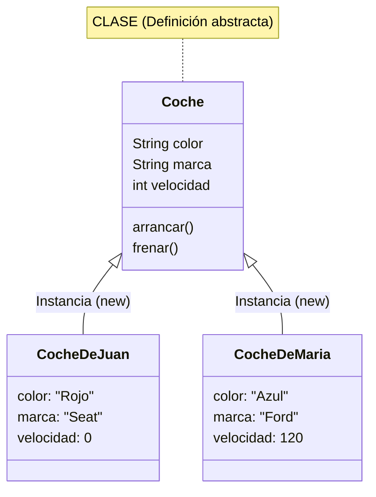
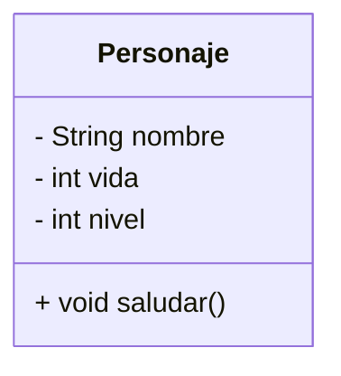
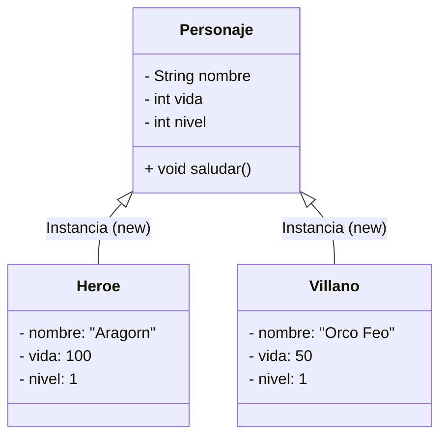
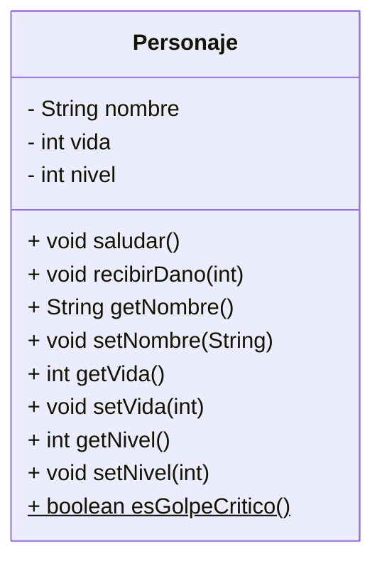
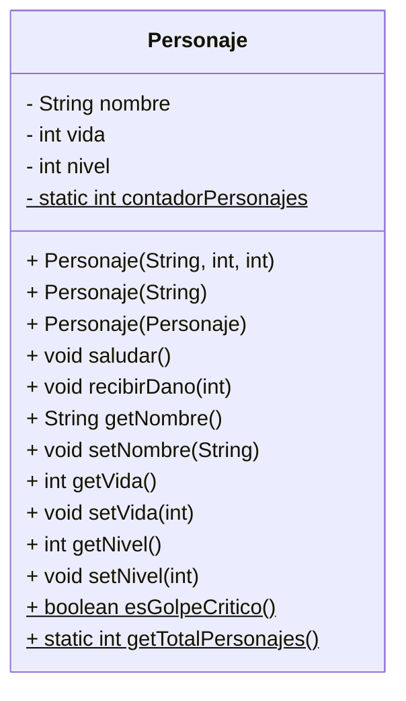

# Unidad 5. Programación Orientada a Objetos (POO)

## 1. Introducción: Pensando en Objetos

La **Programación Orientada a Objetos (POO)** no es solo una sintaxis nueva; es un **paradigma de programación**. Un paradigma es un modelo o estilo fundamental de desarrollo de software.

Hasta ahora, has programado bajo el **paradigma estructurado** (o procedimental). En este enfoque, los datos (variables) y las acciones (funciones) están separados. El programador es como un cocinero que sigue una receta paso a paso: "coge estos huevos, bátelos, añade sal". Si el programa crece, terminamos con miles de variables sueltas y funciones que las modifican sin control, generando un código difícil de mantener ("código espagueti").

La POO propone un cambio radical: **modelar el software basándonos en las cosas (objetos) que existen en el problema real**. En lugar de separar datos y lógica, los empaquetamos juntos en unidades llamadas **Objetos**.

!!! info "Documentación oficial"
    **Java** pertenece a la conocida empresa **Oracle**. Puedes consultar la [documentación oficial de Oracle](https://docs.oracle.com/javase/tutorial/java/javaOO/index.html) para ampliar tu conocimiento sobre **Programación Orientada a Objetos**.

### 1.1. Conceptos Fundamentales: La Tríada del Objeto

Para que algo sea considerado un objeto en este paradigma, debe cumplir con tres características esenciales que le dan sentido y autonomía:

1. **Identidad:** Es la propiedad que permite distinguir un objeto de otro, incluso si sus contenidos son idénticos. En la vida real, dos monedas de un euro son iguales, pero son dos objetos distintos (tienen identidad propia). En Java, esta identidad la gestiona la referencia de memoria.
2. **Estado (Atributos):** Son los datos que caracterizan al objeto en un momento dado. Representan las propiedades o características (ej: color, tamaño, velocidad actual).
3. **Comportamiento (Métodos):** Son las acciones que el objeto puede realizar o las respuestas que puede dar ante mensajes de otros objetos (ej: frenar, cambiar de color, calcular total).

### 1.2. Clase vs. Objeto: La Abstracción

Es vital distinguir entre el concepto abstracto y la realidad concreta.

* **La Clase (El plano):** Es la definición abstracta, el plano o la plantilla. Define qué atributos y métodos tendrán los objetos, pero **no contiene datos concretos** ni ocupa memoria de ejecución para almacenarlos.
* **El Objeto (La Instancia):** Es la concreción de la clase. Es un elemento tangible en la memoria del ordenador que se ha creado a partir de la clase.



### 1.3. Ejemplos de Abstracción en la Vida Real

El proceso de diseñar clases se llama **abstracción**: consiste en observar un objeto real, ignorar los detalles irrelevantes y quedarse solo con las características importantes para nuestro programa.

Veamos cómo modelaríamos diferentes objetos cotidianos en clases de Java:

#### A. Una Lámpara

Si queremos programar un sistema de domótica, no nos importa de qué material es la bombilla, solo si está encendida o no.

* **Estado (Atributos):** `estaEncendida` (boolean), `intensidad` (int).
* **Comportamiento (Métodos):** `encender()`, `apagar()`, `regularIntensidad(int nivel)`.

#### B. Una Cuenta Bancaria

Para un banco, tu cuenta es un objeto digital.

* **Estado:** `numeroCuenta` (String), `saldo` (double), `titular` (String).
* **Comportamiento:** `ingresar(double cantidad)`, `retirar(double cantidad)`, `consultarSaldo()`.

#### C. Un Enemigo de Videojuego

Para un juego de rol.

* **Estado:** `puntosVida` (int), `fuerzaAtaque` (int), `tipoArma` (String).
* **Comportamiento:** `atacar(Personaje objetivo)`, `recibirDano(int cantidad)`, `gritar()`.

---

## 2. Clases y Objetos: El Plano y la Casa

Para entender la diferencia fundamental entre estos dos conceptos, usaremos una analogía arquitectónica:

* **La Clase es el Plano (Blueprints):**

    * El arquitecto dibuja un plano detallado. En él especifica dónde van las ventanas, de qué material son las paredes y cuántas habitaciones hay.
    * Pero **nadie puede vivir en un plano**. El plano es solo papel (o un archivo digital). No tiene paredes físicas, ni techo, ni ocupa un lugar en la calle. Es pura información.

* **El Objeto es la Casa Construida:**

    * Usando ese **mismo plano**, una constructora puede edificar 50 casas en una urbanización.
    * Cada casa es una **instancia** del plano.
    * Aunque todas se hicieron con el mismo plano, cada casa es independiente:
        * En la Casa Nº 1 pueden pintar las paredes de azul.
        * En la Casa Nº 2 pueden tener las luces encendidas.
        * Si se rompe una ventana en la Casa Nº 3, no se rompe en la Casa Nº 4.

En programación:

* **La Clase** define la estructura.
* **El Objeto** ocupa memoria y tiene sus propios valores.

### 2.1. Definición de una Clase en Java

Una clase se define con la palabra reservada `class`. Por convención, **los nombres de las clases siempre empiezan por Mayúscula**.

Vamos a crear nuestro hilo conductor: un **Personaje de Videojuego**.

!!! note "🔎 Comprobación"
    Comprueba el funcionamiento del programa. **Copia el código y ejecútalo** en tu entorno para comprender cómo funciona.

```java
// Definición de la Clase (El Molde)
public class Personaje {
    
    // ATRIBUTOS (Estado - Datos)
    String nombre;
    int vida;
    int nivel;

    // MÉTODOS (Comportamiento - Acciones)
    void saludar() {
        System.out.println("¡Hola! Soy " + nombre + " y tengo nivel " + nivel);
    }
}
```

**Representación Visual (Diagrama de Clases UML):**

Así es como representamos esta clase en un diagrama profesional:



### 2.2. Instanciación: Creando Objetos

Para crear un objeto (una "casa") a partir de la clase, usamos el operador **`new`**.

```java
public class Main {
    public static void main(String[] args) {
        // Declaración y creación del Objeto 1
        Personaje heroe = new Personaje();
        
        // Accediendo a sus datos (¡Ojo! Aún no tienen valor, están vacíos)
        heroe.nombre = "Aragorn";
        heroe.vida = 100;
        heroe.nivel = 1;

        // Declaración y creación del Objeto 2
        Personaje villano = new Personaje();
        villano.nombre = "Orco Feo";
        villano.vida = 50;
        villano.nivel = 1;

        // Usando sus comportamientos
        heroe.saludar();   // Imprime: ¡Hola! Soy Aragorn...
        villano.saludar(); // Imprime: ¡Hola! Soy Orco Feo...
    }
}
```

**Diagrama de Instancias:**

Aquí podemos ver cómo, a partir de una única clase `Personaje`, hemos creado dos objetos independientes en la memoria, cada uno con sus propios valores.



!!! question "💻 Momento de Práctica: Tu primer Objeto"
    1. Crea una clase llamada `Coche` en un archivo `Coche.java`.
    2. Añádele atributos: `marca` (String), `modelo` (String) y `velocidad` (int).
    3. Crea un método `void infoCoche()` que muestre un mensaje con la información del modelo y la marca.
    4. En el `main`, crea dos coches distintos (ej: un Ferrari y un Seat, con sus modelos) y muestra su información.

---

## 3. Miembros de una Clase

Una clase se compone de dos tipos de miembros: Atributos y Métodos.

### 3.1. Atributos (Variables de Instancia)

Son las variables que guardan el estado de **cada objeto individualmente**. Cada objeto tiene su propia copia de estas variables.

* Si cambias la vida del `heroe`, la vida del `villano` NO cambia. Son independientes.

### 3.2. Métodos

Son las funciones que definen qué puede hacer el objeto. Pueden leer y modificar los atributos del propio objeto.

Vamos a ampliar nuestro **Personaje** con una nueva habilidad: `recibirDano(int puntos)`.

```java
// Así queda la clase Personaje ampliada
public class Personaje {
    String nombre;
    int vida;
    int nivel;

    void saludar() {
        System.out.println("¡Hola! Soy " + nombre + " y tengo nivel " + nivel);
    }

    // NUEVO MÉTODO: Lógica de combate
    void recibirDano(int puntos) {
        // Modificamos el atributo 'vida' de ESTE objeto
        vida = vida - puntos;
        
        // Comprobamos el estado tras el cambio
        if (vida <= 0) {
            vida = 0; // No dejamos que sea negativa
            System.out.println("[MUERTE] " + nombre + " ha sido derrotado.");
        } else {
            System.out.println("[DAÑO] " + nombre + " ha recibido " + puntos + " de daño. Vida restante: " + vida);
        }
    }
}
```

!!! question "💻 Momento de Práctica: ¡A la batalla!"
    Ahora te toca a ti probar este nuevo método. Vuelve a tu clase principal (`JuegoMain`) y modifica el código para simular una pelea:

    1. Copia el código nuevo del método `recibirDano` dentro de tu clase `Personaje`.
    2. En el `main`, haz que el `villano` reciba 30 puntos de daño.
    3. Luego, haz que reciba otros 50 puntos.
    4. ¿Qué pasa si recibe un golpe fatal de 100 puntos? Comprueba que sale el mensaje de derrota.

### 3.3. El Puntero `this`: ¿Quién soy yo?

En Java, cuando escribes código dentro de una clase, a veces necesitas referirte al propio objeto que está ejecutando el código, es decir, "MI atributo" o "MI método". Para eso usamos la palabra clave **`this`**.

* **`this`** es una referencia al **objeto actual** que está ejecutando el código.

Es muy útil para evitar ambigüedades cuando un parámetro se llama igual que un atributo. Esto se llama **Shadowing** (Sombreado).

```java
// Forma INCORRECTA (Ambigüedad)
void cambiarNombre(String nombre) {
    nombre = nombre; // ¿Cuál es cuál? Java asigna el parámetro a sí mismo. ¡No hace nada!
}

// Forma CORRECTA (Usando this)
void cambiarNombre(String nombre) {
    this.nombre = nombre; // "Mi atributo nombre" = "El parámetro nombre"
}
```

#### Aplicándolo a nuestro Personaje

Vamos a añadir un método para cambiar el nombre del personaje, usando `this` para diferenciar el atributo del parámetro.

```java
public class Personaje {
    String nombre;
    int vida;
    int nivel;

    // ... otros métodos ...

    // Método para renombrar al personaje
    void cambiarNombre(String nombre) {
        // Usamos 'this' para dejar claro que queremos modificar el atributo de la clase
        this.nombre = nombre; 
    }
}
```

!!! question "💻 Momento de Práctica: Ampliando el Coche"
    Vamos a mejorar tu clase `Coche`.

    1. Añade un método `void frenar(int cantidad)` que reduzca la velocidad en la *cantidad* correspondiente.
    2. Añade un método `void acelerar(int cantidad)` que acelere la velocidad en la *cantidad* dada.
    3. **Lógica:** El coche no puede tener velocidad negativa. Si al frenar baja de 0, la velocidad debe quedarse en 0 y mostrar un mensaje "¡Coche detenido!".
    4. **Lógica:** El coche no puede sobrepasar la velocidad máxima (por ejemplo 200). Si al acelerar pasa de 200, la velocidad debe quedarse en 200 y mostrar un mensaje "¡Velocidad máxima alcanzada!".
    5. Prueba a acelerar y frenar en el `main`.

---

## 4. Encapsulamiento y Visibilidad (La Caja Negra)

El **Encapsulamiento** es el principio fundamental de la POO que nos dice: **"Oculta los detalles internos y muestra solo lo que sea seguro usar"**.

### 4.1 ¿Por qué necesitamos proteger nuestros datos?

Imagina que estás conduciendo tu coche. Tienes acceso al volante, los pedales y la palanca de cambios (Interfaz Pública). Pero el fabricante del coche ha protegido el motor bajo un capó cerrado.

¿Qué pasaría si pudieras tocar los pistones del motor directamente mientras conduces?

1. **Integridad:** Podrías romper el motor sin querer.
2. **Seguridad:** Podrías hacerte daño.
3. **Complejidad:** Tendrías que saber mecánica avanzada solo para ir a comprar pan.

En programación ocurre lo mismo. Si dejas que cualquiera modifique la `vida` de tu personaje directamente (`heroe.vida = -5000`), tu programa podría romperse o comportarse de forma absurda (¡personajes zombies con vida negativa!).

En Java, usamos los **Modificadores de Acceso** para controlar esto:

* **`public`:** Acceso total. Es la "puerta abierta" de la clase.
* **`private`:** Acceso restringido. Solo la propia clase puede ver y tocar estos miembros.

**Regla de Oro:** Por defecto, los **atributos** deben ser siempre **`private`**.

### 4.2 Getters y Setters

Si hacemos los atributos privados, ¿cómo trabajamos con ellos? Usando métodos públicos controlados, conocidos como **Accessors**.

#### 1. El Setter (Método de Modificación)

Se usa para **asignar** un valor a un atributo privado.

* **Ventaja:** Nos permite validar el dato antes de guardarlo. Si el dato es incorrecto, podemos rechazarlo o corregirlo.
* *Analogía:* Es como el guardia de seguridad de una discoteca. No deja entrar a cualquiera.

#### 2. El Getter (Método de Lectura)

Se usa para **recuperar** el valor de un atributo privado.

* **Ventaja:** Nos permite controlar cómo se muestra el dato o incluso devolver un dato calculado.
* *Analogía:* Es como mirar a través de un cristal blindado. Puedes ver lo que hay, pero no tocarlo.

### 4.3. Métodos Ocultos (Privados)

A veces, una clase necesita realizar tareas internas complejas que no deben ser vistas ni usadas desde fuera. A estos métodos se les llama **Helpers** o métodos auxiliares, y se declaran como **`private`**.

Imagina un método que calcula si un golpe recibido es crítico. Solo la clase `Personaje` debe usarlo cuando recibe daño; nadie desde fuera debería poder llamar a `esGolpeCritico()` directamente.

```java
private boolean esGolpeCritico() {
    // Lógica interna compleja (ej: números aleatorios)
    return Math.random() > 0.95; // 5% de probabilidad
}
```

Si el `Personaje` recibe un *golpe crítico* (tiene un 5% de posibilidades de recibirlo), al daño recibido se le añade 10 puntos. Nuestro método `recibirDano` puede llamar **internamente** al nuevo método:

```java
    public void recibirDano(int puntos) {
        
        this.vida -= puntos;

        if(esGolpeCritico()) {
            this.vida = this.vida - 10;
            System.out.println("[GOLPE CRÍTICO] Recibe 10 ptos. extra de daño");
        }

        if (this.vida <= 0) {
            this.vida = 0;
            System.out.println("[GAME OVER] " + this.nombre + " ha muerto.");
        } else {
            System.out.println("[DAÑO] " + this.nombre + " tiene " + this.vida + " ptos. de vida");
        }
    }
```

### 4.4. Código Final de la Clase Personaje

Aquí tienes la versión profesional de nuestra clase `Personaje`, aplicando encapsulamiento, constructores y métodos.

!!! note "🔎 Comprobación"
    Comprueba el funcionamiento del programa. **Copia el código y ejecútalo** en tu entorno para comprender cómo funciona.

```java
public class Personaje {
    
    // 1. ATRIBUTOS (Privados para protegerlos)
    private String nombre;
    private int vida;
    private int nivel;

    // 2. MÉTODOS DE COMPORTAMIENTO
    public void saludar() {
        System.out.println("¡Hola! Soy " + this.nombre + " (Nv. " + this.nivel + ")");
    }

    public void recibirDano(int puntos) {
        
        this.vida -= puntos;

        if(esGolpeCritico()) {
            this.vida = this.vida - 10;
            System.out.println("[GOLPE CRÍTICO] Recibe 10 ptos. extra de daño");
        }

        if (this.vida <= 0) {
            this.vida = 0;
            System.out.println("[GAME OVER] " + this.nombre + " ha muerto.");
        } else {
            System.out.println("[DAÑO] " + this.nombre + " tiene " + this.vida + " ptos. de vida");
        }
    }

    // 3. HELPERS. Métodos privados

    private boolean esGolpeCritico() {
        // Lógica interna compleja (ej: números aleatorios)
        return Math.random() > 0.95; // 5% de probabilidad
    }

    // 4. GETTERS Y SETTERS (La Interfaz Pública)

    // Getter para el nombre
    public String getNombre() {
        return this.nombre;
    }

    // Setter para el nombre (podríamos validar que no sea vacío)
    public void setNombre(String nombre) {
        this.nombre = nombre;
    }

    // Getter para la vida
    public int getVida() {
        return this.vida;
    }

    // Setter INTELIGENTE para la vida
    public void setVida(int vida) {
        if (vida < 0) {
            System.out.println("Error: No se puede asignar vida negativa a " + this.nombre);
            this.vida = 0; // Corrección automática
        } else {
            this.vida = vida;
        }
    }

    // Getter para el nivel
    public int getNivel() {
        return this.nivel;
    }

    // Setter para el nivel
    public void setNivel(int nivel) {
        this.nivel = nivel;
    }
}
```

### 4.5. Diagrama de Clases UML (Encapsulado)

Observa cómo cambian los símbolos:

* `-` significa **private** (candado cerrado).
* `+` significa **public** (puerta abierta).



### 4.6. Ejemplo de Uso en el Main

Veamos cómo usamos esta clase segura. Fíjate que ya no podemos hacer `p.vida = -100`, el compilador no nos dejará.

```java
public class Main {
    public static void main(String[] args) {
        System.out.println("--- INICIO DEL JUEGO ---");

        // 1. Instanciación
        Personaje heroe = new Personaje();

        heroe.setNombre("Aragorn");
        heroe.setVida(100);
        heroe.setNivel(1);

        Personaje villano = new Personaje();

        villano.setNombre("Orco feo");
        villano.setVida(50);
        villano.setNivel(1);

        // 2. Uso de Getters para leer información
        System.out.println("El héroe se llama: " + heroe.getNombre());
        System.out.println("Vida actual: " + heroe.getVida());

        // 3. Intento de sabotaje (Asignar vida negativa)
        // heroe.vida = -500; // ¡ERROR DE COMPILACIÓN! No es visible.
        
        System.out.println("\n--- INTENTO DE TRAMPA ---");
        heroe.setVida(-999); // Usamos el setter
        System.out.println("Vida tras el intento: " + heroe.getVida()); // Sigue siendo 0, no -999

        // 4. Combate legal
        System.out.println("\n--- COMBATE ---");
        villano.recibirDano(60); // El método gestiona la lógica interna
    }
}
```

!!! question "💻 Momento de Práctica: Protegiendo tu Coche"
    Vuelve a tu clase `Coche`.

    1. Cambia la visibilidad de todos los atributos de la clase a `private`.
    2. Intenta acceder directamente desde el main (`miCoche.velocidad = 200`). Verás que da error.
    3. Crea un método `setVelocidad(int v)` que impida poner una velocidad negativa.
    4. Usa el setter en el main para probarlo.

---

## 5. Constructores: Naciendo con Estado

Hasta este momento, hemos creado nuestros objetos en dos pasos:

1. Los creábamos vacíos con `new Personaje()`.
2. Les dábamos valores línea a línea usando los *setters*.

**¿El problema?** Es un proceso propenso a errores humanos. ¿Qué pasa si creas un `Personaje` pero se te olvida ponerle nombre o vida? Tendrías un objeto "zombie" o incompleto circulando por tu programa, lo cual podría causar errores graves más adelante.

El **Constructor** es un método especial diseñado para solucionar esto. Se ejecuta **automáticamente** en el momento exacto de la creación del objeto (al usar `new`). Su misión es garantizar que el objeto nazca en un estado válido.

### 5.1. Características Técnicas

Para que un método sea un constructor, debe cumplir dos reglas estrictas:

1. Tener **exactamente el mismo nombre** que la clase.
2. **No tener tipo de retorno** (ni siquiera `void`). No devuelve nada, devuelve el objeto mismo.

### 5.2. Tipos de Constructores

#### A. El Constructor por Defecto (El Invisible)

Si tú no escribes *ningún* constructor en tu clase, Java te regala uno invisible y vacío: `public Personaje() {}`. Este es el que nos permitía hacer `new Personaje()` hasta ahora.

!!! warning "Importante"
    En el momento en que escribas TÚ un constructor (con parámetros), Java retira el constructor por defecto. Si quieres seguir usándolo, tendrás que escribirlo explícitamente.

#### B. Constructores con Parámetros

Son los más útiles. Nos obligan a pasar los datos necesarios para que el objeto exista.

```java
public class Personaje {
    private String nombre;
    private int vida;
    private int nivel;

    // Constructor: Obliga a dar un nombre, una vida y un nivel al nacer
    public Personaje(String nombre, int vida, int nivel) {
        this.nombre = nombre;
        this.setVida(vida); // ¡Buena práctica! Usar el setter para validar incluso al nacer
        this.nivel = nivel;
    }
}
```

Ahora, es **imposible** crear un personaje vacío. El compilador nos obligará a hacer: `new Personaje("Gandalf", 150, 5)`.

#### C. El Constructor de Copia

A veces necesitamos crear un objeto que sea una **copia exacta** de otro objeto que ya existe (un clon). Para eso usamos un constructor que recibe como parámetro un objeto de su misma clase.

```java
    // Constructor de Copia
    public Personaje(Personaje p) {
        this.nombre = p.nombre;
        this.vida = p.vida;
        this.nivel = p.nivel;
    }
```

### 5.3. Sobrecarga de Constructores (Overloading)

A veces queremos flexibilidad. Quizás queremos crear un personaje dando todos los datos, o quizás solo dando el nombre y asumiendo valores por defecto para el resto.

Podemos tener múltiples constructores siempre que sus **parámetros sean diferentes** (en cantidad o tipo).


### 5.4. Resultado Final: La Clase Personaje Profesional

Aquí tienes cómo queda nuestra clase integrando **Encapsulamiento** (atributos privados y getters/setters) y **Constructores**.

!!! note "🔎 Comprobación"
    Comprueba el funcionamiento del programa. **Copia el código y ejecútalo** en tu entorno para comprender cómo funciona.

```java
public class Personaje {
    
    // 1. ESTADO (Privado)
    private String nombre;
    private int vida;
    private int nivel;

    // 2. CONSTRUCTORES (Sobrecarga)

    // Opción A: Constructor completo (Control total)
    public Personaje(String nombre, int vida, int nivel) {
        this.nombre = nombre;
        this.setVida(vida); // Usamos setter para validar
        this.setNivel(nivel);
    }

    // Opción B: Constructor rápido (Valores por defecto)
    // Solo pide el nombre. Asume vida=100 y nivel=1.
    public Personaje(String nombre) {
        this.nombre = nombre;
        this.vida = 100;
        this.nivel = 1;
    }

    // Opción C: Constructor copia
    // Recibe otro personaje y copia sus atributos
    public Personaje(Personaje p) {
        this.nombre = p.nombre;
        this.vida = p.vida;
        this.nivel = p.nivel;
    }

    // 3. MÉTODOS (Comportamiento)
    public void saludar() {
        System.out.println("¡Hola! Soy " + this.nombre + " (Nv. " + this.nivel + ")");
    }

    public void recibirDano(int puntos) {
        
        this.vida -= puntos;

        if(esGolpeCritico()) {
            this.vida = this.vida - 10;
            System.out.println("[GOLPE CRÍTICO] Recibe 10 ptos. extra de daño");
        }

        if (this.vida <= 0) {
            this.vida = 0;
            System.out.println("[GAME OVER] " + this.nombre + " ha muerto.");
        } else {
            System.out.println("[DAÑO] " + this.nombre + " tiene " + this.vida + " ptos. de vida");
        }
    }

    // 4. HELPERS. Métodos privados

    private boolean esGolpeCritico() {
        // Lógica interna compleja (ej: números aleatorios)
        return Math.random() > 0.95; // 5% de probabilidad
    }

    // 5. GETTERS Y SETTERS
    public String getNombre() { return nombre; }
    public void setNombre(String nombre) { this.nombre = nombre; }

    public int getVida() { return vida; }
    public void setVida(int vida) {
        if (vida < 0) {
            System.out.println("Error: Vida negativa no permitida.");
            this.vida = 0;
        } else {
            this.vida = vida;
        }
    }

    public int getNivel() { return nivel; }
    public void setNivel(int nivel) { 
        if (nivel < 1) nivel = 1; // Mínimo nivel 1
        else this.nivel = nivel; 
    }
}
```

### 5.5. Uso en el Programa Principal

Fíjate cómo la creación de objetos ahora es mucho más robusta y limpia.

```java
public class Main {
    public static void main(String[] args) {
        
        // Usando el Constructor Completo
        Personaje heroe = new Personaje("Aragorn", 150, 10);
        
        // Usando el Constructor Rápido
        Personaje villano = new Personaje("Goblin"); // Vida 100, Nivel 1 automáticos

        heroe.saludar();
        villano.saludar();

        // Intento de crear un personaje vacío... ¡ERROR DE COMPILACIÓN!
        // Personaje fantasma = new Personaje(); // Java te dice: "¿Dónde están los datos?"

        // Personaje copia "clonamos" el villano

        Personaje villano2 = new Personaje(villano); // villano2 es una copia idéntica de villano
    }
}
```

!!! question "💻 Momento de Práctica: La Fábrica de Coches"
    Vamos a profesionalizar tu clase `Coche`.

    1.  Elimina cualquier inicialización manual que tuvieras en el `main`.
    2.  Crea un **Constructor Completo** que pida `marca`, `modelo` y `velocidad` (los datos los pedirá al usuario antes de llamar al constructor).
    3.  Crea un **Constructor Parcial** que solo pida `marca` y `modelo` (la velocidad debe iniciarse a 0).
    4.  Crea un **Constructor Copia**.
    5.  En el `main`, intenta crear un coche con `new Coche()`. ¿Qué ocurre?
    6.  Crea dos coches usando los dos constructores nuevos que has programado y muestra sus datos.
    7.  Copia en un tercer coche, el coche segundo.

---

## 6. Miembros Estáticos (`static`)

Hasta ahora, cada objeto tenía su propia copia de los atributos (cada `Personaje` tenía su propio `nombre`). Pero, ¿y si queremos un dato que sea **compartido** por todos?

Imagina un contador de **"Total de Personajes Creados"**.

* Si se lo damos a "Aragorn", solo él sabría el dato.
* Si se lo damos a "Legolas", tendríamos el dato duplicado.
* Ese dato no pertenece a un personaje concreto, pertenece al **JUEGO** (a la Clase).

Para eso usamos la palabra clave **`static`**.

* **Atributo Estático:** Existe una única copia en memoria para toda la aplicación. Si un objeto lo modifica, cambia para todos.
* **Método Estático:** Se puede llamar sin crear ningún objeto (como `Math.sqrt()`). No puede usar `this` porque no está ligado a ninguna instancia concreta.

```java
public class Personaje {
    // Variable de instancia (cada uno tiene la suya)
    private String nombre; 
    
    // Variable de clase (COMPARTIDA por todos)
    public static int contadorPersonajes = 0; 

    public Personaje(String nombre) {
        this.nombre = nombre;
        // Cada vez que nace uno, aumentamos el contador global
        Personaje.contadorPersonajes++; 
    }
}
```

Uso:

```java
Personaje p1 = new Personaje("A");
Personaje p2 = new Personaje("B");

// Accedemos a través de la CLASE, no del objeto
System.out.println("Total creados: " + Personaje.contadorPersonajes); // Imprime 2
```

### 6.1. Código Final de la Clase Personaje

Aquí tienes la clase definitiva, integrando **Encapsulamiento**, **Constructores**, **Lógica** y **Miembros Estáticos**.

!!! note "🔎 Comprobación"
    Comprueba el funcionamiento del programa. **Copia el código y ejecútalo** en tu entorno para comprender cómo funciona.

```java
public class Personaje {
    
    // --- 1. ATRIBUTOS ESTÁTICOS (De la Clase) ---
    // Contador compartido por TODOS los objetos Personaje
    private static int contadorPersonajes = 0;

    // --- 2. ATRIBUTOS DE INSTANCIA (Del Objeto) ---
    private String nombre;
    private int vida;
    private int nivel;

    // --- 3. CONSTRUCTORES ---
    public Personaje(String nombre, int vida, int nivel) {
        this.nombre = nombre;
        this.setVida(vida); // Usamos setter para validar
        this.nivel = nivel;
        
        // ¡IMPORTANTE! Cada vez que nace un personaje, aumentamos el contador global
        Personaje.contadorPersonajes++;
    }

    // Constructor rápido
    public Personaje(String nombre) {
        this(nombre, 100, 1); // Llamada al otro constructor
    }

    // Constructor copia
    public Personaje(Personaje p) {
        this.nombre = p.nombre;
        this.vida = p.vida;
        this.nivel = p.nivel;
    }

    // --- 4. MÉTODOS DE COMPORTAMIENTO ---
    public void saludar() {
        System.out.println("¡Hola! Soy " + this.nombre + " (Nv. " + this.nivel + ")");
    }

     public void recibirDano(int puntos) {
        
        this.vida -= puntos;

        if(esGolpeCritico()) {
            this.vida = this.vida - 10;
            System.out.println("[GOLPE CRÍTICO] Recibe 10 ptos. extra de daño");
        }

        if (this.vida <= 0) {
            this.vida = 0;
            System.out.println("[GAME OVER] " + this.nombre + " ha muerto.");
        } else {
            System.out.println("[DAÑO] " + this.nombre + " tiene " + this.vida + " ptos. de vida");
        }
    }

    private boolean esGolpeCritico() {
        return Math.random() > 0.95;
    }

    // --- 5. MÉTODOS ESTÁTICOS ---
    // Permite consultar el contador sin tener ningún personaje creado
    public static int getTotalPersonajes() {
        return Personaje.contadorPersonajes;
    }

    // --- 6. GETTERS Y SETTERS ---
    public String getNombre() { return nombre; }
    public void setNombre(String nombre) { this.nombre = nombre; }

    public int getVida() { return vida; }
    public void setVida(int vida) {
        if (vida < 0) {
            System.out.println("Error: Vida negativa no permitida.");
            this.vida = 0;
        } else {
            this.vida = vida;
        }
    }
    
    public int getNivel() { return nivel; }
}
```

Los miembros estáticos suelen representarse subrayados. En este diagrama, el contador es estático.



### 6.2. Ejemplo de Uso en el Main

Observa cómo accedemos a la información estática usando el **Nombre de la Clase** (`Personaje.algo`), no el nombre de un objeto.

```java
public class JuegoMain {
    public static void main(String[] args) {
        
        System.out.println("--- INICIO DEL JUEGO ---");
        
        // 1. Consultar estático antes de crear nada
        System.out.println("Personajes actuales: " + Personaje.getTotalPersonajes()); // Salida: 0

        // 2. Crear objetos (El constructor aumentará el contador solo)
        Personaje p1 = new Personaje("Aragorn", 150, 10);
        Personaje p2 = new Personaje("Legolas", 120, 10);
        Personaje p3 = new Personaje("Gimli");

        // 3. Consultar estático de nuevo
        System.out.println("Personajes actuales: " + Personaje.getTotalPersonajes()); // Salida: 3

        // 4. Probar encapsulamiento y métodos
        p1.recibirDano(50);
        p1.setVida(-200); // El setter lo corregirá a 0
        
        System.out.println("Vida de Aragorn: " + p1.getVida());
    }
}
```

!!! question "💻 Momento de Práctica: La Fábrica de Coches (Final)"
    Para terminar tu clase `Coche`, vamos a añadirle control de producción.

    1.  Añade un atributo privado y estático `contadorCoches`.
    2.  Modifica tus constructores para que aumenten este contador cada vez que se cree un coche nuevo.
    3.  Crea un método público y estático `getCochesFabricados()` que devuelva ese número.
    4.  Añade también una **Constante Estática** (public static final) llamada `RUEDAS = 4` (todos los coches tienen 4 ruedas).
    5.  En el `main`:
        * Imprime cuántas ruedas tiene un coche usando la constante.
        * Crea 3 coches.
        * Imprime el total de coches fabricados llamando al método estático.