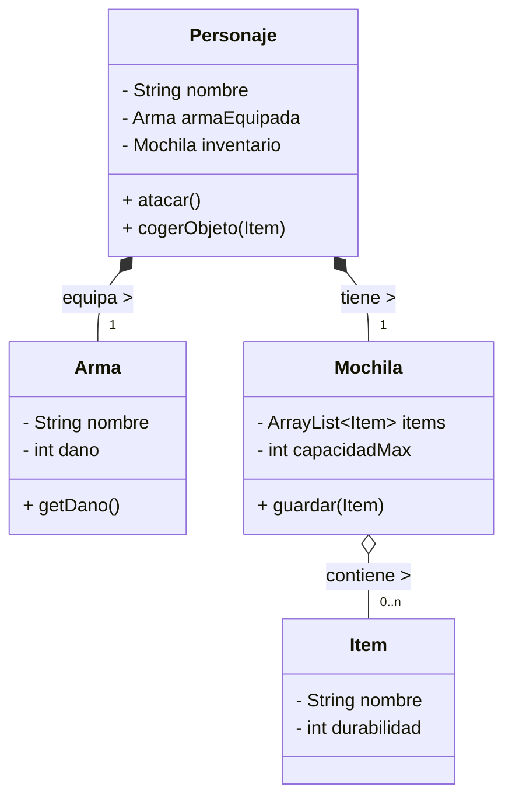
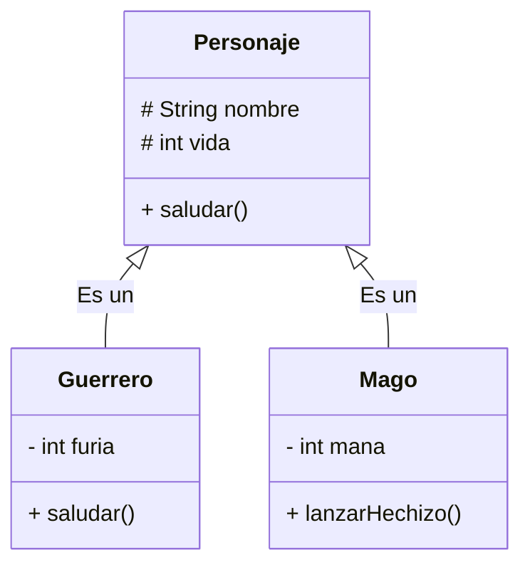
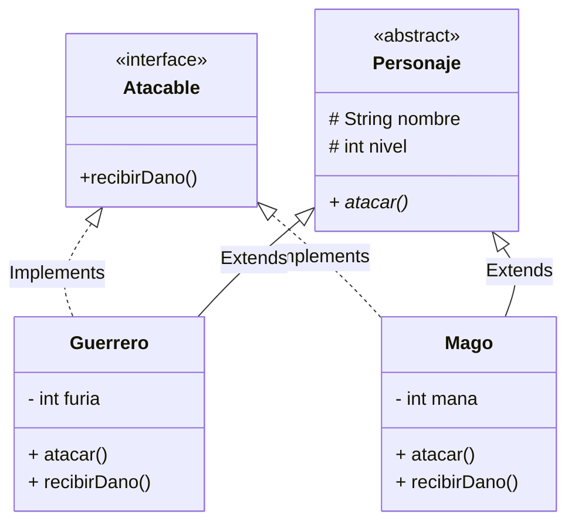

# Unidad 6. Programación Orientada a Objetos Avanzada

## 1. Clases Compuestas (Composición)

Hasta ahora, hemos trabajado con objetos sencillos (como un `Coche` con velocidad o color). Sin embargo, en el mundo profesional, el software se parece más a un juego de **LEGO**.

**¿Cómo construyes un castillo de Lego?** No fabricas el plástico desde cero. Tomas bloques que ya existen (ventanas, puertas, ladrillos) y los "compones" para crear algo nuevo y más complejo.

La **Composición** es exactamente eso: crear clases complejas usando otras clases como "piezas".

### 1.1. La Relación "TIENE-UN" (Has-A)

Para saber si estás ante un caso de composición, usa la prueba del "TIENE-UN":

*   Un `Ordenador` **TIENE UN** `Procesador`.
*   Un `Personaje` **TIENE UN** `Arma`.
*   Una `Casa` **TIENE UNA** `Cocina`.

(Si la frase fuera "ES UN", estaríamos hablando de Herencia, que veremos luego).

!!! tip "Consejo Pro"
    En Java, implementamos esto declarando atributos que son **referencias a otros Objetos**, en lugar de simples `int` o `String`.

### 1.2. Ventajas: Delegación

La clase contenedora (`Personaje`) no necesita saber cómo dispara el `Arma`. Solo le pide que dispare.
A esto se le llama **Delegación**: "Yo (Personaje) no calculo el daño, *delego* esa tarea a mi arma".

### 1.3. Ejemplo: Personaje y Arma

Vamos a ver cómo se traduce esto a código real.

```java
// PIEZA 1: El objeto "pequeño"
public class Arma {
    private String nombre;
    private int dano;

    public Arma(String nombre, int dano) {
        this.nombre = nombre;
        this.dano = dano;
    }

    public int getDano() { return dano; }
    public String getNombre() { return nombre; }
}
```

```java
// PIEZA 2: El objeto "contenedor"
public class Personaje {
    private String nombre;
    private int vida;

    // COMPOSICIÓN: El personaje TIENE un Arma
    // En memoria, esto es una referencia (un hueco) para conectar un objeto Arma.
    private Arma armaEquipada;

    public Personaje(String nombre, Arma armaInicial) {
        this.nombre = nombre;
        // Importante: Validamos que no nos pasen un arma 'null'
        if (armaInicial == null) {
            System.out.println("¡Cuidado! Se intenta crear sin arma.");
        }
        this.armaEquipada = armaInicial;
    }

    public void atacar() {
        // DELEGACIÓN: Usamos el objeto interno para trabajar
        System.out.println(this.nombre + " ataca con " + this.armaEquipada.getNombre());
        System.out.println("Daño causado: " + this.armaEquipada.getDano());
    }

    public void cambiarArma(Arma nuevaArma) {
        this.armaEquipada = nuevaArma;
        System.out.println(this.nombre + " ahora lleva: " + nuevaArma.getNombre());
    }
}
```

### 1.4. Composición con Colecciones (Relación "TIENE-MUCHOS")

¿Y si nuestro personaje tiene una mochila? Una mochila no tiene un solo objeto, tiene **muchos**.
Aquí es donde combinamos Composición con `ArrayList`.

```java
import java.util.ArrayList;

// CLASE COMPONENTE
public class Item {
    private String nombre;
    private int durabilidad; // Ejemplo: 100 (nuevo) a 0 (roto)

    public Item(String nombre, int durabilidad) {
        this.nombre = nombre;
        this.durabilidad = durabilidad;
    }
    
    @Override
    public String toString() { return nombre + " [" + durabilidad + "%]"; }
}
```

```java
// CLASE COMPUESTA INTERMEDIA
public class Mochila {
    private ArrayList<Item> items; // La colección
    private int capacidadMax;

    public Mochila(int capacidad) {
        this.items = new ArrayList<>();
        this.capacidadMax = capacidad;
    }

    public void guardar(Item i) {
        if (items.size() < capacidadMax) {
            items.add(i);
            System.out.println("Guardado: " + i);
        } else {
            System.out.println("No cabe: " + i);
        }
    }
    
    public String listar() {
        return items.toString();
    }
}
```

```java
// CLASE PRINCIPAL
public class Personaje {
    private String nombre;
    // COMPOSICIÓN: El Personaje TIENE UNA Mochila
    private Mochila inventario; 

    public Personaje(String nombre) {
        this.nombre = nombre;
        // Al nacer, el personaje recibe una mochila vacía de 10 huecos
        this.inventario = new Mochila(10);
    }
    
    public void cogerObjeto(Item i) {
        // Delegamos en la mochila la acción de guardar
        this.inventario.guardar(i);
    }
}
```

### 1.5. Visualización Completa

En este diagrama mostramos **todos** los atributos para ver la estructura completa de objetos en memoria.



!!! question "💻 Momento de Práctica: El Ordenador Modular"
    Vamos a construir un PC modular. Esta vez no es una sola clase, será un sistema de piezas ensambladas.

    **1. Las Piezas (Clases Componentes)**
    
    *   **Clase `Procesador`:**
        *   Atributos: `marca` (String) y `modelo` (String).
        *   Constructor y método `toString()` que devuelva algo como *"Intel i7"*.
    *   **Clase `MemoriaRAM`:**
        *   Atributos: `capacidad` (int, en GB) y `tecnologia` (String, ej: "DDR4", "DDR5").
        *   Constructor y método `toString()`.

    **2. La Torre (Clase Compuesta)**

    *   **Clase `Ordenador`:**
        *   Atributos:
            *   `cpu`: Objeto de tipo `Procesador`.
            *   `bancosRAM`: `ArrayList<MemoriaRAM>` (Aquí guardaremos los módulos).
            *   `MAX_RAM_SLOTS`: Constante `final int` (ej: 4).
        *   Constructor: Debe recibir **solo el Procesador** y crear la lista de RAM vacía.

    **3. La Lógica de Ensamblaje**

    *   Método **`void anadirMemoria(MemoriaRAM ram)`**:
        *   Comprueba si hay hueco libre (`size() < MAX_RAM_SLOTS`).
        *   Si hay hueco, añade la memoria a la lista.
        *   Si no, imprime: *"¡No quedan slots libres!"*.
    
    *   Método **`void mostrarConfiguracion()`**:
        *   Imprime el procesador.
        *   Recorre la lista de RAM sumando sus capacidades.
        *   Muestra el total: *"Ordenador con [Intel i7] y [32] GB de RAM instalada"*.

    **Reto Extra:** Modifica `anadirMemoria` para que impida mezclar tecnologías. Si la primera RAM es "DDR4", no debe dejar añadir una "DDR5".

---

## 2. Introducción a la Herencia

La **Herencia** es el mecanismo que nos permite crear nuevas clases basadas en clases que ya existen.

Imagina que estás programando un videojuego con 50 tipos de enemigos distintos (Zombies, Aliens, Robots...). Todos tienen `vida`, todos se `mueven`, todos tienen `coordenadas`.

*   ¿Vas a escribir el código de `moverse()` 50 veces? **NO**.
*   ¿Si descubres un fallo en el movimiento, vas a corregirlo en 50 archivos? **NO**.

Aquí entra la **Herencia**:
Igual que tú heredas el ADN de tus padres (no tienes que "aprender" a tener ojos, ya te vienen de fábrica), en programación creamos una **Clase Padre** con lo común y las **Clases Hijas** heredan su código automáticamente.

### 2.1. La Regla del "ES-UN" (Is-A)

Para saber si debes usar herencia, la frase debe tener sentido:

*   Un `Guerrero` **ES UN** `Personaje`. (Correcto: Herencia)
*   Un `Coche` **ES UN** `Motor`. (Incorrecto: Es Composición, porque *TIENE un* motor)

### 2.2. Sintaxis (`extends`) y Visibilidad (`protected`)

Para heredar usamos **`extends`**. Pero tenemos un problema: los hijos no pueden ver los atributos `private` de sus padres.

Para solucionarlo, nace un nuevo nivel de seguridad: **`protected`**.
Imagínalo como **"Secretos de Familia"**:

*   `public`: Lo sabe todo el mundo (la calle).
*   `protected`: Lo sabe la familia (Hijos) y los vecinos (mismo paquete).
*   `private`: Solo lo sé yo (Padre).

```java
// CLASE PADRE (Superclase)
public class Personaje {
    protected String nombre; // Protected para que los hijos lo puedan usar
    protected int vida;

    public Personaje(String nombre, int vida) {
        this.nombre = nombre;
        this.vida = vida;
    }

    public void saludar() {
        System.out.println("Hola, soy un personaje genérico.");
    }
}

// CLASE HIJA (Subclase)
public class Guerrero extends Personaje {
    private int furia; // Atributo exclusivo del hijo

    // EL CONSTRUCTOR: La Regla de los Cimientos
    public Guerrero(String nombre, int vida, int furia) {
        // 1º Construimos al padre (Cimientos)
        super(nombre, vida); 
        // 2º Construimos al hijo (Decoración)
        this.furia = furia;
    }
}
```

!!! warning "Importante: super()"
    La llamada a **`super()`** debe ser SIEMPRE la **primera línea** del constructor del hijo. No puedes decorar la casa si no has puesto los cimientos antes.

### 2.3. Sobreescritura de Métodos (`@Override`)

¿Y si el hijo quiere hacer las cosas de forma diferente a su padre?
El `Guerrero` hereda `saludar()`, pero quiere saludar gritando.

Podemos **reescribir** el método usando la etiqueta **`@Override`**.

```java
public class Guerrero extends Personaje {
    // ... constructor ...

    @Override
    public void saludar() {
        // Opción A: Borrón y cuenta nueva (Ignoramos al padre)
        System.out.println("¡GRRR! SOY " + this.nombre + " Y TE APLASTARÉ.");
        
        // Opción B: Ampliar lo que hace el padre
        // super.saludar(); // Llamaría al "Hola..." original
        // System.out.println("...pero tengo mal genio.");
    }
}
```

### 2.4. Diagrama de Herencia

En UML, la herencia se representa con una **flecha de línea continua y punta triangular hueca** que va del Hijo al Padre.



*(Nota: El símbolo `#` representa `protected` en los diagramas).*

!!! question "💻 Momento de Práctica: El Reino Animal"
    Vamos a crear una pequeña jerarquía biológica.

    1.  Crea una clase **`Animal`** con atributos `protected nombre` y `edad`.
        *   Método `hacerSonido()` que imprima: *"..."* (sonido genérico).
    2.  Crea la clase **`Perro`** que hereda de `Animal`.
        *   `@Override` `hacerSonido()` -> *"¡Guau!"*.
    3.  Crea la clase **`Gato`** que hereda de `Animal`.
        *   `@Override` `hacerSonido()` -> *"¡Miau!"*.
    4.  **En el Main:**
        *   Crea un Perro y un Gato.
        *   Haz que ambos "hablen".
        *   **Prueba Curiosa:** Intenta hacer `Animal a = new Perro(...)`. ¿Funciona? (Spoiler: Sí, es el principio del Polimorfismo).
* *Solución Java:* Se puede simular usando **Interfaces** (lo veremos en el punto 4).

---

## 3. Clases Abstractas

A veces, la superclase es un concepto tan general que no debería poder instanciarse.
Piénsalo: en un juego, tú no dices "Invoco a un Personaje". Dices "Invoco a un Guerrero" o "Invoco a un Mago". El concepto "Personaje" es una abstracción.

### 3.1. Declaración (`abstract`)

Usamos la palabra clave **`abstract`**.

```java
public abstract class Personaje {
    // ... código ...
}
```

* **Efecto:** `new Personaje()` dará **ERROR**. Solo podemos usarla como padre para crear hijas concretas (`new Guerrero()`).

### 3.2. Métodos Abstractos

Son métodos que **no tienen cuerpo** (sin llaves `{}`). Definen **QUÉ** se hace, pero no **CÓMO**.
Es una forma de obligar a las hijas a implementarlos.

"Todo personaje sabe atacar, pero no sé cómo ataca un personaje genérico. El Guerrero atacará con espada y el Mago con fuego".

```java
// En la clase abstracta Personaje
public abstract void atacar(); // Sin llaves. Solo punto y coma.

// En la clase Guerrero (OBLIGATORIO implementarlo)
@Override
public void atacar() {
    System.out.println("Espadazo furioso!!");
}

// En la clase Mago (OBLIGATORIO implementarlo)
@Override
public void atacar() {
    System.out.println("Bola de fuego!!");
}
```

### 3.3. Clases y Métodos Finales (`final`)

Lo contrario a abstracto es `final`.
* **Clase `final`:** Una clase estéril. No puede tener hijos (herencia prohibida). Ej: `String` es final.
* **Método `final`:** Nadie puede sobreescribirlo (`@Override` prohibido). Garantiza que el comportamiento no cambie en las hijas.

---

## 4. Interfaces

Las **Interfaces** llevan la abstracción al extremo. Mientras que una clase abstracta es "algo que eres" (Identidad), una interfaz define "algo que puedes hacer" (Capacidad).

### 4.1. Concepto y Diferencias

| Característica | Clase Abstracta | Interfaz |
| :--- | :--- | :--- |
| **Relación** | ES-UN (Jerarquía) | PUEDE-HACER (Capacidad) |
| **Atributos** | Puede tener de todo | Solo constantes (`public static final`) |
| **Métodos** | Con código y abstractos | Todos abstractos (hasta Java 8) |
| **Herencia** | Simple (un solo padre) | **Múltiple** (implementa muchas) |

### 4.2. Definición (`interface`)

Imagina que en nuestro juego, tanto un `Personaje` como una `CajaMadera` pueden recibir dano. No son familia, pero comparten una capacidad: ser atacables.

```java
public interface Atacable {
    // Método implícitamente public y abstract
    void recibirDano(int cantidad);
}
```

### 4.3. Implementación (`implements`)

Las clases "firman un contrato" con la interfaz. Deben implementar sus métodos.

```java
public class Guerrero extends Personaje implements Atacable {
    @Override
    public void recibirDano(int cantidad) {
        // Implementación específica del guerrero (tiene armadura)
        this.vida -= (cantidad - armadura);
    }
}

public class CajaMadera implements Atacable {
    @Override
    public void recibirDano(int cantidad) {
        // Implementación específica de la caja (se rompe fácil)
        this.vida -= cantidad;
    }
}
```

### 4.4. Comparación de Objetos (`Comparable`)

Java usa interfaces para muchas cosas estándar. Por ejemplo, para ordenar una lista de personajes por nivel, nuestra clase debe implementar la interfaz `Comparable<Personaje>`.

```java
public class Personaje implements Comparable<Personaje> {
    // ...
    @Override
    public int compareTo(Personaje otro) {
        // Devuelve negativo si soy menor, positivo si mayor, 0 si igual
        return this.nivel - otro.nivel;
    }
}
// Ahora Collections.sort(listaPersonajes) funcionará automáticamente.
```

---

## 5. Polimorfismo

El **Polimorfismo** ("muchas formas") es la capacidad de tratar objetos de diferentes clases (Hijas) como si fueran de su clase genérica (Padre), pero conservando su comportamiento específico.

Es la magia de la POO: **Un mismo código funciona para tipos distintos.**

### 5.1. Concepto de Polimorfismo

Gracias a la herencia, un objeto `Guerrero` **ES UN** `Personaje`.
Por tanto, puedo guardar un Guerrero dentro de una variable de tipo Personaje.

```java
// Variable de tipo PADRE = Objeto de tipo HIJO
Personaje p1 = new Guerrero("Conan");
Personaje p2 = new Mago("Gandalf");

// ¡Magia! Llamamos al mismo método...
p1.atacar(); // Ejecuta el atacar() de GUERRERO (Espadazo)
p2.atacar(); // Ejecuta el atacar() de MAGO (Fuego)
```

Esto se llama **Ligadura Dinámica** (*Dynamic Binding*): Java decide qué método ejecutar en tiempo de ejecución, mirando qué objeto real hay en memoria, no qué tipo de variable usamos.

### 5.2. Ejemplo Potente: Colecciones Polimórficas

Imagina gestionar el turno de ataque de tu juego. Sin polimorfismo, necesitarías un array para Guerreros, otro para Magos, otro para Arqueros...

Con polimorfismo, usamos una lista del tipo genérico:

```java
ArrayList<Personaje> equipo = new ArrayList<>();

equipo.add(new Guerrero("Conan", 100, 50));
equipo.add(new Mago("Merlín", 70, 100));
equipo.add(new Arquero("Legolas", 80, 20));

System.out.println("--- TURNO DE ATAQUE ---");

// Bucle Polimórfico
for (Personaje p : equipo) {
    // No sabemos qué es 'p', ni nos importa.
    // Solo sabemos que es un Personaje y sabe atacar.
    // Java ejecutará la versión correcta para cada uno.
    p.atacar(); 
}
```

**Resultado:**
```text
¡Conan ataca con su espada!
¡Merlín lanza una bola de fuego!
¡Legolas dispara una flecha!
```

### Diagrama Final de la Unidad



!!! question "💻 Reto Final de Unidad"
    Crea un sistema de **Zoológico**.
    1. Clase abstracta `Animal` (nombre, comer, dormir).
    2. Interfaz `Trucos` (hacerTruco).
    3. Clases `Leon`, `Delfin` y `Perro`.
    4. El `Delfin` y el `Perro` implementan `Trucos`, el `Leon` no.
    5. Crea un `ArrayList<Animal>`, anade varios y recórrelos. Haz que todos coman. Intenta hacer que hagan trucos (pista: necesitarás `instanceof` para saber si un animal concreto sabe hacer trucos antes de llamarlo).