# Unidad 6. Programación Orientada a Objetos Avanzada

## 1. Clases Compuestas (Composición)

Hasta ahora, hemos trabajado con objetos sencillos (como un `Coche` con velocidad o color). Sin embargo, en el mundo profesional, el software se parece más a un juego de **LEGO**.

**¿Cómo construyes un castillo de Lego?** No fabricas el plástico desde cero. Tomas bloques que ya existen (ventanas, puertas, ladrillos) y los "compones" para crear algo nuevo y más complejo.

La **Composición** es exactamente eso: crear clases complejas usando otras clases como "piezas".

### 1.1. La Relación "TIENE-UN" (Has-A)

Para saber si estás ante un caso de composición, usa la prueba del "TIENE-UN":

*   Un `Ordenador` **TIENE UN** `Procesador`.
*   Un `Personaje` **TIENE UN** `Arma`.
*   Una `Casa` **TIENE UNA** `Cocina`.

(Si la frase fuera "ES UN", estaríamos hablando de Herencia, que veremos luego).

!!! tip "Consejo Pro"
    En Java, implementamos esto declarando atributos que son **referencias a otros Objetos**, en lugar de simples `int` o `String`.

### 1.2. Ventajas: Delegación

La clase contenedora (`Personaje`) no necesita saber cómo dispara el `Arma`. Solo le pide que dispare.
A esto se le llama **Delegación**: "Yo (Personaje) no calculo el daño, *delego* esa tarea a mi arma".

### 1.3. Ejemplo: Personaje y Arma

Vamos a ver cómo se traduce esto a código real.

```java
// PIEZA 1: El objeto "pequeño"
public class Arma {
    private String nombre;
    private int dano;

    public Arma(String nombre, int dano) {
        this.nombre = nombre;
        this.dano = dano;
    }

    public int getDano() { return dano; }
    public String getNombre() { return nombre; }
}
```

```java
// PIEZA 2: El objeto "contenedor"
public class Personaje {
    private String nombre;
    private int vida;

    // COMPOSICIÓN: El personaje TIENE un Arma
    // En memoria, esto es una referencia (un hueco) para conectar un objeto Arma.
    private Arma armaEquipada;

    public Personaje(String nombre, Arma armaInicial) {
        this.nombre = nombre;
        // Importante: Validamos que no nos pasen un arma 'null'
        setArmaEquipada(armaInicial);
    }

    public void atacar() {
        // DELEGACIÓN: Usamos el objeto interno para trabajar
        System.out.println(this.nombre + " ataca con " + this.armaEquipada.getNombre());
        System.out.println("Daño causado: " + this.armaEquipada.getDano());
    }

    public void cambiarArma(Arma nuevaArma) {
        setArmaEquipada(nuevaArma);
        System.out.println(this.nombre + " ahora lleva: " + nuevaArma.getNombre());
    }

    public Arma getArmaEquipada() {
        return armaEquipada;
    }

    public void setArmaEquipada(Arma nuevoArma) {
        if (nuevoArma != null) {
            this.armaEquipada = nuevoArma;
        } else {
            System.out.println("¡Cuidado! Se intenta crear sin arma.");
            Arma punyoPorDefecto = new Arma("Puño", 1);
            this.armaEquipada = punyoPorDefecto;
        }
    }
    
}
```

### 1.4. Composición con Colecciones (Relación "TIENE-MUCHOS")

¿Y si nuestro personaje tiene una mochila? Una mochila no tiene un solo objeto, tiene **muchos**.
Aquí es donde combinamos Composición con `ArrayList`.

```java
import java.util.ArrayList;

// CLASE COMPONENTE
public class Item {
    private String nombre;
    private int durabilidad; // Ejemplo: 100 (nuevo) a 0 (roto)

    public Item(String nombre, int durabilidad) {
        this.nombre = nombre;
        this.durabilidad = durabilidad;
    }
    
    @Override
    public String toString() { return nombre + " [" + durabilidad + "%]"; }
}
```

```java
// CLASE COMPUESTA INTERMEDIA
public class Mochila {
    private ArrayList<Item> items; // La colección
    private int capacidadMax;

    public Mochila(int capacidad) {
        this.items = new ArrayList<>();
        this.capacidadMax = capacidad;
    }

    public void guardar(Item i) {
        if (items.size() < capacidadMax) {
            items.add(i);
            System.out.println("Guardado: " + i);
        } else {
            System.out.println("No cabe: " + i);
        }
    }
    
    public String listar() {
        return items.toString();
    }
}
```

```java
// CLASE PRINCIPAL
public class Personaje {

    private String nombre;
    private int vida;

    private Arma armaEquipada;
    private Mochila mochila;

    public Personaje(String nombre, Arma armaInicial) {
        this.nombre = nombre;
        // Importante: Validamos que no nos pasen un arma 'null'
        if (armaInicial == null) {
            System.out.println("¡Cuidado! Se intenta crear sin arma.");

        }
        setArmaEquipada(armaInicial);
        mochila = new Mochila(10);
    }

    public String getNombre() {
        return nombre;
    }

    public void setNombre(String nombre) {
        this.nombre = nombre;
    }

    public int getVida() {
        return vida;
    }

    public void setVida(int vida) {
        this.vida = vida;
    }

    public Arma getArmaEquipada() {
        return armaEquipada;
    }

    public void atacar() {
        // DELEGACIÓN: Usamos el objeto interno para trabajar
        System.out.println(this.nombre + " ataca con " + this.armaEquipada.getNombre());
        System.out.println("Daño causado: " + this.armaEquipada.getDano());
    }

    public void cambiarArma(Arma nuevaArma) {
        setArmaEquipada(nuevaArma);
        System.out.println(this.nombre + " ahora lleva: " + getArmaEquipada().getNombre());
    }

    public void setArmaEquipada(Arma nuevoArma) {
        if (nuevoArma != null) {
            this.armaEquipada = nuevoArma;
        } else {
            Arma punyoPorDefecto = new Arma("Puño", 1);
            this.armaEquipada = punyoPorDefecto;
        }
    }

    public void cogerObjeto(Item i) {
        // Delegamos en la mochila la acción de guardar
        this.mochila.guardar(i);
    }
}
```

### 1.5. Visualización Completa

En este diagrama mostramos **todos** los atributos para ver la estructura completa de objetos en memoria.

```mermaid
classDiagram
    class Personaje {
        - String nombre
        - int vida
        - Arma armaEquipada
        - Mochila mochila
        + Personaje(nombre, arma)
        + atacar()
        + cambiarArma(Arma)
        + cogerObjeto(Item)
    }
    class Arma {
        - String nombre
        - int dano
        + getDano()
    }
    class Mochila {
        - ArrayList~Item~ items
        - int capacidadMax
        + guardar(Item)
    }
    class Item {
        - String nombre
        - int durabilidad
    }

    Item --o Mochila : Contiene
    Personaje o-- Arma : Agregación (Tiene una)
    Personaje *-- Mochila : Composición (Parte de él)
```



!!! question "💻 Momento de Práctica: El Ordenador Modular"
    Vamos a construir un PC modular. Esta vez no es una sola clase, será un sistema de piezas ensambladas.

    **1. Las Piezas (Clases Componentes)**
    
    *   **Clase `Procesador`:**
        *   Atributos: `marca` (String) y `modelo` (String).
        *   Constructor y método `toString()` que devuelva algo como *"Intel i7"*.
    *   **Clase `MemoriaRAM`:**
        *   Atributos: `capacidad` (int, en GB) y `tecnologia` (String, ej: "DDR4", "DDR5").
        *   Constructor y método `toString()`.

    **2. La Torre (Clase Compuesta)**

    *   **Clase `Ordenador`:**
        *   Atributos:
            *   `cpu`: Objeto de tipo `Procesador`.
            *   `bancosRAM`: `ArrayList<MemoriaRAM>` (Aquí guardaremos los módulos).
            *   `MAX_RAM_SLOTS`: Constante `final int` (ej: 4).
        *   Constructor: Debe recibir **solo el Procesador** y crear la lista de RAM vacía.

    **3. La Lógica de Ensamblaje**

    *   Método **`void anadirMemoria(MemoriaRAM ram)`**:
        *   Comprueba si hay hueco libre (`size() < MAX_RAM_SLOTS`).
        *   Si hay hueco, añade la memoria a la lista.
        *   Si no, imprime: *"¡No quedan slots libres!"*.
    
    *   Método **`void mostrarConfiguracion()`**:
        *   Imprime el procesador.
        *   Recorre la lista de RAM sumando sus capacidades.
        *   Muestra el total: *"Ordenador con [Intel i7] y [32] GB de RAM instalada"*.

    **Reto Extra:** Modifica `anadirMemoria` para que impida mezclar tecnologías. Si la primera RAM es "DDR4", no debe dejar añadir una "DDR5".

---

## 2. Introducción a la Herencia

La **Herencia** es el mecanismo que nos permite crear nuevas clases basadas en clases que ya existen.

Imagina que estás programando un videojuego con 50 tipos de enemigos distintos (Zombies, Aliens, Robots...). Todos tienen `vida`, todos se `mueven`, todos tienen `coordenadas`.

*   ¿Vas a escribir el código de `moverse()` 50 veces? **NO**.
*   ¿Si descubres un fallo en el movimiento, vas a corregirlo en 50 archivos? **NO**.

Aquí entra la **Herencia**:
Igual que tú heredas el ADN de tus padres (no tienes que "aprender" a tener ojos, ya te vienen de fábrica), en programación creamos una **Clase Padre** con lo común y las **Clases Hijas** heredan su código automáticamente.

### 2.1. La Regla del "ES-UN" (Is-A)

Para saber si debes usar herencia, la frase debe tener sentido:

*   Un `Guerrero` **ES UN** `Personaje`. (Correcto: Herencia)
*   Un `Coche` **ES UN** `Motor`. (Incorrecto: Es Composición, porque *TIENE un* motor)

### 2.2. Sintaxis (`extends`) y Visibilidad (`protected`)

Para heredar usamos **`extends`**. Pero tenemos un problema: los hijos no pueden ver los atributos `private` de sus padres.

Para solucionarlo, existe un modificador de acceso diseñado específicamente para la herencia: **`protected`**.
Este nivel de visibilidad actúa como un punto intermedio entre la privacidad total y la exposición pública:

| Modificador | Alcance y Descripción |
| :--- | :--- |
| **`public`** | Visible desde **cualquier clase** de la aplicación. |
| **`protected`** | Visible para las clases del **mismo paquete** y para sus **subclases** (hijas), independientemente de donde estén. |
| **`private`** | Visible únicamente dentro de la **propia clase** (ni siquiera los hijos pueden acceder). |


!!! tip "¿Cuándo usar `protected`?"
    Aunque `protected` es útil para la herencia, **no abuses de él**.
    
    Por defecto, intenta mantener tus atributos `private` y usa **Getters/Setters** (públicos o protegidos) si los hijos necesitan acceder. Usa `protected` en atributos solo cuando sea estrictamente necesario para el diseño o rendimiento.

```java
// CLASE PADRE (Superclase)
public class Personaje {
    protected String nombre; // Protected para que los hijos lo puedan usar
    protected int vida;

    public Personaje(String nombre, int vida) {
        this.nombre = nombre;
        this.vida = vida;
    }

    public void saludar() {
        System.out.println("Hola, soy un personaje genérico.");
    }
}
```

```java
// CLASE HIJA (Subclase)
public class Guerrero extends Personaje {
    private int furia; // Atributo exclusivo del hijo

    // EL CONSTRUCTOR: La Regla de los Cimientos
    public Guerrero(String nombre, int vida, int furia) {
        // 1º Construimos al padre (Cimientos)
        super(nombre, vida); 
        // 2º Construimos al hijo (Decoración)
        this.furia = furia;
    }
}
```

!!! warning "Importante: super()"
    La llamada a **`super()`** debe ser SIEMPRE la **primera línea** del constructor del hijo. No puedes decorar la casa si no has puesto los cimientos antes.

!!! tip "Curiosidad: ¿Herencia Múltiple?"
    En Java, una subclase **SOLO puede tener un PADRE** (`extends`). No existe la herencia múltiple de clases (como en C++ o Python).
    
    Esto se hace para evitar conflictos (el "Problema del Diamante"). Sin embargo, Java compensa esto permitiendo implementar **múltiples Interfaces**.

### 2.3. Sobreescritura de Métodos (`@Override`)

¿Y si el hijo quiere hacer las cosas de forma diferente a su padre?
El `Guerrero` hereda `saludar()`, pero quiere saludar gritando.

Podemos **reescribir** el método usando la etiqueta **`@Override`**.

```java
public class Guerrero extends Personaje {
    // ... constructor ...

    @Override
    public void saludar() {
        // Opción A: Borrón y cuenta nueva (Ignoramos al padre)
        System.out.println("¡GRRR! SOY " + this.nombre + " Y TE APLASTARÉ.");
        
        // Opción B: Ampliar lo que hace el padre
        // super.saludar(); // Llamaría al "Hola..." original
        // System.out.println("...pero tengo mal genio.");
    }
}
```

### 2.4. Diagrama de Herencia

En UML, la herencia se representa con una **flecha de línea continua y punta triangular hueca** que va del Hijo al Padre.


*(Nota: El símbolo `#` representa `protected` en los diagramas).*

!!! question "💻 Momento de Práctica: El Reino Animal"
    Vamos a crear una pequeña jerarquía biológica.

    1.  Crea una clase **`Animal`** con atributos `protected nombre` y `edad`.
        *   Método `hacerSonido()` que imprima: *"..."* (sonido genérico).
    2.  Crea la clase **`Perro`** que hereda de `Animal`.
        *   `@Override` `hacerSonido()` -> *"¡Guau!"*.
    3.  Crea la clase **`Gato`** que hereda de `Animal`.
        *   `@Override` `hacerSonido()` -> *"¡Miau!"*.
    4.  **En el Main:**
        *   Crea un Perro y un Gato.
        *   Haz que ambos "hablen".
        *   **Prueba Curiosa:** Intenta hacer `Animal a = new Perro(...)`. ¿Funciona? (Spoiler: Sí, es el principio del Polimorfismo).

---

## 3. Clases Abstractas

Hasta ahora, nuestras clases servían para crear objetos (`new Guerrero()`). Pero a veces, necesitamos definir un concepto que es puramente estructural y no debería existir por sí solo.

**Concepto Abstracto vs Implementación Concreta:**
Piensa en la ingeniería. Tú sabes lo que es un **"Vehículo"** (tiene motor, ruedas, transporta gente).

*   Pero tú no puedes ir a un concesionario y decir: *"Deme un Vehículo, a secas"*.
*   El vendedor te dirá: *"¿Quiere un Coche? ¿Una Moto? ¿Un Camión?"*.

"Vehículo" es un concepto abstracto. No se puede fabricar. Solo sirve de base para crear cosas reales como "Coche" o "Moto".

### 3.1. Definición (`abstract`)

En Java, usamos la palabra clave **`abstract`** para impedir que una clase se pueda instanciar.

```java
public abstract class Figura {
    protected String color; // Un atributo común más lógico para una figura
    
    public Figura(String color) {
        this.color = color;
    }
}
```

*   **Efecto inmediato:** `new Figura("Rojo")` dará **ERROR DE COMPILACIÓN**.
*   **Utilidad:** Solo podemos usarla como padre (`extends`) para crear clases útiles como `Circulo` o `Rectangulo`.

### 3.2. Métodos Abstractos (El Contrato)

Si definimos una "Figura", sabemos que todas las figuras tienen un **Área**. Pero, ¿cómo se calcula el área de "una figura genérica"?
¡No se puede! Depende de si es redonda o cuadrada.

Aquí usamos un **Método Abstracto**: Definimos el **QUÉ** pero dejamos el **CÓMO** vacío.

```java
public abstract class Figura {
    protected String color;

    public Figura(String color) {
        this.color = color;
    }

    // MÉTODO ABSTRACTO: No tiene llaves {}. Termina en "punto y coma".
    // "Prometo que cualquier hijo mío sabrá calcular su área, pero yo no sé cómo".
    public abstract double calcularArea();
}
```

**La Regla de Oro:**
Si heredas de una clase abstracta, estás **OBLIGADO** a implementar sus métodos abstractos (darles código). Si no lo haces, tú también serás abstracto.

### 3.3. Ejemplo: Geometría

```java
// CLASE HIJA 1
public class Circulo extends Figura {
    private double radio;

    public Circulo(String color, double radio) {
        super(color);
        this.radio = radio;
    }

    @Override
    public double calcularArea() {
        return Math.PI * radio * radio;
    }
}
```

```java
// CLASE HIJA 2
public class Rectangulo extends Figura {
    private double base, altura;

    public Rectangulo(String color, double base, double altura) {
        super(color);
        this.base = base;
        this.altura = altura;
    }

    @Override
    public double calcularArea() {
        return base * altura;
    }
}
```

```java
// CLASE HIJA 3
public class Triangulo extends Figura {
    private double base, altura;

    public Triangulo(String color, double base, double altura) {
        super(color);
        this.base = base;
        this.altura = altura;
    }

    @Override
    public double calcularArea() {
        return (base * altura) / 2;
    }
}
```

### 3.4. Diagrama UML

En los diagramas de clases, las clases abstractas y los métodos abstractos se representan en *cursiva* (o con la etiqueta `<<abstract>>`).


*(Nota: El asterisco `*` o la cursiva en `calcularArea()` indica que es abstracto).*

### 3.5. Clases y Métodos Finales (`final`)

Justo lo opuesto a `abstract` es **`final`**.

*   **Clase `final`:** "Estéril". Nadie puede heredar de ella. (Ej: `String` es `final` por seguridad).
*   **Método `final`:** "Intocable". Nadie puede sobreescribirlo (`@Override`).

```java
// Ejemplo: Una clase que no queremos que nadie modifique ni extienda
public final class ConstantesFisicas {
    public static final double GRAVEDAD = 9.81;
}

// ERROR DE COMPILACIÓN: No se puede heredar de una clase final
// public class MiFisica extends ConstantesFisicas { ... }
```

!!! question "💻 Momento de Práctica: Gestión de Nóminas"
    Vamos a crear un sistema de pago para una empresa.
    
    1.  Clase Abstracta **`Empleado`**:
        *   Atributos: `nombre`, `dni`.
        *   Método Abstracto: **`double calcularSueldo()`**.
        *   Método Normal: `toString()` que devuelva el nombre.
    2.  Hija **`EmpleadoAsalariado`**:
        *   Tiene `sueldoBase` (fijo) y `antiguedad` (años).
        *   Sueldo = `sueldoBase` + (100 * `antiguedad`).
    3.  Hija **`Freelance`**:
        *   Tiene `precioHora` y `horasTrabajadas`.
        *   Sueldo = `precioHora` * `horasTrabajadas`.
    4.  **Main (Polimorfismo puro):**
        *   Crea un `ArrayList<Empleado>`.
        *   Añade un Asalariado y un Freelance.
        *   Recorre la lista y suma cuánto dinero total tiene que pagar la empresa este mes.

---

## 4. Interfaces

Las **Interfaces** llevan la abstracción al siguiente nivel. Si una Clase Abstracta define **QUÉ ERES** (Identidad), una Interfaz define **QUÉ PUEDES HACER** (Capacidad).

### 4.1. Metáfora: El Mando de la Consola

Imagina el mando de una videoconsola.

*   Tiene unos botones definidos: **X**, **O**, **Triángulo**, **Cuadrado**.
*   Si juegas al **FIFA**, al pulsar **X** haces un *Pase*.
*   Si juegas al **Call of Duty**, al pulsar **X** haces un *Salto*.

El mando (Interfaz) impone **qué botones existen**, pero no **qué hacen**.
La clase concreta (el juego) es quien decide cómo reaccionar a esos botones.

### 4.2. Diferencias Clave

| Característica | Clase Abstracta | Interfaz |
| :--- | :--- | :--- |
| **Concepto** | **Identidad** (ADN). "Soy un Animal". | **Habilidad** (Título). "Sé Nadar". |
| **Relación** | Padres/Hijos (Jerarquía Vertical). | Contrato (Conexión Horizontal). |
| **Atributos** | Puede tener variables normales. | Solo constantes (`public static final`). |
| **Herencia** | Simple (Solo un padre). | **Múltiple** (Puedes tener muchas habilidades). |

### 4.3. Ejemplo: GPS Universal (`Localizable`)

Imagina una App de mapas. Necesita mostrar cosas en el mapa.
No solo coches. También personas, mascotas con collar GPS, o incluso edificios.
No tienen NADA en común (no son familia), pero todos son **Localizables**.

Primero, vamos a definir una clase que almacene las coordenadas.

```java
public class Coordenadas {
    
    public double latitud, longitud;

    public Coordenadas(double latitud, double longitud) {
        this.latitud = latitud;
        this.longitud = longitud;
    }
}
```

Ahora, vamos a definir la interfaz `Localizable`. Estará implementada por todas las clases que quieran ser localizables y usaremos el objeto `Coordenadas` para almacenar las coordenadas en cada clase.

```java
// 1. Definimos la CAPACIDAD (Interfaz)
public interface Localizable {
    // "Quien firme esto, debe saber decirme dónde está"
    double getLatitud();
    double getLongitud();
}

```

Podemos usar la interfaz `Localizable` para implementar la localización en clases abstractas.

```java
public abstract class Vehiculo implements Localizable {

    protected Coordenadas gps;

    /** Simplificamos el código */

    @Override
    public double getLatitud() {
        return this.gps.lat;
    }

    @Override
    public double getLongitud() {
        return this.gps.lon;
    }

}
```

Podemos usar la interfaz `Localizable` para implementar la localización en clases concretas.

```java
public class Usuario implements Localizable {

    private String nombre;
    private int edad;
    private Coordenadas movil;

    /** Simplificamos el código */

    public Usuario(String nombre, int edad, Coordenadas movil) {
        this.nombre = nombre;
        this.edad = edad;
        this.movil = movil;
    }

    @Override
    public double getLatitud() {
        return this.movil.lat;
    }

    @Override
    public double getLongitud() {
        return this.movil.lon;
    }

}
```

```java
public class Perro implements Localizable {

    private String nombre;
    private Coordenadas collar;

    /** Simplificamos el código */

    public Perro(String nombre, Coordenadas collar) {
        this.nombre = nombre;
        this.collar = collar;
    }

    @Override
    public double getLatitud() {
        return this.collar.lat;
    }

    @Override
    public double getLongitud() {
        return this.collar.lon;
    }

}
```

Aquí tenemos un ejemplo de uso en el `main`:

```java
public class MainInterfaces {

    public static void main(String[] args) {

        Coordenadas localizacion = new Coordenadas(39.67, -0.25);

        Perro perro = new Perro("Sparky", localizacion);
        Usuario usuario = new Usuario("Dulcinea del Toboso", 18, localizacion);

        System.out.println("Mi perro está en " + perro.getLatitud() + " " +  perro.getLongitud());
        System.out.println("Dulcinea del Toboso está en  " + usuario.getLatitud() + " " +  usuario.getLongitud());

    }
}
```

### 4.4. Diagrama UML

En UML, la relación **"implementa una interfaz"** (Realización) se dibuja con una **línea discontinua y punta triangular hueca**.


!!! tip "Poder Ilimitado: Implementar Múltiples Interfaces"
    A diferencia de la herencia de clases (`extends`), donde solo puedes tener **un padre**, en Java puedes implementar **tantas interfaces como quieras**.
    
    Solo tienes que separarlas por comas:
    `public class SuperHeroe implements Volador, SuperFuerza, IdentidadSecreta { ... }`
    
    ¡Eso sí! Tienes que escribir el código de **TODOS** los métodos de **TODAS** las interfaces.

!!! question "💻 Momento de Práctica: La Casa Domótica"
    Vamos a crear los dispositivos inteligentes de una casa.
    
    1.  **La Interfaz:** Crea `Controlable` con métodos `void encender()` y `void apagar()`.
    2.  **Las Clases:** Crea `Televisor`, `AireAcondicionado` y `Persiana` que implementen `Controlable`.
        *   *Piensa* en qué atributo necesitas para indicar si un dispositivo está encendido o apagado.
        *   *Detalle:* El televisor al encenderse dice: "Bienvenido a Netflix".
        *   *Detalle:* El aire al apagarse dice: "Cerrando aspas...".
    3.  **La Prueba:** En el `main`, crea un objeto de cada uno. Enciéndelos y apágalos.
    4.  **Reflexión:** Fíjate que aunque los métodos se llaman igual, cada objeto hace algo distinto (uno muestra logos, otro mueve aspas). Eso es gracias a la interfaz.

---

## 5. Polimorfismo

El **Polimorfismo** ("muchas formas") es la magia real de la POO. Nos permite tratar a objetos diferentes de forma genérica, pero conservando su comportamiento único.

### 5.1. Metáfora: La Caja Mágica

Imagina que tienes una caja etiquetada como **"Personaje"**.

*   Dentro de la caja metes a un **Guerrero**.
*   Tú, desde fuera, solo ves la etiqueta "Personaje".
*   Si le gritas a la caja *"¡ATACA!"*, lo que saldrá de dentro es un **ESPADAZO** (comportamiento de Guerrero), aunque tú trataras la caja como algo genérico.

**Concepto Clave:**

*   **Tipo de la Variable (La Caja):** Define qué métodos PUEDES llamar.
*   **Tipo del Objeto (El Contenido):** Define CÓMO se ejecutan esos métodos.

### 5.2. Ligadura Dinámica (Dynamic Binding)

```java
// Creamos un ARRAYLIST de la clase padre (La Caja)
ArrayList<Personaje> grupo = new ArrayList<>();

// Guardamos objetos HIJOS (El Contenido)
grupo.add(new Guerrero("Conan", 100, 5, 20));
grupo.add(new Mago("Gandalf", 80, 10, 50));

// Creamos un enemigo dummy
Personaje enemigo = new Orco("Orokhur", 200, 1, 8);

// BUCLE POLIMÓRFICO:
// Tratamos a todos como "Personaje", pero cada uno reacciona a su manera.
for (Personaje p : grupo) {
    p.atacar(enemigo); // JAVA VE: Guerrero -> Espadazo, Mago -> Fuego...
}
```

Java decide **en tiempo de ejecución** qué código ejecutar. Esto se llama **Ligadura Dinámica**.

### 5.3. Trasteando con la Herencia: Casting y `instanceof`

A veces, tienes un `Personaje` (caja genérica) pero sabes que dentro hay un `Guerrero` y quieres usar su método especial `gritoDeGuerra()` (que el Mago no tiene).

Intentarlo directamente da error:
```java
Personaje p = grupo.get(0); // Recuperamos al primero (Sabemos que es Conan)
// p.gritoDeGuerra(); // ERROR: La clase Personaje no tiene ese método.
```

Para solucionarlo, necesitamos hacer **Casting** (destapar la caja y confirmar qué es). Pero ¡cuidado! Si te equivocas, el programa explota. Para estar seguros, usamos el "escáner de rayos X": **`instanceof`**.

```java
if (p instanceof Guerrero) {
    // Confirmado: Es un guerrero. Hacemos Downcasting seguro.
    Guerrero g = (Guerrero) p;
    g.gritoDeGuerra(); // ¡AHORA SÍ!
}
```

!!! question "💻 Reto Final de Unidad: El Zoológico Interactivo 🦁🐬🐶"
    Vamos a crear un simulador de zoológico con gestión de energía.

    1.  **Clase Abstracta `Animal`:**
        *   Atributos: `nombre`, `energia` (empieza en 50).
        *   Método `jugar(int gasto)`: Resta energía e imprime *"[Nombre] está jugando... Energía restante: [X]"*.
        *   Método Abstracto **`comer(String comida)`**: Cada animal recupera energía de forma distinta según lo que coma. Si no quiere la comida, muestra rechazo con un mensaje.
    2.  **Interfaz `Trucos`:**
        *   Método `hacerTruco()`: Muestra un mensaje especial.
    3.  **Las Especies:**
        *   **`Leon`:** Solo come "Carne" (+100 de energía). Si le das otra cosa, se enfada y pierde 10. *No hace trucos*.
        *   **`Delfin`:** Come "Peces" (+50) y "Calamar" (+80). Implementa `Trucos`: *"¡Hace un salto mortal hacia atrás!"* y resta 10 de energía.
        *   **`Perro`:** Come de todo ("Carne" +50, "Pienso" +30). Implementa `Trucos`: *"¡Da la patita y rueda!"* y resta 5 de energía.
    4.  **El Show (Main):**
        *   Crea un `ArrayList<Animal>` con uno de cada.
        *   **Bucle del Show:**
            1.  Haz que todos **jueguen** (gastan 20 de energía).
            2.  Aliméntalos a todos con "Carne". (Observa cómo el Delfín no la querrá).
            3.  Si el animal sabe hacer **trucos** (`instanceof`), ¡que actúe para el público!

---

### 5.4. Sobreescritura de Comparadores (Igualdad y Orden)

En Java, a menudo necesitamos saber si dos objetos son "iguales" o cuál va antes en una lista (ordenar).
Por defecto, `==` solo compara si son **el mismo objeto en memoria**, no si tienen los mismos datos.

#### 5.4.1. Igualdad de Contenido (`equals`)

Para comparar el **contenido**, debemos sobreescribir el método `equals` y `hashCode`.

```java
@Override
public boolean equals(Object obj) {
    if (this == obj) return true;
    if (obj == null || getClass() != obj.getClass()) return false;

    Personaje otro = (Personaje) obj;
    // Decidimos que dos personajes son iguales si tienen el mismo nombre
    return this.nombre.equals(otro.nombre);
}

@Override
public int hashCode() {
    // Si dos objetos son iguales, DEBEN tener el mismo hashCode.
    return this.nombre.hashCode();
}
```

!!! tip "El contrato de `equals` y `hashCode`"
    1.  **`equals()`**: Define cuándo dos objetos son lógicamente "el mismo".
    2.  **`hashCode()`**: Devuelve un número entero que representa al objeto (como una huella dactilar rápida).
    
    **Regla de Oro:** Siempre que sobreescribas `equals`, **DEBES** sobreescribir `hashCode`.
    ¿Por qué? Porque colecciones como `HashSet` o `HashMap` usan primero el `hashCode` para buscar rápido. Si dos objetos son iguales pero tienen `hashCode` distinto, estas colecciones fallarán y creerán que son objetos diferentes.


#### 5.4.2. Orden Natural (`Comparable`)

Si queremos poder ordenar una lista de personajes con `Collections.sort(lista)`, nuestra clase debe implementar la interfaz `Comparable<T>` y su método `compareTo`.

**Ejemplo 1: Ordenar por Nombre (Texto)**

```java
public class Personaje implements Comparable<Personaje> {
    // ... codigo ...

    @Override
    public int compareTo(Personaje o) {
        // Orden alfabético por nombre (String ya implementa compareTo)
        return this.nombre.compareTo(o.nombre);
    }
}
```

**Ejemplo de Uso:**

```java
ArrayList<Personaje> lista = new ArrayList<>();
lista.add(new Guerrero("Link", ...));
lista.add(new Mago("Gandalf", ...));
lista.add(new Guerrero("Aragorn", ...));

// Al llamar a sort, Java usa tu método compareTo para ordenar
Collections.sort(lista);

for (Personaje p : lista) {
    System.out.println(p.getNombre()); // Salida: Aragorn, Gandalf, Link
}
```

**Ejemplo 2: Ordenar por Nivel (Numérico)**

Si preferimos ordenar por su poder (nivel), comparamos enteros.

```java
@Override
public int compareTo(Personaje o) {
    // Orden numérico por nivel
    return Integer.compare(this.nivel, o.nivel); 
}
```

!!! tip "Comparadores de tipos `Integer`, `Double` y `String`"
    Java ya tiene implementados los comparadores para estos tipos.
    *   `Integer.compare(a, b)`
    *   `Double.compare(a, b)`
    *   `String.compare(a, b)`

--- 

## 6. Ejemplo Completo de Integración

A continuación, tienes un ejemplo de código completo que integra **Herencia, Clases Abstractas, Interfaces y Polimorfismo**.
Puedes copiar cada bloque en un archivo separado para probarlo.

**Escenario:** Un pequeño juego RPG.

### 6.1. La Interfaz (Capacidad)

```java
// Archivo: Atacable.java
public interface Atacable {
    void recibirDano(int cantidad);
}
```

### 6.2. La Clase Abstracta (Identidad Base)

```java
// Archivo: Personaje.java
public abstract class Personaje implements Atacable, Comparable<Personaje> {

    protected String nombre;
    protected int vida;
    protected int nivel;

    public Personaje(String nombre, int vida, int nivel) {
        this.nombre = nombre;
        this.vida = vida;
        this.nivel = nivel;
    }

    public abstract void atacar(Personaje objetivo);

    @Override
    public void recibirDano(int cantidad) {
        this.vida -= cantidad;
        if (this.vida < 0) this.vida = 0;
        System.out.println(this.nombre + " recibe " + cantidad + " de daño. Vida restante: " + this.vida);
    }

    public boolean estaVivo() {
        return this.vida > 0;
    }

    public String getNombre() { return nombre; }

    // --- MÉTODOS DE IGUALDAD Y ORDEN ---

    @Override
    public boolean equals(Object obj) {
        if (this == obj) return true;
        if (obj == null || getClass() != obj.getClass()) return false;
        Personaje other = (Personaje) obj;
        return this.nombre.equals(other.nombre);
    }

    @Override
    public int hashCode() {
        return this.nombre.hashCode();
    }

    @Override
    public int compareTo(Personaje o) {
        // Orden alfabético por nombre
        return this.nombre.compareTo(o.nombre);
    }
}
```

### 6.3. Las Clases Concretas (Implementación)

```java
// Archivo: Guerrero.java
public class Guerrero extends Personaje {
    private int furia;

    public Guerrero(String nombre, int vida, int nivel, int furia) {
        super(nombre, vida, nivel);
        this.furia = furia;
    }

    @Override
    public void atacar(Personaje objetivo) {
        int dano = this.nivel * 2 + this.furia;
        System.out.println(this.nombre + " lanza un ESPADAZO BRUTAL a " + objetivo.getNombre());
        objetivo.recibirDano(dano);
    }

    public void gritoDeGuerra() {
        System.out.println(this.nombre + ": ¡¡GRRRR!!");
    }
}
```

```java
// Archivo: Mago.java
public class Mago extends Personaje {

    private int mana;

    public Mago(String nombre, int vida, int nivel, int mana) {
        super(nombre, vida, nivel);
        this.mana = mana;
    }

    @Override
    public void atacar(Personaje objetivo) {
        if (this.mana >= 10) {
            int dano = this.nivel * 3; // El mago pega más fuerte
            this.mana -= 10;
            System.out.println(this.nombre + " lanza BOLA DE FUEGO a " + objetivo.getNombre());
            objetivo.recibirDano(dano);
        } else {
            System.out.println(this.nombre + " no tiene maná y golpea con el bastón (puf...)");
            objetivo.recibirDano(1);
        }
    }
}
```

```java
// Archivo: Orco.java
public class Orco extends Personaje {

    private int rabia;

    public Orco(String nombre, int vida, int nivel, int rabia) {
        super(nombre, vida, nivel);
        this.rabia = rabia;
    }

    @Override
    public void atacar(Personaje objetivo) {
        if (this.vida < 10) {
            int dano = this.nivel * 4 + rabia;
            System.out.println(this.nombre + " ataca con FURIA " + objetivo.getNombre());
            objetivo.recibirDano(dano);
        } else {
            objetivo.recibirDano(this.nivel);
        }
    }
}
```

### 6.4. El Main (Polimorfismo en Acción)

```java
// Archivo: JuegoRPG.java
import java.util.ArrayList;

public class JuegoRPG {
    public static void main(String[] args) {
        ArrayList<Personaje> equipo = new ArrayList<>();

        // Polimorfismo: Guardamos Hijos en variables Padre (lista)
        equipo.add(new Guerrero("Conan", 150, 5, 100));
        equipo.add(new Mago("Gandalf", 80, 10, 200));

        // Enemigo dummy para probar
        Guerrero enemigo = new Orco("Orco Feo", 200, 3, 8);

        System.out.println("--- EMPIEZA LA BATALLA ---");

        // Bucle Polimórfico
        for (Personaje p : equipo) {
            p.atacar(enemigo); // Java decide qué atacar() usar dinámicamente

            // Uso de instanceof para acceder a métodos exclusivos
            if (p instanceof Guerrero) {
                ((Guerrero) p).gritoDeGuerra(); // Downcasting seguro
            }
        }
    }
}
```

### 6.5. Diagrama UML Completo del Juego de Rol


