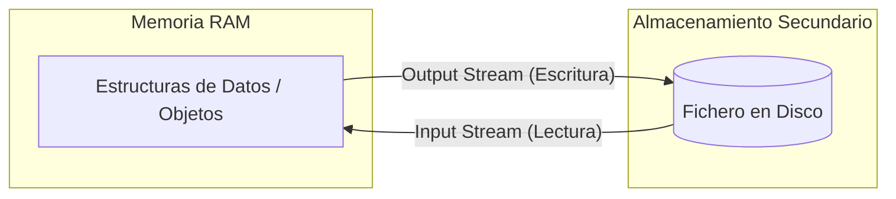
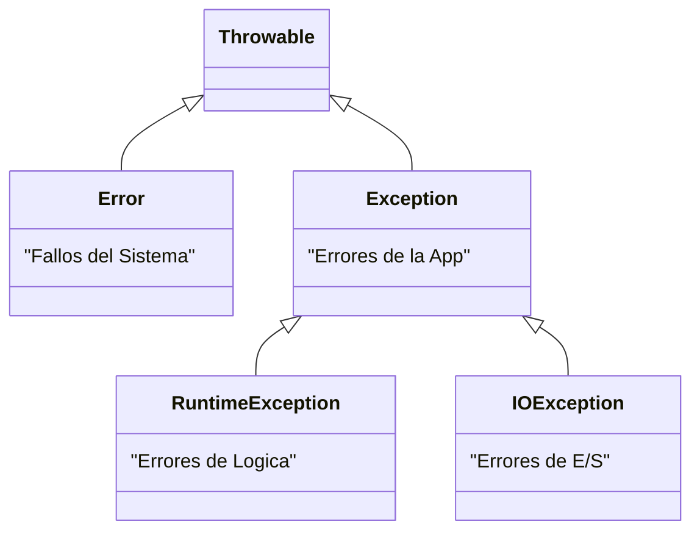
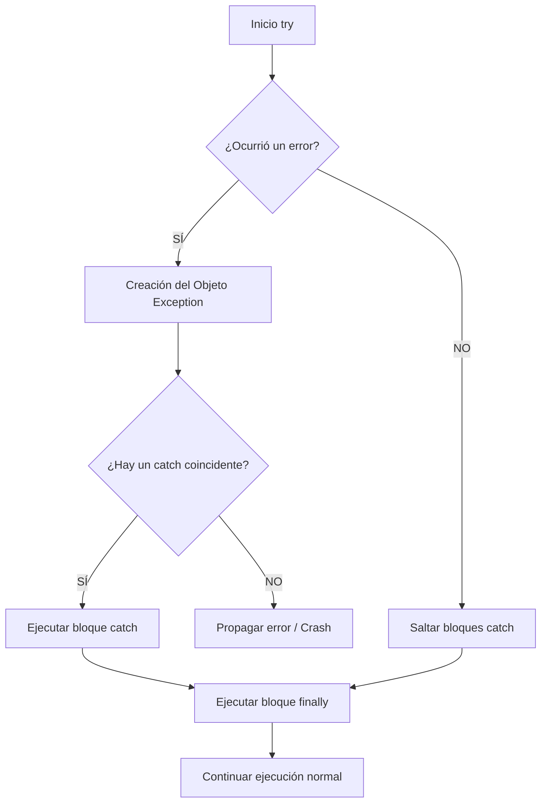

# Unidad 7. Ficheros y Excepciones

## 1. Ficheros y Persistencia de Datos

En el ciclo de vida de cualquier aplicación de software, la gestión de la memoria es un factor crítico. Hasta este momento de tu aprendizaje, todas las estructuras de datos y objetos instanciados (como un `ArrayList` de personajes o un objeto `Guerrero`) han residido exclusivamente en la **Memoria Principal (RAM)**.

La característica fundamental de la memoria RAM es su **volatilidad**. Esto significa que el estado de la aplicación se pierde irremediablemente cuando el proceso termina, ya sea por una finalización normal o por una interrupción del sistema.

Para garantizar que la información sobreviva a la ejecución del programa, debemos recurrir a la **Persistencia de Datos**.

### 1.1. El Concepto de Persistencia y el Sistema de Archivos

La persistencia es la capacidad de un sistema para almacenar el estado de los datos en una **Memoria Secundaria no volátil** (como un disco duro HDD, un SSD o almacenamiento en la nube). El sistema operativo gestiona esta memoria mediante un **Sistema de Archivos** (File System), proporcionando una abstracción lógica a la que denominamos **Fichero** (o archivo).

Un fichero no es más que una secuencia contigua de bytes almacenada en un dispositivo físico y referenciada mediante una ruta (*path*) y un nombre.

El proceso de persistencia implica dos operaciones fundamentales de Entrada/Salida (I/O o *Input/Output*):

* **Escritura (Output / Save):** Consiste en transformar los objetos y datos de la memoria RAM en un formato almacenable (proceso de codificación o serialización) y enviarlos al disco duro.
* **Lectura (Input / Load):** Consiste en recuperar los bytes del disco, decodificarlos (*parseo*) y reconstruir las estructuras de datos y objetos en la memoria RAM para que el programa pueda volver a operar con ellos.

### 1.2. Clasificación de Ficheros: Texto vs. Binario

A bajo nivel (a nivel de máquina), todos los ficheros son secuencias de ceros y unos. Sin embargo, a nivel de programación y estructuración de la información, clasificamos los ficheros en dos grandes familias dependiendo de cómo el software deba interpretar esos bytes.

| Característica | Ficheros de Texto | Ficheros Binarios |
| :--- | :--- | :--- |
| **Codificación** | Usan tablas de caracteres estándar (ASCII, UTF-8, etc.). | Bytes crudos (*Raw bytes*). No tienen una codificación de texto subyacente. |
| **Legibilidad** | Legibles e interpretables por el ser humano usando un editor de texto simple. | Solo legibles por la máquina o el programa específico que los creó. |
| **Eficiencia** | Mayor tamaño. Requieren un proceso de "parseo" (traducción de texto a tipos de datos como `int` o `double`). | Muy eficientes. Ocupan menos espacio y el volcado a memoria RAM es casi directo. |
| **Interoperabilidad** | Muy alta. Son el estándar para compartir datos entre diferentes sistemas operativos y lenguajes. | Baja. Suelen depender de la arquitectura del procesador o la versión del software. |
| **Ejemplos** | `.txt`, `.csv`, `.json`, `.xml`, código fuente (`.java`). | `.dat`, `.bin`, `.png`, `.mp3`, código compilado (`.class`). |

En esta unidad, nos centraremos principalmente en la manipulación de **ficheros de texto**, ya que facilitan la depuración en las etapas iniciales del aprendizaje y son la base para formatos modernos de intercambio de datos como JSON o XML.

### 1.3. El Concepto de Flujo de Datos (Streams)

En el ecosistema de Java (paquete `java.io`), las operaciones de Entrada y Salida no se realizan enviando bloques masivos de datos "de golpe". En su lugar, se gestionan mediante la abstracción de **Streams** (Flujos de datos).

Un *Stream* representa un canal de comunicación continuo, secuencial y unidireccional entre el programa y el origen/destino de los datos (en este caso, un fichero en el disco).

* **Input Stream (Flujo de Entrada):** El programa "absorbe" datos del exterior de forma secuencial.
* **Output Stream (Flujo de Salida):** El programa "escupe" datos hacia el exterior.



---

## 2. La Clase File: Abstracción de Rutas y Metadatos

La clase `File` (perteneciente al paquete `java.io`) es nuestra herramienta principal para interactuar con la topología del **Sistema de Archivos**. 

Es fundamental comprender un concepto que suele causar confusión en la programación inicial: **Instanciar un objeto `File` no crea un archivo en el disco físico ni abre un flujo de datos (Stream)**. Un objeto `File` es simplemente una **representación lógica** (una ruta o *path*) en la memoria de Java que apunta a un recurso que puede, o no, existir físicamente en el dispositivo de almacenamiento.

### 2.1. Rutas Absolutas vs. Rutas Relativas

Al instanciar un objeto `File`, debemos proporcionar una cadena de texto que indique la ubicación del recurso. Esta ruta puede definirse mediante dos enfoques:

* **Ruta Absoluta:** Especifica la ubicación exacta y completa desde la raíz del sistema operativo. Es rígida y suele dar problemas al cambiar de entorno de ejecución.
    * *Ejemplo Windows:* `C:\\Usuarios\\Jose\\Documentos\\datos.txt`
    * *Ejemplo Linux/macOS:* `/home/jose/documentos/datos.txt`
* **Ruta Relativa:** Especifica la ubicación en relación con el directorio de trabajo actual (generalmente, la carpeta raíz del proyecto en el entorno de desarrollo). Es la opción recomendada, ya que garantiza la portabilidad del código.
    * *Ejemplo:* `datos.txt` (busca en la raíz del proyecto) o `guardados/partida.txt` (busca en una subcarpeta interna).

### 2.2. Métodos de Inspección (Metadatos)

Una vez instanciado nuestro objeto `File`, podemos interrogar al sistema operativo sobre las propiedades y metadatos del recurso apuntado utilizando diversos métodos.

| Método | Retorno | Descripción Técnica |
| :--- | :--- | :--- |
| `exists()` | `boolean` | Verifica si la ruta especificada corresponde a un elemento físico real en el disco. |
| `isFile()` | `boolean` | Determina si el elemento apuntado es un archivo estándar de datos. |
| `isDirectory()` | `boolean` | Determina si el elemento apuntado es una carpeta (directorio). |
| `length()` | `long` | Devuelve el tamaño del archivo en bytes (0L si no existe o es un directorio vacío). |
| `getName()` | `String` | Extrae y devuelve únicamente el nombre final del archivo o directorio (ej: `datos.txt`). |
| `getAbsolutePath()`| `String` | Resuelve la ruta relativa y devuelve la ruta absoluta completa en el sistema operativo. |

### 2.3. Manipulación del Sistema de Archivos

Además de la lectura de metadatos, la clase `File` nos otorga capacidad para alterar la estructura del almacenamiento secundario (siempre sujeto a los permisos del sistema operativo):

| Método | Retorno | Descripción Técnica |
| :--- | :--- | :--- |
| `createNewFile()` | `boolean` | Crea un nuevo archivo vacío físicamente en el disco. Requiere control de `IOException`. |
| `mkdir()` | `boolean` | Crea un único directorio (carpeta) en la ruta especificada. |
| `mkdirs()` | `boolean` | Crea un directorio y, de manera recursiva, todos los directorios padre necesarios. |
| `delete()` | `boolean` | Elimina el archivo o directorio. **Nota:** El directorio debe estar vacío para poder borrarlo. |
| `renameTo(File dest)` | `boolean` | Cambia el nombre del archivo o lo reubica (mueve) a una nueva ruta. |

### 2.4. Ejemplo Práctico: Analizador de Archivos

A continuación, implementamos un programa que combina estos conceptos para analizar y crear un recurso en el sistema de archivos de forma robusta.

```java
import java.io.File;
import java.io.IOException;

public class GestorArchivos {
    public static void main(String[] args) {
        // Utilizamos una ruta relativa para mayor portabilidad
        File miArchivo = new File("configuracion_juego.txt");

        System.out.println("--- ANÁLISIS DEL SISTEMA DE ARCHIVOS ---");
        System.out.println("Ruta absoluta resuelta: " + miArchivo.getAbsolutePath());

        if (miArchivo.exists()) {
            System.out.println("Estado: El recurso EXISTE en el almacenamiento.");
            
            if (miArchivo.isFile()) {
                System.out.println("Tipo: Es un FICHERO de datos.");
                System.out.println("Tamaño: " + miArchivo.length() + " bytes.");
            } else if (miArchivo.isDirectory()) {
                System.out.println("Tipo: Es un DIRECTORIO.");
            }
        } else {
            System.out.println("Estado: El recurso NO EXISTE. Procediendo a instanciarlo físicamente...");
            
            try {
                // Invocamos al SO para crear el archivo en disco
                boolean creado = miArchivo.createNewFile();
                
                if (creado) {
                    System.out.println("Éxito: Archivo materializado correctamente en el disco.");
                }
            } catch (IOException e) {
                // Interceptamos posibles errores (ej. permisos insuficientes)
                System.err.println("Error crítico de E/S al intentar crear el archivo: " + e.getMessage());
            }
        }
    }
}
```

!!! question "💻 Momento de Práctica: Explorador del Sistema"
    Copia el código anterior en un nuevo proyecto de IntelliJ y ejecútalo. Una vez funcione, intenta realizar estas modificaciones:
    
    1.  Cambia el nombre del archivo de `configuracion_juego.txt` a algo diferente (ej: `mis_stats.dat`).
    2.  Modifica el código para que, si el archivo ya existe, **lo borre** usando `miArchivo.delete()` e informe al usuario.
    3.  Intenta crear una carpeta en lugar de un archivo usando `miArchivo.mkdir()`. ¿Qué cambia en la salida del programa cuando compruebas `isFile()` y `isDirectory()`?

---


## 3. Lectura de Ficheros de Texto: La Clase Scanner

Aunque habitualmente asociamos la clase `Scanner` (del paquete `java.util`) a la captura de entrada estándar por teclado (`System.in`), su diseño original es mucho más versátil y ambicioso. `Scanner` es, en realidad, un potente **analizador léxico** (o *parser*) capaz de procesar cualquier flujo de entrada de texto, incluidos los ficheros alojados en el disco.

La mayor ventaja de utilizar `Scanner` frente a otras herramientas de lectura más primitivas radica en su capacidad para interpretar el texto y realizar conversiones de tipo (*type casting*) de forma automática al vuelo.

### 3.1. Tokenización y el Cursor Interno

Cuando `Scanner` lee un fichero, no lo procesa simplemente como una enorme cadena de caracteres. En su lugar, aplica un proceso de **tokenización**. 

Por defecto, utiliza los espacios en blanco, las tabulaciones y los saltos de línea como **delimitadores**. El texto comprendido entre dos delimitadores se considera un **Token** (un "trozo" de información con significado).

Para avanzar por el archivo, `Scanner` utiliza un **cursor interno** (o puntero) que avanza secuencialmente. El flujo de trabajo típico sigue un patrón de inspección y extracción:

1. **Inspeccionar:** ¿Hay un siguiente token válido disponible?
2. **Extraer:** Lee el token, conviértelo al tipo de dato deseado y avanza el cursor.

### 3.2. Métodos de Inspección y Extracción

Para operar de forma segura sin sobrepasar el límite del archivo (lo que provocaría una excepción `NoSuchElementException`), debemos emparejar los métodos de inspección (`hasNext...`) con los de extracción (`next...`).

| Acción sobre el Cursor | Método de Inspección (Devuelve `boolean`) | Método de Extracción (Avanza el cursor) | Descripción / Tipo Retornado |
| :--- | :--- | :--- | :--- |
| **Por Tokens (Palabras)** | `hasNext()` | `next()` | Lee la siguiente palabra hasta el próximo espacio. Retorna `String`. |
| **Por Líneas Completas** | `hasNextLine()` | `nextLine()` | Lee toda la línea hasta el salto de línea (`\n`). Retorna `String`. |
| **Por Tipos Numéricos** | `hasNextInt()` | `nextInt()` | Extrae el token y lo parsea matemáticamente a `int`. |
| **Por Tipos Decimales** | `hasNextDouble()` | `nextDouble()` | Extrae el token y lo parsea a `double` (ojo con la configuración regional: coma vs. punto). |

!!! warning "Aviso Temporal: La firma throws y el Cierre de Recursos"
    Al igual que ocurre al crear archivos, intentar abrir un flujo de lectura sobre un recurso que no existe lanzará un error crítico. Por ahora, añadiremos `throws FileNotFoundException` en la declaración de nuestro método `main`. Además, es un imperativo técnico **cerrar siempre el flujo** (`lector.close()`) al terminar de leer. Dejar flujos abiertos consume memoria RAM (fugas de memoria) y mantiene el archivo bloqueado a nivel de sistema operativo.

### 3.3. Ejemplo Práctico: Extracción de Datos Tipados (Parseo)

Supongamos que tenemos un archivo llamado `estadisticas_personaje.txt` que contiene, en una sola línea separada por espacios, el nombre, el nivel y la salud máxima de un jugador (Ej: `Aragorn 15 250,5`).

```java
import java.io.File;
import java.util.Scanner;
import java.io.FileNotFoundException;

public class LectorAvanzado {
    public static void main(String[] args) throws FileNotFoundException {
        File archivoStats = new File("estadisticas_personaje.txt");
        
        // Inicializamos el analizador léxico conectándolo al archivo
        Scanner analizador = new Scanner(archivoStats);

        System.out.println("--- DECODIFICANDO ARCHIVO DE GUARDADO ---");
        
        // Verificamos y extraemos asegurando el tipo de dato
        if (analizador.hasNext()) {
            String nombrePersonaje = analizador.next(); // Extrae "Aragorn"
            System.out.println("Héroe: " + nombrePersonaje);
        }
        
        if (analizador.hasNextInt()) {
            int nivel = analizador.nextInt(); // Extrae "15" y lo convierte a entero
            System.out.println("Nivel actual: " + nivel);
        }
        
        if (analizador.hasNextDouble()) {
            double salud = analizador.nextDouble(); // Extrae "250.5" como decimal
            System.out.println("Puntos de Salud Máximos: " + salud);
        }
        
        // Liberamos los recursos del sistema operativo
        analizador.close(); 
        System.out.println("--- LECTURA FINALIZADA CON ÉXITO ---");
    }
}
```

!!! question "💻 Momento de Práctica: El Lector de Personajes"
    Para este ejercicio, primero crea manualmente un archivo llamado `jugadores.txt` con el siguiente contenido (fíjate bien en el orden):
    `Legolas 12 180,5`

    Ahora, modifica el programa `LectorAvanzado` para:
    
    1.  Cambiar el nombre del archivo a `jugadores.txt`.
    2.  Intentar leer los datos usando primero `next()`, luego `nextInt()` y finalmente `nextDouble()`.
    3.  ¿Qué pasa si en el archivo cambias el `180,5` por `180.5` (punto en lugar de coma)? Investiga por qué `Scanner` se comporta de forma diferente según el idioma de tu ordenador.

### 3.4. De Fichero a Objeto: Reconstruyendo la Información

En la Programación Orientada a Objetos, lo más potente no es solo leer datos sueltos, sino utilizarlos para **instanciar objetos** que recuperen su estado desde el disco.

Este proceso es la base de cualquier sistema de "Cargar Partida". La técnica consiste en leer los tokens del archivo en el orden exacto y pasarlos como argumentos al constructor de nuestra clase.

```java
class Personaje {
   
    private String nombre;
    private int nivel;
    private double puntosVida;

    public Personaje(String nombre, int nivel, double puntosVida) {
        this.nombre = nombre;
        this.nivel = nivel;
        this.puntosVida = puntosVida;
    }

    /** Getters y Setters ... */

    @Override
    public String toString() {
        return "Héroe: " + nombre + " | Nivel: " + nivel;
    }
}
```

```java
import java.io.File;
import java.util.Scanner;
import java.io.FileNotFoundException;

public class CargarHeroe {
    public static void main(String[] args) throws FileNotFoundException {
        File f = new File("heroe.txt"); // Contenido: "Geralt 30 250,5"
        Scanner sc = new Scanner(f);

        String nombre = null;
        int nivel = 0;
        double vida = 0;

        if (sc.hasNext()) {
            nombre = sc.next();
        }

        if (sc.hasNextInt()) {
            nivel = sc.nextInt();
        }

        if (sc.hasNextDouble()) {
            vida = sc.nextDouble();
        }

        Personaje p = new Personaje(nombre, nivel, vida);

        System.out.println("Objeto reconstruido con éxito:");
        System.out.println(p.toString());

        sc.close();
    }
}
```

!!! question "💻 Momento de Práctica: El Aprendiz de Héroe"
    1.  Crea la clase `Alumno` con los atributos `nombre`, `edad` y `notaMedia`.
    2.  Crea manualmente un archivo `alumno.txt` con los datos de un único estudiante (Ej: `Juan 20 8,5`).
    3.  Modifica el programa `CargarHeroe` para que lea el archivo `alumno.txt` y cree un objeto de la clase `Alumno`.
    4.  Muestra por pantalla la información del alumno usando su método `toString()`.

### 3.5. Lectura de Múltiples Objetos: El Registro del Gremio

En aplicaciones reales, los ficheros suelen contener listas de datos (como un ranking de puntuaciones o un inventario completo). Para reconstruir esta información, combinaremos el uso de un bucle `while` con una colección de tipo `ArrayList`.

Supongamos que el archivo `gremio.txt` contiene varios personajes:
```text
Aragorn 15 250,5
Legolas 12 180,0
Gimli 14 210,5
```

```java
import java.io.File;
import java.util.Scanner;
import java.util.ArrayList;
import java.io.FileNotFoundException;

public class CargarGremio {
    public static void main(String[] args) throws FileNotFoundException {
        File f = new File("gremio.txt");
        Scanner sc = new Scanner(f);
        
        ArrayList<Personaje> listaAventureros = new ArrayList<>();

        // Mientras el archivo tenga más tokens...
        while (sc.hasNext()) {
            String nombre = sc.next();
            int nivel = sc.nextInt();
            double vida = sc.nextDouble();

            // Creamos el objeto y lo añadimos a la lista
            Personaje p = new Personaje(nombre, nivel, vida);
            listaAventureros.add(p);
        }

        sc.close();

        // Mostramos la lista recuperada
        System.out.println("--- AVENTUREROS RECUPERADOS ---");
        for (Personaje a : listaAventureros) {
            System.out.println(a);
        }
    }
}
```

!!! question "💻 Momento de Práctica: El Expediente Académico"
    1.  Reutiliza la clase `Alumno` del ejercicio anterior.
    2.  Crea manualmente un archivo `alumnos.txt` con varias líneas, donde cada línea sea un alumno (Ej: `Juan 20 8,5`).
    3.  Modifica el programa anterior para que lea **todas las líneas** del archivo, cree un objeto para cada estudiante y lo guarde en un `ArrayList<Alumno>`.
    4.  Al final, recorre el `ArrayList` e imprime la información de todos los alumnos recuperados.

---

## 4. Escritura de Ficheros de Texto: La Clase PrintStream

Si la clase `Scanner` nos proporciona un flujo de entrada (*Input Stream*), para materializar la persistencia necesitamos establecer un flujo de salida (*Output Stream*). En el ecosistema de Java, la clase **`PrintStream`** es una de las herramientas más robustas y cómodas para escribir datos de texto estructurado en un fichero.

¿Te resulta familiar la instrucción `System.out.println()`? Efectivamente, `out` es un objeto estático de tipo `PrintStream`. La única diferencia es que `System.out` canaliza el flujo de texto hacia la consola (salida estándar), mientras que nosotros canalizaremos ese mismo flujo hacia un objeto `File` en el disco duro.

### 4.1. Modos de Escritura: Sobreescritura vs. Inserción (Append)

Al establecer un flujo de salida hacia un archivo, debemos tomar una decisión arquitectónica crucial: ¿Queremos destruir el contenido anterior o queremos añadir nueva información al final?

* **Modo Sobreescritura (Truncate):** Es el comportamiento por defecto. Si pasamos directamente un objeto `File` al constructor de `PrintStream`, Java creará el archivo si no existe. Si ya existe, **borrará todo su contenido** antes de empezar a escribir.
* **Modo Inserción (Append):** Si queremos conservar el histórico (por ejemplo, para un archivo *log* o registro de eventos), necesitamos usar una clase intermediaria llamada `FileOutputStream`. Al pasarle el parámetro `true`, le indicamos al sistema operativo que mantenga el contenido y coloque el cursor de escritura al final del documento.

### 4.2. Métodos de Formateo y Volcado

`PrintStream` nos ofrece métodos de alto nivel para formatear la salida antes de enviarla al disco.

| Método | Descripción Técnica |
| :--- | :--- |
| `print(dato)` | Escribe el dato en el flujo sin añadir un salto de línea al final. |
| `println(dato)` | Escribe el dato y añade automáticamente un salto de línea (`\n` o `\r\n` según el SO). |
| `printf(formato, args)` | Permite escribir texto con formato avanzado (inyectando variables en marcadores como `%d` para enteros o `%s` para textos). |
| `flush()` | **Fuerza** el vaciado del búfer interno de memoria, escribiendo físicamente los datos en el disco en ese mismo instante. |
| `close()` | Cierra el flujo de comunicación y libera el recurso. Invoca automáticamente a `flush()` antes de cerrar. |

!!! danger "El Peligro del Búfer (Buffering)"
    Las operaciones directas de escritura en disco son lentas. Por eficiencia, Java guarda lo que escribes en un *búfer* (una memoria temporal en RAM) y solo lo vuelca al disco cuando este se llena o cuando cierras el flujo. **Si tu programa finaliza bruscamente antes de llamar a `close()`, perderás los datos que estaban en el búfer.** ¡Cierra siempre tus *Streams*!

### 4.3. Ejemplo Práctico: El Diario de Batalla (Logger)

Vamos a implementar un sistema que registre los eventos de nuestro juego. Utilizaremos el modo *append* para no perder el histórico de batallas de ejecuciones anteriores.

```java
import java.io.File;
import java.io.FileOutputStream;
import java.io.PrintStream;
import java.io.FileNotFoundException;

public class DiarioBatalla {
    public static void main(String[] args) throws FileNotFoundException {
        File archivoLog = new File("registro_combates.txt");
        
        // 1. Configuramos el flujo en modo APPEND (true)
        // Usamos FileOutputStream como puente para activar la inserción al final
        FileOutputStream puente = new FileOutputStream(archivoLog, true);
        PrintStream escritor = new PrintStream(puente);

        System.out.println("--- REGISTRANDO EVENTOS EN EL DISCO ---");

        // 2. Escribimos usando diferentes formatos
        escritor.println("=====================================");
        escritor.println("NUEVA SESIÓN DE JUEGO INICIADA");
        
        String heroe = "Aragorn";
        String enemigo = "Orco Feo";
        int dano = 45;
        
        // Uso de printf para texto estructurado
        escritor.printf("[COMBATE] %s ha atacado a %s.\n", heroe, enemigo);
        escritor.printf("[DAÑO] Se han infligido %d puntos de daño.\n", dano);
        
        // 3. Cerramos el flujo para forzar el guardado (flush) y liberar el archivo
        escritor.close();
        
        System.out.println("Eventos guardados correctamente en el registro.");
    }
}
```

---

## 5. Ciclo de Vida Completo: Guardando y Cargando Objetos

En las aplicaciones reales no guardamos variables sueltas desvinculadas entre sí; persistimos **el estado de nuestros objetos**. Si tenemos una clase `Personaje`, lo ideal es que la propia clase sepa cómo empaquetar sus atributos para guardarlos en disco y cómo leerlos para reconstruirse.

A este proceso de transformar un objeto de la memoria RAM a un formato de almacenamiento (texto o binario) se le conoce formalmente como **Serialización**. El proceso inverso, reconstruir el objeto en RAM a partir del archivo, es la **Deserialización**.

### 5.1. Serialización Manual de Texto

Vamos a modificar nuestra clase `Personaje` para dotarla de persistencia. Elegiremos un formato estructurado muy sencillo: guardaremos cada atributo en una línea distinta del archivo.

* **Línea 1:** Nombre (`String`)
* **Línea 2:** Nivel (`int`)
* **Línea 3:** Puntos de Salud (`double`)

```java
import java.io.File;
import java.io.PrintStream;
import java.util.Scanner;
import java.io.FileNotFoundException;

public class Personaje {
   
   /** 
     * Definición de atributos, getters y setters 
     *  ...
     * */

    // Comportamiento del personaje
    public void recibirCura(double puntos) {
        this.puntosVida += puntos;
    }

    public void subirNivel() {
        this.nivel++;
    }

    public void mostrarInfo() {
        System.out.printf("Héroe: %s | Nivel: %d | Salud: %.1f\n", nombre, nivel, puntosVida);
    }

    // --- MÉTODOS DE PERSISTENCIA ---

    /**
     * SERIALIZACIÓN: Vuelca el estado actual del objeto al fichero indicado.
     */
    public void guardarPartida(File archivoDestino) throws FileNotFoundException {
        PrintStream escritor = new PrintStream(archivoDestino);
        
        // Guardamos los datos en un orden estricto y predecible
        escritor.println(this.nombre);
        escritor.println(this.nivel);
        escritor.println(this.puntosVida);
        
        escritor.close();
    }

    /**
     * DESERIALIZACIÓN (Patrón Factory): Es un método ESTÁTICO porque necesitamos
     * invocarlo ANTES de tener el objeto creado. Lee el fichero y fabrica el objeto.
     */
    public static Personaje cargarPartida(File archivoOrigen) throws FileNotFoundException {
        
        Scanner lector = new Scanner(archivoOrigen);
        
        // Debemos extraer los datos exactamente en el mismo orden en que se guardaron
        String nom = lector.nextLine();
        int niv = lector.nextInt();
        double puntosVida = lector.nextDouble();
        
        lector.close();
        
        // Utilizamos el constructor estándar con los datos recuperados del disco
        return new Personaje(nom, niv, puntosVida);
    }
}
```

### 5.2. El Bucle Principal del Juego (Main)

Ahora implementaremos la clase principal que actuará como motor del juego. Seguirá un flujo lógico profesional:
1. Comprobar si existe un archivo de guardado previo.
2. Si existe, cargar el estado reconstruyendo el objeto.
3. Si no existe, instanciar un objeto nuevo desde cero.
4. Jugar (modificar el estado en RAM).
5. Guardar la partida antes de salir.

```java
import java.io.File;
import java.io.FileNotFoundException;

public class MotorJuego {
    public static void main(String[] args) throws FileNotFoundException {
        File archivoSave = new File("savegame.txt");
        Personaje jugador;

        System.out.println("--- INICIANDO SISTEMA ---");

        // 1 y 2. FASE DE CARGA (Input)
        if (archivoSave.exists()) {
            System.out.println("Archivo de guardado detectado. Restaurando sesión...");
            // Llamamos al método estático (fábrica) para que nos devuelva el objeto montado
            jugador = Personaje.cargarPartida(archivoSave);
        } else {
            System.out.println("No hay partidas previas. Creando nueva sesión...");
            archivoSave.createNewFile();
            jugador = Personaje("Guerrero Novato", 1, 100.0);
        }

        // Mostramos el estado en RAM
        jugador.mostrarInfo();

        // 4. FASE DE JUEGO (Modificación en RAM)
        System.out.println("\n[EVENTO] Has descansado en la posada y entrenado duro.");
        jugador.recibirCura(25.5);
        jugador.subirNivel();
        
        jugador.mostrarInfo();

        // 5. FASE DE GUARDADO (Output)
        System.out.println("\nGuardando progreso en el disco...");
        // Le pedimos al propio objeto que se guarde a sí mismo
        jugador.guardarPartida(archivoSave);
        
        System.out.println("Sistema apagado con éxito.");
    }
}
```

!!! question "💻 Momento de Práctica: Persistencia de Inventarios"
    Vamos a expandir este concepto para manejar colecciones de datos.
    
    1. Crea un programa que gestione una clase `Inventario`. Esta clase contendrá internamente un `ArrayList<String>` llamado `objetos`.
    2. Diseña un método `guardarInventario(File f)`. Este método debe usar un `PrintStream` para recorrer el `ArrayList` con un bucle `for` e imprimir un objeto por cada línea del fichero.
    3. Diseña el método estático `Inventario cargarInventario(File f)`. Usará un `Scanner` y un bucle `while(lector.hasNextLine())` para leer línea a línea e ir añadiendo los objetos a un nuevo `ArrayList`. Finalmente devolverá el objeto `Inventario` restaurado.

---

## 6. Tratamiento de Excepciones: Robustez del Software

En el desarrollo de software profesional, no basta con escribir código que funcione cuando todo va bien (el llamado *Happy Path* o camino feliz). Un programa robusto debe ser capaz de anticipar, interceptar y recuperarse de situaciones anómalas sin interrumpir abruptamente la experiencia del usuario.

En Java, cualquier evento excepcional que altera el flujo normal de ejecución se materializa en un objeto llamado **Excepción** (`Exception`).

### 6.1. ¿Qué es exactamente una Excepción?

Cuando ocurre un error en tiempo de ejecución (por ejemplo, intentar dividir por cero, acceder a un índice de array que no existe o leer un fichero borrado), la Máquina Virtual de Java (JVM) o el propio método **instancia un objeto** que contiene información detallada sobre el error (el tipo de fallo, el mensaje y la línea exacta donde ocurrió).

Este objeto se "lanza" (*throw*) hacia el sistema. Si el programador no ha escrito un mecanismo para "capturarlo" (*catch*), el error sube por la pila de llamadas (*Call Stack*) hasta llegar al `main`, provocando el cierre forzoso de la aplicación (el temido texto rojo en la consola).

Para evitar este cierre forzoso, podemos "atrapar" ese objeto utilizando una estructura `try-catch` muy intuitiva. Fíjate en este ejemplo sencillo:


```java
System.out.println("--- Inicio del programa ---");

try {
    // Código "arriesgado" que podría fallar
    int resultado = 10 / 0; // Esto lanza una ArithmeticException
    
    // Si la línea anterior falla, el resto del bloque try se ignora
    System.out.println("El resultado es: " + resultado); 
    
} catch (Exception e) {
    // Si hay un error, el control salta inmediatamente aquí
    System.out.println("¡Ups! Ha ocurrido un error: No se puede dividir por cero.");
}

// Gracias al catch, el programa se ha recuperado y puede continuar
System.out.println("--- El programa sigue funcionando tranquilamente ---");
```

### 6.2. La Jerarquía de Excepciones en Java

No todos los errores son iguales. Java clasifica los problemas mediante una jerarquía de herencia estricta que hereda de la clase base `Throwable`.



* **`Error`:** Representa fallos catastróficos a nivel de la Máquina Virtual (ej: `OutOfMemoryError` cuando nos quedamos sin RAM). **No debemos intentar capturarlos**, ya que la aplicación no puede recuperarse de ellos.
* **`Exception` (Checked Exceptions):** Son errores previsibles que dependen de factores externos (como `IOException` al leer el disco duro o `SQLException` en bases de datos). **El compilador nos obliga** a escribir código para manejarlas.
* **`RuntimeException` (Unchecked Exceptions):** Son excepciones no comprobadas que derivan de errores en la lógica del programador (ej: `NullPointerException`, `IndexOutOfBoundsException`). El compilador no obliga a capturarlas; lo correcto es **arreglar el código** para que no sucedan.

### 6.3. Bloques de Control: try, catch y finally

Para interceptar y gestionar estos objetos de error, utilizamos una estructura de control específica.

* **`try`:** Define el bloque de código "arriesgado" que será monitorizado.
* **`catch`:** Define el bloque de recuperación. Solo se ejecuta si ocurre una excepción del tipo especificado (o sus clases hijas). Podemos encadenar múltiples `catch` para manejar distintos errores de forma específica.
* **`finally`:** Bloque opcional pero vital para la gestión de recursos. Se ejecuta **SIEMPRE**, independientemente de si el código falló o tuvo éxito, e incluso si hay un `return` previo.



**Ejemplo de Sintaxis:**

```java
import java.util.InputMismatchException;
import java.util.Scanner;

public class DivisionSegura {
    public static void main(String[] args) {
        Scanner sc = new Scanner(System.in);
        
        try {
            System.out.print("Introduce un número entero: ");
            int numero = sc.nextInt(); // Riesgo: InputMismatchException
            
            int resultado = 100 / numero; // Riesgo: ArithmeticException
            System.out.println("El resultado es: " + resultado);

        } catch (InputMismatchException e) {
            System.err.println("Error: No has introducido un número válido.");
            
        } catch (ArithmeticException e) {
            System.err.println("Error matemático: " + e.getMessage());
            
        } finally {
            System.out.println("Liberando el lector (Scanner).");
            sc.close(); // Se ejecuta pase lo que pase
        }
    }
}
```

### 6.4. Propagación y Lanzamiento (throws y throw)

A veces, un método no tiene la capacidad (o no es su responsabilidad) solucionar un problema. En lugar de usar `try-catch`, el método puede "lavarse las manos" y pasarle el problema al método que lo llamó.

* **`throws` (Aviso en la firma):** Informa al compilador de que el método *podría* lanzar una excepción, obligando a quien lo use a capturarla. Es lo que hemos estado usando temporalmente en nuestro `main`.
* **`throw` (Lanzamiento manual):** La palabra clave (sin la 's' final) que utilizamos para materializar y arrojar la excepción manualmente cuando detectamos una anomalía de negocio.

```java
public class Banco {
    
    // El método avisa de que lanza un error con "throws"
    public void retirarDinero(double saldo, double cantidad) throws Exception {
        if (cantidad > saldo) {
            // Instanciamos y lanzamos el error manualmente con "throw"
            throw new Exception("Saldo insuficiente para esta operación.");
        }
        System.out.println("Retirando " + cantidad + "€");
    }
}
```

---

## 7. Excepciones y Ficheros (El Enfoque Profesional)

La lectura y escritura de ficheros es, por naturaleza, una operación de alto riesgo. Nuestro programa delega el trabajo al Sistema Operativo, y pueden ocurrir multitud de imprevistos físicos o de permisos. Por este motivo, Java clasifica la E/S de datos bajo excepciones comprobadas (*Checked Exceptions*, principalmente `IOException` y su hija `FileNotFoundException`), obligándonos a rodear el código con bloques `try-catch`.

### 7.1. El problema del cierre manual (`finally`)

Históricamente, el gran reto de trabajar con ficheros era garantizar que el flujo de datos (`Stream`) **se cerrara siempre**, incluso si ocurría un error a mitad de la escritura. Dejar un fichero abierto consume memoria y lo bloquea para otros programas.

Para lograrlo, usábamos el bloque `finally`, pero el código resultante era verboso y repetitivo:

```java
PrintStream escritor = null; // Declarado fuera para que el finally lo vea
try {
    escritor = new PrintStream(new File("datos.txt"));
    escritor.println("Guardando...");
} catch (FileNotFoundException e) {
    System.err.println("Error de acceso.");
} finally {
    // Código de limpieza tradicional (propenso a olvidos)
    if (escritor != null) {
        escritor.close();
    }
}
```

### 7.2. La solución moderna: Try-with-resources

Para simplificar esto, a partir de Java 7 se introdujo la estructura **`try-with-resources`**. 

Si declaramos e instanciamos nuestros lectores o escritores **dentro de los paréntesis del `try`**, Java garantiza al 100% que invocará el método `close()` automáticamente en cuanto el bloque termine (ya sea por éxito o por un *crash*). La única condición es que la clase utilizada implemente la interfaz `AutoCloseable` (como hacen `Scanner` y `PrintStream`).

Veamos cómo queda el guardado de nuestro inventario con este enfoque profesional, limpio y seguro:

```java
import java.io.File;
import java.io.PrintStream;
import java.io.FileNotFoundException;

public class GuardadoModerno {

    public static void main(String[] args) {
        System.out.println("Iniciando proceso de guardado seguro...");
        File archivo = new File("inventario.txt");

        // Declaramos el recurso dentro de los paréntesis del try
        try (PrintStream escritor = new PrintStream(archivo)) {
            
            // Si llegamos aquí, el archivo está abierto y listo
            escritor.println("Espada Larga");
            escritor.println("Poción de Salud");
            System.out.println("Inventario guardado perfectamente.");

        } catch (FileNotFoundException e) {
            // Interceptamos la anomalía
            System.err.println("ERROR: No se pudo crear o acceder al archivo.");
            System.err.println("Detalles: " + e.getMessage());
        } 
        
        // ¡Magia! No necesitamos bloque 'finally'. 
        // El PrintStream 'escritor' ya está cerrado y la memoria liberada.
        System.out.println("El programa continúa funcionando normalmente...");
    }
}
```

!!! question "💻 Reto Final de Unidad: El Registro del Gremio"
    Crea un sistema para el Gremio de Aventureros usando Ficheros y Excepciones.

    1.  Crea un programa con un menú que permita:
        * **A) Registrar nuevo aventurero:** Pide por Scanner (teclado) el nombre de un jugador y su clase ("Mago", "Guerrero"). Utiliza un **`try-with-resources`** para abrir un `PrintStream` en modo *añadir* (usando `FileOutputStream(..., true)`) y guarda los datos en `gremio.txt`.
        * **B) Leer registro:** Abre `gremio.txt` con un `Scanner` de ficheros en otro `try-with-resources` e imprime por pantalla todos los héroes registrados.
    2.  Todo debe estar protegido por `catch`. Si el archivo `gremio.txt` no existe todavía al intentar leerlo, el `catch` debe interceptar la `FileNotFoundException` y mostrar un mensaje amigable: *"El gremio está vacío. Registra a alguien primero."*.


!!! tip "Consejo Pro: Try-with-resources"
    A partir de Java 7, existe una forma más moderna y limpia de escribir esto que cierra los ficheros automáticamente sin necesidad de usar `finally`. ¡Investiga sobre el **Try-with-resources** si quieres llevar tu código al siguiente nivel!