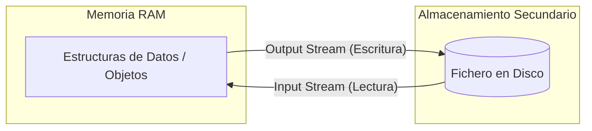
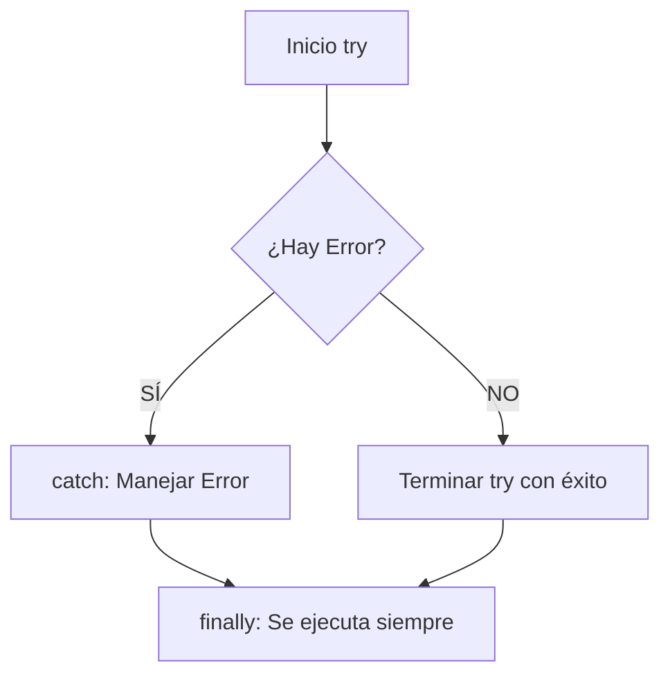

# Unidad 7. Ficheros y Excepciones

## 1. Ficheros y Persistencia de Datos

En el ciclo de vida de cualquier aplicación de software, la gestión de la memoria es un factor crítico. Hasta este momento de tu aprendizaje, todas las estructuras de datos y objetos instanciados (como un `ArrayList` de personajes o un objeto `Guerrero`) han residido exclusivamente en la **Memoria Principal (RAM)**.

La característica fundamental de la memoria RAM es su **volatilidad**. Esto significa que el estado de la aplicación se pierde irremediablemente cuando el proceso termina, ya sea por una finalización normal o por una interrupción del sistema.

Para garantizar que la información sobreviva a la ejecución del programa, debemos recurrir a la **Persistencia de Datos**.

### 1.1. El Concepto de Persistencia y el Sistema de Archivos

La persistencia es la capacidad de un sistema para almacenar el estado de los datos en una **Memoria Secundaria no volátil** (como un disco duro HDD, un SSD o almacenamiento en la nube). El sistema operativo gestiona esta memoria mediante un **Sistema de Archivos** (File System), proporcionando una abstracción lógica a la que denominamos **Fichero** (o archivo).

Un fichero no es más que una secuencia contigua de bytes almacenada en un dispositivo físico y referenciada mediante una ruta (*path*) y un nombre.

El proceso de persistencia implica dos operaciones fundamentales de Entrada/Salida (I/O o *Input/Output*):

* **Escritura (Output / Save):** Consiste en transformar los objetos y datos de la memoria RAM en un formato almacenable (proceso de codificación o serialización) y enviarlos al disco duro.
* **Lectura (Input / Load):** Consiste en recuperar los bytes del disco, decodificarlos (*parseo*) y reconstruir las estructuras de datos y objetos en la memoria RAM para que el programa pueda volver a operar con ellos.

### 1.2. Clasificación de Ficheros: Texto vs. Binario

A bajo nivel (a nivel de máquina), todos los ficheros son secuencias de ceros y unos. Sin embargo, a nivel de programación y estructuración de la información, clasificamos los ficheros en dos grandes familias dependiendo de cómo el software deba interpretar esos bytes.

| Característica | Ficheros de Texto | Ficheros Binarios |
| :--- | :--- | :--- |
| **Codificación** | Usan tablas de caracteres estándar (ASCII, UTF-8, etc.). | Bytes crudos (*Raw bytes*). No tienen una codificación de texto subyacente. |
| **Legibilidad** | Legibles e interpretables por el ser humano usando un editor de texto simple. | Solo legibles por la máquina o el programa específico que los creó. |
| **Eficiencia** | Mayor tamaño. Requieren un proceso de "parseo" (traducción de texto a tipos de datos como `int` o `double`). | Muy eficientes. Ocupan menos espacio y el volcado a memoria RAM es casi directo. |
| **Interoperabilidad** | Muy alta. Son el estándar para compartir datos entre diferentes sistemas operativos y lenguajes. | Baja. Suelen depender de la arquitectura del procesador o la versión del software. |
| **Ejemplos** | `.txt`, `.csv`, `.json`, `.xml`, código fuente (`.java`). | `.dat`, `.bin`, `.png`, `.mp3`, código compilado (`.class`). |

En esta unidad, nos centraremos principalmente en la manipulación de **ficheros de texto**, ya que facilitan la depuración en las etapas iniciales del aprendizaje y son la base para formatos modernos de intercambio de datos como JSON o XML.

### 1.3. El Concepto de Flujo de Datos (Streams)

En el ecosistema de Java (paquete `java.io`), las operaciones de Entrada y Salida no se realizan enviando bloques masivos de datos "de golpe". En su lugar, se gestionan mediante la abstracción de **Streams** (Flujos de datos).

Un *Stream* representa un canal de comunicación continuo, secuencial y unidireccional entre el programa y el origen/destino de los datos (en este caso, un fichero en el disco).

* **Input Stream (Flujo de Entrada):** El programa "absorbe" datos del exterior de forma secuencial.
* **Output Stream (Flujo de Salida):** El programa "escupe" datos hacia el exterior.



---

## 2. La Clase File: Abstracción de Rutas y Metadatos

La clase `File` (perteneciente al paquete `java.io`) es nuestra herramienta principal para interactuar con la topología del **Sistema de Archivos**. 

Es fundamental comprender un concepto que suele causar confusión en la programación inicial: **Instanciar un objeto `File` no crea un archivo en el disco físico ni abre un flujo de datos (Stream)**. Un objeto `File` es simplemente una **representación lógica** (una ruta o *path*) en la memoria de Java que apunta a un recurso que puede, o no, existir físicamente en el dispositivo de almacenamiento.

### 2.1. Rutas Absolutas vs. Rutas Relativas

Al instanciar un objeto `File`, debemos proporcionar una cadena de texto que indique la ubicación del recurso. Esta ruta puede definirse mediante dos enfoques:

* **Ruta Absoluta:** Especifica la ubicación exacta y completa desde la raíz del sistema operativo. Es rígida y suele dar problemas al cambiar de entorno de ejecución.
    * *Ejemplo Windows:* `C:\\Usuarios\\Jose\\Documentos\\datos.txt`
    * *Ejemplo Linux/macOS:* `/home/jose/documentos/datos.txt`
* **Ruta Relativa:** Especifica la ubicación en relación con el directorio de trabajo actual (generalmente, la carpeta raíz del proyecto en el entorno de desarrollo). Es la opción recomendada, ya que garantiza la portabilidad del código.
    * *Ejemplo:* `datos.txt` (busca en la raíz del proyecto) o `guardados/partida.txt` (busca en una subcarpeta interna).

### 2.2. Métodos de Inspección (Metadatos)

Una vez instanciado nuestro objeto `File`, podemos interrogar al sistema operativo sobre las propiedades y metadatos del recurso apuntado utilizando diversos métodos.

| Método | Retorno | Descripción Técnica |
| :--- | :--- | :--- |
| `exists()` | `boolean` | Verifica si la ruta especificada corresponde a un elemento físico real en el disco. |
| `isFile()` | `boolean` | Determina si el elemento apuntado es un archivo estándar de datos. |
| `isDirectory()` | `boolean` | Determina si el elemento apuntado es una carpeta (directorio). |
| `length()` | `long` | Devuelve el tamaño del archivo en bytes (0L si no existe o es un directorio vacío). |
| `getName()` | `String` | Extrae y devuelve únicamente el nombre final del archivo o directorio (ej: `datos.txt`). |
| `getAbsolutePath()`| `String` | Resuelve la ruta relativa y devuelve la ruta absoluta completa en el sistema operativo. |

### 2.3. Manipulación del Sistema de Archivos

Además de la lectura de metadatos, la clase `File` nos otorga capacidad para alterar la estructura del almacenamiento secundario (siempre sujeto a los permisos del sistema operativo):

| Método | Retorno | Descripción Técnica |
| :--- | :--- | :--- |
| `createNewFile()` | `boolean` | Crea un nuevo archivo vacío físicamente en el disco. Requiere control de `IOException`. |
| `mkdir()` | `boolean` | Crea un único directorio (carpeta) en la ruta especificada. |
| `mkdirs()` | `boolean` | Crea un directorio y, de manera recursiva, todos los directorios padre necesarios. |
| `delete()` | `boolean` | Elimina el archivo o directorio. **Nota:** El directorio debe estar vacío para poder borrarlo. |
| `renameTo(File dest)` | `boolean` | Cambia el nombre del archivo o lo reubica (mueve) a una nueva ruta. |

### 2.4. Ejemplo Práctico: Analizador de Archivos

A continuación, implementamos un programa que combina estos conceptos para analizar y crear un recurso en el sistema de archivos de forma robusta.

```java
import java.io.File;
import java.io.IOException;

public class GestorArchivos {
    public static void main(String[] args) {
        // Utilizamos una ruta relativa para mayor portabilidad
        File miArchivo = new File("configuracion_juego.txt");

        System.out.println("--- ANÁLISIS DEL SISTEMA DE ARCHIVOS ---");
        System.out.println("Ruta absoluta resuelta: " + miArchivo.getAbsolutePath());

        if (miArchivo.exists()) {
            System.out.println("Estado: El recurso EXISTE en el almacenamiento.");
            
            if (miArchivo.isFile()) {
                System.out.println("Tipo: Es un FICHERO de datos.");
                System.out.println("Tamaño: " + miArchivo.length() + " bytes.");
            } else if (miArchivo.isDirectory()) {
                System.out.println("Tipo: Es un DIRECTORIO.");
            }
        } else {
            System.out.println("Estado: El recurso NO EXISTE. Procediendo a instanciarlo físicamente...");
            
            try {
                // Invocamos al SO para crear el archivo en disco
                boolean creado = miArchivo.createNewFile();
                
                if (creado) {
                    System.out.println("Éxito: Archivo materializado correctamente en el disco.");
                }
            } catch (IOException e) {
                // Interceptamos posibles errores (ej. permisos insuficientes)
                System.err.println("Error crítico de E/S al intentar crear el archivo: " + e.getMessage());
            }
        }
    }
}
```

!!! question "💻 Momento de Práctica: Explorador del Sistema"
    Copia el código anterior en un nuevo proyecto de IntelliJ y ejecútalo. Una vez funcione, intenta realizar estas modificaciones:
    
    1.  Cambia el nombre del archivo de `configuracion_juego.txt` a algo diferente (ej: `mis_stats.dat`).
    2.  Modifica el código para que, si el archivo ya existe, **lo borre** usando `miArchivo.delete()` e informe al usuario.
    3.  Intenta crear una carpeta en lugar de un archivo usando `miArchivo.mkdir()`. ¿Qué cambia en la salida del programa cuando compruebas `isFile()` y `isDirectory()`?

---


## 3. Lectura de Ficheros de Texto: La Clase Scanner

Aunque habitualmente asociamos la clase `Scanner` (del paquete `java.util`) a la captura de entrada estándar por teclado (`System.in`), su diseño original es mucho más versátil y ambicioso. `Scanner` es, en realidad, un potente **analizador léxico** (o *parser*) capaz de procesar cualquier flujo de entrada de texto, incluidos los ficheros alojados en el disco.

La mayor ventaja de utilizar `Scanner` frente a otras herramientas de lectura más primitivas radica en su capacidad para interpretar el texto y realizar conversiones de tipo (*type casting*) de forma automática al vuelo.

### 3.1. Tokenización y el Cursor Interno

Cuando `Scanner` lee un fichero, no lo procesa simplemente como una enorme cadena de caracteres. En su lugar, aplica un proceso de **tokenización**. 

Por defecto, utiliza los espacios en blanco, las tabulaciones y los saltos de línea como **delimitadores**. El texto comprendido entre dos delimitadores se considera un **Token** (un "trozo" de información con significado).

Para avanzar por el archivo, `Scanner` utiliza un **cursor interno** (o puntero) que avanza secuencialmente. El flujo de trabajo típico sigue un patrón de inspección y extracción:

1. **Inspeccionar:** ¿Hay un siguiente token válido disponible?
2. **Extraer:** Lee el token, conviértelo al tipo de dato deseado y avanza el cursor.

### 3.2. Métodos de Inspección y Extracción

Para operar de forma segura sin sobrepasar el límite del archivo (lo que provocaría una excepción `NoSuchElementException`), debemos emparejar los métodos de inspección (`hasNext...`) con los de extracción (`next...`).

| Acción sobre el Cursor | Método de Inspección (Devuelve `boolean`) | Método de Extracción (Avanza el cursor) | Descripción / Tipo Retornado |
| :--- | :--- | :--- | :--- |
| **Por Tokens (Palabras)** | `hasNext()` | `next()` | Lee la siguiente palabra hasta el próximo espacio. Retorna `String`. |
| **Por Líneas Completas** | `hasNextLine()` | `nextLine()` | Lee toda la línea hasta el salto de línea (`\n`). Retorna `String`. |
| **Por Tipos Numéricos** | `hasNextInt()` | `nextInt()` | Extrae el token y lo parsea matemáticamente a `int`. |
| **Por Tipos Decimales** | `hasNextDouble()` | `nextDouble()` | Extrae el token y lo parsea a `double` (ojo con la configuración regional: coma vs. punto). |

!!! warning "Aviso Temporal: La firma throws y el Cierre de Recursos"
    Al igual que ocurre al crear archivos, intentar abrir un flujo de lectura sobre un recurso que no existe lanzará un error crítico. Por ahora, añadiremos `throws FileNotFoundException` en la declaración de nuestro método `main`. Además, es un imperativo técnico **cerrar siempre el flujo** (`lector.close()`) al terminar de leer. Dejar flujos abiertos consume memoria RAM (fugas de memoria) y mantiene el archivo bloqueado a nivel de sistema operativo.

### 3.3. Ejemplo Práctico: Extracción de Datos Tipados (Parseo)

Supongamos que tenemos un archivo llamado `estadisticas_personaje.txt` que contiene, en una sola línea separada por espacios, el nombre, el nivel y la salud máxima de un jugador (Ej: `Aragorn 15 250,5`).

```java
import java.io.File;
import java.util.Scanner;
import java.io.FileNotFoundException;

public class LectorAvanzado {
    public static void main(String[] args) throws FileNotFoundException {
        File archivoStats = new File("estadisticas_personaje.txt");
        
        // Inicializamos el analizador léxico conectándolo al archivo
        Scanner analizador = new Scanner(archivoStats);

        System.out.println("--- DECODIFICANDO ARCHIVO DE GUARDADO ---");
        
        // Verificamos y extraemos asegurando el tipo de dato
        if (analizador.hasNext()) {
            String nombrePersonaje = analizador.next(); // Extrae "Aragorn"
            System.out.println("Héroe: " + nombrePersonaje);
        }
        
        if (analizador.hasNextInt()) {
            int nivel = analizador.nextInt(); // Extrae "15" y lo convierte a entero
            System.out.println("Nivel actual: " + nivel);
        }
        
        if (analizador.hasNextDouble()) {
            double salud = analizador.nextDouble(); // Extrae "250.5" como decimal
            System.out.println("Puntos de Salud Máximos: " + salud);
        }
        
        // Liberamos los recursos del sistema operativo
        analizador.close(); 
        System.out.println("--- LECTURA FINALIZADA CON ÉXITO ---");
    }
}
```

!!! question "💻 Momento de Práctica: El Lector de Personajes"
    Para este ejercicio, primero crea manualmente un archivo llamado `jugadores.txt` con el siguiente contenido (fíjate bien en el orden):
    `Legolas 12 180,5`

    Ahora, modifica el programa `LectorAvanzado` para:
    
    1.  Cambiar el nombre del archivo a `jugadores.txt`.
    2.  Intentar leer los datos usando primero `next()`, luego `nextInt()` y finalmente `nextDouble()`.
    3.  ¿Qué pasa si en el archivo cambias el `180,5` por `180.5` (punto en lugar de coma)? Investiga por qué `Scanner` se comporta de forma diferente según el idioma de tu ordenador.

### 3.4. De Fichero a Objeto: Reconstruyendo la Información

En la Programación Orientada a Objetos, lo más potente no es solo leer datos sueltos, sino utilizarlos para **instanciar objetos** que recuperen su estado desde el disco.

Este proceso es la base de cualquier sistema de "Cargar Partida". La técnica consiste en leer los tokens del archivo en el orden exacto y pasarlos como argumentos al constructor de nuestra clase.

```java
class Personaje {
   
    private String nombre;
    private int nivel;
    private double puntosVida;

    public Personaje(String nombre, int nivel, double puntosVida) {
        this.nombre = nombre;
        this.nivel = nivel;
        this.puntosVida = puntosVida;
    }

    /** Getters y Setters ... */

    @Override
    public String toString() {
        return "Héroe: " + nombre + " | Nivel: " + nivel;
    }
}
```

```java
import java.io.File;
import java.util.Scanner;
import java.io.FileNotFoundException;

public class CargarHeroe {
    public static void main(String[] args) throws FileNotFoundException {
        File f = new File("heroe.txt"); // Contenido: "Geralt 30 250,5"
        Scanner sc = new Scanner(f);

        String nombre = null;
        int nivel = 0;
        double vida = 0;

        if (sc.hasNext()) {
            nombre = sc.next();
        }

        if (sc.hasNextInt()) {
            nivel = sc.nextInt();
        }

        if (sc.hasNextDouble()) {
            vida = sc.nextDouble();
        }

        Personaje p = new Personaje(nombre, nivel, vida);

        System.out.println("Objeto reconstruido con éxito:");
        System.out.println(p.toString());

        sc.close();
    }
}
```

!!! question "💻 Momento de Práctica: El Aprendiz de Héroe"
    1.  Crea la clase `Alumno` con los atributos `nombre`, `edad` y `notaMedia`.
    2.  Crea manualmente un archivo `alumno.txt` con los datos de un único estudiante (Ej: `Juan 20 8,5`).
    3.  Modifica el programa `CargarHeroe` para que lea el archivo `alumno.txt` y cree un objeto de la clase `Alumno`.
    4.  Muestra por pantalla la información del alumno usando su método `toString()`.

### 3.5. Lectura de Múltiples Objetos: El Registro del Gremio

En aplicaciones reales, los ficheros suelen contener listas de datos (como un ranking de puntuaciones o un inventario completo). Para reconstruir esta información, combinaremos el uso de un bucle `while` con una colección de tipo `ArrayList`.

Supongamos que el archivo `gremio.txt` contiene varios personajes:
```text
Aragorn 15 250,5
Legolas 12 180,0
Gimli 14 210,5
```

```java
import java.io.File;
import java.util.Scanner;
import java.util.ArrayList;
import java.io.FileNotFoundException;

public class CargarGremio {
    public static void main(String[] args) throws FileNotFoundException {
        File f = new File("gremio.txt");
        Scanner sc = new Scanner(f);
        
        ArrayList<Personaje> listaAventureros = new ArrayList<>();

        // Mientras el archivo tenga más tokens...
        while (sc.hasNext()) {
            String nombre = sc.next();
            int nivel = sc.nextInt();
            double vida = sc.nextDouble();

            // Creamos el objeto y lo añadimos a la lista
            Personaje p = new Personaje(nombre, nivel, vida);
            listaAventureros.add(p);
        }

        sc.close();

        // Mostramos la lista recuperada
        System.out.println("--- AVENTUREROS RECUPERADOS ---");
        for (Personaje a : listaAventureros) {
            System.out.println(a);
        }
    }
}
```

!!! question "💻 Momento de Práctica: El Expediente Académico"
    1.  Reutiliza la clase `Alumno` del ejercicio anterior.
    2.  Crea manualmente un archivo `alumnos.txt` con varias líneas, donde cada línea sea un alumno (Ej: `Juan 20 8,5`).
    3.  Modifica el programa anterior para que lea **todas las líneas** del archivo, cree un objeto para cada estudiante y lo guarde en un `ArrayList<Alumno>`.
    4.  Al final, recorre el `ArrayList` e imprime la información de todos los alumnos recuperados.

---


## 4. Escribir ficheros. Clase PrintStream

Para guardar texto en un archivo, usaremos la clase **`PrintStream`**. 

¿Te suena la instrucción `System.out.println()`? ¡Pues `out` es en realidad un objeto de tipo `PrintStream`! La única diferencia es que `System.out` imprime en la pantalla (consola), y nosotros vamos a crear uno que imprima dentro de un archivo de texto.

```java
import java.io.File;
import java.io.PrintStream;
import java.io.FileNotFoundException;

public class GuardarPartida {
    public static void main(String[] args) throws FileNotFoundException {
        File archivo = new File("personaje.txt");
        
        // Creamos el PrintStream apuntando al archivo
        PrintStream escritor = new PrintStream(archivo);

        // ¡Escribimos igual que si fuera por consola!
        escritor.println("Nombre: Conan");
        escritor.println("Nivel: 15");
        escritor.println("Vida: 250");
        
        System.out.println("Partida guardada correctamente.");
        
        // Al terminar, cerramos el flujo de datos
        escritor.close();
    }
}
```

---

## 5. Escribir y leer en un mismo programa

Lo habitual en un juego o aplicación es el ciclo completo: cargamos datos, jugamos (modificamos en RAM) y volvemos a guardar antes de salir.

Vamos a simular que el jugador sube de nivel y actualizamos su archivo.

```java
import java.io.File;
import java.io.PrintStream;
import java.util.Scanner;
import java.io.FileNotFoundException;

public class CicloJuego {
    public static void main(String[] args) throws FileNotFoundException {
        File archivo = new File("nivel_jugador.txt");
        int nivelActual = 1; // Valor por defecto

        // 1. CARGAR (Si existe)
        if (archivo.exists()) {
            Scanner lector = new Scanner(archivo);
            nivelActual = lector.nextInt(); // Leemos el número guardado
            lector.close();
            System.out.println("Partida cargada. Nivel inicial: " + nivelActual);
        }

        // 2. JUGAR (Modificar en RAM)
        System.out.println("¡Has derrotado a un jefe!");
        nivelActual++;
        System.out.println("Tu nuevo nivel es: " + nivelActual);

        // 3. GUARDAR
        PrintStream escritor = new PrintStream(archivo);
        escritor.println(nivelActual); // Sobreescribimos con el nuevo valor
        escritor.close();
        System.out.println("Juego guardado con éxito.");
    }
}
```

!!! question "💻 Momento de Práctica: La Taverna"
    Crea un programa que gestione el oro de tu personaje.
    
    1.  Crea un archivo manual llamado `oro.txt` y escribe dentro un `100`.
    2.  Haz un programa que lea el archivo y guarde el oro en una variable.
    3.  Pregunta al usuario: *"Una poción cuesta 20 monedas. ¿Quieres comprarla? (S/N)"*.
    4.  Si dice que sí, resta 20 al oro y **vuelve a guardar** el nuevo total en `oro.txt`.

---

## 6. Excepciones: Evitando el Crash

¿Recuerdas que tuvimos que poner `throws FileNotFoundException` en el `main`? Eso es porque trabajar con cosas externas al programa (como discos duros o internet) es peligroso. 

* ¿Y si el disco duro está lleno?
* ¿Y si el usuario ha borrado el archivo mientras jugábamos?
* ¿Y si no tenemos permisos de administrador para guardar ahí?

Cuando ocurre un error grave en Java, se "lanza" una **Excepción**. Si no la "atrapamos", el programa se estrella (el famoso texto rojo en la consola).

Para manejar esto de forma profesional y evitar que el juego se cierre bruscamente, usamos los bloques **`try-catch`**.

### 6.1. Estructura try-catch

La sintaxis es como decirle a Java: *"Intenta hacer esto, pero si falla, captura el error y haz esta otra cosa en lugar de explotar"*.

```java
try {
    // Código "peligroso" que podría fallar
    int division = 10 / 0; // Esto lanza ArithmeticException
    
} catch (Exception e) {
    // Código de emergencia si algo falla arriba
    System.out.println("¡Error detectado! " + e.getMessage());
}
```

### 6.2. El bloque finally

Existe un bloque opcional llamado `finally`. El código dentro de este bloque se ejecutará **SIEMPRE**, independientemente de si el código falló o tuvo éxito. Es el lugar ideal para "limpiar" o cerrar cosas.



---

## 7. Excepciones y Ficheros (El Enfoque Profesional)

Ahora que sabemos cazar errores, vamos a quitar el feo `throws FileNotFoundException` del `main` y a programar la lectura y escritura como lo haría un profesional: con sus `try-catch`.

Vamos a crear un método seguro para guardar el inventario de nuestro personaje.

```java
import java.io.File;
import java.io.PrintStream;
import java.io.FileNotFoundException;

public class GuardadoSeguro {

    public static void main(String[] args) {
        System.out.println("Iniciando proceso de guardado...");
        
        File archivo = new File("RutaImposible/inventario.txt"); // Carpeta que no existe
        PrintStream escritor = null; // Lo declaramos fuera para poder cerrarlo en finally

        try {
            // INTENTAMOS abrir el archivo (esto es lo que lanza la excepción)
            escritor = new PrintStream(archivo);
            escritor.println("Espada Larga");
            escritor.println("Poción de Salud");
            System.out.println("Inventario guardado perfectamente.");

        } catch (FileNotFoundException e) {
            // SI FALLA, entramos aquí y el programa no se estrella
            System.out.println("ERROR: No se pudo crear el archivo.");
            System.out.println("Detalles técnicos: " + e.getMessage());

        } finally {
            // SIEMPRE entraremos aquí. Si logramos abrir el escritor, lo cerramos.
            if (escritor != null) {
                escritor.close();
                System.out.println("Flujo de datos cerrado de forma segura.");
            }
        }
        
        System.out.println("El programa continúa funcionando normalmente...");
    }
}
```

!!! tip "Consejo Pro: Try-with-resources"
    A partir de Java 7, existe una forma más moderna y limpia de escribir esto que cierra los ficheros automáticamente sin necesidad de usar `finally`. ¡Investiga sobre el **Try-with-resources** si quieres llevar tu código al siguiente nivel!

!!! question "💻 Reto Final de Unidad: El Registro del Gremio"
    Crea un sistema para el Gremio de Aventureros usando Ficheros y Excepciones.

    1.  Crea un programa con un menú que permita:
        * **A) Registrar nuevo aventurero:** Pide por Scanner (teclado) el nombre de un jugador y su clase ("Mago", "Guerrero"). Abre un `PrintStream` en modo *añadir* (investiga cómo hacer `append` o crear un archivo que no se borre cada vez) y guarda los datos en `gremio.txt`.
        * **B) Leer registro:** Abre `gremio.txt` con un `Scanner` de ficheros e imprime por pantalla todos los héroes registrados.
    2.  Todo debe estar protegido con bloques `try-catch`. Si el archivo `gremio.txt` no existe todavía al intentar leerlo, el `catch` debe mostrar el mensaje: *"El gremio está vacío. Registra a alguien primero."*.
