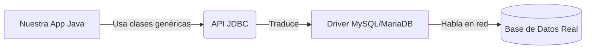
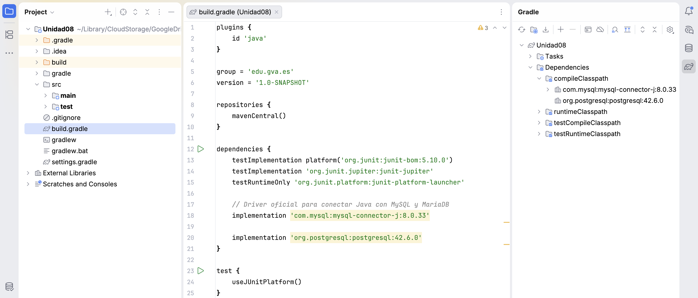
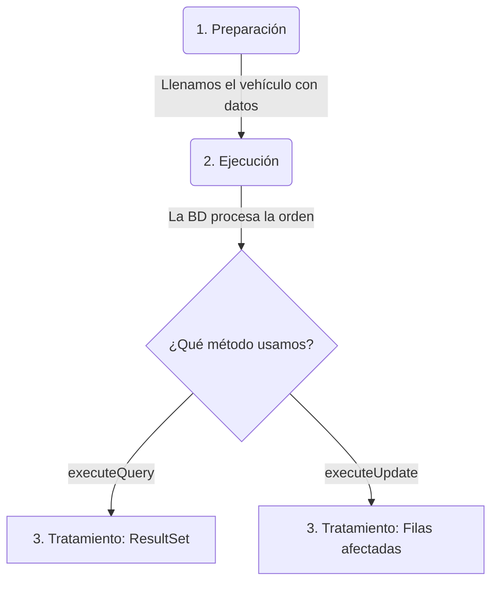
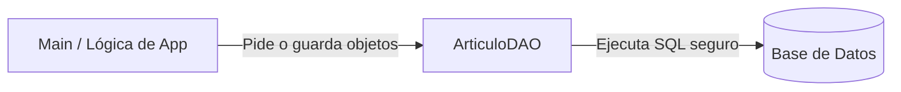
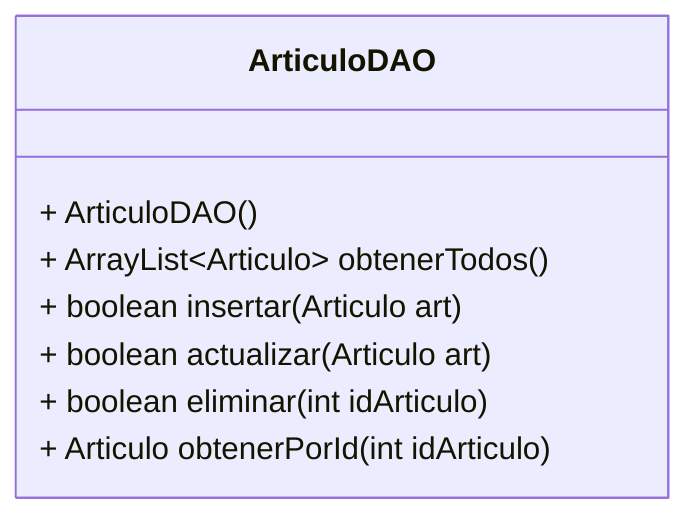

# Unidad 8. Acceso a Bases de Datos: El Ecosistema JDBC

## 1. Introducción: De Ficheros a Bases de Datos

En la unidad anterior aprendimos a persistir información en ficheros de texto. Aunque los ficheros son geniales para guardar configuraciones o datos secuenciales (como un *log*), presentan graves problemas cuando el volumen de datos crece:

* **Búsquedas ineficientes:** Para encontrar un dato, a menudo hay que leer el fichero entero.
* **Problemas de concurrencia:** ¿Qué pasa si dos usuarios intentan escribir en el mismo fichero a la vez?
* **Falta de relaciones:** Es muy difícil vincular datos complejos (ej: "Dime todos los artículos que pertenecen al fabricante Kingston").

Para solucionar esto, la industria utiliza **Sistemas Gestores de Bases de Datos Relacionales (SGBDR)** como MySQL, MariaDB, PostgreSQL o Oracle. En esta unidad aprenderemos a conectar nuestras aplicaciones Java con una base de datos real.

Para nuestros ejemplos, utilizaremos la siguiente base de datos de una **Tienda Informática**:

```sql
-- Estructura de nuestra BD de ejemplo
CREATE DATABASE tienda_informatica;

-- Conectarse a la base de datos en PostgreSQL
\c tienda_informatica;

CREATE TABLE fabricantes (
    id_fabricante INT PRIMARY KEY,
    nombre VARCHAR(100)
);

CREATE TABLE articulos (
    id_articulo INT PRIMARY KEY,
    nombre VARCHAR (100),
    precio INT,
    id_fab INT REFERENCES fabricantes(id_fabricante)
);


INSERT INTO fabricantes VALUES (1, 'Kingston');
INSERT INTO fabricantes VALUES (2, 'Adata');
INSERT INTO fabricantes VALUES (3, 'Logitech');
INSERT INTO fabricantes VALUES (4, 'Lexar');
INSERT INTO fabricantes VALUES (5, 'Seagate');

INSERT INTO articulos VALUES (1, 'Teclado',  100, 3);
INSERT INTO articulos VALUES (2, 'Disco Duro 300GB',  500, 5);
INSERT INTO articulos VALUES (3, 'Mouse',  80, 3);
INSERT INTO articulos VALUES (4, 'Memoria USB',  140, 4);
INSERT INTO articulos VALUES (5, 'Memoria RAM',  290, 1);
INSERT INTO articulos VALUES (6, 'Disco Duro Extraible 230 GB',  650, 5);
INSERT INTO articulos VALUES (7, 'Memoria USB',  279, 1);
INSERT INTO articulos VALUES (8, 'DVD ROM',  450, 2);
INSERT INTO articulos VALUES (9, 'CD ROM' , 200, 2);
INSERT INTO articulos VALUES (10, 'Tarjeta de red',  180, 3);
```

---

## 2. JDBC y el concepto de API

**JDBC (Java Database Connectivity)** es la API estándar de Java para conectarse a bases de datos relacionales (SGBDR). Forma parte del núcleo de Java (paquete **`java.sql`**) y proporciona todas las herramientas necesarias para enviar sentencias SQL, establecer conexiones y procesar los resultados obtenidos.

Una **API** (*Application Programming Interface*) es un conjunto de reglas, interfaces y clases que permiten que dos piezas de software se comuniquen. En este contexto, JDBC define las operaciones genéricas para interactuar con *cualquier* base de datos, ocultando la complejidad subyacente de cada fabricante.



### 2.1. Ventajas de usar JDBC

La magia de JDBC radica en su nivel de abstracción. Entre sus principales ventajas destacan:

* **Independencia del Gestor de Base de Datos (SGBDR):** Escribimos el código Java una sola vez. Si mañana cambiamos nuestra base de datos de MySQL a PostgreSQL o a Oracle, solo tenemos que cambiar la librería traductora (el "Driver") y la cadena de conexión. ¡La lógica de nuestro código Java se mantiene intacta!
* **Portabilidad:** Al ser parte del estándar de Java, se beneficia de su filosofía "Escribe una vez, ejecuta donde sea" (*Write Once, Run Anywhere*). Tu aplicación se conectará a la base de datos de la misma forma en Windows, Linux o macOS.
* **Curva de aprendizaje suave:** Proporciona un conjunto de clases e interfaces uniformes y bien diseñadas (como `Connection`, `PreparedStatement` o `ResultSet`) que estandarizan el flujo de trabajo independientemente de la base de datos utilizada.
* **Ecosistema Empresarial:** JDBC es la base sobre la cual se construyen frameworks más avanzados y complejos del mundo Java (como Hibernate, JPA o Spring Data). Conocer el funcionamiento de JDBC es indispensable para entender y dominar estas herramientas de alto nivel.

---

## 3. Preparación del Entorno (Dependencias)

Java incluye la API JDBC de fábrica instalada en su núcleo, pero **NO incluye los drivers específicos** de cada base de datos. Un driver es una librería externa (un archivo `.jar`) desarrollada por el fabricante que sabe exactamente cómo traducir las órdenes genéricas de Java (JDBC) al dialecto específico de su base de datos (MySQL, SQLite, PostgreSQL, etc.).

Para añadir este driver a nuestro proyecto de forma profesional, no debemos descargar el archivo a mano. En su lugar, utilizamos un **Gestor de Dependencias** como **Gradle** (el estándar moderno ampliamente utilizado en IDEs como IntelliJ IDEA).

### 3.1. Configuración paso a paso con Gradle

A continuación, veremos cómo añadir el driver de tu base de datos (**MySQL / MariaDB** o **PostgreSQL**) a tu proyecto usando Gradle:

**Paso 1: Localizar el archivo de configuración**
En tu proyecto Gradle, busca en la carpeta raíz un archivo llamado `build.gradle`. Este archivo contiene la receta de construcción y las dependencias de tu proyecto.

**Paso 2: Añadir la dependencia**
Abre el archivo y busca el bloque llamado `dependencies { ... }`. Dentro de este bloque, debes añadir la línea correspondiente al conector JDBC del motor que vayas a utilizar.

Edita el archivo para incluir la dependencia que necesites (asegúrate de incluir solo la correspondiente a tu base de datos):

```groovy
dependencies {
    // ... otras dependencias

    // OPCION A: Driver oficial para conectar Java con MySQL y MariaDB
    implementation 'com.mysql:mysql-connector-j:8.0.33'

    // OPCION B: Driver oficial para conectar Java con PostgreSQL
    implementation 'org.postgresql:postgresql:42.6.0'
}
```

!!! note "¿Qué significan estas instrucciones?"

    * **`implementation`**: Le indica a Gradle que esta librería es necesaria para compilar y ejecutar nuestro programa.
    * **Grupo y Artefacto (ej. `com.mysql:mysql-connector-j` o `org.postgresql:postgresql`)**: Es el identificador único de la librería en los repositorios centrales de internet.
    * **Versión (ej. `8.0.33` o `42.6.0`)**: Es la versión exacta que queremos descargar.

**Paso 3: Sincronizar el proyecto (¡Paso crítico!)**
Una vez modificado el archivo `build.gradle`, **el driver todavía no está en tu ordenador**. Necesitas indicarle a tu entorno de desarrollo que aplique y descargue esos cambios.

* Si utilizas **IntelliJ IDEA**, tras modificar el archivo, aparecerá un pequeño icono flotante en la parte superior derecha del editor con un elefante y unas flechas circulares. Debes hacer clic en **"Load Gradle Changes"** (o en el icono de sincronizar).
* En ese instante, Gradle se conectará a internet, descargará automáticamente el `.jar` del driver desde el repositorio central y lo configurará en tu proyecto Java de manera invisible. En cuanto acabe la barra de progreso, ¡tu entorno estará listo!



!!! tip "La importancia de Gradle y Maven"
    Aprender a manejar herramientas como Gradle (o su alternativa, Maven) te ahorrará muchísimos problemas de versiones y librerías perdidas ("En mi máquina sí funciona"). Son el estándar absoluto hoy en día en cualquier empresa de desarrollo de software.

!!! question "Práctica Guiada: Tu Primer Proyecto JDBC"
    ¡Es hora de mancharse las manos de código! Vamos a crear desde cero el entorno de trabajo que usaremos durante toda esta unidad.

    1. **Crear el proyecto:** Abre IntelliJ IDEA (o tu IDE favorito) y crea un nuevo proyecto seleccionando explícitamente **Gradle** como sistema de construcción (*Build system*).
    2. **Configurar el `build.gradle`:** Localiza el archivo de configuración de Gradle y añade dentro de su bloque `dependencies` la ruta oficial del conector JDBC para tu motor de base de datos (PostgreSQL, preferentemente), tal y como acabamos de ver en el apartado 3.1.
    3. **Sincronizar el entorno:** Recarga el proyecto (pulsando en el icono del elefante u opción de sincronizar) para que la librería sea descargada de internet e integrada en el proyecto de manera automática.
    4. **Verificar las dependencias:** Asegúrate de que no existan líneas rojas subyacentes indicando un error en el archivo `build.gradle`. Si todo se cargó con éxito, tu proyecto Java recién nacido ya estará capacitado arquitectónicamente para conectarse con un Sistema Gestor de Bases de Datos.

---

## 4. El Conector de la BD (`Connection`)

Para operar con la base de datos, el primer paso indispensable es establecer un "túnel" de comunicación. Esto se hace mediante la interfaz **`Connection`** y la clase **`DriverManager`**.

Necesitamos tres datos clave (que encapsularemos como **Constantes** de clase para centralizar su configuración y evitar sobreescrituras):

1. **URL de conexión:** Indica el protocolo, la IP, el puerto y el nombre de la BD (ej. `jdbc:postgresql://localhost:5432/tienda_informatica`).
2. **Usuario:** Credencial de acceso (ej: `postgres`).
3. **Contraseña:** Clave del usuario.

Como la conexión por red puede fallar, **es obligatorio usar `try-catch`** (concretamente capturando `SQLException`). Una buena práctica es encapsular y aislar esta lógica en su propio método (por ejemplo, `conectar()`) en lugar de amontonar código en el `main`.

```java
import java.sql.Connection;
import java.sql.DriverManager;
import java.sql.SQLException;

public class ConexionBD {
    
    // 1. Definimos los datos de conexión granulares como constantes de clase
    private static final String HOST = "localhost:5432";
    private static final String DB_NAME = "tienda_informatica";
    private static final String USUARIO = "postgres";
    private static final String PASSWORD = "tu_password";
    
    // Construimos la URL completa uniendo las variables
    private static final String URL = "jdbc:postgresql://" + HOST + "/" + DB_NAME;

    /**
     * Establece y devuelve una conexión con la base de datos
     */
    public static Connection conectar() {
        Connection conexion = null;
        try {
            System.out.println("Intentando conectar a la base de datos...");
            // Abrimos la comunicación usando nuestras constantes
            conexion = DriverManager.getConnection(URL, USUARIO, PASSWORD);
            System.out.println("¡Conexión establecida con éxito!");
        } catch (SQLException e) {
            System.err.println("Error de conexión: " + e.getMessage());
        }
        return conexion;
    }

    public static void main(String[] args) {
        System.out.println("Iniciando aplicación de prueba...");
        
        // Llamamos al método conectar.
        // Lo envolvemos en un try-with-resources para asegurar que se cierre al terminar.
        try (Connection con = conectar()) {
            
            if (con != null) {
                System.out.println("=> La base de datos está lista para recibir comandos SQL.");
                // Aquí irían nuestras futuras operaciones de inserción, borrado, etc.
            }
            
        } catch (SQLException e) {
            System.err.println("Fallo inesperado al cerrar la base de datos: " + e.getMessage());
        }
    }
}
```

!!! question "Práctica Guiada: Tu primera clase de Conexión"
    ¡Seguimos ampliando el proyecto! Ahora vamos a sentar las bases de la comunicación creando nuestra primera clase.

    1. **Crear el paquete:** En tu proyecto (dentro de `src/main/java`), crea un paquete organizativo llamado `model` o `database`.
    2. **Crear la clase:** Crea una nueva clase de Java llamada `ConexionBD` y copia o transcribe la estructura que hemos definido arriba.
    3. **Ajustar constantes:** Modifica el valor de las constantes `USUARIO` y `PASSWORD` para que coincidan explícitamente con los que configuraste durante la instalación de tu servidor PostgreSQL.
    4. **Comprobar errores sintácticos:** Revisa que los `import` funcionen y que tu IDE no marque la interfaz `Connection` en rojo. Si aparece subrayada en rojo, significa que la descarga del driver en el `build.gradle` (la práctica 1) no se sincronizó correctamente.
    5. **Prueba de fuego:** Ejecuta el método `main` alojado dentro de `ConexionBD`. Si la consola inferior imprime *"¡Conexión establecida con éxito!"*, ¡enhorabuena, tu programa Java y tu Base de Datos ya están hablando!

---

## 5. Ejecución de Consultas: Planificación y Tipos

Una vez conectados, necesitamos un "vehículo" para enviar nuestras instrucciones SQL. Java nos ofrece dos opciones principales:

| Vehículo | Clase en Java | ¿Cuándo usarlo? | Seguridad |
| :--- | :--- | :--- | :--- |
| **Simple** | `Statement` | Consultas estáticas, sin variables (ej: `SELECT * FROM fabricantes`). | Peligro de Inyección SQL si se concatenan variables. |
| **Preparado** | `PreparedStatement`| Consultas dinámicas, con variables. Se pre-compila en el servidor. | Protegido contra Inyección SQL. Más rápido y seguro. |

!!! warning "La regla de oro de la seguridad"
    **NUNCA** construyas una consulta SQL concatenando Strings con variables del usuario (ej: `"SELECT * FROM tabla WHERE id = " + idUsuario`). Esto abre la puerta a la vulnerabilidad más famosa de la historia: la **Inyección SQL**. Utiliza siempre `PreparedStatement`.

### 5.1. El Ciclo de Vida de una Consulta (Planificación)

Cualquier interacción con la base de datos sigue siempre un ciclo de vida compuesto de tres fases fundamentales: **preparación**, **ejecución** y **tratamiento**.



1. **Preparación**: Se define el texto de la sentencia SQL asegurada (usualmente con las interrogaciones `?` reservando espacios) y se le inyectan los valores reales que el usuario haya escrito en el formulario.
2. **Ejecución**: El "vehículo" sale de nuestra aplicación Java hacia el motor de base de datos para que esta valide y procese la instrucción de forma segura sin peligro de inyección.
3. **Tratamiento**: La base de datos responde. Si hemos leído información (`SELECT`), debemos iterar y traducir la tabla devuelta fila a fila con un `ResultSet`. Si hemos modificado datos (`INSERT`, `UPDATE`, `DELETE`), recibiremos un número o `int` comprobando el número de registros que han sido modificados.

### 5.2. Tipos de Ejecución

Dependiendo de la consulta SQL que envíemos en la fase de Ejecución, invocaremos un método diferente:

1. **`executeQuery()`**: Para consultas `SELECT`. Devuelve un objeto **`ResultSet`** (una tabla con los resultados).
2. **`executeUpdate()`**: Para `INSERT`, `UPDATE` o `DELETE`. Devuelve un número entero (`int`) que indica cuántas filas han sido modificadas.

---

## 6. Operaciones CRUD en Acción

CRUD son las siglas de *Create, Read, Update, Delete* (Crear, Leer, Actualizar, Borrar). Son las cuatro operaciones fundamentales en cualquier base de datos. A continuación, vamos a desglosar en qué consiste cada una para luego realizar un ejemplo práctico completo integrando todas en una sola clase Java.

### 6.1. CREATE (Insertar)

Para añadir registros nuevos a la base de datos se utiliza una consulta `INSERT` ejecutada a través de un `PreparedStatement` llamando al método `executeUpdate()`.

* Las interrogaciones `?` actúan de marcadores de posición.
* Debemos rellenar esas posiciones invocando los métodos `set...()` (ej. `setInt()`, `setString()`) antes de ejecutar.
* El resultado de `executeUpdate()` es un número entero (`int`) que te dice exactamente **cuántas filas se han insertado**.

```java
String sqlInsert = "INSERT INTO articulos (id_articulo, nombre, precio, id_fab) VALUES (?, ?, ?, ?)";
try (PreparedStatement pstmt = con.prepareStatement(sqlInsert)) {
    pstmt.setInt(1, 999); // Inventamos un super ID
    pstmt.setString(2, "Teclado Mecánico RGB");
    pstmt.setInt(3, 120);
    pstmt.setInt(4, 3);   // Asumimos que el fabricante 3 es Logitech
    
    int insertadas = pstmt.executeUpdate();
    System.out.println("CREATE -> Filas insertadas: " + insertadas);
}
```

### 6.2. READ (Leer / SELECT)

Para rescatar y leer información usamos el método `executeQuery()`. A diferencia del resto de operaciones, esta es la única que **no** devuelve un número entero, sino un puntero a una tabla de datos llamado **`ResultSet`**.

* Esencialmente, el `ResultSet` se comporta de inicio iterador que apunta una posición *antes* de la primera fila.
* Con `rs.next()` avanzamos. Si hay datos en esa fila devuelve `true`, y si la tabla terminó devuelve `false` (por eso iteramos con un `while`).
* Dentro del bucle usamos `rs.get...()` pasando como argumento en texto exacto del nombre de la columna para recuperar sus valores.

```java
String sqlSelect = "SELECT id_articulo, nombre, precio FROM articulos WHERE id_articulo = ?";
try (PreparedStatement pstmt = con.prepareStatement(sqlSelect)) {
    pstmt.setInt(1, 999);
    
    try (ResultSet rs = pstmt.executeQuery()) {
        if (rs.next()) {
            System.out.println("READ -> Encontrado ID " + rs.getInt("id_articulo") + 
                               ": " + rs.getString("nombre") + " por " + rs.getInt("precio") + "€");
        } else {
            System.out.println("Error: No se ha encontrado el nuevo producto.");
        }
    }
}
```

### 6.3. UPDATE (Actualizar)

La modificación de registros comparte la mecánica exacta de la inserción de datos haciendo uso del `executeUpdate()` pero con sentencias `UPDATE ... SET`.

* **Peligro fatal:** Jamás lances un `UPDATE` sin rellenar la cláusula `WHERE`. Si no acotas qué id quieres cambiar, corromperás y cambiarás toda la tabla.
* Igualmente, el valor devuelto indicará el número de registros que acaban de ser sobrescritos.

```java
String sqlUpdate = "UPDATE articulos SET nombre = ?, precio = ? WHERE id_articulo = ?";
try (PreparedStatement pstmt = con.prepareStatement(sqlUpdate)) {
    pstmt.setString(1, "Teclado Mecánico RGB (Reacondicionado)");
    pstmt.setInt(2, 90);  // Nuevo precio
    pstmt.setInt(3, 999); // ID del objeto que queremos modificar
    
    int actualizadas = pstmt.executeUpdate();
    System.out.println("UPDATE -> Filas modificadas: " + actualizadas);
}
```

### 6.4. DELETE (Borrar)

Borrar consiste en deshacerse de un registro para siempre mediante un `DELETE FROM`. También lanza un `executeUpdate()`.

* Como con el UPDATE, si olvidas el `WHERE`, vaciarás y purgarás por completo tu tabla.
* Suele ser la consulta que requiere inyectar menos parámetros, y el retorno confirma cuántas filas han sido realmente eliminadas.

```java
String sqlDelete = "DELETE FROM articulos WHERE id_articulo = ?";
try (PreparedStatement pstmt = con.prepareStatement(sqlDelete)) {
    pstmt.setInt(1, 999);
    
    int borradas = pstmt.executeUpdate();
    System.out.println("DELETE -> Filas eliminadas con éxito: " + borradas);
}
```

### 6.5. Ejemplo Completo Final (PruebaCRUD)

Para resumir la sección, presentaremos un código completo Java. Suponiendo que sigamos teniendo nuestra clase `ConexionBD` del punto 4, este código creará un artículo nuevo, lo buscará en la base de datos para mostrar que existe, cambiará su nombre a "Monitor Rebajado", y finalmente lo purgará de la base de datos.

Todo en secuencia.

```java
import java.sql.Connection;
import java.sql.PreparedStatement;
import java.sql.ResultSet;
import java.sql.SQLException;

public class PruebaCRUD {

    public static void main(String[] args) {
        
        // 1. Iniciamos la conexión ayudándonos de la clase que creamos en el punto 4
        try (Connection con = ConexionBD.conectar()) {
            
            if (con == null) {
                System.out.println("No se pudo establecer el túnel con la Base de Datos.");
                return;
            }

            System.out.println("\n--- INICIANDO CICLO CRUD ---");

            // A) CREATE: Insertamos una nueva fila
            String sqlInsert = "INSERT INTO articulos (id_articulo, nombre, precio, id_fab) VALUES (?, ?, ?, ?)";
            try (PreparedStatement pstmt = con.prepareStatement(sqlInsert)) {
                pstmt.setInt(1, 999); // Inventamos un super ID
                pstmt.setString(2, "Teclado Mecánico RGB");
                pstmt.setInt(3, 120);
                pstmt.setInt(4, 3);   // Asumimos que el fabricante 3 es Logitech
                
                int insertadas = pstmt.executeUpdate();
                System.out.println("CREATE -> Filas insertadas: " + insertadas);
            }

            // B) READ: Leemos el artículo que acabamos de guardar
            String sqlSelect = "SELECT id_articulo, nombre, precio FROM articulos WHERE id_articulo = ?";
            try (PreparedStatement pstmt = con.prepareStatement(sqlSelect)) {
                pstmt.setInt(1, 999);
                
                try (ResultSet rs = pstmt.executeQuery()) {
                    if (rs.next()) {
                        System.out.println("READ -> Encontrado ID " + rs.getInt("id_articulo") + 
                                           ": " + rs.getString("nombre") + " por " + rs.getInt("precio") + "€");
                    } else {
                        System.out.println("Error: No se ha encontrado el nuevo producto.");
                    }
                }
            }

            // C) UPDATE: Vamos a aplicarle una rebaja y cambiarle el nombre
            String sqlUpdate = "UPDATE articulos SET nombre = ?, precio = ? WHERE id_articulo = ?";
            try (PreparedStatement pstmt = con.prepareStatement(sqlUpdate)) {
                pstmt.setString(1, "Teclado Mecánico RGB II");
                pstmt.setInt(2, 90);  // Nuevo precio
                pstmt.setInt(3, 999); // ID del objeto que queremos modificar
                
                int actualizadas = pstmt.executeUpdate();
                System.out.println("UPDATE -> Filas modificadas: " + actualizadas);
            }

            // D) DELETE: Probado que todo funciona, limpiamos la base de datos para no ensuciar
            String sqlDelete = "DELETE FROM articulos WHERE id_articulo = ?";
            try (PreparedStatement pstmt = con.prepareStatement(sqlDelete)) {
                pstmt.setInt(1, 999);
                
                int borradas = pstmt.executeUpdate();
                System.out.println("DELETE -> Filas eliminadas con éxito: " + borradas);
            }

            System.out.println("--- PRUEBA CRUD FINALIZADA ---");

        } catch (SQLException e) {
            System.err.println("Fallo fatal de base de datos interrumpiendo el flujo: " + e.getMessage());
        }
    }
}
```

!!! question "Práctica Guiada: Jugando con el CRUD"
    Ha llegado el momento de poner a prueba la sintaxis SQL. Crea la clase `PruebaCRUD`, asegúrate de que tiene acceso a `ConexionBD` y ejecuta el programa.

    Una vez te funcione el flujo por defecto, intenta realizar las siguientes **variaciones** para ganar destreza:
    
    1. **Añadir:** Modifica el código de inserción para crear dos artículos distintos a la vez (por ejemplo, un "Ratón Inalámbrico" y unos "Auriculares Gaming"). 
    2. **Actualizar:** Cambia la sentencia `UPDATE` para que, en lugar de modificar el nombre y el precio, modifique el `id_fab` (fabricante) del artículo 2 traspasándolo al fabricante 1.
    3. **Borrar / Persistencia:** Comenta (desactiva) el bloque de código dedicado al `DELETE`, ejecuta el programa, y comprueba visualmente (usando IntelliJ u otro cliente) cómo tus nuevos datos se han quedado guardados de forma totalmente persistente en tu PostgreSQL.
    4. **El reto del Fabricante:** Crea un bloque desde cero para insertar un nuevo Fabricante en la base de datos (ej. id 6, nombre "Corsair").

---

## 7. Arquitectura Profesional: Construcción de un DAO

Si escribimos el código SQL mezclado con la lógica de nuestra aplicación (nuestros menús, nuestras ventanas), el código se volverá un caos inmanejable.

Para evitar esto, la industria utiliza un **Patrón de Diseño** llamado **DAO (Data Access Object)**.

La filosofía del DAO es sencilla: **Ocultar todo el código SQL en una clase independiente**.
Si el programa principal quiere un artículo, no hace un `SELECT`; en su lugar, le pide un objeto `Articulo` a la clase `ArticuloDAO`.



### 7.1. Paso 1: El Modelo (La Clase POJO)

El primer paso para aplicar el patrón DAO es crear una representación de nuestra tabla SQL mediante una clase en Java. A estas clases transaccionales se las conoce comúnmente en la industria técnica como **POJO** (*Plain Old Java Object* - Objeto Java simple y tradicional).

Un POJO es simplemente una clase estándar que cumple tres características fundamentales:

1. Contiene **atributos privados** que mapean directamente las columnas de la tabla de la base de datos.
2. Contiene **constructores** para instanciar e inicializar la clase.
3. Ofrece métodos **Getters** y **Setters** públicos para leer y modificar sus datos.

Estas clases no heredan de lógicas complejas ni cargan librerías de terceros; su único propósito es servir como un contendor limpio y ligero para transportar información desde la base de datos hacia nuestro programa, y viceversa.

```java
// Archivo: Articulo.java
public class Articulo {
    private int idArticulo;
    private String nombre;
    private int precio;
    private int idFabricante;

    // Constructor
    public Articulo(int idArticulo, String nombre, int precio, int idFabricante) {
        this.idArticulo = idArticulo;
        this.nombre = nombre;
        this.precio = precio;
        this.idFabricante = idFabricante;
    }
    
    // Getters y Setters
    public int getIdArticulo() {
        return idArticulo;
    }

    public void setIdArticulo(int idArticulo) {
        this.idArticulo = idArticulo;
    }

    public String getNombre() {
        return nombre;
    }

    public void setNombre(String nombre) {
        this.nombre = nombre;
    }

    public int getPrecio() {
        return precio;
    }

    public void setPrecio(int precio) {
        this.precio = precio;
    }

    public int getIdFabricante() {
        return idFabricante;
    }

    public void setIdFabricante(int idFabricante) {
        this.idFabricante = idFabricante;
    }
}
```

### 7.2. Paso 2: La Clase DAO

Aquí agrupamos todas las operaciones CRUD referidas a los artículos en un único punto centralizado. A continuación se muestra su diagrama de clases UML con los atributos y métodos de las operaciones:



```java
// Archivo: ArticuloDAO.java
import java.sql.*;
import java.util.ArrayList;

public class ArticuloDAO {


    // MÉTODO READ: Devuelve objetos, NO ResultSets
    public ArrayList<Articulo> obtenerTodos() {
        ArrayList<Articulo> lista = new ArrayList<>();
        String sql = "SELECT id_articulo, nombre, precio, id_fab FROM articulos";

        // Abrimos la tubería en el propio DAO mediante nuestra clase de apoyo ConexionBD
        try (Connection con = ConexionBD.conectar();
             PreparedStatement pstmt = con.prepareStatement(sql);
             ResultSet rs = pstmt.executeQuery()) {

            while (rs.next()) {
                // Traducimos de Relacional a Orientado a Objetos (Mapeo)
                Articulo a = new Articulo(
                    rs.getInt("id_articulo"),
                    rs.getString("nombre"),
                    rs.getInt("precio"),
                    rs.getInt("id_fab")
                );
                lista.add(a); // Añadimos a la lista
            }
        } catch (SQLException e) {
            System.err.println("Error al obtener artículos: " + e.getMessage());
        }
        return lista;
    }

    // MÉTODO CREATE: Recibe un objeto y lo guarda
    public boolean insertar(Articulo art) {
        String sql = "INSERT INTO articulos (id_articulo, nombre, precio, id_fab) VALUES (?, ?, ?, ?)";
        
        try (Connection con = ConexionBD.conectar();
             PreparedStatement pstmt = con.prepareStatement(sql)) {
             
            pstmt.setInt(1, art.getIdArticulo());
            pstmt.setString(2, art.getNombre());
            pstmt.setInt(3, art.getPrecio());
            pstmt.setInt(4, art.getIdFabricante());
            
            return pstmt.executeUpdate() > 0; // Devuelve true si afectó a alguna fila
        } catch (SQLException e) {
            System.err.println("Error al insertar: " + e.getMessage());
            return false;
        }
    }
}
```

### 7.3. Paso 3: Uso en el Programa Principal

Llegó el momento de recoger los frutos de nuestra arquitectura orientada a objetos. Nuestro programa principal (la clase `AppTienda`, que perfectamente podría representar la lógica detrás de una ventana visual o un menú) ya no se ensuciará con cadenas de texto SQL, interrogaciones enredadas ni problemas sintácticos con la base de datos.

Toda esa complejidad técnica queda encapsulada en la capa inferior. El programa ahora simplemente instancia un objeto DAO, le pasa objetos Java convencionales (nuestros POJOs) y recibe resultados limpios y tipados. Al delegar la conexión internamente en el DAO a través de `ConexionBD`, nuestro `main` se desliga por competo de abrir y cerrar túneles.

Observa lo legible, abstracto y fácil de mantener que resulta el código de alto nivel:

```java
public class AppTienda {
    public static void main(String[] args) {
        
        // Instanciamos el DAO de Articulos
        ArticuloDAO dao = new ArticuloDAO();

        // 1. Instanciamos y rellenamos un POJO con los datos para evitar inserts larguísimos
        Articulo nuevo = new Articulo(12, "Webcam HD", 45, 3);
        if(dao.insertar(nuevo)) {
            System.out.println("Artículo guardado con éxito.");
        }

        // 2. Recuperamos la información de la DB directamente en formato Lista de Objetos
        System.out.println("--- LISTA DE ARTÍCULOS ---");
        for (Articulo a : dao.obtenerTodos()) {
            System.out.println(a.getNombre() + " - " + a.getPrecio() + "€");
        }
    }
}
```

!!! question "Reto Final de Unidad: Diseñando la Aplicación"
    Basándote en el `ArticuloDAO` que hemos visto:

    1. Implementa el método `public boolean eliminar(int idArticulo)`. Deberá ejecutar un `DELETE` en la base de datos para borrar el artículo especificado por su id.
    2. Implementa un método `public Articulo obtenerPorId(int idArticulo)`. Deberá hacer un `SELECT` con un `WHERE`, extraer el resultado y devolver un solo objeto `Articulo` (o `null` si no existe).
    3. Implementa el método `public boolean actualizar(Articulo art)`. Deberá ejecutar un `UPDATE` basándose en el id del objeto para sobrescribir en bloque sus atributos.
    4. **Aplicación Final:** Construye una clase nueva (ej. `MenuTienda`) que muestre un menú interactivo por terminal (usando `Scanner`). El menú iterará en bucle y permitirá al usuario elegir entre:
        * Listar todos los artículos.
        * Buscar y mostrar un artículo concreto por id.
        * Dar de alta un nuevo artículo (pidiendo los campos).
        * Modificar los datos de un artículo existente.
        * Eliminar un artículo.
        * Salir del programa.
    
    *El objetivo principal de esta práctica es que estructures un programa donde tu clase principal visual interactúe exclusivamente con los métodos Java de tu `ArticuloDAO`, manteniendo las mecánicas SQL totalmente separadas e invisibles para el menú.*

---

## 8. Estructuración y Empaquetado del Proyecto

A medida que nuestras aplicaciones crecen, tener todos los archivos Java mezclados dentro de la misma carpeta raíz (o en el paquete "por defecto") acaba produciendo un caos organizativo insostenible.

Una buena práctica universal en la industria del software es separar nuestras clases en diferentes **paquetes** (*Packages* en Java) dependiendo de la responsabilidad o tarea principal que realicen. A este famoso patrón arquitectónico se le conoce como **Separación de Responsabilidades**.

De cara a este reto final y a tus futuros proyectos profesionales orientados al acceso a datos, tu árbol de carpetas principal (`src/main/java/`) debería asimilarse a la siguiente estructura formal:

```text
src/
└── main/
    └── java/
        └── org.camp.tienda/
            ├── model/              # Aquí ubicamos todos nuestros POJOs puros
            │   ├── Articulo.java
            │   └── Fabricante.java
            ├── database/           # Toda la lógica de red, conexión y manipulación SQL
            │   ├── ConexionBD.java
            │   ├── ArticuloDAO.java
            │   └── FabricanteDAO.java
            └── view/               # Interfaz de usuario, menús visuales y puntos de entrada
                └── MenuTienda.java # (Contiene tu public static void main)
```

### 8.1. ¿Por qué organizarlo en paquetes?

1. **Escalabilidad:** Si en el futuro decides sustituir el espartano `MenuTienda.java` de texto por una ventana visual moderna (`VentanaApp.java`), las capas de conexión (`database`) y los modelos (`model`) no sufren ningún cambio porque están totalmente divorciados de la interfaz gráfica.
2. **Mantenibilidad:** Si salta una excepción SQL durante la ejecución de la app, instintivamente ya sabes que la avería técnica reside en exclusiva dentro de alguna de las escasas clases del paquete `database`.
3. **Trabajo en Equipo:** En la industria nunca programarás solo. Esta separación permite que un desarrollador de *backend* pueda estar optimizando la capa del `DAO` mientras que, en paralelo y sin producir conflictos de git, otro compañero diagrama el menú en el paquete de vistas.

!!! question "Práctica Final: Refactorizando el Proyecto"
    Antes de dar la unidad por concluida, vamos a aplicar estas estrictas reglas de jerarquía profesional a todo el código que has escrito para tu **Reto Final**:

    1. Localiza tu carpeta principal `src/main/java/org/camp/tienda/` (o tu paquete base), haz clic derecho sobre ella y crea en su interior los tres paquetes fundamentales: `model`, `database` y `view`.
    2. Selecciona y arrastra tus clases POJO (`Articulo` y `Fabricante`) dentro de la carpeta `model`.
    3. Pincha y desplaza tu herramienta `ConexionBD` y todo el grueso del `ArticuloDAO` hacia su nuevo hogar lógico: `database`.
    4. Por último, localiza tu clase ejecutable principal `MenuTienda` (la que contiene la función `main`) y confínala dentro de `view`.
    5. Al realizar esta reestructuración masiva, asegúrate de utilizar la herramienta de refactorización de tu IDE o bien revisa los nuevos `import` en las cabeceras de tus archivos para solucionar cualquier dependencia rota.
    6. Vuelve a arrancar la máquina virtual ejecutando el `main`. ¡Si compila a la primera y tu menú por consola sigue dominando los registros de PostgreSQL, habrás completado con un rotundo éxito esta unidad técnica!
