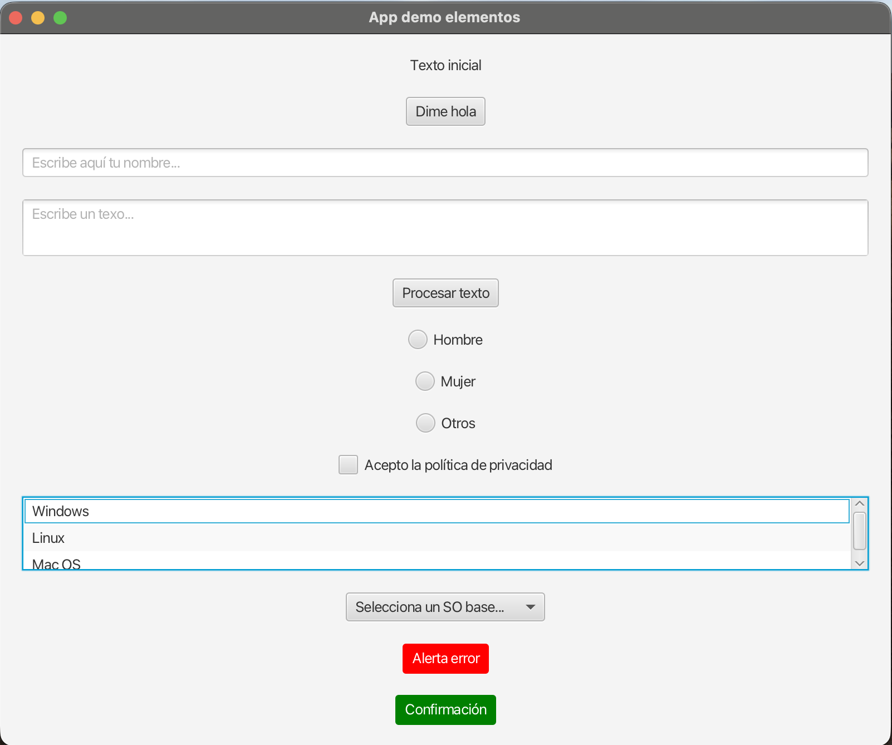

# Elementos de Interfaz en JavaFX

## 1. Introducción a los Controles

JavaFX proporciona una amplia variedad de controles interactivos (nodos) para construir interfaces sólidas y amistosas. En este documento repasaremos los componentes más utilizados, prestando especial atención a cómo se referencian en el archivo de diseño visual y cómo recabamos o modificamos sus datos desde el controlador.

!!! info "Vectores de Comunicación"
    Recuerda la regla de oro: la instancia visual del elemento nace y reside en el archivo **`.fxml`** (usando preferiblemente _SceneBuilder_), e interactuamos con su estado (leer o modificar) uniendo esa vista al archivo **`Controlador.java`** mediante la etiqueta mágica `@FXML` y su `fx:id`.

Vamos a ver los controles más utilizados:



---

## 2. Textos y Botones (`Label` y `Button`)

Cimientos obligatorios para cualquier interfaz gráfica. Un `Label` sirve para mostrar texto formativo o estático (como un título) y un `Button` es nuestro interruptor de acción.

**En la Vista (FXML):**

```xml
<!-- Asignamos sus fx:id inconfundibles -->
<Label fx:id="lbBienvenido" text="Texto inicial"/>
<Button fx:id="btHola" text="Dime Hola" onAction="#onHelloButtonClick"/>
```

**En el Controlador Java:**

```java
@FXML 
private Label lbBienvenido; 

@FXML 
private Button btHola; 

// Método auto-ejecutado al construir la interfaz visual
@FXML
public void initialize() { 
    lbBienvenido.setText("¡Bienvenido a la pantalla inicial!"); 
} 

// Evento anclado al click del botón
@FXML 
protected void onHelloButtonClick() { 
    lbBienvenido.setText("¡Botón presionado con éxito!"); 
} 
```

---

## 3. Entradas de Texto (`TextField` y `TextArea`)

Son los canales de inyección principales cuando solicitamos al usuario que escriba. Si prevemos un nombre o dato corto emplearemos un `TextField` (una única línea); si solicitamos comentarios largos, un `TextArea` multilínea.

**En la Vista (FXML):**

```xml
<TextField fx:id="txfNombre" promptText="Escribe aquí tu nombre completo..."/>
<TextArea fx:id="txaDescripcion" prefRowCount="4" promptText="Escribe un resumen..."/>
```

**En el Controlador Java:**

```java
@FXML 
private TextField txfNombre;
@FXML 
private TextArea txaDescripcion;

// Ejemplo de método asociado a un botón para procesar estos datos
    @FXML
    public void procesarTextos() {
        // 1. Recuperamos lo que escribe el usuario
        String nombre = txfNombre.getText();
        String descripcion = txaDescripcion.getText();
        // 2. Sobreescribimos el texto del Label
        lbBienvenido.setText("Bienvenid@ "+nombre+". Texto escrito: "+descripcion);
        // 3. Limpiamos los campos  
        txfNombre.clear();
        txaDescripcion.clear();
    }
```

!!! tip "Pistas Visuales"
    La propiedad `promptText` es francamente útil. Imprime en pantalla un texto tenue (marca de agua informacional) que desaparece de forma automática tan pronto el usuario posicione su cursor y empiece a redactar encima.

---

## 4. Opciones Excluyentes (`RadioButton` y `ToggleGroup`)

A menudo, requerimos ofrecer Múltiples opciones donde el usuario solo puede fijar **una**. Al marcarlas en un visual FXML, se insertan habitualmente desvinculados por defecto. El gran truco es "agruparlos en manada" desde el código Java bajo un `ToggleGroup`.

**En la Vista (FXML):**

```xml
<RadioButton fx:id="rbHombre" text="Hombre" onMouseClicked="#pulsadoButtonRadio"/>  
<RadioButton fx:id="rbMujer" text="Mujer" onMouseClicked="#pulsadoButtonRadio"/> 
<RadioButton fx:id="rbOtros" text="Otros" onMouseClicked="#pulsadoButtonRadio"/> 
```

**En el Controlador Java:**

```java
@FXML 
private RadioButton rbHombre; 
@FXML 
private RadioButton rbMujer; 
@FXML 
private RadioButton rbOtros; 

@FXML
public void initialize() { 
    // Obligamos a estos tres nodos a discutir: ¡solo uno de ellos podrá estar activo a la vez!
    ToggleGroup tgRadio = new ToggleGroup(); 
    rbHombre.setToggleGroup(tgRadio); 
    rbMujer.setToggleGroup(tgRadio); 
    rbOtros.setToggleGroup(tgRadio); 
} 

// Rescatando quién fue interactuado mediante condicionales
@FXML 
public void pulsadoButtonRadio(MouseEvent event) { 
    // 1. Obtenemos el origen del evento (el RadioButton presionado)
    RadioButton rbPulsado = (RadioButton) event.getSource();
    
    // 2. Comprobamos a través de un if/else qué botón exacto es
    if (rbPulsado == rbHombre) {
        lbBienvenido.setText("Has marcado: " + rbHombre.getText());
    } else if (rbPulsado == rbMujer) {
        lbBienvenido.setText("Has marcado: " + rbMujer.getText());
    } else if (rbPulsado == rbOtros) {
        lbBienvenido.setText("Has marcado: " + rbOtros.getText());
    }
} 
```

---

## 5. Casillas de Verificación (`CheckBox`)

Si a diferencia del bloque anterior, admitimos respuestas afirmativas/negativas asiladas que no interfieren con nada, el protagonista es el `CheckBox`.

**En la Vista (FXML):**

```xml
<CheckBox fx:id="cbAceptar" text="Acepto la política de privacidad" selected="false" onAction="#pulsadoAceptar"/> 
```

**En el Controlador Java:**

```java
@FXML private CheckBox cbAceptar;

@FXML
public void pulsadoAceptar(ActionEvent event) { 
    // isSelected() nos confiesa instantáneamente su estado actual
    if(cbAceptar.isSelected()){ 
        System.out.println("Condiciones aceptadas correctamente."); 
    } else { 
        System.out.println("Debes aceptar las condiciones para continuar."); 
    } 
} 
```

---

## 6. Listas y Desplegables (`ListView`, `ComboBox` y `ChoiceBox`)

Se usan para mostrar largas colecciones. `ListView` aloja un bloque scrollable listando todos sus integrantes permanentemente con tamaño fijo, mientras que el clásico `ComboBox` comprime esas opciones tras una lengüeta con flecha y se adapta excelentemente a entornos limpios sin espacio residual.

El mecanismo interno sobre el que ambas piezas gravitan es una **`ObservableList`**.

**En la Vista (FXML):**

```xml
<ListView fx:id="lwSistemas" prefHeight="100"/>
<ComboBox fx:id="combSistemas" promptText="Selecciona un SO base..."/>
```

**En el Controlador Java:**

```java
import javafx.scene.control.SelectionMode;
import javafx.collections.FXCollections;
import javafx.collections.ObservableList;

@FXML private ListView<String> lwSistemas; 
@FXML private ComboBox<String> combSistemas; 

@FXML
public void initialize() { 
    // Creamos la lista matriz dinámica de inserción
    ObservableList<String> soList = FXCollections.observableArrayList("Windows", "Linux", "Mac OS"); 
    
    // Rellenamos e inflamos ambos componentes gráficos basándonos en la matriz original
    lwSistemas.setItems(soList); 
    combSistemas.setItems(soList);
    
    // Extra visual para el listview puro: le facultamos permitir selección múltiple
    lwSistemas.getSelectionModel().setSelectionMode(SelectionMode.MULTIPLE); 
} 

// Lógica para interceptar la decisión extraída del usuario
public void obtenerSeleccion() {
    // Si queremos recuperar el dato elegido desde un ComboBox simple:
    String electo = combSistemas.getSelectionModel().getSelectedItem();
    
    // Si queremos rescatar varios elementos simultáneos desde un ListView:
    ObservableList<String> electos = lwSistemas.getSelectionModel().getSelectedItems();
}
```

---

## 7. Ventanas de Diálogo Remotas (`Alert`)

Hay pantallas para las que construir físicamente un `popup.fxml` con el patrón normal resulta innecesario y tedioso. JavaFX incluye de fábrica los "Alert": cuadros de advertencia automáticos perfectos para dar tirones de orejas, mensajes de confirmación de salida, etc.

**En el Controlador Java:**
_(Al ser entidades independientes autogeneradas internamente, carecen de registro fxml asociado)_

```java
@FXML 
private void mostrarErrorCritico() { 
    // Instanciamos el modelo genérico que arroja un gran escudo rojo
    Alert alert = new Alert(Alert.AlertType.ERROR); 
    alert.setTitle("Notificación de Error"); 
    alert.setHeaderText(null); // Eliminamos la cabecera gris sobrante
    alert.setContentText("Ha surgido un peligro grave al establecer la ruta FXML."); 
    
    // Pausamos la ejecución general hasta que el usuario reaccione cerrando la mosca web
    alert.showAndWait(); 
} 

@FXML 
private void mostrarAvisoSalida() { 
    // Modelo de alerta con aspa e interrogante para decisiones afirmativas-negativas
    Alert alert = new Alert(Alert.AlertType.CONFIRMATION); 
    alert.setTitle("Salida Controlada"); 
    alert.setHeaderText(null);
    alert.setContentText("Tienes datos no enviados. ¿Deseas firmemente perder estos progresos?"); 
    alert.showAndWait(); 
} 
```

!!! question "💻 Reto Integrador: Matrícula DAM en el IES Camp de Morvedre"
    Pon a prueba todo lo que has dominado en este documento diseñando el **"Formulario Oficial de Matrícula"** para el ciclo de DAM en el IES Camp de Morvedre. Tu misión es crear una interfaz visual empleando absolutamente todos los componentes estudiados:

    * **Crea** los archivos *formulario-matricula.fxml* y *MatriculaController.java*
    * **Entrada de texto**: Un **`TextField`** para teclear tu "Nombre Completo" y un **`TextArea`** para detallar tus "Conocimientos previos de informática".
    * **Opciones excluyentes**: Usa un grupo de **`RadioButtons`** para que el alumno escoja su vía de acceso exclusiva (ej: Bachillerato, Prueba de Acceso, Grado Medio).
    * **Listados simples y múltiples**: Incorpora un **`ComboBox`** para elegir un Municipio de residencia, y un **`ListView`** en modo múltiple para que seleccionen al menos dos "Módulos optativos o áreas de interés".
    * **Consentimiento y validación**: Utiliza un **`CheckBox`** clásico mediante el cual se acepte explícitamente la directiva de privacidad y protección de datos del centro.
    
    Por último, dispara el proceso desde un gran **`Button`** general de _"Formalizar Matrícula"_. El controlador de este botón deberá validar que todos los campos constan de respuesta, que el cuadro de privacidad está verificado con un _check_ y coronará la experiencia construyendo un resguardo resumido en pantalla mostrándolo como una advertencia en forma de **`Alert`**.
