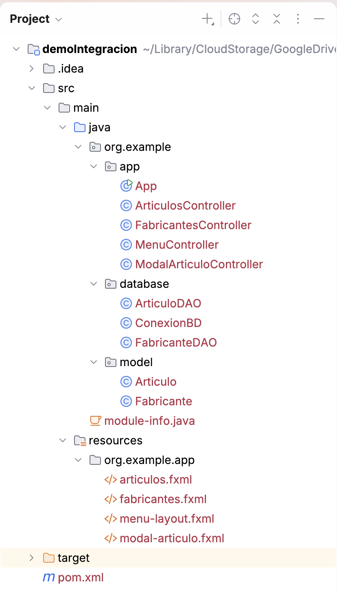
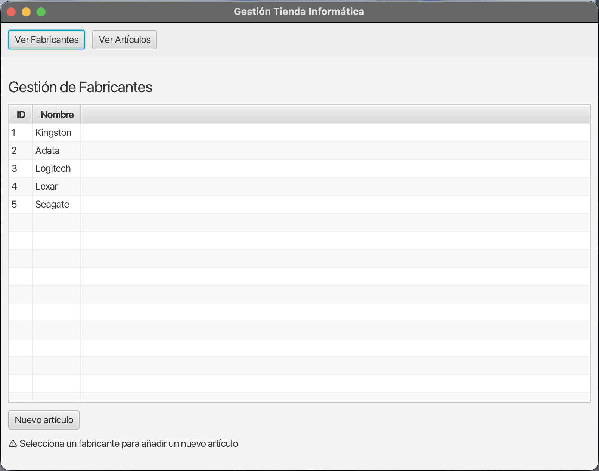
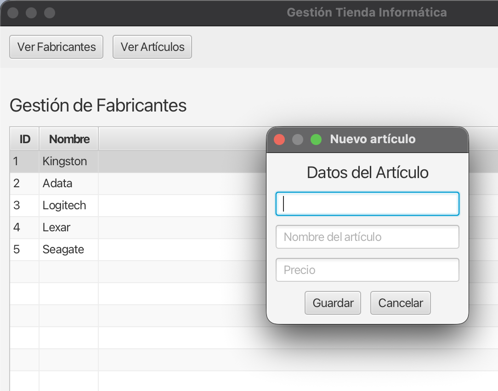
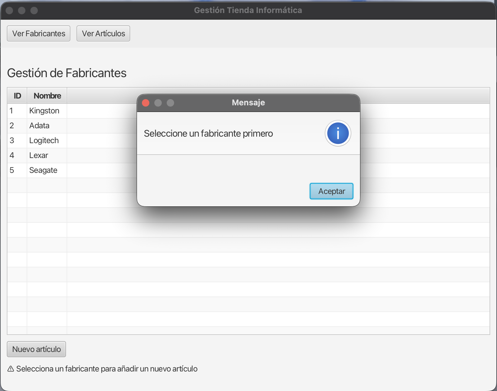
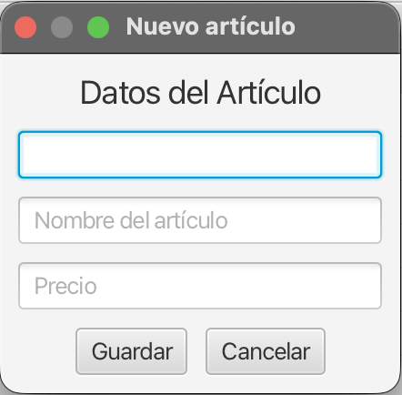
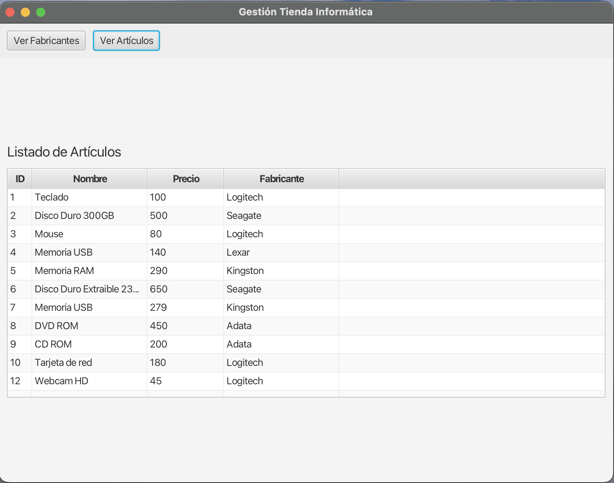

# Integración de Vistas y Base de Datos

Hasta ahora hemos aprendido a diseñar interfaces con JavaFX, a navegar entre distintas pantallas usando un menú fijo y a conectarnos a una base de datos mediante JDBC con el patrón DAO.

En esta sección vamos a construir una **aplicación completa** para gestionar los datos de una tienda de informática. Nuestra aplicación permitirá visualizar fabricantes, ver sus artículos, así como crear, editar y eliminar registros, todo ello utilizando la macroestructura de navegación (`BorderPane`) que creamos en el apartado anterior.

---

## 1. La Base de Datos y estructura del Proyecto

Trabajaremos sobre una base de datos PostgreSQL llamada `tienda_informatica` con la siguiente estructura relacional. Observa que un artículo pertenece a un fabricante mediante la clave foránea `id_fab`.

```sql
CREATE TABLE fabricante (
    id_fabricante INTEGER PRIMARY KEY,
    nombre VARCHAR(100)
);

CREATE TABLE articulo (
    id_articulo INTEGER PRIMARY KEY,
    nombre VARCHAR(100),
    precio INTEGER,
    id_fab INTEGER,
    FOREIGN KEY (id_fab) REFERENCES fabricante(id_fabricante)
);
```

!!! info "Nota sobre la arquitectura"
    Siguiendo las buenas prácticas (como vimos en las unidades de acceso a datos), nuestra aplicación separará estrictamente la capa de presentación (vistas FXML y controladores) de la capa de datos (clases DAO y conexión a base de datos).

### 1.1. Dependencias del Proyecto (Maven)

Dado que estamos utilizando **PostgreSQL** y nuestro proyecto en IntelliJ está gestionado con Maven, es esencial que incluyamos el *driver* de conexión en nuestro archivo `pom.xml`. Añade el siguiente bloque dentro de tu sección `<dependencies>`:

```xml
<dependency>
    <groupId>org.postgresql</groupId>
    <artifactId>postgresql</artifactId>
    <version>42.7.3</version> <!-- Puedes usar la última versión estable -->
</dependency>
```

Además, como JavaFX hace uso del sistema de módulos de Java, debes indicarle expresamente a tu programa que vas a hacer uso del paquete de bases de datos. Abre tu archivo `module-info.java` y añade el requerimiento de `java.sql`, además de abrir tu paquete del modelo para que las tablas de JavaFX puedan leer las propiedades de tus objetos:

```java
module org.example.app {
    requires javafx.controls;
    requires javafx.fxml;
    requires java.sql; // <-- ¡Imprescindible para trabajar con JDBC!

    opens org.example.app to javafx.fxml;
    exports org.example.app;
    
    // Necesario para que CellValueFactory pueda leer por reflexión los POJOs
    opens org.example.model to javafx.base; 
}
```

### 1.2 Estructura del Proyecto

Antes de empezar, vamos a separar y organizar nuestro código en distintos paquetes, siguiendo las buenas prácticas de programación orientada a objetos. La estructura del proyecto será la siguiente:



!!! warning "El archivo `App.java` y el `Layout`"
    El archivo `App.java` será el lanzador de nuestra aplicación.   Por otro lado, seguiremos con el `Layout` que creamos en el punto anterior para separar la barra de menú del contenido dinámico.

    Usaremos `MenuController.java` para manejar los eventos de los menús y `menu-layout.fxml` para diseñar la estructura con la barra de menú

    ```java
    package org.example.app;

    import javafx.application.Application;
    import javafx.fxml.FXMLLoader;
    import javafx.scene.Scene;
    import javafx.stage.Stage;

    public class App extends Application {
        @Override
        public void start(Stage stage) throws Exception {
            FXMLLoader fxmlLoader = new FXMLLoader(getClass().getResource("menu-layout.fxml"));
            Scene scene = new Scene(fxmlLoader.load(), 800, 600);

            MenuController menuController = fxmlLoader.getController();
            menuController.cargarPantalla("fabricantes.fxml");

            stage.setTitle("Gestión Tienda Informática");
            stage.setScene(scene);
            stage.show();
        }

        public static void main(String[] args) {
            launch(args);
        }
    }
    ```

---

## 2. El Modelo (POJOs)

Empezaremos definiendo las clases que representan la estructura básica de nuestro sistema. Fíjate en cómo implementamos la **composición**: la clase `Articulo` no guarda simplemente un `int id_fab`, sino que contiene un objeto `Fabricante` completo.

Esto facilitará enormemente el acceso a los datos de la tabla relacionada (como el nombre del fabricante) en la interfaz gráfica.

```java
package org.example.model;

public class Fabricante {
    private int idFabricante;
    private String nombre;

    // Constructores
    public Fabricante() {}
    public Fabricante(int idFabricante, String nombre) {
        this.idFabricante = idFabricante;
        this.nombre = nombre;
    }
    
    // Getters y setters
    public int getIdFabricante() { return idFabricante; }
    public void setIdFabricante(int idFabricante) { this.idFabricante = idFabricante; }
    public String getNombre() { return nombre; }
    public void setNombre(String nombre) { this.nombre = nombre; }
}
```

```java
package org.example.model;

public class Articulo {
    private int idArticulo;
    private String nombre;
    private int precio; // Usamos int tal como define la tabla en PostgreSQL
    private Fabricante fabricante; // ¡Composición en lugar de int id_fab!

    // Constructores
    public Articulo() {}
    public Articulo(int idArticulo, String nombre, int precio, Fabricante fabricante) {
        this.idArticulo = idArticulo;
        this.nombre = nombre;
        this.precio = precio;
        this.fabricante = fabricante;
    }

    // Getters y setters
    public int getIdArticulo() { return idArticulo; }
    public void setIdArticulo(int idArticulo) { this.idArticulo = idArticulo; }
    public String getNombre() { return nombre; }
    public void setNombre(String nombre) { this.nombre = nombre; }
    public int getPrecio() { return precio; }
    public void setPrecio(int precio) { this.precio = precio; }
    public Fabricante getFabricante() { return fabricante; }
    public void setFabricante(Fabricante fabricante) { this.fabricante = fabricante; }
}
```

---

## 3. Acceso a Datos (DAOs)

Necesitaremos dos clases DAO (`FabricanteDAO` y `ArticuloDAO`) encargadas de realizar las operaciones CRUD (Crear, Leer, Actualizar, Eliminar) contra nuestra base de datos.

Como ejemplo, veamos cómo sería el método de inserción en `ArticuloDAO`. Presta especial atención a cómo obtenemos el `id_fabricante` a partir del objeto `Fabricante` asociado al artículo, para guardarlo en la columna `id_fab`:

```java
package org.example.database;

import org.example.model.Articulo;
import org.example.model.Fabricante;
import java.sql.Connection;
import java.sql.PreparedStatement;
import java.sql.ResultSet;
import java.sql.SQLException;
import java.util.ArrayList;

public class ArticuloDAO {
    // Asumimos que existe una clase ConexionBD (vista en ud08) para gestionar la conexión
    private Connection con = ConexionBD.conectar();

    public boolean insertar(Articulo articulo) {
        // Ojo al nombre de la columna foránea en SQL: id_fab
        String sql = "INSERT INTO articulo (id_articulo, nombre, precio, id_fab) VALUES (?, ?, ?, ?)";
        
        try (PreparedStatement ps = con.prepareStatement(sql)) {
            ps.setInt(1, articulo.getIdArticulo());
            ps.setString(2, articulo.getNombre());
            ps.setInt(3, articulo.getPrecio());
            ps.setInt(4, articulo.getFabricante().getIdFabricante()); // Extracción mediante POJO
            
            return ps.executeUpdate() > 0;
            
        } catch (SQLException e) {
            e.printStackTrace();
            return false;
        }
    }
    
    public ArrayList<Articulo> obtenerTodos() {
        ArrayList<Articulo> lista = new ArrayList<>();
        // Realizamos un JOIN para obtener a la vez los datos del artículo y de su fabricante
        String sql = "SELECT a.id_articulo, a.nombre AS nombre_art, a.precio, " +
                     "a.id_fab, f.nombre AS nombre_fab " +
                     "FROM articulo a INNER JOIN fabricante f ON a.id_fab = f.id_fabricante";
        
        try (PreparedStatement ps = con.prepareStatement(sql);
             ResultSet rs = ps.executeQuery()) {
            
            while (rs.next()) {
                // 1. Construimos el POJO del fabricante
                Fabricante fab = new Fabricante();
                fab.setIdFabricante(rs.getInt("id_fab"));
                fab.setNombre(rs.getString("nombre_fab"));
                
                // 2. Construimos el POJO del artículo y le inyectamos su fabricante
                Articulo art = new Articulo();
                art.setIdArticulo(rs.getInt("id_articulo"));
                art.setNombre(rs.getString("nombre_art"));
                art.setPrecio(rs.getInt("precio"));
                art.setFabricante(fab); // ¡Composición en acción!
                
                lista.add(art);
            }
        } catch (SQLException e) {
            e.printStackTrace();
        }
        return lista;
    }

    public boolean actualizar(Articulo articulo) {
        String sql = "UPDATE articulo SET nombre = ?, precio = ?, id_fab = ? WHERE id_articulo = ?";
        
        try (PreparedStatement ps = con.prepareStatement(sql)) {
            ps.setString(1, articulo.getNombre());
            ps.setInt(2, articulo.getPrecio());
            ps.setInt(3, articulo.getFabricante().getIdFabricante());
            ps.setInt(4, articulo.getIdArticulo());
            
            return ps.executeUpdate() > 0;
            
        } catch (SQLException e) {
            e.printStackTrace();
            return false;
        }
    }

    public boolean eliminar(int idArticulo) {
        String sql = "DELETE FROM articulo WHERE id_articulo = ?";
        
        try (PreparedStatement ps = con.prepareStatement(sql)) {
            ps.setInt(1, idArticulo);
            
            return ps.executeUpdate() > 0;
            
        } catch (SQLException e) {
            e.printStackTrace();
            return false;
        }
    }
}
```

De la misma manera, implementamos la clase `FabricanteDAO`. Fíjate que al ser una tabla que no depende de otras (no tiene claves foráneas), sus consultas CRUD son mucho más directas y no requieren composición compleja ni sentencias `JOIN`:

```java
package org.example.database;

import org.example.model.Fabricante;
import java.sql.Connection;
import java.sql.PreparedStatement;
import java.sql.ResultSet;
import java.sql.SQLException;
import java.util.ArrayList;

public class FabricanteDAO {
    // Reutilizamos la conexión de nuestra clase de utilidad
    private Connection con = ConexionBD.conectar();

    public boolean insertar(Fabricante fabricante) {
        String sql = "INSERT INTO fabricante (id_fabricante, nombre) VALUES (?, ?)";
        try (PreparedStatement ps = con.prepareStatement(sql)) {
            ps.setInt(1, fabricante.getIdFabricante());
            ps.setString(2, fabricante.getNombre());
            return ps.executeUpdate() > 0;
        } catch (SQLException e) {
            e.printStackTrace();
            return false;
        }
    }

    public ArrayList<Fabricante> obtenerTodos() {
        ArrayList<Fabricante> lista = new ArrayList<>();
        String sql = "SELECT id_fabricante, nombre FROM fabricante";
        
        try (PreparedStatement ps = con.prepareStatement(sql);
             ResultSet rs = ps.executeQuery()) {
            
            while (rs.next()) {
                Fabricante fab = new Fabricante();
                fab.setIdFabricante(rs.getInt("id_fabricante"));
                fab.setNombre(rs.getString("nombre"));
                lista.add(fab);
            }
        } catch (SQLException e) {
            e.printStackTrace();
        }
        return lista;
    }

    public boolean actualizar(Fabricante fabricante) {
        String sql = "UPDATE fabricante SET nombre = ? WHERE id_fabricante = ?";
        try (PreparedStatement ps = con.prepareStatement(sql)) {
            ps.setString(1, fabricante.getNombre());
            ps.setInt(2, fabricante.getIdFabricante());
            return ps.executeUpdate() > 0;
        } catch (SQLException e) {
            e.printStackTrace();
            return false;
        }
    }

    public boolean eliminar(int idFabricante) {
        String sql = "DELETE FROM fabricante WHERE id_fabricante = ?";
        try (PreparedStatement ps = con.prepareStatement(sql)) {
            ps.setInt(1, idFabricante);
            return ps.executeUpdate() > 0;
        } catch (SQLException e) {
            e.printStackTrace();
            return false;
        }
    }
}
```

---

## 4. Gestión de Fabricantes y Artículos

Nuestra interfaz va a constar principalmente de un visor de Fabricantes y otro de Artículos. Empezaremos viendo cómo podemos, desde la lista de fabricantes, invocar la creación de un nuevo artículo asignándolo automáticamente.

### 4.1. La Tabla de Fabricantes

Diseñaremos una pantalla (`fabricantes.fxml`) con un `TableView` que mostrará todos los fabricantes. Añadiremos un botón llamado **"Nuevo artículo"**.

```xml
<?xml version="1.0" encoding="UTF-8"?>
<?import javafx.scene.control.*?>
<?import javafx.scene.layout.*?>
<?import javafx.geometry.Insets?>

<VBox xmlns="http://javafx.com/javafx"
      xmlns:fx="http://javafx.com/fxml"
      fx:controller="org.example.app.FabricantesController"
      spacing="10" >
    <padding>
        <Insets top="10" right="10" bottom="10" left="10"/>
    </padding>
    
    <Label text="Gestión de Fabricantes" style="-fx-font-size: 20px;"/>
    
    <TableView fx:id="tablaFabricantes">
        <columns>
            <TableColumn fx:id="colId" text="ID"/>
            <TableColumn fx:id="colNombre" text="Nombre"/>
        </columns>
    </TableView>
    
    <Button text="Nuevo artículo" onAction="#nuevoArticulo"/>
    <Label text="⚠️ Selecciona un fabricante para añadir un nuevo artículo"></Label>

</VBox>
```



El controlador (`FabricantesController.java`) enlazará la base de datos con esta tabla:

```java
package org.example.app;

import javafx.fxml.FXML;
import javafx.scene.control.TableColumn;
import javafx.scene.control.TableView;
import javafx.scene.control.cell.PropertyValueFactory;
import org.example.database.FabricanteDAO;
import org.example.model.Fabricante;

public class FabricantesController {

    @FXML private TableView<Fabricante> tablaFabricantes;
    @FXML private TableColumn<Fabricante, Integer> colId;
    @FXML private TableColumn<Fabricante, String> colNombre;

    private FabricanteDAO fdao = new FabricanteDAO();

    @FXML
    private void initialize() {
        // Enlazamos cada columna con su propiedad correspondiente en la clase Fabricante
        colId.setCellValueFactory(new PropertyValueFactory<>("idFabricante"));
        colNombre.setCellValueFactory(new PropertyValueFactory<>("nombre"));

        // Cargamos los datos desde la BD (fdao.obtenerTodos() devuelve un ArrayList<Fabricante>)
        tablaFabricantes.getItems().addAll(fdao.obtenerTodos());
    }
    
    // ... métodos de acción ...
}
```

### 4.2. Creación de un Artículo asociándolo a un Fabricante

Cuando el usuario selecciona un fabricante y pulsa "Nuevo artículo", abriremos un **formulario modal** (una subventana bloqueante). El reto aquí es que este nuevo modal necesita saber a qué fabricante pertenece el artículo que vamos a crear.



Lo resolvemos inyectando el fabricante seleccionado en el controlador del modal *antes de mostrar la ventana*:

```java
@FXML
private void nuevoArticulo() {
    // 1. Obtenemos el fabricante seleccionado en la tabla
    Fabricante fab = tablaFabricantes.getSelectionModel().getSelectedItem();

    if (fab == null) {
        mostrarMensaje("Selecciona un fabricante primero");
        return; 
    }

    // 2. Abrimos el modal y le pasamos el fabricante
    abrirModalArticulo(fab);
}

private void abrirModalArticulo(Fabricante fab) {
    try {
        FXMLLoader loader = new FXMLLoader(getClass().getResource("modal-articulo.fxml"));
        Parent root = loader.load();

        // Extraemos el controlador del modal recién cargado
        ModalArticuloController controller = loader.getController();

        // Creamos un artículo "vacío" y le asociamos el fabricante seleccionado
        Articulo nuevo = new Articulo();
        nuevo.setFabricante(fab);
        nuevo.setIdArticulo(-1); // Un ID negativo nos sirve como bandera interna de "Alta Nueva"

        // ¡Le pasamos el artículo al controlador del modal!
        controller.setArticulo(nuevo);

        Stage stage = new Stage();
        stage.setScene(new Scene(root));
        stage.setTitle("Nuevo artículo");
        stage.initModality(Modality.APPLICATION_MODAL); // Modo modal: bloquea la ventana padre
        stage.showAndWait(); // Pausa la ejecución aquí hasta que el modal se cierre

        // 3. Al volver, comprobamos si el usuario guardó los cambios con éxito
        if (controller.isGuardado()) {
            Articulo articuloFinal = controller.getArticulo();
            
            // Inserción en Base de Datos (asumiendo que adao es un ArticuloDAO instanciado)
            if (adao.insertar(articuloFinal)) {
                 System.out.println("El artículo se ha creado correctamente.");
            }
        }

    } catch (Exception e) {
        e.printStackTrace();
    }
}

private void mostrarMensaje(String mensaje) {
    Alert alert = new Alert(Alert.AlertType.INFORMATION);
    alert.setTitle("Mensaje");
    alert.setHeaderText(mensaje);
    alert.showAndWait();
}
```

Si el usuario no ha seleccionado ningún fabricante, se mostrará un mensaje de error y no se abrirá el modal.



---

## 5. El Formulario Modal de Artículos

El archivo `modal-articulo.fxml` será una ventana con campos (`TextField`) para el `ID`, `Nombre` y `Precio`. Este mismo formulario nos servirá mágicamente tanto para **crear** (altas) como para **editar** (modificaciones).

```xml
<?xml version="1.0" encoding="UTF-8"?>
<?import javafx.scene.layout.VBox?>
<?import javafx.scene.control.Label?>
<?import javafx.scene.control.TextField?>
<?import javafx.scene.layout.HBox?>
<?import javafx.scene.control.Button?>
<?import javafx.geometry.Insets?>

<VBox xmlns="http://javafx.com/javafx"
      xmlns:fx="http://javafx.com/fxml"
      fx:controller="org.example.app.ModalArticuloController"
      spacing="10" alignment="CENTER">
      
    <padding>
        <Insets top="10" right="10" bottom="10" left="10"/>
    </padding>
  
    <Label text="Datos del Artículo" style="-fx-font-size: 18px;"/>
    
    <TextField fx:id="txtId" promptText="ID del artículo" prefWidth="200"/>
    <TextField fx:id="txtNombre" promptText="Nombre del artículo" prefWidth="200"/>
    <TextField fx:id="txtPrecio" promptText="Precio" prefWidth="200"/>
  
    <HBox spacing="10" alignment="CENTER">
        <Button text="Guardar" onAction="#guardar"/>
        <Button text="Cancelar" onAction="#cancelar"/>
    </HBox>
</VBox>
```

Tendrá el siguiente aspecto:



!!! warning "Mejora de la interfaz..."
    El diseño de la interfaz es mejorable. Ahora nos centramos solamente en otorgar funcionalidad a las interfaces.

Su controlador `ModalArticuloController.java` recibe el objeto `Articulo`. Si el ID es negativo (`-1`), todos los campos quedan habilitados. Si es positivo o cero, asumimos que estamos editando un artículo existente y **bloquearemos el campo ID** para que no pueda ser alterado:

```java
package org.example.app;

import javafx.fxml.FXML;
import javafx.scene.control.TextField;
import javafx.stage.Stage;
import org.example.model.Articulo;

public class ModalArticuloController {
    @FXML private TextField txtId;
    @FXML private TextField txtNombre;
    @FXML private TextField txtPrecio;

    private Articulo articulo;
    private boolean guardado = false;

    // Método clave: recibe el artículo desde la pantalla principal
    public void setArticulo(Articulo articulo) {
        this.articulo = articulo;

        // Si el artículo ya tiene un ID válido (>= 0), estamos editando
        if (articulo != null && articulo.getIdArticulo() >= 0) {
            txtId.setText(String.valueOf(articulo.getIdArticulo()));
            txtNombre.setText(articulo.getNombre());
            txtPrecio.setText(String.valueOf(articulo.getPrecio()));
            
            // Ojo: ¡El ID de la base de datos no se puede editar!
            txtId.setDisable(true); 
        }
    }
    
    @FXML
    private void guardar() {
        // (En un caso real, aquí validaríamos que los textos no estén vacíos ni contengan letras donde van números)
        articulo.setIdArticulo(Integer.parseInt(txtId.getText()));
        articulo.setNombre(txtNombre.getText());
        articulo.setPrecio(Integer.parseInt(txtPrecio.getText()));
        
        guardado = true;
        cerrarVentana();
    }
    
    @FXML
    private void cancelar() {
        guardado = false;
        cerrarVentana();
    }

    private void cerrarVentana() {
        // Recupera la ventana activa desde cualquier elemento visual y la cierra
        Stage stage = (Stage) txtId.getScene().getWindow();
        stage.close();
    }
    
    public Articulo getArticulo() { return articulo; }
    public boolean isGuardado() { return guardado; }
}
```

---

## 6. Visualizando los Artículos y sus Fabricantes

Por último, podemos tener una pantalla general (`articulos.fxml`) que muestre **todos los artículos** registrados en el sistema, cruzados con el nombre de su fabricante correspondiente.

```xml
<?xml version="1.0" encoding="UTF-8"?>
<?import javafx.scene.control.*?>
<?import javafx.scene.layout.*?>
<?import javafx.geometry.Insets?>

<VBox xmlns="http://javafx.com/javafx"
      xmlns:fx="http://javafx.com/fxml"
      fx:controller="org.example.app.ArticuloController"
      spacing="10" >
    <padding>
        <Insets top="10" right="10" bottom="10" left="10"/>
    </padding>
  
    <Label text="Listado de Artículos" style="-fx-font-size: 18px;"/>
  
    <TableView fx:id="tablaArticulos" prefHeight="300">
        <columns>
            <TableColumn fx:id="colId" text="ID" prefWidth="80"/>
            <TableColumn fx:id="colNombre" text="Nombre" prefWidth="150"/>
            <TableColumn fx:id="colPrecio" text="Precio" prefWidth="100"/>
            <TableColumn fx:id="colFabricante" text="Fabricante" prefWidth="150"/>
        </columns>
    </TableView>
</VBox>
```

Cuyo aspecto sería el siguiente:



Como el `nombre` del fabricante no es un atributo directo de la clase `Articulo` (sino que está dentro de su objeto anidado `Fabricante`), no podemos usar un simple `PropertyValueFactory` mágico.

Para resolverlo, utilizaremos una **expresión Lambda** importando `javafx.beans.property.SimpleStringProperty` para indicarle a JavaFX cómo extraer exactamente ese dato:

!!! tip "¿Qué es una expresión Lambda?"
    Una **expresión Lambda** (introducida en Java 8) es una forma corta y directa de escribir una función "anónima" (un método que no necesita nombre).

    En JavaFX se utilizan constantemente para definir comportamientos sobre la marcha o formatear datos, y se identifican fácilmente por el operador flecha `->`. 
    
    En este caso, le estamos diciendo a la columna: *"Toma cada celda (`celda ->`), obtén su fabricante, extrae el nombre y devuélvelo envuelto como una cadena de texto de JavaFX"*.

```java
@FXML private TableColumn<Articulo, Integer> colId;
@FXML private TableColumn<Articulo, String> colNombre;
@FXML private TableColumn<Articulo, Integer> colPrecio;
@FXML private TableColumn<Articulo, String> colFabricante; // Columna extra

@FXML
public void initialize() {
    // Columnas simples (atributos directos del POJO Articulo)
    colId.setCellValueFactory(new PropertyValueFactory<>("idArticulo"));
    colNombre.setCellValueFactory(new PropertyValueFactory<>("nombre"));
    colPrecio.setCellValueFactory(new PropertyValueFactory<>("precio"));

    // Columna compleja (acceso a atributo del objeto anidado)
    colFabricante.setCellValueFactory(celda -> {
        // Navegamos por composición: Articulo -> Fabricante -> Nombre
        String nombreFabricante = celda.getValue().getFabricante().getNombre();
        
        // JavaFX requiere que la celda envuelva la cadena en una "Property"
        return new SimpleStringProperty(nombreFabricante);
    });
}
```
