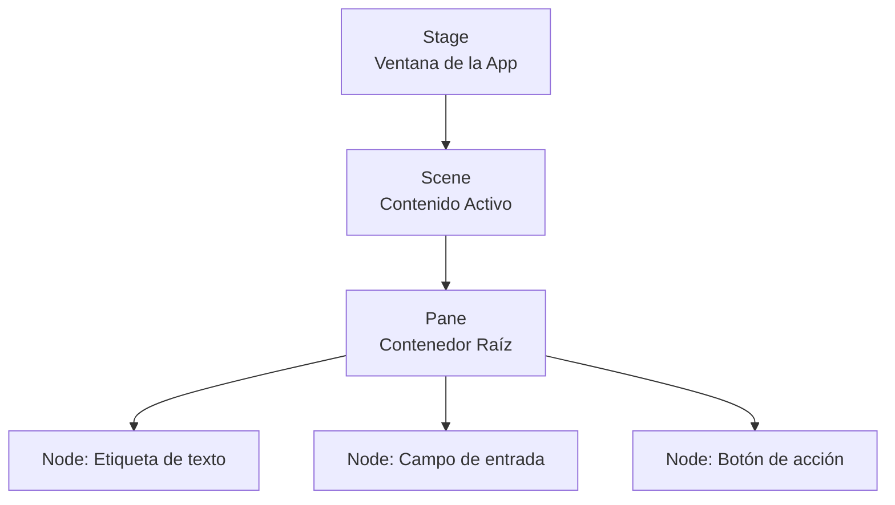
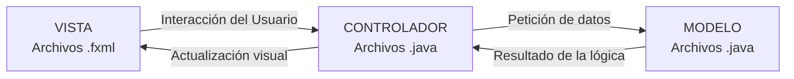
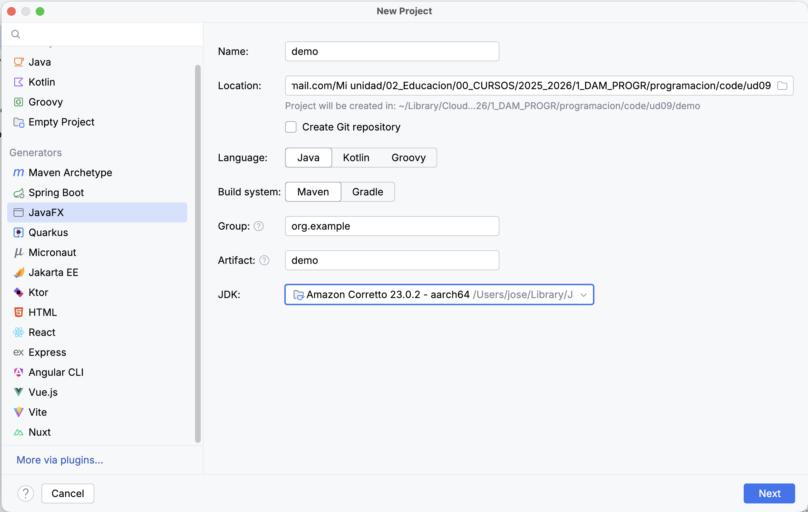

# Unidad 9. Interfaces Gráficas con JavaFX

## 1. ¿Qué es JavaFX?

Hasta ahora, nuestras aplicaciones se han ejecutado en la consola de comandos (texto negro y blanco). **JavaFX** es la biblioteca estándar moderna de Java diseñada específicamente para construir **Interfaces Gráficas de Usuario (GUI)**.

Nos permite crear aplicaciones de escritorio interactivas con ventanas, botones, cuadros de texto, imágenes, listas y menús.

**Características destacadas de JavaFX:**

* Está basado en una arquitectura orientada a componentes.
* Es plenamente compatible con **FXML**, un lenguaje basado en XML que nos permite diseñar la interfaz separada del código Java.
* Ofrece soporte avanzado para multimedia, animaciones, efectos visuales y gráficos 2D/3D.
* Promueve una separación clara y profesional entre la vista (lo que ve el usuario) y la lógica (lo que hace el programa) mediante controladores.

!!! info "Estilos con CSS"
    Una de las grandes ventajas de JavaFX es que permite cambiar el aspecto visual de sus componentes (colores, bordes, fuentes) utilizando **CSS**, ¡exactamente igual que en el diseño de páginas web!

---

## 2. Estructura de las Ventanas en JavaFX

Antes de escribir código, debemos entender cómo organiza JavaFX los elementos visuales en la pantalla. Para ello, utiliza cuatro conceptos clave en forma de jerarquía:

1. **Stage (El Escenario):** Representa la ventana física de la aplicación en el sistema operativo. A través del Stage podemos establecer propiedades globales como el título de la ventana, sus dimensiones máximas o si se puede redimensionar.
2. **Scene (La Escena):** Es el contenido visual que se muestra dentro de un `Stage`. Solo puede haber una escena activa al mismo tiempo dentro de nuestra ventana (aunque podemos cambiar de escena, como cambiar de "pantalla").
3. **Pane (El Contenedor):** Es un lienzo o contenedor estructural colocado en una escena que se encarga de distribuir y organizar los elementos gráficos (por ejemplo, apilarlos en vertical u horizontal).
4. **Node (El Nodo):** Es cualquier elemento visual e interactivo de JavaFX: un botón, una etiqueta de texto, una imagen, un campo de entrada o incluso un propio contenedor.



---

## 3. El Patrón MVC (Modelo-Vista-Controlador)

Aunque podemos crear interfaces programando cada botón y cada margen en Java (como vimos arriba), **no es una buena práctica** profesional. Mezclar código de lógica con código de diseño visual hace que los programas sean inmanejables.

JavaFX promueve el uso del **Patrón de Arquitectura MVC**, separando las responsabilidades de nuestro programa en tres bloques:

* **Modelo (Model):** Son tus clases Java tradicionales (Unidades 5 y 6). Representan los datos, la lógica de negocio y las reglas (ej: `Producto`, `Usuario`, calculadoras, conexiones a BD).
* **Vista (View):** Es puramente la interfaz gráfica. En JavaFX se define utilizando archivos **FXML**. Describe qué botones hay y dónde se colocan, pero *no tiene ni idea* de qué hacer cuando se pulsan.
* **Controlador (Controller):** Es una clase Java vinculada a la vista. Es el "cerebro intermedio". Detecta las acciones del usuario en la Vista (clics, textos), consulta al Modelo y actualiza la Vista con las respuestas.



Para conectar todo esto, usamos la clase **`FXMLLoader`**, que se encarga de leer el archivo `.fxml` (la Vista), instanciar los componentes visuales y enlazarlos con su Controlador correspondiente.

---

## 4. Contenedores Visuales (Panes)

El diseño en JavaFX se basa en colocar contenedores dentro de contenedores. JavaFX incluye diferentes tipos de `Pane`, cada uno con reglas de distribución automáticas:

* **`VBox`:** Apila los nodos en una columna vertical, uno debajo del otro.
* **`HBox`:** Coloca los nodos en una fila horizontal, uno al lado del otro.
* **`StackPane`:** Apila los nodos uno encima del otro (como capas de Photoshop), centrándolos por defecto.
* **`BorderPane`:** Divide el espacio en cinco zonas fijas: `top` (arriba), `bottom` (abajo), `left` (izquierda), `right` (derecha) y `center` (centro). Muy típico para menús de navegación.
* **`GridPane`:** Organiza los nodos en una cuadrícula estricta de filas y columnas (como un tablero de ajedrez).
* **`AnchorPane`:** Permite "anclar" los nodos a los bordes de la ventana manteniendo una distancia fija.

---

## 5. Anatomía de una aplicación MVC en JavaFX

Vamos a diseccionar el proyecto por defecto que nos crea IntelliJ IDEA para entender cómo se enlazan la Vista, el Controlador y el Cargador.

### 5.1. La Vista (`hello-view.fxml`)

En lugar de construir la escena con código Java, definimos la estructura en un archivo XML:

```xml
<?xml version="1.0" encoding="UTF-8"?>
<?import javafx.geometry.Insets?>
<?import javafx.scene.control.Label?>
<?import javafx.scene.layout.VBox?>
<?import javafx.scene.control.Button?>

<VBox alignment="CENTER" spacing="20.0" xmlns:fx="[http://javafx.com/fxml](http://javafx.com/fxml)"
      fx:controller="org.example.demo.HelloController">
    
    <padding>
        <Insets bottom="20.0" left="20.0" right="20.0" top="20.0"/>
    </padding>

    <Label fx:id="welcomeText"/>
    
    <Button text="Hello!" onAction="#onHelloButtonClick"/>
</VBox>
```

**Puntos clave:**

* `fx:controller`: Enlaza directamente este archivo FXML con la clase Java que lo va a gobernar.
* `fx:id`: Es como bautizar a un componente. Nos permite capturarlo desde Java.
* `onAction`: Vincula un evento (como un clic) a un método específico.

### 5.2. El Controlador (`HelloController.java`)

Es una clase Java normal, pero utiliza la etiqueta "mágica" **`@FXML`**.

```java
package org.example.demo;

import javafx.fxml.FXML;
import javafx.scene.control.Label;

public class HelloController {

    // La anotación @FXML inyecta el componente creado en el XML dentro de esta variable
    // ¡El nombre de la variable DEBE coincidir con el fx:id del XML!
    @FXML
    private Label welcomeText;

    // Método que se ejecutará cuando se dispare el evento onAction del botón
    @FXML
    protected void onHelloButtonClick() {
        // Modificamos el nodo visual desde Java
        welcomeText.setText("¡Bienvenido al mundo de JavaFX!");
    }
}
```

### 5.3. El Lanzador (`HelloApplication.java`)

Por último, la clase principal que arranca la aplicación usando el `FXMLLoader`:

```java
package org.example.demo;

import javafx.application.Application;
import javafx.fxml.FXMLLoader;
import javafx.scene.Scene;
import javafx.stage.Stage;
import java.io.IOException;

public class HelloApplication extends Application {
    @Override
    public void start(Stage stage) throws IOException {
        // 1. Cargamos el archivo FXML
        FXMLLoader fxmlLoader = new FXMLLoader(HelloApplication.class.getResource("hello-view.fxml"));
        
        // 2. Creamos la escena usando la interfaz cargada
        Scene scene = new Scene(fxmlLoader.load(), 320, 240);
        
        // 3. Mostramos la ventana
        stage.setTitle("App Modular MVC");
        stage.setScene(scene);
        stage.show();
    }

    public static void main(String[] args) {
        launch();
    }
}
```

---

## 6. Puesta en Práctica

Es hora de comprobar que tu entorno de desarrollo está listo. IntelliJ IDEA incluye un generador de proyectos que nos prepara todo el ecosistema (Carpetas, Maven y dependencias de JavaFX).



!!! question "💻 Reto: Tu Primera Ventana"
    1. Abre IntelliJ y ve a **File -> New -> Project**.
    2. En el panel izquierdo, selecciona **JavaFX**.
    3. Asegúrate de configurar:
        * Language: **Java**.
        * Build system: **Maven**.
        * Group / Artifact: Puedes usar `org.example` y `demo`.
    4. Pulsa **Create**.
    5. Localiza en la estructura del proyecto (`src/main/...`) los tres archivos clave que hemos estudiado: el `Application`, el `.fxml` (en `resources`) y el `Controller`.
    6. **Ejecuta** la aplicación y pulsa el botón.
    7. **Misión de experimentación:**
        * Ve al controlador y cambia el texto de respuesta.
        * Ve al archivo `.fxml` y cambia el texto que dice `text="Hello!"` por algo en español.
        * Vuelve a ejecutar y comprueba los cambios. ¿Entiendes cómo se comunican la Vista y el Controlador?
