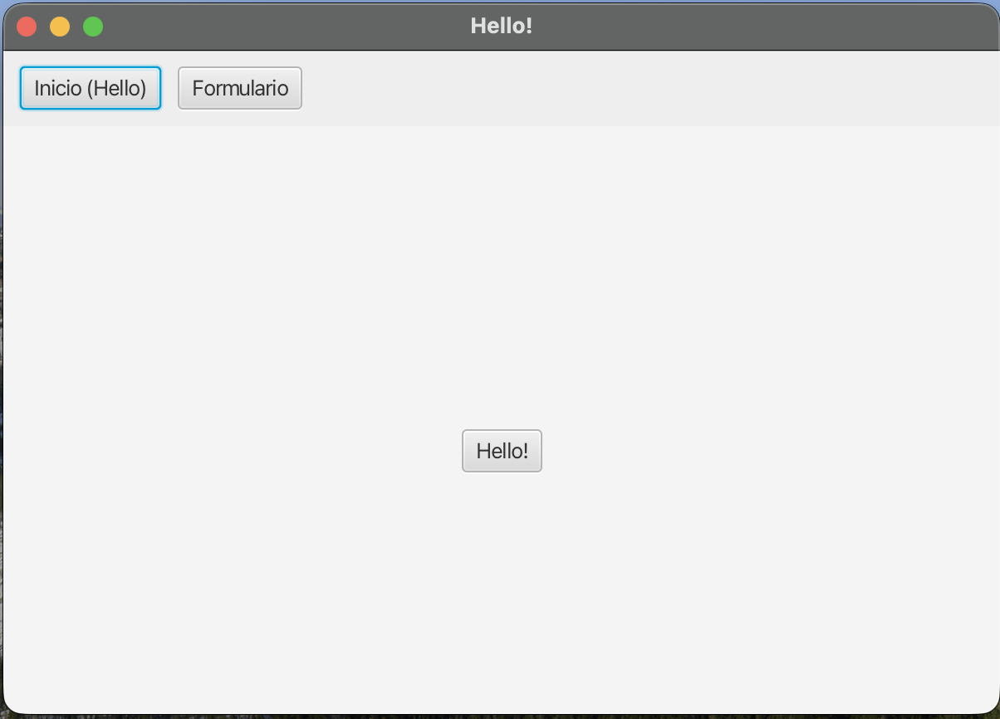
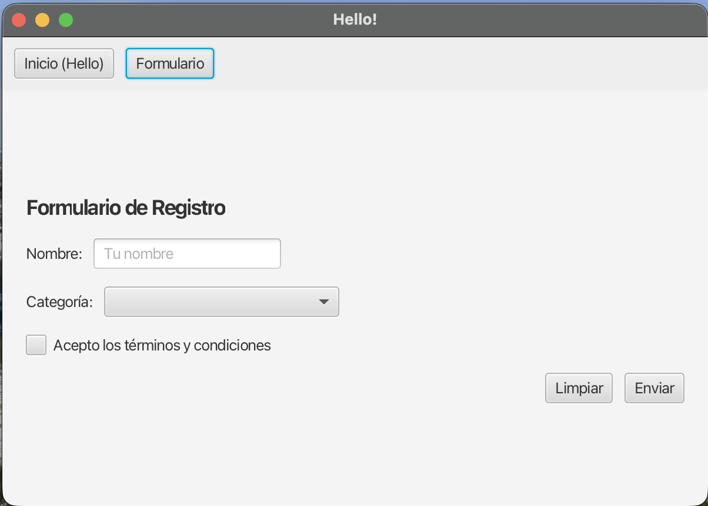

# Navegación Basada en Menús en JavaFX

## 1. Introducción: Menú Fijo y Pantalla Dinámica

Toda aplicación comercial que se precie dispone siempre a la vista de un **menú de navegación fijo** (barra superior, menú lateral...) desde el cual el usuario puede saltar entre pantallas.

Para lograr esta experiencia unificada en JavaFX, dejamos de jugar directamente con el `Stage`. En su lugar, el `Stage` cargará un esqueleto maestro estructurado (generalmente un **`BorderPane`**) en el que alojaremos nuestra botonera de menú, y dejaremos la zona de su núcleo (**centro**) vacía para ir incrustando y removiendo interfaces dinámicamente.

!!! info "El contenedor inamovible"
    Bajo este modelo, desaparece la necesidad de estar transfiriendo la referencia de la ventana (`Stage`) entre pantallas. Nuestro controlador del Menú Maestro orquestará la inyección de cada escena como "trozos de vistas" (`Parent`) embebiéndolos dentro de su armazón central de forma limpia.

---

## 2. Creación del Esqueleto (Menú Base)

Vamos a definir la interfaz de control maestro de nuestra app. Diseñamos este nuevo contenedor principal bajo el nombre **`menu-layout.fxml`**:

```xml
<?xml version="1.0" encoding="UTF-8"?>
<?import javafx.scene.layout.*?>
<?import javafx.scene.control.Button?>

<BorderPane xmlns:fx="http://javafx.com/fxml"
            fx:controller="org.example.demo.MenuController">

    <!-- La barra fija superior (Nuestra Navegación) -->
    <top>
        <HBox fx:id="menuBar" spacing="10" style="-fx-padding: 10; -fx-background-color: #EEE;">
            <Button text="Inicio (Hello)" onAction="#goHello"/>
            <Button text="Formulario" onAction="#goFormulario"/>
        </HBox>
    </top>

    <!-- Zona Central Dinámica (Cambiará según el botón pulsado) -->
    <center>
        <!-- Este VBox es el lienzo contenedor mágico donde aterrizarán las páginas -->
        <VBox fx:id="contentArea" alignment="CENTER" spacing="20"/>
    </center>

</BorderPane>
```

Para entender mejor la estructura de regiones de un `BorderPane`, podemos visualizar su distribución de la siguiente manera:

```text
+---------------------------------------------------------+
|                           top                           |
|                      (Menú global)                      |
+----------+-----------------------------------+----------+
|          |                                   |          |
|   left   |              center               |  right   |
| (Menús)  |       (Contenido dinámico)        | (Paneles)|
|          |                                   |          |
+----------+-----------------------------------+----------+
|                         bottom                          |
|                    (Pie de programa)                    |
+---------------------------------------------------------+
```

**Puntos clave:**

* **`BorderPane`**: Es excelente para patrón de _Layout_. Separa semánticamente el lienzo en regiones: `top` (menú global), `bottom` (pie de programa), `left`/`right` (menús laterales) y `center` (contenido cambiable de interés).
* **`contentArea`**: Actúa de cajón integrador o vitrina temporal. Acogerá porciones diferentes de nuestra aplicación a petición.

Demos vida al **Controlador del Menú** (`MenuController.java`). A diferencia de anteriores versiones, éste se ocupará exclusivamente de leer FXML periféricos para inyectarlos en `contentArea`:

```java
package org.example.demo;

import javafx.fxml.FXML;
import javafx.fxml.FXMLLoader;
import javafx.scene.Parent;
import javafx.scene.layout.VBox;
import java.io.IOException;

public class MenuController {

    @FXML
    private VBox contentArea; // Vinculación FXML de nuestro receptáculo dinámico

    // Función núcleo: lee FXML, saca su raíz y borra el panel central para injertar el nuevo
    public void cargarPantalla(String archivoFxml) {
        try {
            Parent root = FXMLLoader.load(getClass().getResource(archivoFxml));
            // Actualización radical de los hijos del VBox "contentArea"
            contentArea.getChildren().setAll(root);
        } catch (IOException e) {
            e.printStackTrace();
        }
    }

    // Enlaces de Acción para los botones declarados en nuestro menú maestro
    @FXML
    private void goHello() {
        cargarPantalla("hello-view.fxml");
    }

    @FXML
    private void goFormulario() {
        cargarPantalla("formulario.fxml");
    }
}
```

---

## 3. Modificando el Arranque del Programa

Puesto que a partir de ahora rige la macroestructura `menu-layout.fxml`, debemos alterar el archivo raíz (`HelloApplication.java`) para que ensamble y despliegue el esqueleto maestro como envoltorio unificador en vez de arrancar con una pantalla concreta de la app.

Debemos cerciorarnos además de dar la orden inicial de arranque rellenando manualmente la caja `contentArea`, en caso contrario al ejecutar la aplicación la vista quedaría en un espacio en blanco y vacío.

```java
@Override  
public void start(Stage stage) throws IOException {  
  
    // 1. Cargamos el esquema absoluto del Menú Fijo (El esqueleto de la App)
    FXMLLoader fxmlLoader = new FXMLLoader(getClass().getResource("menu-layout.fxml"));
    Scene scene = new Scene(fxmlLoader.load(), 600, 400);

    // 2. Extraemos su controlador para delegarle de forma forzada la página 1 de inicio
    MenuController menuController = fxmlLoader.getController();
    menuController.cargarPantalla("hello-view.fxml");

    // 3. Montamos la plataforma final visual
    stage.setScene(scene);
    stage.setTitle("Software Profesional: Menú Global e inyección dinámica");
    stage.show();
}
```





!!! tip "Extensibilidad Absoluta"
    ¡A partir de este instante es tremendamente versátil ramificarse! Cada nueva funcionalidad que desees sumar tan solo te exigirá:

    1. Diseñar el aspecto en un nuevo archivo `visor.fxml`.
    2. Establecer su propia clase controladora de comportamiento.
    3. Añadir otro dócil `<Button>` a la botonera principal de `menu-layout.fxml` que instancie la frase maestra `cargarPantalla("visor.fxml")`.
