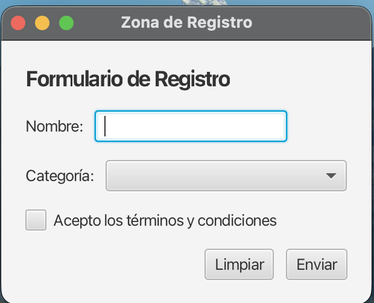
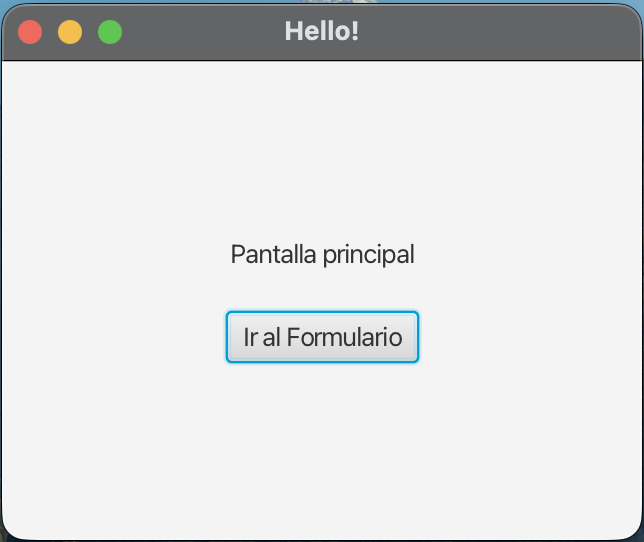
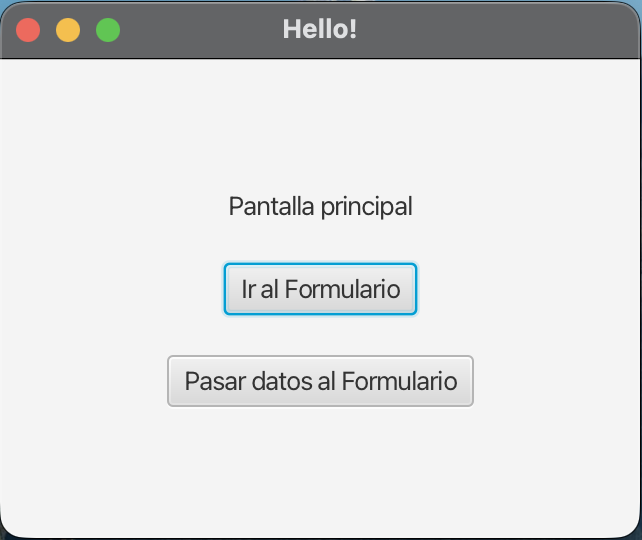
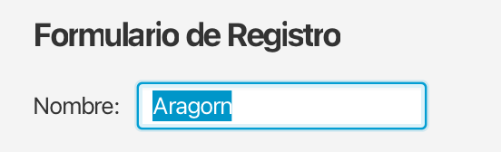

# Navegación entre Pantallas en JavaFX

## 1. Introducción: Cambio de Escenas

Abrir un _popup_ es útil para avisos rápidos, pero en una aplicación madura lo habitual es **navegar entre distintas pantallas dentro de la misma ventana** (por ejemplo, pasar de una pantalla de _Login_ a un panel de control).

La estrategia principal consiste en **sustituir la `Scene` activa** del `Stage` actual por una completamente nueva generada a partir de otro archivo FXML.

!!! info "Solo una Escena a la vez"
    Recuerda que, por naturaleza estructural, **solo puede haber una `Scene` visible al mismo tiempo** insertada en el `Stage` principal. Navegar significa descartar la escena presente y cargar la siguiente.

---

## 2. Creación de la Nueva Pantalla (FXML)

El primer paso es diseñar la estructura visual de la pantalla destino. Crearemos un archivo llamado `formulario.fxml` en nuestra carpeta `resources` simulando un sistema de registro:

```xml
<?xml version="1.0" encoding="UTF-8"?>  
<?import javafx.geometry.Insets?>  
<?import javafx.scene.control.*?>  
<?import javafx.scene.layout.*?>  
  
<VBox xmlns:fx="http://javafx.com/fxml"  
      fx:controller="org.example.demo.FormularioController"  
      spacing="15" alignment="CENTER_LEFT">  
      
    <padding>
         <Insets top="20" right="20" bottom="20" left="20"/>  
    </padding>  
    
    <Label text="Formulario de Registro" style="-fx-font-size: 18px; -fx-font-weight: bold;"/>  
    
    <HBox spacing="10" alignment="CENTER_LEFT">  
        <Label text="Nombre:"/>  
        <TextField fx:id="txtNombre" promptText="Tu nombre"/>  
    </HBox>  
    
    <HBox spacing="10" alignment="CENTER_LEFT">  
        <Label text="Categoría:"/>  
        <ComboBox fx:id="comboCategoria" prefWidth="200"/>  
    </HBox>  
    
    <CheckBox fx:id="chkAcepto" text="Acepto los términos y condiciones"/>  
  
    <HBox spacing="10" alignment="CENTER_RIGHT">  
        <Button text="Limpiar" onAction="#limpiarFormularioButtonClick"/>  
        <Button text="Enviar" onAction="#enviarFormularioButtonClick"/>  
    </HBox>  
</VBox>
```




**Puntos clave:**

* **Estructura combinada**: Hemos anidado varios contenedores `HBox` (en horizontal) dentro de un gran contenedor `VBox` (en vertical).
* **Componentes de captura**: Hacemos uso de `TextField`, `ComboBox` y `CheckBox` para recolectar datos heterogéneos.

!!! tip "Tip: Usando el método mágico `initialize()`"
    Con acompañamiento FXML, JavaFX nos provee del método `initialize()`. Si lo declaras en cualquier controlador con la anotación `@FXML`, se ejecutará **automáticamente** justo en el instante en que cargue la vista, siendo perfecto para rellenar listas o _ComboBoxes_.

Para dotar de vida a nuestra vista, diseñamos su correspondiente **Controlador**:

```java
package org.example.demo;  
  
import javafx.fxml.FXML;  
import javafx.scene.control.*;  
  
public class FormularioController {  
  
    @FXML private TextField txtNombre;  
    @FXML private ComboBox<String> comboCategoria;  
    @FXML private CheckBox chkAcepto;  
  
    // Se ejecuta automáticamente al arrancar esta vista
    @FXML  
    private void initialize() {  
        comboCategoria.getItems().addAll("General", "Premium", "Invitado");  
    }  
  
    @FXML  
    private void limpiarFormularioButtonClick() {  
        txtNombre.clear(); 
        // Vaciamos la elección del usuario
        comboCategoria.getSelectionModel().clearSelection();  
        chkAcepto.setSelected(false);  
    }  
  
    @FXML  
    private void enviarFormularioButtonClick() {  
        // Validación básica de campos
        if (txtNombre.getText().isBlank() || comboCategoria.getValue() == null || !chkAcepto.isSelected()) {  
            mostrarAlerta("Error", "Debes completar todos los campos y aceptar los términos.");  
            return;  
        }  
        mostrarAlerta("Formulario Recibido", "¡Bienvenido, " + txtNombre.getText() + "!");  
    }  
  
    // Método auxiliar diseñado para prevenir repetición de código visualizando Alertas
    private void mostrarAlerta(String titulo, String mensaje) {  
        Alert alert = new Alert(Alert.AlertType.INFORMATION);  
        alert.setTitle(titulo);  
        alert.setHeaderText(null);  
        alert.setContentText(mensaje);  
        alert.showAndWait();  
    }  
}
```

---

## 3. Enlace desde la Escena Principal

Una vez con el destino listo, instruimos a la pantalla de origen (nuestro visor inicial) para habilitar el viaje. En `hello-view.fxml`, añadimos un botón de salto:

```xml
<VBox alignment="CENTER" spacing="20.0" xmlns:fx="http://javafx.com/fxml"  
      fx:controller="org.example.demo.HelloController">  
      
    <Label fx:id="welcomeText" text="Pantalla principal"/>  
    <Button text="Hello!" onAction="#onHelloButtonClick"/>  
    
    <!-- Añadimos nuestro conductor de escena -->
    <Button text="Ir al Formulario" onAction="#onOpenButtonClick"/>  
</VBox>
```



Finalmente, programamos en su controlador de origen (`HelloController`) la transición. Nota que, a diferencia del proceso para abrir ventanas secundarias, aquí **reutlizaremos el `Stage` recuperándolo en lugar de crear uno nuevo**:

```java
package org.example.demo;

import javafx.event.ActionEvent;  
import javafx.fxml.FXML;  
import javafx.fxml.FXMLLoader;  
import javafx.scene.Node;  
import javafx.scene.Scene;  
import javafx.stage.Stage;  
import java.io.IOException;

public class HelloController {  

    @FXML  
    private void onOpenButtonClick(ActionEvent evento) {  
        try {  
            // 1. Cargamos el archivo físico FXML de la nueva pantalla
            FXMLLoader loader = new FXMLLoader(getClass().getResource("formulario.fxml"));  
            
            // 2. Rastreamos la ventana actual (Stage) apoyándonos en el botón que activó el evento
            Stage stage = (Stage) ((Node) evento.getSource()).getScene().getWindow();  
            
            // 3. Sustituimos radicalmente la escena alojada y actualizamos el título
            stage.setScene(new Scene(loader.load()));  
            stage.setTitle("Zona de Registro");  
            
        } catch (IOException ex) {  
            throw new RuntimeException("Lanzamiento fallido de escena", ex);  
        }  
    }
}
```

Al hacer clic, el efecto que experimentará el usuario será un cambio nativo, nítido y directo hacia la nueva pantalla en exactamente la misma ventana; brindando la experiencia unificada tradicional del desarrollo de software.

---

## 4. Paso de Datos entre Pantallas

Una necesidad muy común al navegar es llevar **información de una pantalla a otra** (por ejemplo, enviar el nombre del usuario logueado desde la pantalla de Inicio hacia un Panel de Control).

Para hacer esto, debemos pausar sutilmente la carga de la escena. Debemos recuperar el **Controlador de destino** justo antes de mostrarlo, e inyectarle los datos gracias a un método público que hayamos programado en él.

**1. En el Controlador destino (ej: `FormularioController.java`)**

Allí donde vamos a aterrizar, creamos un método público diseñado para recibir la información:

```java
public class FormularioController {
    @FXML private TextField txtNombre;
    
    // Método público que llamaremos desde la ventana anterior
    public void recibirDatoPrecalculado(String usuario) {
        // En este ejemplo, auto-rellenamos el campo nombre con la información recibida
        txtNombre.setText(usuario);
    }
}
```

**2. En la Vista y el Controlador origen (ej: `hello-view.fxml` y `HelloController.java`)**

Añadimos un nuevo botón en nuestra vista principal diseñado específicamente para invocar este trasvase de datos:

```xml
<Button text="Pasar datos al Formulario" onAction="#onOpenButtonSendData"/>  
```



A continuación, programamos este método inédito en nuestro proceso de salto para "atrapar" el controlador secundario antes de dar el cambiazo de escenario definitivo:

```java
@FXML  
private void onOpenButtonSendData(ActionEvent evento) {  
    try {  
        FXMLLoader loader = new FXMLLoader(getClass().getResource("formulario.fxml"));  
        
        // 1. Cargamos el Parent raíz primero (sin atarlo a una escena aún)
        Parent root = loader.load();
        
        // 2. Extraemos el Controlador de la pantalla destino
        FormularioController controladorDestino = loader.getController();
        
        // 3. ¡Inyectamos los datos en remoto!
        controladorDestino.recibirDatoPrecalculado("Aragorn");
        
        // 4. Cambiamos la escena normalmente usando el Parent ya "rellenado"
        Stage stage = (Stage) ((Node) evento.getSource()).getScene().getWindow();  
        stage.setScene(new Scene(root));  
        stage.setTitle("Formulario Autocompletado");
        
    } catch (IOException ex) {  
        throw new RuntimeException(ex);
    }  
}
```



Con este sencillo y poderosísimo puente lógico, la nueva pantalla arrancará conociendo y habiendo cargado los datos que se le enviaron desde la primera.

---

!!! question "💻 Reto: Navegación Inversa con Paso de Datos"
    Actualmente la navegación está implementada de forma unidireccional. Modifica el proyecto para permitir el retorno dinámico a la pantalla principal completando la siguiente funcionalidad:
    
    1. En el método `enviarFormularioButtonClick()`, añade el flujo de navegación mediante `FXMLLoader` para cargar de nuevo el diseño previo `hello-view.fxml`.
    2. Recupera la instancia del controlador de la vista principal (`HelloController`) antes de cargar la escena.
    3. Asegúrate de diseñar un método público en `HelloController` capaz de recibir un texto por parámetro y asignarlo a tu `Label` principal (`welcomeText`).
    4. Invoca este método inyectándole los datos del formulario (ej. el nombre y la categoría seleccionados) y cambia la escena. De esta forma, al pulsar "Enviar", la aplicación regresará a la ventana inicial mostrando un mensaje personalizado.
