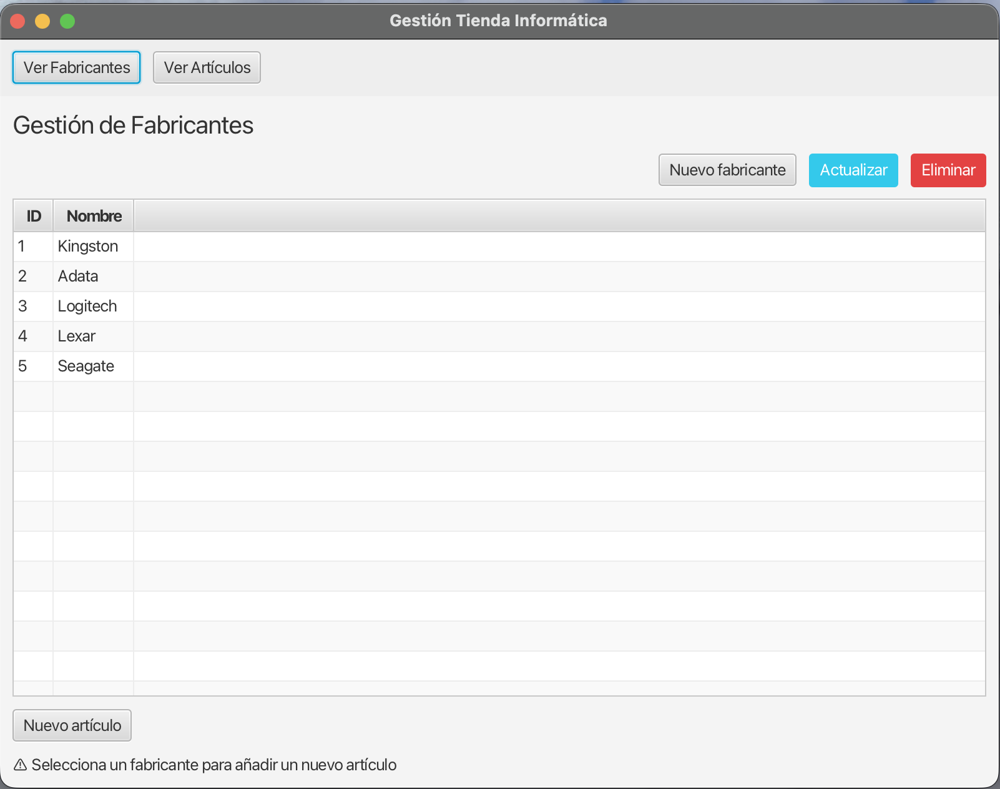
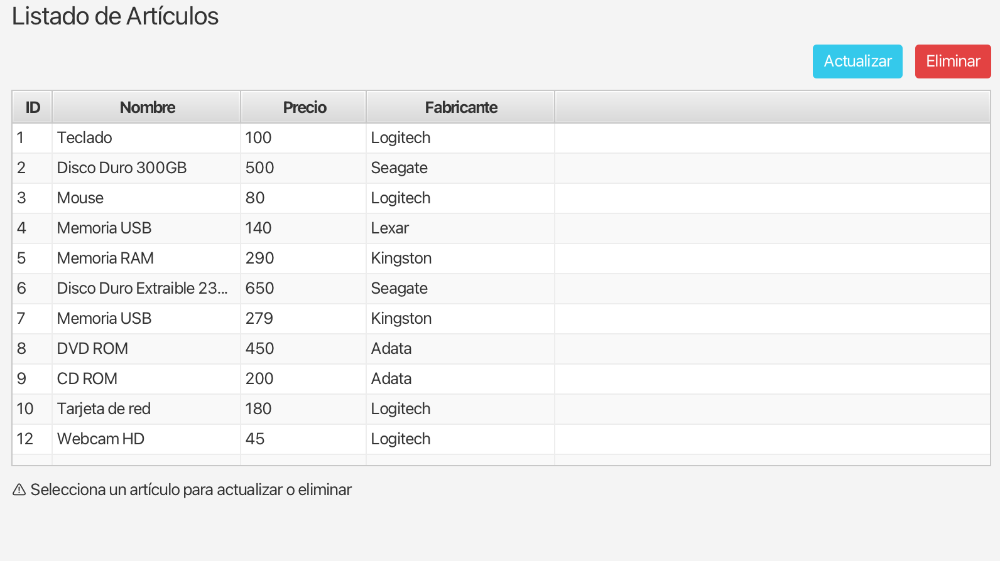

# Reto Final: Completando el CRUD

En el apartado anterior hemos sentado las bases de nuestra aplicación `demoIntegracion`. Hemos conseguido leer de la base de datos, navegar entre distintas pantallas e incluso insertar nuevos registros combinando datos entre ventanas mediante un formulario modal.

Sin embargo, una aplicación de gestión real no está terminada hasta que cuenta con todas sus operaciones CRUD (Crear, Leer, Actualizar, Borrar) para todas sus entidades.

Ha llegado el momento de que pongas a prueba todo lo aprendido. El reto final consiste en ampliar el proyecto base para que sea totalmente funcional. Deberás implementar de forma autónoma los siguientes requisitos:

## 1. Gestión Completa de Fabricantes

Actualmente, la pantalla `fabricantes.fxml` solo nos permite ver la lista y añadir un artículo a un fabricante.

Tu objetivo es dotarla de **operaciones CRUD completas para la entidad Fabricante**:

1. **Nuevo Fabricante**: Añade un botón que abra una nueva ventana modal (tendrás que diseñar un `modal-fabricante.fxml` con su correspondiente controlador). Este modal albergará un formulario sencillo para crear un fabricante (campos para el `ID` y el `Nombre`).
2. **Actualizar Fabricante**: Añade un botón de edición. Al seleccionar un fabricante de la tabla y pulsar este botón, se debe abrir el mismo modal anterior, pero con los datos del fabricante pre-cargados en las cajas de texto y listos para modificarse. ¡Recuerda bloquear el campo ID como hicimos con los artículos!
3. **Borrar Fabricante**: Añade un botón de borrado. Al pulsar este botón (teniendo un fabricante seleccionado en la tabla), deberás pedir confirmación al usuario utilizando un `Alert` de tipo `CONFIRMATION`. Si el usuario acepta, procede a borrarlo de la base de datos utilizando el método `eliminar()` de `FabricanteDAO`.

!!! warning "Cuidado con las Claves Foráneas"
    Ten precaución al borrar fabricantes. Si intentas borrar un fabricante que actualmente **tiene artículos asociados** a él, la base de datos PostgreSQL lanzará una excepción debido a la restricción de la clave foránea `id_fab`. Deberás capturar este posible error (`SQLException`) desde Java y mostrar un `Alert` de error al usuario indicándole que *"No se puede borrar un fabricante que tenga artículos en stock"*.



## 2. Gestión Completa de Artículos

Nuestra pantalla general `articulos.fxml` actualmente solo nos sirve a modo de listado visual. Debemos proporcionarle la interactividad que le falta:

1. **Actualizar Artículo**: Añade un botón "Editar Artículo" en esta pantalla. Cuando el usuario seleccione una fila en la tabla de artículos y pulse el botón, se deberá abrir directamente nuestro formulario ya existente (`modal-articulo.fxml`). A diferencia de cuando dábamos un alta (donde le pasábamos un artículo vacío con ID `-1`), aquí deberás pasarle al controlador del modal el objeto `Articulo` real que has extraído de la tabla. Tras volver de la ventana, deberás ejecutar en tu base de datos un `UPDATE` (`adao.actualizar(...)`).
2. **Borrar Artículo**: Añade un botón "Eliminar Artículo". Al igual que con los fabricantes, debe comprobar primero que haya una fila seleccionada en el `TableView`, mostrar un diálogo de confirmación de borrado, y llamar al método `eliminar()` de `ArticuloDAO` en caso afirmativo.



!!! tip "Refrescando los TableView"
    Una vez que la base de datos se modifica, **la tabla gráfica no se actualizará sola de forma mágica**. Debes reflejar esos cambios.
    La vía más rápida para garantizar que tienes los datos idénticos a los de la BD es vaciar la tabla y volverla a llenar:
    ```java
    tablaArticulos.getItems().clear();
    tablaArticulos.getItems().addAll(adao.obtenerTodos());
    ```
