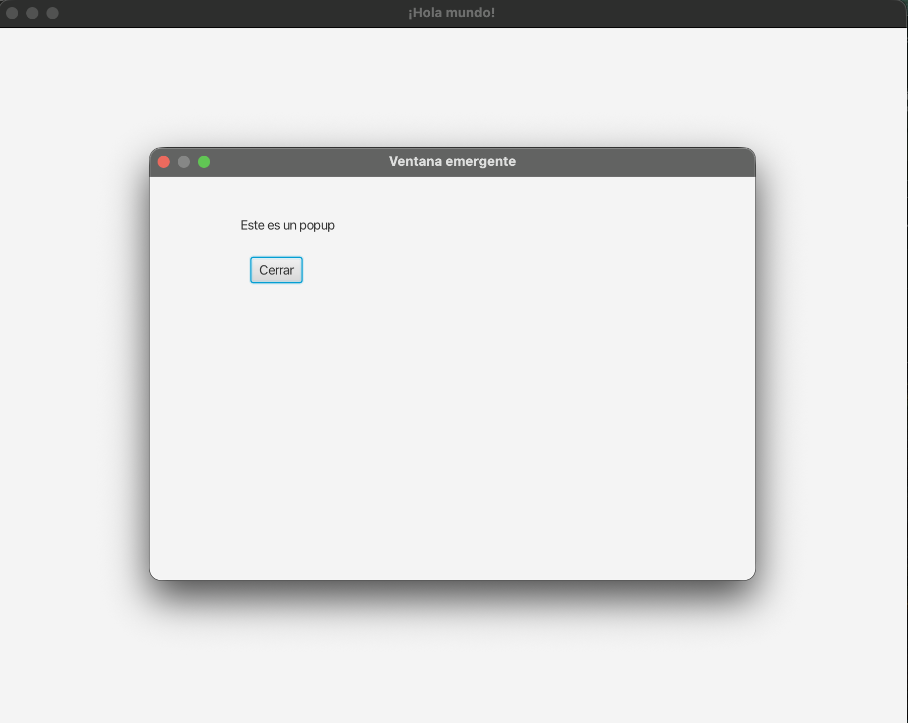

# Gestión de Ventanas en JavaFX

## 1. Introducción: Múltiples Ventanas

Hasta ahora, nuestras aplicaciones han utilizado una única pantalla. Sin embargo, las aplicaciones reales suelen requerir **múltiples ventanas** (por ejemplo, para mostrar detalles, formularios adicionales o confirmaciones emergentes).

Cada vez que queramos abrir una nueva ventana, necesitaremos instanciar su propio diseño **FXML**, asociarle su respectivo **Controlador** y cargar la escena en un nuevo **Stage** (ventana física de la app).

!!! info "Recordatorio MVC"
    La nueva ventana funciona de forma completamente independiente de la principal, pero debe replicar el patrón **Modelo-Vista-Controlador**. Toda ventana nueva contará con su `.fxml` y su controlador en `.java`.

---

## 2. Creación de una Nueva Vista (FXML)

El primer paso es diseñar la estructura visual de la segunda ventana.

Para ello, creamos un nuevo archivo (ej: `popup.fxml`) en nuestra carpeta `resources`. Es importante que su ubicación emule el paquete de su controlador en la carpeta `java` (por ejemplo, en `org/example/demo`).

```xml
<?xml version="1.0" encoding="UTF-8"?>  
<?import javafx.scene.control.*?>  
<?import javafx.scene.layout.*?>  

<AnchorPane xmlns="http://javafx.com/javafx"  
            xmlns:fx="http://javafx.com/fxml"  
            fx:controller="org.example.demo.PopupController"  
            prefHeight="200.0" prefWidth="300.0">  
    <children>
     <Label layoutX="90.0" layoutY="40.0" text="Este es un popup" />  
        <Button layoutX="100.0" layoutY="80.0" text="Cerrar" onAction="#onCloseButtonClick" />
 </children>
</AnchorPane>
```

**Puntos clave del diseño:**

* **`fx:controller`**: Enlaza nuestra nueva vista con su clase gestora (`PopupController`).
* **`AnchorPane`**: Nuestro nodo raíz. Este contenedor permite posicionar libremente sus componentes usando coordenadas `X` e `Y` exactas (`layoutX` y `layoutY`).

!!! tip "Diseño visual WYSIWYG"
    Aunque se puede escribir el XML manualmente, la herramienta gráfica oficial recomendada es **SceneBuilder**. Permite posicionar componentes *arrastrando y soltando*, lo que resulta ideal para organizar un `AnchorPane`.

A continuación, debemos crear el controlador que solventará el error que IntelliJ mostrará al no encontrar esa clase Java en nuestro paquete:

```java
package org.example.demo;  

import javafx.event.ActionEvent;
import javafx.fxml.FXML;  

public class PopupController {  
    // Método que enlazamos con el botón en el FXML
    @FXML  
    private void onCloseButtonClick(ActionEvent event) {  
       // Lo implementaremos en el paso 4
    }  
}
```

---

## 3. Apertura del Popup (Stage Secundario)

Con la vista y el controlador creados, pasamos a iniciar el lanzamiento del *popup* desde nuestra ventana principal (por ejemplo, desde una acción en `HelloController`).

Los pasos para lanzar correctamente una nueva ventana son:

1. **Crear** un nuevo elemento `Stage`.
2. **Cargar** nuestro `.fxml` sirviéndonos del *cargador* de componentes.
3. **Generar** una `Scene` a partir del XML cargado.
4. **Asignar** la escena al `Stage` y definir sus reglas antes de hacerlo directamente visible.

```java
import java.io.IOException;  
import javafx.stage.Modality;
import javafx.stage.Stage;
import javafx.scene.Scene;
import javafx.fxml.FXMLLoader;

public class HelloController {  

    @FXML  
    protected void onHelloButtonClick() {  
        try {  
            // 1. Invocamos al FXML
            FXMLLoader loader = new FXMLLoader(getClass().getResource("popup.fxml"));  
            
            // 2. Creamos y dotamos de contenido a la nueva ventana (Stage secundario)
            Stage popupStage = new Stage();  
            popupStage.setScene(new Scene(loader.load()));  
            popupStage.setTitle("Ventana emergente");  
            
            // 3. Comportamiento modal (el popup bloqueará la ventana generadora)
            popupStage.initModality(Modality.APPLICATION_MODAL); 
            
            // 4. Mostramos el popup y obligamos al código a "esperar" aquí hasta el cierre
            popupStage.showAndWait();  
            
        } catch (IOException e) {  
            // Gestionamos un posible fallo de lectura (archivo perdido, etc.)
            throw new RuntimeException("Error al abrir la ventana", e);  
        }  
    }  
}
```

!!! warning "Excepciones en `FXMLLoader`"
    El proceso `.load()` es propenso a fallos del sistema relativos a archivos en mal estado o extraviados, provocando una validada `IOException`. Por seguridad, esto obliga a encapsular la acción en un bloque estructurado **`try-catch`**.

---

## 4. Cierre del Popup

Para finalizar el programa de forma adecuada, retomamos la labor en `PopupController` programando el evento del botón "Cerrar".

El gran desafío es **obtener una referencia al `Stage`** para poder cerrarlo. Esto lo podemos lograr rastreando el origen del evento al hacer clic:

```java
package org.example.demo;  

import javafx.event.ActionEvent;  
import javafx.fxml.FXML;  
import javafx.scene.Node;  
import javafx.stage.Stage;  

public class PopupController {  

    @FXML  
    private void onCloseButtonClick(ActionEvent event) {
        // 1. Navegamos: evento origen (Botón) -> su Escena -> su Ventana (Stage)
        Stage stage = (Stage) ((Node) event.getSource()).getScene().getWindow();  
        
        // 2. Cerramos el stage recuperado
        stage.close();  
    }  
}
```



Al ejecutarse el `close()`, como la ventana funcionaba en modo `APPLICATION_MODAL`, el programa devolverá el foco visual y el código continuará su curso en la ventana subyacente.

!!! question "💻 Reto: Modalidades"
    Acude a la lógica de apertura que escribimos en el Paso 3. Sustituye la asignación `APPLICATION_MODAL` por el comportamiento `NONE`, e intercambia la operación de despliegue `showAndWait()` por `show()`. Ahora arranca y verifica cómo puedes actuar de forma independiente en ambas ventanas simultáneamente.
